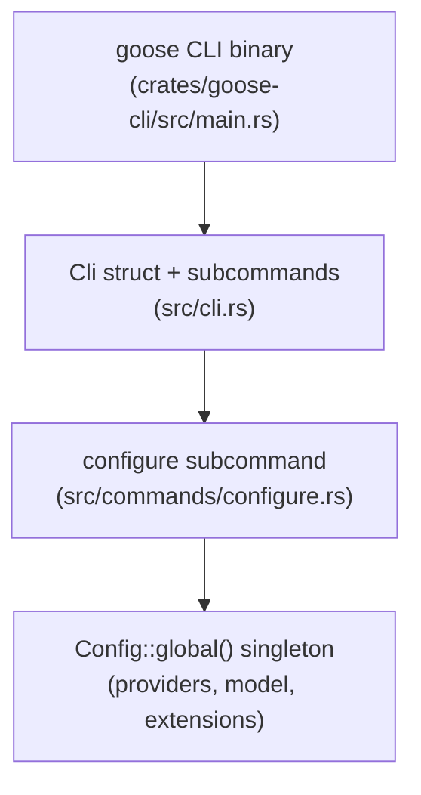

# Chapter 1: Getting Started

Welcome to **Chapter 1: Getting Started**. In this part of **Goose Tutorial: Extensible Open-Source AI Agent for Real Engineering Work**, you will build an intuitive mental model first, then move into concrete implementation details and practical production tradeoffs.


This chapter establishes a clean Goose baseline so you can move into advanced workflows without setup drift.

## Learning Goals

- install Goose Desktop or CLI on your platform
- configure your first LLM provider
- run your first session in a target repository
- identify common startup failures and quick fixes

## Installation Paths

| Path | Command / Flow | Best For |
|:-----|:---------------|:---------|
| Desktop app | Download from Goose releases and launch | Visual workflows and session management in UI |
| CLI install script | `curl -fsSL https://github.com/block/goose/releases/download/stable/download_cli.sh \| bash` | Fast terminal bootstrap |
| Homebrew CLI | `brew install block-goose-cli` | macOS/Linux environments using package managers |

## First Configuration Checklist

1. run `goose configure`
2. select a provider and authenticate
3. choose a model suitable for tool calling
4. start a session from your working directory
5. run a low-risk task (for example, repo summary + TODO extraction)

## First Session Flow

```bash
cd /path/to/repo
goose session
```

Inside the session, start with a scoped prompt such as:

- "Summarize this repo structure and propose a 3-step refactor plan."

## Platform-Specific Installation Notes

### macOS

Both Homebrew and the install script work. Homebrew is preferred if you manage other CLI tools through it — updates come via `brew upgrade block-goose-cli`. The install script places the binary in `~/.local/bin`; ensure this is on your `PATH`.

### Linux

Use the install script. After running it, verify the install with:

```bash
goose --version
goose info
```

`goose info` prints the config file path, log directory, and current version — useful for confirming the binary and config are where Goose expects them.

### Windows

Use the desktop installer from the GitHub releases page. The CLI is available but the desktop app provides a more stable setup flow on Windows. WSL2 is a supported path for CLI-only usage.

## Desktop vs CLI Tradeoffs

| Factor | Desktop App | CLI |
|:-------|:------------|:----|
| first-time setup | guided UI with provider wizard | `goose configure` interactive prompts |
| session visibility | visual conversation pane | terminal output with streaming |
| extension management | toggle UI per extension | `goose configure` or `--with-builtin` flag |
| scripting / CI | not suitable | `goose run` with headless flags |
| context usage display | token meter in sidebar | printed before each prompt |

Most developers use the CLI for scripted tasks and the desktop app for exploratory sessions. Both share the same `~/.config/goose/config.yaml` configuration file.

## What `goose info` Shows

After setup, running `goose info` outputs your runtime baseline:

```
version:       v1.28.0
config file:   ~/.config/goose/config.yaml
log dir:       ~/.config/goose/logs/
sessions dir:  ~/.config/goose/sessions/
provider:      anthropic
model:         claude-sonnet-4-5
```

This is the first command to run when diagnosing unexpected behavior.

## Early Failure Triage

| Symptom | Likely Cause | First Fix |
|:--------|:-------------|:----------|
| no model response | provider not configured correctly | rerun `goose configure` and re-authenticate |
| tool calls fail unexpectedly | permission mode mismatch | switch mode or adjust per-tool permissions |
| noisy or irrelevant context | wrong working directory | restart session from repo root |
| `command not found: goose` | binary not on PATH | check `~/.local/bin` is in PATH |
| auth errors with Anthropic | API key expired or incorrect | regenerate key at console.anthropic.com |

## Source References

- [Goose Quickstart](https://block.github.io/goose/docs/quickstart)
- [Install goose](https://block.github.io/goose/docs/getting-started/installation)
- [Configure LLM Provider](https://block.github.io/goose/docs/getting-started/providers)

## Updating Goose

Keep your installation current to get bug fixes and new provider support:

```bash
# Upgrade to latest stable release
goose update --channel stable

# Check what version you have
goose info
```

For Homebrew installations, use `brew upgrade block-goose-cli` instead. The install-script path and Homebrew path are independent; do not mix them on the same machine.

## Custom Distros

If your organization wants to ship a pre-configured Goose with specific providers, extensions, and branding, the `CUSTOM_DISTROS.md` file at the repo root documents the distro build process. This is relevant for platform teams that want to standardize Goose across a large engineering org without requiring each developer to run `goose configure` from scratch.

## Summary

You now have Goose installed, configured, and running in a real project context.

Next: [Chapter 2: Architecture and Agent Loop](02-architecture-and-agent-loop.md)

## Source Code Walkthrough

### `crates/goose-cli/src/cli.rs` — CLI entry point and command structure

The top-level `Cli` struct in [`crates/goose-cli/src/cli.rs`](https://github.com/block/goose/blob/main/crates/goose-cli/src/cli.rs) defines the complete command surface you interact with during setup and every session:

```rust
#[derive(Parser)]
#[command(name = "goose", author, version, display_name = "", about, long_about = None)]
pub struct Cli {
    #[command(subcommand)]
    command: Option<Command>,
}
```

Key argument groups surfaced by this file include:

- **`Identifier`** — selects a session by `--name (-n)`, `--session-id`, or legacy `--path`
- **`SessionOptions`** — controls `--debug`, `--max-tool-repetitions`, `--max-turns` (default 1000), and `--container`
- **`InputOptions`** — accepts `--instructions (-i)` (file path or stdin), `--text (-t)`, `--recipe`, `--system`, and `--params`
- **`ExtensionOptions`** — adds extensions via `--with-extension`, `--with-builtin`, or disables defaults with `--no-profile`

This is the interface boundary you see when running `goose --help` or `goose session --help`.

### `crates/goose-cli/src/commands/configure.rs` — interactive provider setup

The `configure_provider_dialog()` function in [`crates/goose-cli/src/commands/configure.rs`](https://github.com/block/goose/blob/main/crates/goose-cli/src/commands/configure.rs) runs when you execute `goose configure`:

```rust
pub async fn configure_provider_dialog() -> anyhow::Result<bool> {
    let config = Config::global();
    let mut available_providers = providers().await;
    available_providers.sort_by(|a, b| a.0.display_name.cmp(&b.0.display_name));

    let provider_items: Vec<(&String, &str, &str)> = available_providers
        .iter()
        .map(|(p, _)| (&p.name, p.display_name.as_str(), p.description.as_str()))
        .collect();

    let current_provider: Option<String> = config.get_goose_provider().ok();
    let default_provider = current_provider.unwrap_or_default();

    let provider_name = cliclack::select("Which model provider should we use?")
        .initial_value(&default_provider)
        .items(&provider_items)
        .filter_mode()
        .interact()?;

    // ... iterate config_keys, collect credentials, test provider
    Ok(true)
}
```

The function reads `ProviderMetadata` for each registered provider, prompts for required `ConfigKey` credentials via secure input, and validates the connection before writing to `Config::global()`. This is the first thing you run after installing Goose.

## How These Components Connect


