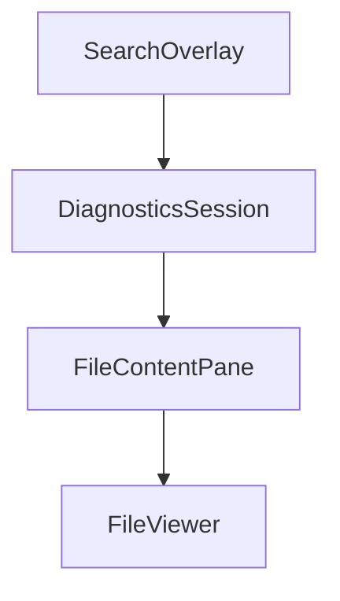

# Chapter 2: Architecture and Agent Loop

Welcome to **Chapter 2: Architecture and Agent Loop**. In this part of **Goose Tutorial: Extensible Open-Source AI Agent for Real Engineering Work**, you will build an intuitive mental model first, then move into concrete implementation details and practical production tradeoffs.


This chapter explains how Goose turns requests into concrete engineering actions.

## Learning Goals

- understand Goose's core runtime components
- trace request -> tool call -> response loop behavior
- reason about context revision and token efficiency
- use this model to debug misbehavior faster

## Core Components

| Component | Role | Practical Impact |
|:----------|:-----|:-----------------|
| Interface (Desktop/CLI) | Collects prompts, shows outputs | Determines operator experience and control surface |
| Agent | Runs orchestration loop | Handles provider calls, tool invocations, and retries |
| Extensions (MCP) | Expose capabilities as tools | Enable shell, file, API, browser, memory, and more |

## Interactive Loop (Operational View)

1. user submits task
2. Goose sends task + available tools to model
3. model requests tool calls when needed
4. Goose executes tool calls and returns results
5. Goose revises context for relevance/token limits
6. model returns answer or next action request

## Why This Matters

- if outputs degrade, inspect tool surface and context length first
- if execution stalls, isolate whether provider/tool/permission is blocking
- if costs spike, tune context strategy and tool verbosity

## Error Handling Behavior

Goose treats many execution failures as recoverable signals to the model:

- malformed tool arguments
- unavailable tools
- command failures

This makes multi-step workflows more resilient than simple one-shot prompting.

## Source References

- [Goose Architecture](https://block.github.io/goose/docs/goose-architecture/)
- [Extensions Design](https://block.github.io/goose/docs/goose-architecture/extensions-design)

## Summary

You now have an operator-level mental model for Goose's execution loop and error paths.

Next: [Chapter 3: Providers and Model Routing](03-providers-and-model-routing.md)

## Depth Expansion Playbook

## Source Code Walkthrough

### `scripts/diagnostics-viewer.py`

The `SearchOverlay` class in [`scripts/diagnostics-viewer.py`](https://github.com/block/goose/blob/HEAD/scripts/diagnostics-viewer.py) handles a key part of this chapter's functionality:

```py


class SearchOverlay(Container):
    """Search overlay widget."""

    def __init__(self):
        super().__init__()
        self.display = False

    def compose(self) -> ComposeResult:
        with Horizontal(id="search-container"):
            yield Static("Search: ", id="search-label")
            yield Input(placeholder="Type to search...", id="search-input")
            yield Static("", id="search-results")


class DiagnosticsSession:
    """Represents a diagnostics bundle."""

    def __init__(self, zip_path: Path):
        self.zip_path = zip_path
        self.name = "Unknown Session"
        self.session_id = zip_path.stem
        self.created_at = zip_path.stat().st_mtime
        self._load_session_name()

    def _load_session_name(self):
        """Extract session name from session.json."""
        try:
            with zipfile.ZipFile(self.zip_path, 'r') as zf:
                # Find session.json
                for name in zf.namelist():
```

This class is important because it defines how Goose Tutorial: Extensible Open-Source AI Agent for Real Engineering Work implements the patterns covered in this chapter.

### `scripts/diagnostics-viewer.py`

The `DiagnosticsSession` class in [`scripts/diagnostics-viewer.py`](https://github.com/block/goose/blob/HEAD/scripts/diagnostics-viewer.py) handles a key part of this chapter's functionality:

```py


class DiagnosticsSession:
    """Represents a diagnostics bundle."""

    def __init__(self, zip_path: Path):
        self.zip_path = zip_path
        self.name = "Unknown Session"
        self.session_id = zip_path.stem
        self.created_at = zip_path.stat().st_mtime
        self._load_session_name()

    def _load_session_name(self):
        """Extract session name from session.json."""
        try:
            with zipfile.ZipFile(self.zip_path, 'r') as zf:
                # Find session.json
                for name in zf.namelist():
                    if name.endswith('session.json'):
                        with zf.open(name) as f:
                            data = json.load(f)
                            self.name = data.get('name', 'Unknown Session')
                            self.session_id = data.get('id', self.zip_path.stem)
                        break
        except Exception as e:
            self.name = f"Error loading: {e}"

    def get_file_list(self) -> list[str]:
        """Get list of files in the zip, sorted with system.txt first."""
        try:
            with zipfile.ZipFile(self.zip_path, 'r') as zf:
                files = zf.namelist()
```

This class is important because it defines how Goose Tutorial: Extensible Open-Source AI Agent for Real Engineering Work implements the patterns covered in this chapter.

### `scripts/diagnostics-viewer.py`

The `FileContentPane` class in [`scripts/diagnostics-viewer.py`](https://github.com/block/goose/blob/HEAD/scripts/diagnostics-viewer.py) handles a key part of this chapter's functionality:

```py


class FileContentPane(Vertical):
    """A pane that shows either JSON tree or plain text."""

    def __init__(self, title: str):
        super().__init__()
        self.title = title
        self.content_type = "empty"
        self.json_data = None
        self.text_content = ""

    def compose(self) -> ComposeResult:
        """Compose the pane content."""
        if self.content_type == "json":
            tree = JsonTreeView(self.title)
            if self.json_data is not None:
                tree.load_json(self.json_data, self.title)
            yield tree
        elif self.content_type == "text":
            with VerticalScroll():
                yield Static(self.text_content)
        else:
            yield Static("[dim]No content[/dim]")

    def set_json(self, data: Any):
        """Set JSON content."""
        self.content_type = "json"
        self.json_data = data

    def set_text(self, text: str):
        """Set text content."""
```

This class is important because it defines how Goose Tutorial: Extensible Open-Source AI Agent for Real Engineering Work implements the patterns covered in this chapter.

### `scripts/diagnostics-viewer.py`

The `FileViewer` class in [`scripts/diagnostics-viewer.py`](https://github.com/block/goose/blob/HEAD/scripts/diagnostics-viewer.py) handles a key part of this chapter's functionality:

```py


class FileViewer(Vertical):
    """Widget for viewing file contents."""

    def __init__(self):
        super().__init__()
        self.current_session = None
        self.current_filename = None
        self.current_part = None

    def compose(self) -> ComposeResult:
        """Create child widgets."""
        with Vertical(id="content-area"):
            yield Static("[dim]Select a file to view[/dim]")

        yield SearchOverlay()

    def update_content(self, session: DiagnosticsSession, filename: str, part: str = None):
        """Update the viewer with new file content.

        Args:
            session: The diagnostics session
            filename: The file to display
            part: For JSONL files, either "request" or "responses"
        """
        self.current_session = session
        self.current_filename = filename
        self.current_part = part

        content = session.read_file(filename)
        if content is None:
```

This class is important because it defines how Goose Tutorial: Extensible Open-Source AI Agent for Real Engineering Work implements the patterns covered in this chapter.


## How These Components Connect


