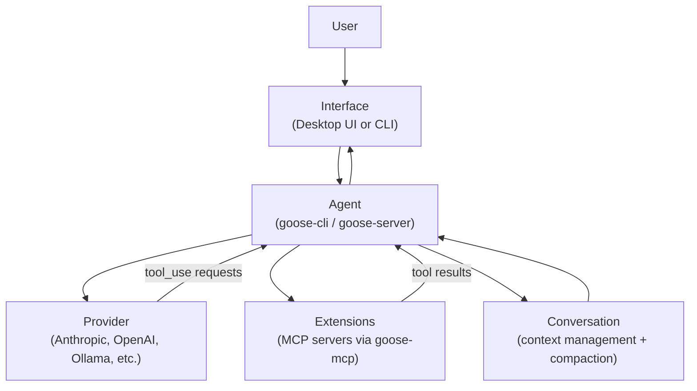
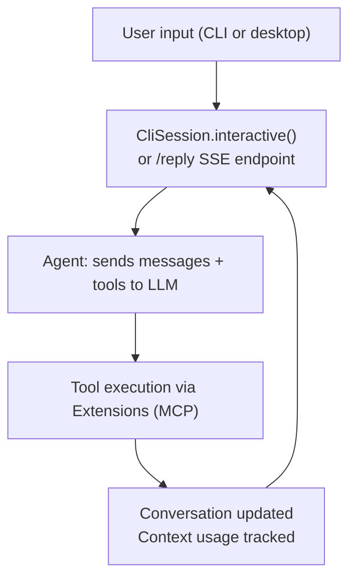

# Chapter 2: Architecture and Agent Loop

Welcome to **Chapter 2: Architecture and Agent Loop**. In this part of **Goose Tutorial: Extensible Open-Source AI Agent for Real Engineering Work**, you will build an intuitive mental model first, then move into concrete implementation details and practical production tradeoffs.


This chapter explains how Goose turns requests into concrete engineering actions.

## Learning Goals

- understand Goose's core runtime components
- trace request -> tool call -> response loop behavior
- reason about context revision and token efficiency
- use this model to debug misbehavior faster

## Architecture Diagram



## Core Components

| Component | Role | Practical Impact |
|:----------|:-----|:-----------------|
| Interface (Desktop/CLI) | Collects prompts, shows outputs | Determines operator experience and control surface |
| Agent | Runs orchestration loop | Handles provider calls, tool invocations, and retries |
| Extensions (MCP) | Expose capabilities as tools | Enable shell, file, API, browser, memory, and more |

## Interactive Loop (Operational View)

1. user submits task
2. Goose sends task + available tools to model
3. model requests tool calls when needed
4. Goose executes tool calls and returns results
5. Goose revises context for relevance/token limits
6. model returns answer or next action request

## Why This Matters

- if outputs degrade, inspect tool surface and context length first
- if execution stalls, isolate whether provider/tool/permission is blocking
- if costs spike, tune context strategy and tool verbosity

## Error Handling Behavior

Goose treats many execution failures as recoverable signals to the model:

- malformed tool arguments
- unavailable tools
- command failures

This makes multi-step workflows more resilient than simple one-shot prompting. The model sees the error text as a tool result and can retry with corrected arguments or choose a different approach.

## Crate Structure

The codebase is organized as a Rust workspace with clear separation between layers:

| Crate | Path | Role |
|:------|:-----|:-----|
| `goose-cli` | `crates/goose-cli/` | Binary, interactive session, headless run |
| `goose-server` | `crates/goose-server/` | HTTP server for desktop app integration |
| `goose-mcp` | `crates/goose-mcp/` | Built-in MCP extensions (memory, computer controller, etc.) |
| `goose-acp` | `crates/goose-acp/` | Agent Control Protocol server implementation |
| `goose-sdk` | `crates/goose-sdk/` | Public SDK for embedding Goose in other tools |

The desktop application communicates with `goose-server` over a local HTTP connection. The CLI uses `goose-cli` directly. Both ultimately call the same `Agent` type from the core goose crate, so behavior is consistent across surfaces.

## Observability in the Loop

The `/reply` endpoint in `goose-server` emits structured telemetry at loop completion:

- turn count and total token usage
- tool call count per session
- session duration
- provider and model name

This telemetry is logged to the sessions directory. In production, these logs are the primary data source for cost attribution and debugging runaway sessions.

## Context Revision Strategy

Goose uses two mechanisms to keep context within model limits:

1. **Auto-compaction** — triggered near `GOOSE_AUTO_COMPACT_THRESHOLD`; the agent rewrites the conversation history with a summarized version, retaining the most recent and most relevant turns
2. **Fallback strategies** — configured via `GOOSE_CONTEXT_STRATEGY`; options include `summarize` (automatic summary) and `prompt` (pause and ask the user how to proceed)

The `display_context_usage()` call at the top of each loop iteration shows you how far you are from the threshold before you send the next prompt.

## Request Lifecycle: Step by Step

Walking through a single turn in detail helps map the architecture to observable behavior:

1. **User submits prompt** — typed in the CLI editor or sent to `/reply` endpoint
2. **`CliSession.handle_input()` dispatches** — validates input, handles slash commands, or passes to agent
3. **`Agent.reply()` called** — packages the `Conversation` (recent messages + system prompt) and available tools into a provider request
4. **Provider call made** — sent to the configured LLM; streamed response begins arriving
5. **Model requests tool calls** — if the model emits `tool_use` blocks, the agent queues them
6. **Permission check** — `PermissionManager` enforces `GooseMode` for each tool; prompts if needed
7. **Tool executed** — MCP extension handles the call and returns a result (or error)
8. **Result appended to `Conversation`** — as a `tool_result` message
9. **Loop back to step 3** — agent continues until model returns a text response or max turns hit
10. **Context usage displayed** — token count shown at next prompt

## Source References

- [Goose Architecture](https://block.github.io/goose/docs/goose-architecture/)
- [Extensions Design](https://block.github.io/goose/docs/goose-architecture/extensions-design)

## The ACP Layer

Goose exposes an Agent Control Protocol (ACP) server via `crates/goose-acp/`. ACP is a session-oriented protocol that allows external clients — including the desktop UI, IDE plugins, and custom integrations — to create and manage agent sessions over a standardized interface. The key struct is `GooseAcpSession`, which bridges ACP's session model with Goose's internal `Session` and `Thread` types. This is the abstraction that makes it possible to drive Goose from multiple surfaces without duplicating agent logic.

## Debugging the Loop

When behavior is unexpected, the most useful debugging signals are:

1. **Token usage display** — visible at the top of each interactive prompt; if you're near the limit, compaction or truncation may have dropped relevant context
2. **Tool call logs** — each tool invocation is logged in the session file; export to Markdown to read the full call sequence
3. **`--debug` flag** — disables output truncation so you see full tool inputs and outputs in the terminal
4. **`goose session diagnostics`** — generates a ZIP with all session data for deep investigation

## Summary

You now have an operator-level mental model for Goose's execution loop and error paths.

Next: [Chapter 3: Providers and Model Routing](03-providers-and-model-routing.md)

## Source Code Walkthrough

### `crates/goose-cli/src/session/mod.rs` — the interactive agent loop

The `CliSession` struct in [`crates/goose-cli/src/session/mod.rs`](https://github.com/block/goose/blob/main/crates/goose-cli/src/session/mod.rs) is the heart of every interactive Goose session:

```rust
pub struct CliSession {
    agent: Agent,
    messages: Conversation,
    session_id: String,
    completion_cache: Arc<std::sync::RwLock<CompletionCache>>,
    debug: bool,
    run_mode: RunMode,
    scheduled_job_id: Option<String>,
    max_turns: Option<u32>,
    edit_mode: Option<EditMode>,
    retry_config: Option<RetryConfig>,
    output_format: String,
}
```

Its `interactive()` method runs the core loop:

```rust
loop {
    self.display_context_usage().await?;
    output::run_status_hook("waiting");
    let input = input::get_input(&mut editor, ...)?;
    if matches!(input, InputResult::Exit) {
        break;
    }
    self.handle_input(input, &history_manager, &mut editor).await?;
}
```

Each iteration: display token usage, read input, dispatch to `handle_input()`, which calls the `Agent`, streams tool invocations back, and writes results to the `Conversation`. This is the loop described conceptually in the chapter's "Interactive Loop" section.

### `crates/goose-server/src/routes/reply.rs` — server-side agent streaming

When using the desktop app or API, the `/reply` SSE endpoint in [`crates/goose-server/src/routes/reply.rs`](https://github.com/block/goose/blob/main/crates/goose-server/src/routes/reply.rs) mirrors the CLI loop over HTTP. It accepts a `ChatRequest` and streams `MessageEvent` variants — `Message`, `Error`, `Finish`, `Notification`, `UpdateConversation`, and `Ping` — back to the client. The implementation uses `tokio::select!` to multiplex cancellation signals, heartbeats (every 500ms), and agent stream responses in the same loop. This is how the agent loop maps to both CLI and desktop surfaces without duplicating logic.

## How These Components Connect


