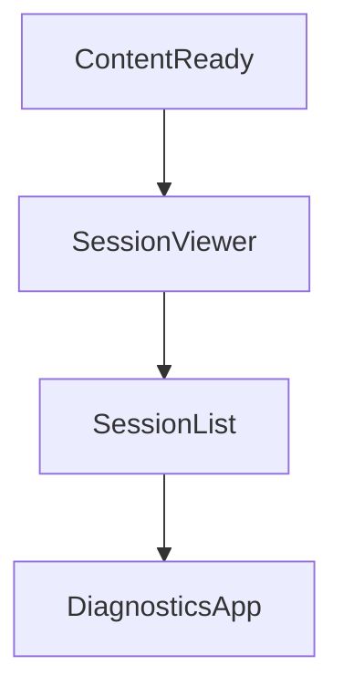

# Chapter 3: Providers and Model Routing

Welcome to **Chapter 3: Providers and Model Routing**. In this part of **Goose Tutorial: Extensible Open-Source AI Agent for Real Engineering Work**, you will build an intuitive mental model first, then move into concrete implementation details and practical production tradeoffs.


This chapter focuses on selecting and configuring model providers for reliability, cost, and performance.

## Learning Goals

- compare provider categories in Goose
- configure provider credentials and model selection paths
- avoid common routing and rate-limit pitfalls
- standardize provider settings for team usage

## Provider Categories

| Category | Examples | Notes |
|:---------|:---------|:------|
| API providers | Anthropic, OpenAI, Groq, OpenRouter, xAI | best for direct programmatic control |
| cloud platform providers | Bedrock, Vertex AI, Databricks | enterprise policy alignment |
| local/compatible providers | Ollama, Docker Model Runner, LiteLLM | local privacy and custom routing |
| CLI pass-through providers | Claude Code, Codex CLI, Cursor Agent, Gemini CLI | can reuse existing subscriptions |

## Configuration Workflow

1. run `goose configure`
2. choose provider and authentication flow
3. select a model with tool-calling support
4. validate in a short task before long sessions

## Routing Stability Tips

- start with one default model before adding many alternatives
- use fallback strategy only after baseline behavior is stable
- keep provider credentials scoped and rotated
- document allowed providers in team onboarding docs

## Rate Limit and Failure Management

| Issue | Prevention |
|:------|:-----------|
| intermittent API failures | choose providers with retry-aware infrastructure |
| unstable model performance | pin known-good models for production tasks |
| auth drift across machines | standardize env var and secret manager strategy |

## Source References

- [Supported LLM Providers](https://block.github.io/goose/docs/getting-started/providers)
- [CLI Providers Guide](https://block.github.io/goose/docs/guides/cli-providers)
- [Rate Limits Guide](https://block.github.io/goose/docs/guides/handling-llm-rate-limits-with-goose)

## Summary

You now know how to route Goose through the right provider and model setup for your constraints.

Next: [Chapter 4: Permissions and Tool Governance](04-permissions-and-tool-governance.md)

## Depth Expansion Playbook

## Source Code Walkthrough

### `scripts/diagnostics-viewer.py`

The `ContentReady` class in [`scripts/diagnostics-viewer.py`](https://github.com/block/goose/blob/HEAD/scripts/diagnostics-viewer.py) handles a key part of this chapter's functionality:

```py

        # Auto-focus the content
        self.post_message(self.ContentReady())

    def _show_jsonl(self, filename: str, content: str, part: str):
        """Show JSONL file - either request or responses part."""
        lines = [line.strip() for line in content.strip().split('\n') if line.strip()]

        # Parse lines
        request_data = None
        responses = []

        if len(lines) > 0:
            try:
                request_data = json.loads(lines[0])
            except json.JSONDecodeError:
                # Skip malformed request line; diagnostics may be truncated or corrupted
                pass

        for i in range(1, len(lines)):
            try:
                responses.append(json.loads(lines[i]))
            except json.JSONDecodeError:
                # Skip individual malformed response lines; show only valid JSON entries
                pass

        # Show content
        content_area = self.query_one("#content-area", Vertical)
        content_area.remove_children()

        if part == "request" and request_data:
            tree = JsonTreeView(f"{filename} - request")
```

This class is important because it defines how Goose Tutorial: Extensible Open-Source AI Agent for Real Engineering Work implements the patterns covered in this chapter.

### `scripts/diagnostics-viewer.py`

The `SessionViewer` class in [`scripts/diagnostics-viewer.py`](https://github.com/block/goose/blob/HEAD/scripts/diagnostics-viewer.py) handles a key part of this chapter's functionality:

```py


class SessionViewer(Vertical):
    """Widget for viewing a diagnostics session."""

    BINDINGS = [
        Binding("ctrl+f,cmd+f", "search", "Search", show=True),
        Binding("c", "copy_file", "Copy file", show=True),
    ]

    def __init__(self, session: DiagnosticsSession):
        super().__init__()
        self.session = session

    def compose(self) -> ComposeResult:
        """Create child widgets."""
        yield Static(f"[bold yellow]Session: {self.session.name}[/bold yellow]", id="session-title")

        with Horizontal(id="main-content"):
            # Left side: File browser
            with Vertical(id="file-browser"):
                yield Static("[bold]Files:[/bold]")
                tree = Tree("Files", id="file-tree")
                tree.show_root = False

                # Build file tree
                files = self.session.get_file_list()

                # Group by directory
                dirs = {}
                for file in files:
                    parts = file.split('/')
```

This class is important because it defines how Goose Tutorial: Extensible Open-Source AI Agent for Real Engineering Work implements the patterns covered in this chapter.

### `scripts/diagnostics-viewer.py`

The `SessionList` class in [`scripts/diagnostics-viewer.py`](https://github.com/block/goose/blob/HEAD/scripts/diagnostics-viewer.py) handles a key part of this chapter's functionality:

```py


class SessionList(Vertical):
    """Widget for listing available sessions."""

    def __init__(self, sessions: list[DiagnosticsSession]):
        super().__init__()
        self.sessions = sessions

    def compose(self) -> ComposeResult:
        """Create child widgets."""
        yield Static("[bold yellow]Available Diagnostics Sessions[/bold yellow]\n")

        if not self.sessions:
            yield Static("[red]No diagnostics files found[/red]")
        else:
            yield Static(f"[dim]Found {len(self.sessions)} session(s)[/dim]\n")
            yield ListView(id="session-list")

    def on_mount(self):
        """Populate the list after mounting."""
        list_view = self.query_one(ListView)
        for session in self.sessions:
            item = ListItem(
                Label(f"{session.name}\n[dim]{session.zip_path.name}[/dim]"),
                name=session.zip_path.name
            )
            list_view.append(item)


class DiagnosticsApp(App):
    """Diagnostics viewer application."""
```

This class is important because it defines how Goose Tutorial: Extensible Open-Source AI Agent for Real Engineering Work implements the patterns covered in this chapter.

### `scripts/diagnostics-viewer.py`

The `DiagnosticsApp` class in [`scripts/diagnostics-viewer.py`](https://github.com/block/goose/blob/HEAD/scripts/diagnostics-viewer.py) handles a key part of this chapter's functionality:

```py


class DiagnosticsApp(App):
    """Diagnostics viewer application."""

    # Disable command palette (Ctrl+\)
    ENABLE_COMMAND_PALETTE = False

    CSS = """
    Screen {
        background: $surface;
    }

    /* Modal styles */
    TextViewerModal {
        align: center middle;
    }

    #modal-container {
        width: 80%;
        height: 80%;
        background: $surface;
        border: thick $primary;
        padding: 1;
    }

    #modal-title {
        background: $primary;
        color: $text;
        padding: 1;
        text-align: center;
        dock: top;
```

This class is important because it defines how Goose Tutorial: Extensible Open-Source AI Agent for Real Engineering Work implements the patterns covered in this chapter.


## How These Components Connect


