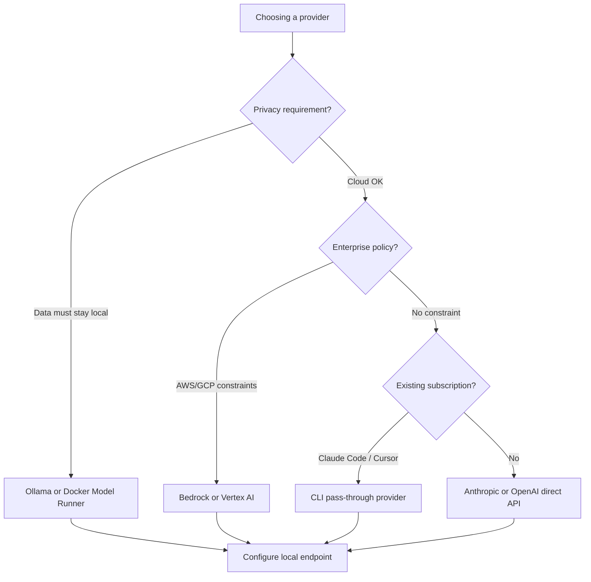
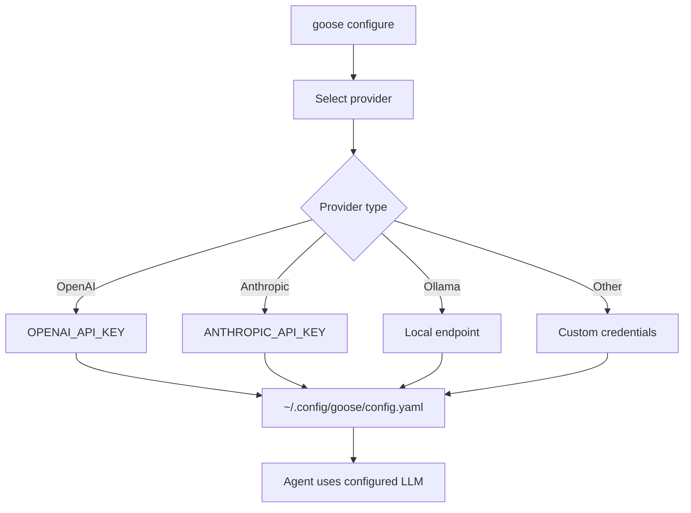

# Chapter 3: Providers and Model Routing

Welcome to **Chapter 3: Providers and Model Routing**. In this part of **Goose Tutorial: Extensible Open-Source AI Agent for Real Engineering Work**, you will build an intuitive mental model first, then move into concrete implementation details and practical production tradeoffs.


This chapter focuses on selecting and configuring model providers for reliability, cost, and performance.

## Learning Goals

- compare provider categories in Goose
- configure provider credentials and model selection paths
- avoid common routing and rate-limit pitfalls
- standardize provider settings for team usage

## Provider Selection Decision Tree



## Provider Categories

| Category | Examples | Notes |
|:---------|:---------|:------|
| API providers | Anthropic, OpenAI, Groq, OpenRouter, xAI | best for direct programmatic control |
| cloud platform providers | Bedrock, Vertex AI, Databricks | enterprise policy alignment |
| local/compatible providers | Ollama, Docker Model Runner, LiteLLM | local privacy and custom routing |
| CLI pass-through providers | Claude Code, Codex CLI, Cursor Agent, Gemini CLI | can reuse existing subscriptions |

## Configuration Workflow

1. run `goose configure`
2. choose provider and authentication flow
3. select a model with tool-calling support
4. validate in a short task before long sessions

After initial setup, your provider and model are stored in `~/.config/goose/config.yaml`. You can verify the active configuration at any time with `goose info`.

## Provider Credential Storage

Goose stores API keys in the system keychain when available, falling back to the config file. For team environments:

- use environment variables (`ANTHROPIC_API_KEY`, `OPENAI_API_KEY`, etc.) rather than storing keys in the config file
- rotate keys on a regular schedule and update them via `goose configure` or by re-exporting the environment variable
- for CI, inject credentials as secrets rather than baking them into images or config files

## Ollama Setup for Local Usage

To use Goose with a locally running Ollama model:

1. Install Ollama: `curl -fsSL https://ollama.ai/install.sh | sh`
2. Pull a tool-capable model: `ollama pull qwen2.5-coder:7b`
3. Run `goose configure` and select "Ollama" as the provider
4. Select the model name (e.g., `qwen2.5-coder:7b`)

Local providers have no API costs and no data leaves your machine — useful for sensitive codebases or offline environments. Performance depends on your hardware; a GPU is recommended for models larger than 7B parameters.

## Routing Stability Tips

- start with one default model before adding many alternatives
- use fallback strategy only after baseline behavior is stable
- keep provider credentials scoped and rotated
- document allowed providers in team onboarding docs

## Model Selection Criteria

Not all models support tool calling, and models that do vary significantly in reliability. When choosing a model:

- **tool-calling support is required** — models that only do text completion will fail at step 3 of the agent loop
- **context window matters** — for large codebases, choose models with 100k+ context; Goose's compaction reduces but does not eliminate context pressure
- **extended thinking** — Claude and Gemini models support extended thinking mode, configurable during `goose configure`; this improves quality on complex multi-step tasks at higher token cost

## CLI Pass-Through Providers

Goose can delegate inference to other CLI tools you already have authenticated:

```bash
# Use Claude Code as provider (reuses your Claude subscription)
# Select "Claude Code" during goose configure

# Use Cursor Agent as provider
# Select "Cursor Agent" during goose configure
```

This is useful in organizations where developers already have subscriptions to one of these tools and adding a separate Goose API key would create overhead.

## Environment Variable Overrides

Provider and model can be overridden per-invocation without changing the persisted config:

```bash
GOOSE_PROVIDER=openai GOOSE_MODEL=gpt-4o goose run --text "..."
```

This is the recommended pattern for CI pipelines where the provider may differ from a developer's local config.

## Rate Limit and Failure Management

| Issue | Prevention |
|:------|:-----------|
| intermittent API failures | choose providers with retry-aware infrastructure |
| unstable model performance | pin known-good models for production tasks |
| auth drift across machines | standardize env var and secret manager strategy |
| rate limits in CI | use `GOOSE_PROVIDER` env var to select a higher-quota provider for CI |
| context window exceeded | tune `GOOSE_AUTO_COMPACT_THRESHOLD` and choose a larger context model |

## Source References

- [Supported LLM Providers](https://block.github.io/goose/docs/getting-started/providers)
- [CLI Providers Guide](https://block.github.io/goose/docs/guides/cli-providers)
- [Rate Limits Guide](https://block.github.io/goose/docs/guides/handling-llm-rate-limits-with-goose)

## Verifying Provider Configuration

Before running a long session, validate your provider setup with a short test:

```bash
# Quick validation: ask for a one-line response
goose run --text "Reply with only: 'Provider is working'" --max-turns 2
```

If this fails, the diagnostic path is:
1. `goose info` — confirm which provider and model are active
2. Check that the API key environment variable is set (e.g., `echo $ANTHROPIC_API_KEY`)
3. Re-run `goose configure` to refresh credentials
4. Check the provider's status page for outages

## Summary

You now know how to route Goose through the right provider and model setup for your constraints.

Next: [Chapter 4: Permissions and Tool Governance](04-permissions-and-tool-governance.md)

## How These Components Connect



## Source Code Walkthrough

### `crates/goose-cli/src/commands/configure.rs` — provider selection and credential management

The `configure_provider_dialog()` function in [`crates/goose-cli/src/commands/configure.rs`](https://github.com/block/goose/blob/main/crates/goose-cli/src/commands/configure.rs) is the main entry point for provider setup:

```rust
pub async fn configure_provider_dialog() -> anyhow::Result<bool> {
    let config = Config::global();
    let mut available_providers = providers().await;
    available_providers.sort_by(|a, b| a.0.display_name.cmp(&b.0.display_name));

    let provider_name = cliclack::select("Which model provider should we use?")
        .initial_value(&default_provider)
        .items(&provider_items)
        .filter_mode()
        .interact()?;

    for key in provider_meta.config_keys.iter().filter(|k| k.primary || k.oauth_flow) {
        if !configure_single_key(config, provider_name, &provider_meta.display_name, key).await? {
            return Ok(false);
        }
    }
    // ... model selection, optional extended thinking config, test call
    Ok(true)
}
```

Provider registration uses the `ProviderMetadata` type, which declares `config_keys` (required credentials), `display_name`, and `description`. `Config::global()` is a singleton backed by `~/.config/goose/config.yaml`.

### `crates/goose-server/src/routes/agent.rs` — runtime provider and model switching

The `UpdateProviderRequest` struct in [`crates/goose-server/src/routes/agent.rs`](https://github.com/block/goose/blob/main/crates/goose-server/src/routes/agent.rs) allows the desktop app to swap providers at runtime without restarting the binary:

```rust
// Deserialized from POST /agent/update_provider
pub struct UpdateProviderRequest {
    pub provider: String,
    pub model: String,
}
```

The route handler re-initializes the agent with the new provider+model pair while preserving the existing session state. This is what powers the provider dropdown in the Goose desktop UI and is also usable from scripts via the Goose API.
