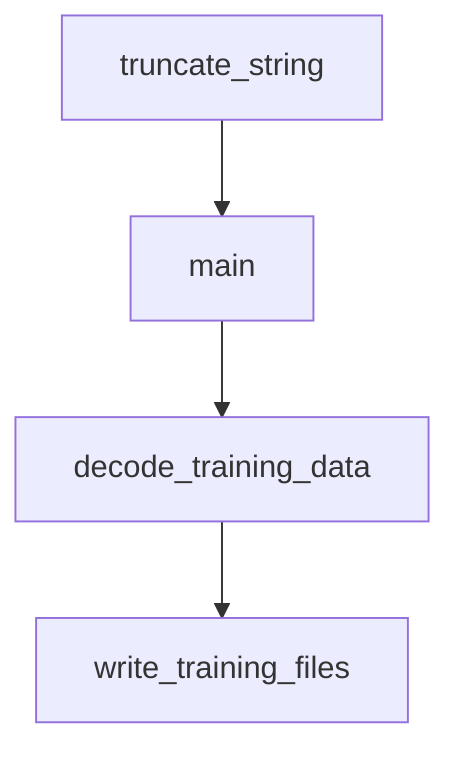

# Chapter 4: Permissions and Tool Governance

Welcome to **Chapter 4: Permissions and Tool Governance**. In this part of **Goose Tutorial: Extensible Open-Source AI Agent for Real Engineering Work**, you will build an intuitive mental model first, then move into concrete implementation details and practical production tradeoffs.


This chapter covers the controls that separate fast automation from unsafe automation.

## Learning Goals

- choose the right Goose permission mode for each task class
- configure per-tool controls for sensitive operations
- reduce unnecessary tool surface to improve safety and quality
- enforce extension policy in constrained environments

## Permission Modes

| Mode | Behavior | Best For |
|:-----|:---------|:---------|
| Completely Autonomous | executes changes and tools without approval prompts | trusted local prototyping |
| Manual Approval | asks before tool actions | high-control sessions |
| Smart Approval | risk-based approvals | balanced day-to-day workflows |
| Chat Only | no tool execution | analysis-only tasks |

## Tool Governance Practices

1. prefer `Manual` or `Smart` for production repositories
2. explicitly deny destructive tools where not needed
3. keep active tool set small to reduce model confusion
4. use `.gooseignore` to exclude sensitive or noisy paths

## Corporate Policy Control

For restricted environments, Goose can enforce extension allowlists via `GOOSE_ALLOWLIST` and a hosted YAML allowlist policy.

## Source References

- [goose Permission Modes](https://block.github.io/goose/docs/guides/goose-permissions)
- [Managing Tool Permissions](https://block.github.io/goose/docs/guides/managing-tools/tool-permissions)
- [goose Extension Allowlist](https://block.github.io/goose/docs/guides/allowlist)
- [Using .gooseignore](https://block.github.io/goose/docs/guides/using-gooseignore)

## Summary

You now have a concrete security-control model for tool execution in Goose.

Next: [Chapter 5: Sessions and Context Management](05-sessions-and-context-management.md)

## Depth Expansion Playbook

## Source Code Walkthrough

### `scripts/diagnostics-viewer.py`

The `truncate_string` function in [`scripts/diagnostics-viewer.py`](https://github.com/block/goose/blob/HEAD/scripts/diagnostics-viewer.py) handles a key part of this chapter's functionality:

```py


def truncate_string(s: str, max_len: int = 100, edge_len: int = 35) -> str:
    """Truncate a string if it's longer than max_len."""
    if len(s) <= max_len:
        return s

    omitted = len(s) - (2 * edge_len)
    return f"{s[:edge_len]}[{omitted} more]{s[-edge_len:]}"


class JsonTreeView(Tree):
    """A tree widget for displaying collapsible JSON."""

    BINDINGS = [
        Binding("ctrl+o", "toggle_all", "Toggle All", show=True),
    ]

    def __init__(self, *args, **kwargs):
        super().__init__(*args, **kwargs)
        self.json_data = None
        self.show_root = False
        self.all_expanded = False

    def load_json(self, data: Any, label: str = "JSON"):
        """Load JSON data into the tree."""
        self.json_data = data
        self.clear()
        self.root.label = label
        self._build_tree(self.root, data)
        # Expand all nodes by default
        self.root.expand_all()
```

This function is important because it defines how Goose Tutorial: Extensible Open-Source AI Agent for Real Engineering Work implements the patterns covered in this chapter.

### `scripts/diagnostics-viewer.py`

The `main` function in [`scripts/diagnostics-viewer.py`](https://github.com/block/goose/blob/HEAD/scripts/diagnostics-viewer.py) handles a key part of this chapter's functionality:

```py
        yield Static(f"[bold yellow]Session: {self.session.name}[/bold yellow]", id="session-title")

        with Horizontal(id="main-content"):
            # Left side: File browser
            with Vertical(id="file-browser"):
                yield Static("[bold]Files:[/bold]")
                tree = Tree("Files", id="file-tree")
                tree.show_root = False

                # Build file tree
                files = self.session.get_file_list()

                # Group by directory
                dirs = {}
                for file in files:
                    parts = file.split('/')
                    is_jsonl = file.endswith('.jsonl')

                    if len(parts) == 1:
                        # Root file
                        if is_jsonl:
                            # Add two entries for JSONL files
                            tree.root.add_leaf(f"{file} - request", data={"file": file, "part": "request"})
                            tree.root.add_leaf(f"{file} - responses", data={"file": file, "part": "responses"})
                        else:
                            tree.root.add_leaf(file, data={"file": file, "part": None})
                    else:
                        # File in directory
                        dir_name = parts[0]
                        if dir_name not in dirs:
                            dirs[dir_name] = tree.root.add(dir_name, expand=True)

```

This function is important because it defines how Goose Tutorial: Extensible Open-Source AI Agent for Real Engineering Work implements the patterns covered in this chapter.

### `recipe-scanner/decode-training-data.py`

The `decode_training_data` function in [`recipe-scanner/decode-training-data.py`](https://github.com/block/goose/blob/HEAD/recipe-scanner/decode-training-data.py) handles a key part of this chapter's functionality:

```py
from pathlib import Path

def decode_training_data():
    """
    Decode all available training data from environment variables
    Returns a dictionary with risk levels and their decoded recipes
    """
    training_data = {}
    
    # Check for each risk level
    for risk_level in ["LOW", "MEDIUM", "HIGH", "EXTREME"]:
        env_var = f"TRAINING_DATA_{risk_level}"
        encoded_data = os.environ.get(env_var)
        
        if encoded_data:
            try:
                # Decode the base64 outer layer
                json_data = base64.b64decode(encoded_data).decode('utf-8')
                
                # Parse the JSON
                parsed_data = json.loads(json_data)
                
                # Decode each recipe's content
                for recipe in parsed_data.get('recipes', []):
                    recipe_content = base64.b64decode(recipe['content_base64']).decode('utf-8')
                    recipe['content'] = recipe_content
                    # Keep the base64 version for reference but don't need it for analysis
                
                training_data[risk_level.lower()] = parsed_data
                print(f"✅ Decoded {len(parsed_data['recipes'])} {risk_level.lower()} risk recipes")
                
            except Exception as e:
```

This function is important because it defines how Goose Tutorial: Extensible Open-Source AI Agent for Real Engineering Work implements the patterns covered in this chapter.

### `recipe-scanner/decode-training-data.py`

The `write_training_files` function in [`recipe-scanner/decode-training-data.py`](https://github.com/block/goose/blob/HEAD/recipe-scanner/decode-training-data.py) handles a key part of this chapter's functionality:

```py
    return training_data

def write_training_files(training_data, output_dir="/tmp/training"):
    """
    Write decoded training files to disk for Goose to analyze
    """
    output_path = Path(output_dir)
    output_path.mkdir(exist_ok=True)
    
    # Write a summary file for Goose
    summary = {
        "training_summary": "Recipe security training data",
        "risk_levels": {},
        "total_recipes": 0
    }
    
    for risk_level, data in training_data.items():
        risk_dir = output_path / risk_level
        risk_dir.mkdir(exist_ok=True)
        
        recipes_info = []
        
        for recipe in data.get('recipes', []):
            # Write the recipe file
            recipe_file = risk_dir / recipe['filename']
            with open(recipe_file, 'w') as f:
                f.write(recipe['content'])
            
            # Write the training notes
            notes_file = risk_dir / f"{recipe['filename']}.notes.txt"
            with open(notes_file, 'w') as f:
                f.write(f"Risk Level: {risk_level.upper()}\n")
```

This function is important because it defines how Goose Tutorial: Extensible Open-Source AI Agent for Real Engineering Work implements the patterns covered in this chapter.


## How These Components Connect


