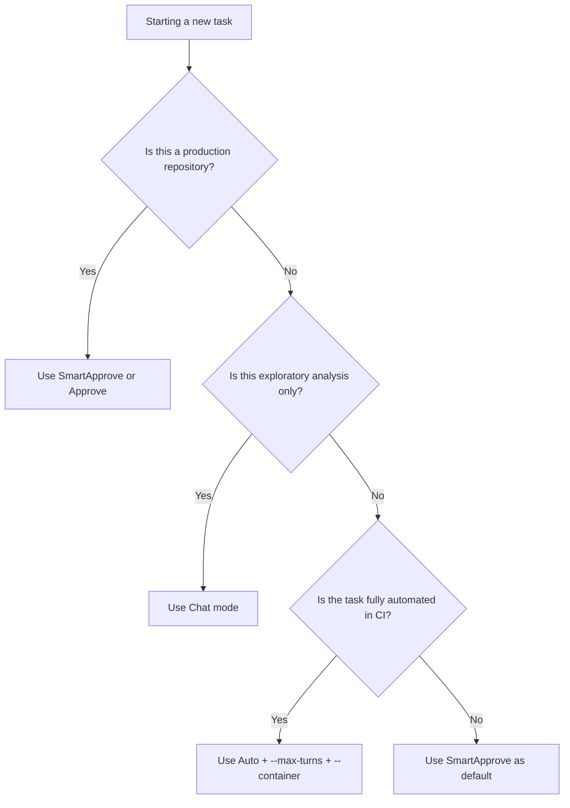
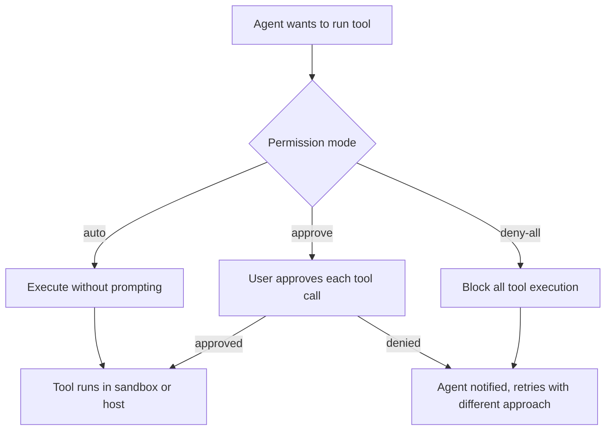

# Chapter 4: Permissions and Tool Governance

Welcome to **Chapter 4: Permissions and Tool Governance**. In this part of **Goose Tutorial: Extensible Open-Source AI Agent for Real Engineering Work**, you will build an intuitive mental model first, then move into concrete implementation details and practical production tradeoffs.


This chapter covers the controls that separate fast automation from unsafe automation.

## Learning Goals

- choose the right Goose permission mode for each task class
- configure per-tool controls for sensitive operations
- reduce unnecessary tool surface to improve safety and quality
- enforce extension policy in constrained environments

## Permission Modes

| Mode | Behavior | Best For |
|:-----|:---------|:---------|
| Completely Autonomous | executes changes and tools without approval prompts | trusted local prototyping |
| Manual Approval | asks before tool actions | high-control sessions |
| Smart Approval | risk-based approvals | balanced day-to-day workflows |
| Chat Only | no tool execution | analysis-only tasks |

## Tool Governance Practices

1. prefer `Approve` or `SmartApprove` for production repositories
2. explicitly restrict destructive tools where not needed (shell, file write)
3. keep active tool set small to reduce model confusion — load only the extensions needed for the task
4. use `.gooseignore` to exclude sensitive or noisy paths from context
5. use `--container` for any task that executes user-provided or external code

## What Smart Approval Covers

`SmartApprove` (also called "Smart Approval" in the UI) applies risk-based logic:

- **auto-approves** read-only operations: file reads, directory listing, search, web fetch
- **requires approval** for modification operations: file writes, shell commands, API mutations
- **always blocks** operations on paths in `.gooseignore`

This mode provides most of the safety benefit of full approval mode with significantly less friction for investigation and analysis tasks.

## Choosing a Permission Mode by Task Class

| Task Class | Recommended Mode | Rationale |
|:-----------|:-----------------|:----------|
| exploring an unfamiliar codebase | Chat | no side effects, no accidental writes |
| reviewing and summarizing PRs | Chat or SmartApprove | read-heavy, minimal write risk |
| refactoring with human oversight | SmartApprove | approves modifications, skips reads |
| automated CI task with known scope | Auto + `--max-turns` | bounded task, controlled environment |
| running untrusted extensions | Approve + `--container` | sandbox + explicit approval at each step |

## The `.gooseignore` File

`.gooseignore` follows `.gitignore` syntax and tells Goose which files and directories to treat as off-limits for reads and writes:

```
# .gooseignore example
.env
*.pem
secrets/
node_modules/
dist/
```

Place this file at the repository root. Goose will not expose files matching these patterns as context or attempt to modify them. This is particularly important when your working directory contains credentials or generated artifacts that should never appear in LLM context.

## Container Isolation

The `--container docker-image:tag` flag in `SessionOptions` forces all extension tool calls to execute inside a Docker container. The agent itself runs on your host, but shell commands, file writes, and other tool-backed actions are forwarded into the container:

```bash
goose session --container ubuntu:22.04 --with-builtin developer
```

Use this when:
- running code generation tasks in a clean environment
- testing extensions that may have side effects
- isolating network access for security-sensitive tasks

## Risk Assessment by Tool Class

Not all tools carry equal risk. When thinking about which permission mode to apply, consider the tool's potential impact:

| Tool Class | Examples | Risk Level | Recommended Mode |
|:-----------|:---------|:-----------|:-----------------|
| Read-only filesystem | `read_file`, `list_directory` | Low | Auto-approve in SmartApprove |
| Web fetch | `web_search`, `fetch_url` | Low-Medium | Auto-approve in SmartApprove |
| File writes | `write_file`, `create_file` | Medium | Require approval in SmartApprove |
| Shell execution | `shell_exec`, `run_command` | High | Require approval in all modes except Auto |
| External API mutations | `create_pr`, `deploy_service` | High | Use Approve mode |
| Network configuration | firewall, DNS, routing | Critical | Approve + manual review before run |

## Corporate Policy Control

For restricted environments, Goose can enforce extension allowlists via `GOOSE_ALLOWLIST` and a hosted YAML allowlist policy. The allowlist YAML specifies which extension commands and sources are approved, blocking any extension not on the list from loading — even if a user tries to add it via `goose configure`.

## Practical Permission Workflow

When starting a new type of task:

1. Begin with `SmartApprove` and observe which approvals come up
2. If the same low-risk approval appears repeatedly, consider explicitly allowing it via `PermissionManager`
3. If an unexpected high-risk approval appears, stop and review before approving
4. Document the settled permission profile and share it in team onboarding

## Per-Tool Permission Overrides

On top of the global mode, individual tools can be set to always-allow or always-deny via the `PermissionManager`. This lets you create configurations like:

- global mode: `SmartApprove`
- `read_file` tool: always-allow (skip approval for reads)
- `shell_exec` tool: always-deny unless explicitly re-enabled per session

## Source References

- [goose Permission Modes](https://block.github.io/goose/docs/guides/goose-permissions)
- [Managing Tool Permissions](https://block.github.io/goose/docs/guides/managing-tools/tool-permissions)
- [goose Extension Allowlist](https://block.github.io/goose/docs/guides/allowlist)
- [Using .gooseignore](https://block.github.io/goose/docs/guides/using-gooseignore)

## Decision Flowchart for Permission Mode



## Quick Reference: Permission Flags

```bash
# Set mode at configure time (persisted)
goose configure   # select permission mode in wizard

# Override mode for a single session
GOOSE_MODE=approve goose session

# Sandbox with container isolation
goose session --container ubuntu:22.04 --with-builtin developer

# Hard cap on iterations
goose run --text "..." --max-turns 20 --max-tool-repetitions 3
```

## Summary

You now have a concrete security-control model for tool execution in Goose.

Next: [Chapter 5: Sessions and Context Management](05-sessions-and-context-management.md)

## How These Components Connect



## Source Code Walkthrough

### `crates/goose-cli/src/commands/configure.rs` — `GooseMode` and `PermissionManager`

The `GooseMode` enum and `PermissionManager` type are both imported by [`crates/goose-cli/src/commands/configure.rs`](https://github.com/block/goose/blob/main/crates/goose-cli/src/commands/configure.rs):

```rust
use goose::config::{Config, ConfigError, ExperimentManager,
    ExtensionEntry, GooseMode, PermissionManager};
```

`GooseMode` has four variants backing the four permission modes:

| Variant | Behavior |
|:--------|:---------|
| `Auto` | Full file and shell modification without prompts |
| `Approve` | Requires human approval before every tool action |
| `SmartApprove` | Risk-based approvals — prompts for modifications, not reads |
| `Chat` | Provider interaction only, no tool execution |

The `PermissionManager` manages per-tool overrides on top of the global mode. This separation lets you set `SmartApprove` as the global default while explicitly allowing specific read-only tools to run without approval.

### `crates/goose-cli/src/cli.rs` — runtime governance flags

The `SessionOptions` group in [`crates/goose-cli/src/cli.rs`](https://github.com/block/goose/blob/main/crates/goose-cli/src/cli.rs) contains the key runtime governance flags:

```
--max-tool-repetitions   // Limit consecutive identical tool calls
--max-turns              // Iteration ceiling (default: 1000)
--container IMAGE        // Run extensions inside a Docker container
```

Setting `--container ubuntu:22.04` forwards all tool-backed shell commands into the container, sandboxing writes and network access from the host. This is the recommended approach when running extensions that execute arbitrary code or have broad filesystem access.
