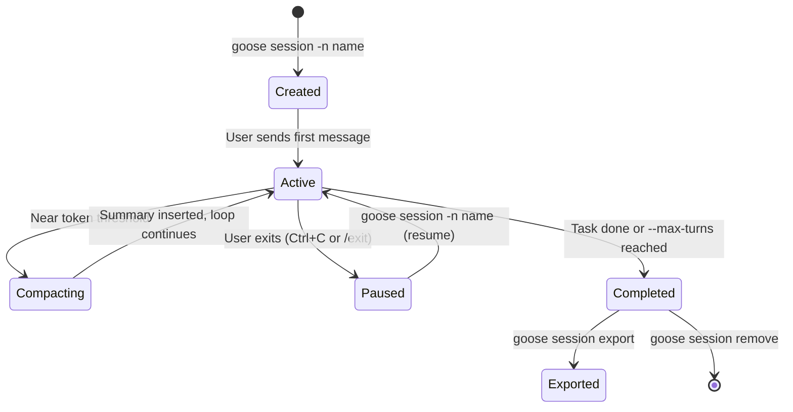
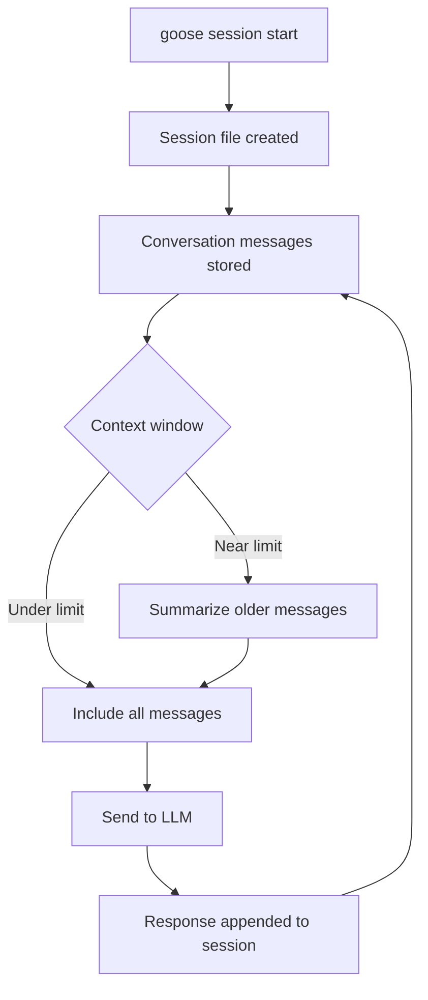

# Chapter 5: Sessions and Context Management

Welcome to **Chapter 5: Sessions and Context Management**. In this part of **Goose Tutorial: Extensible Open-Source AI Agent for Real Engineering Work**, you will build an intuitive mental model first, then move into concrete implementation details and practical production tradeoffs.


This chapter explains how Goose keeps long-running workflows productive without losing context quality.

## Learning Goals

- manage session lifecycle and naming cleanly
- use context compaction and strategies intentionally
- control runaway loops with max-turn governance
- tune session behavior for interactive vs headless usage

## Session Lifecycle Overview



## Session Operations

| Action | CLI Example | Outcome |
|:-------|:------------|:--------|
| start session | `goose session` | interactive agent loop |
| start named session | `goose session -n release-hardening` | easier recovery/resume |
| web session | `goose web --open` | browser-based interaction |

## Context Management Model

Goose uses two layers:

1. auto-compaction near token thresholds
2. fallback context strategies when limits are still exceeded

Useful environment controls include:

- `GOOSE_AUTO_COMPACT_THRESHOLD`
- `GOOSE_CONTEXT_STRATEGY`
- `GOOSE_MAX_TURNS`

## Practical Tuning

- interactive debugging: use `prompt` strategy for control
- headless flows: use `summarize` for continuity
- high-risk automation: lower max turns and require approvals

## Environment Variables Reference

| Variable | Default | Effect |
|:---------|:--------|:-------|
| `GOOSE_AUTO_COMPACT_THRESHOLD` | 0.8 (80% of context window) | When to trigger auto-compaction |
| `GOOSE_CONTEXT_STRATEGY` | `summarize` | Strategy used when compacting (`summarize`, `prompt`, `truncate`) |
| `GOOSE_MAX_TURNS` | 1000 | Global turn ceiling across all sessions |
| `GOOSE_SESSION_DIR` | `~/.config/goose/sessions/` | Where session files are stored |

These can be set in your shell profile for system-wide defaults, or in a `.env` file at the project root for project-specific overrides.

## Naming Conventions for Sessions

Good session names make the history useful:

- include a scope: `goose session -n auth-refactor-jan` or `goose session -n release-v2.1`
- avoid generic names like `test` or `session1` — they are hard to distinguish in `goose session list`
- for CI-generated sessions, use `$(date +%Y%m%d)-$(git rev-parse --short HEAD)` as the name suffix

## Source References

- [Session Management](https://block.github.io/goose/docs/guides/sessions/session-management)
- [Smart Context Management](https://block.github.io/goose/docs/guides/sessions/smart-context-management)
- [Logs and Session Records](https://block.github.io/goose/docs/guides/logs)

## Exporting Sessions for Review

Session exports are a powerful debugging and audit tool:

```bash
# Export a named session to Markdown for human review
goose session export --format markdown --name release-hardening \
  --output release-hardening-session.md

# Export to JSON for programmatic processing
goose session export --format json --name release-hardening | \
  jq '[.messages[] | select(.role == "tool")]'
```

The Markdown format reconstructs the full conversation with tool call inputs and outputs inlined — readable without any special tooling. The JSON format exposes the raw `Conversation` struct for scripted analysis.

## Context Strategy Comparison

| Strategy | Behavior | Best For |
|:---------|:---------|:---------|
| `summarize` (default) | older turns replaced with LLM-generated summary | headless/CI tasks where continuity matters |
| `prompt` | pauses and asks the user before compacting | interactive debugging where you want control |
| `truncate` | drops oldest turns without summarizing | cost-sensitive contexts where summary quality is less important |

Set via `GOOSE_CONTEXT_STRATEGY=summarize` in your environment or in `.env` at the project root.

## Quick Reference: Session Commands

```bash
# Start a named interactive session
goose session -n my-task

# Resume a named session
goose session -n my-task          # re-using the same name resumes

# List all sessions
goose session list
goose session list --format json

# Export a session to Markdown
goose session export --format markdown --name my-task

# Remove old sessions
goose session remove --name my-task

# Generate diagnostics bundle
goose session diagnostics --output /tmp/diag.zip
```

## Summary

You now know how to run longer Goose sessions without uncontrolled context growth.

Next: [Chapter 6: Extensions and MCP Integration](06-extensions-and-mcp-integration.md)

## Session File Storage

Sessions are stored as files under `~/.config/goose/sessions/`. Named sessions use the name you supply; anonymous sessions get a timestamp-based ID. The structure allows:

- resuming a session after an interruption: `goose session -n release-hardening`
- exporting for review: `goose session export --format markdown -n release-hardening`
- deleting stale sessions to reclaim disk: `goose session remove --name release-hardening`

When you resume a session, the full conversation history is loaded into the `Conversation` struct and context management rules apply from that point forward — so even resumed sessions benefit from auto-compaction.

## Max Turns in Practice

`GOOSE_MAX_TURNS` and the `--max-turns` CLI flag are the most effective safeguards against runaway automation. A sensible baseline:

| Context | Recommended `--max-turns` |
|:--------|:--------------------------|
| exploration and investigation | default (1000) or unset |
| focused refactor task | 50–100 |
| CI automation step | 20–40 |
| untrusted input or external data | 10–20 |

When the turn limit is reached, Goose exits the session cleanly (non-zero exit code) so your script or CI pipeline can detect and handle the failure.

## Web Session Mode

`goose web --open` starts a local HTTP server and opens a browser-based chat UI. This is useful when:
- working on a remote server over SSH without a terminal-friendly setup
- sharing a session view with a teammate (same machine)
- using a browser extension or bookmark to quickly open Goose

The web interface shares the same session storage as the CLI, so sessions started via `goose web` are visible in `goose session list`.

## How These Components Connect



## Source Code Walkthrough

### `crates/goose-cli/src/session/mod.rs` — `CliSession` and context tracking

The `CliSession` struct in [`crates/goose-cli/src/session/mod.rs`](https://github.com/block/goose/blob/main/crates/goose-cli/src/session/mod.rs) holds both the conversation history and the fields that control session lifecycle:

```rust
pub struct CliSession {
    agent: Agent,
    messages: Conversation,         // full turn history
    session_id: String,             // used for resume/export
    max_turns: Option<u32>,         // enforces GOOSE_MAX_TURNS ceiling
    retry_config: Option<RetryConfig>,
    run_mode: RunMode,              // Interactive vs headless (Run)
    output_format: String,          // text or json
    // ...
}
```

Context usage is surfaced via `display_context_usage()`, which queries the session manager for current token counts relative to the model's limit. When compaction fires (controlled by `GOOSE_AUTO_COMPACT_THRESHOLD`), the agent rewrites the `Conversation` with a summarized history.

### `crates/goose-cli/src/commands/session.rs` — session lifecycle operations

[`crates/goose-cli/src/commands/session.rs`](https://github.com/block/goose/blob/main/crates/goose-cli/src/commands/session.rs) implements the session management commands:

- **`handle_session_list()`** — lists all sessions with optional working-directory filter and JSON output mode; handles broken-pipe gracefully when piping to `head` or `grep`
- **`handle_session_remove()`** — deletes by ID, name, or regex with confirmation before destructive action
- **`handle_session_export()`** — exports to JSON, YAML, or Markdown; Markdown format reconstructs the full conversation with tool calls inlined
- **`handle_diagnostics()`** — bundles session metadata and logs into a ZIP file for sharing with support

Named sessions created via `goose session -n release-hardening` are stored under `~/.config/goose/sessions/` and can be resumed or exported at any time.
