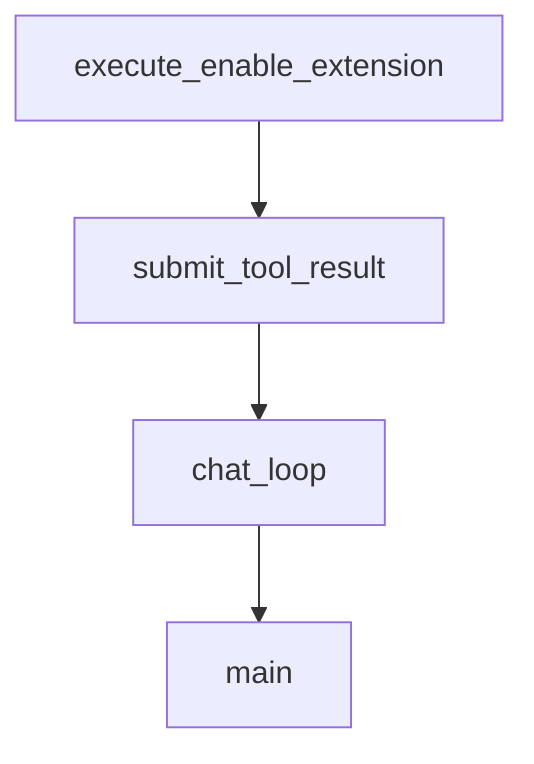

# Chapter 6: Extensions and MCP Integration

Welcome to **Chapter 6: Extensions and MCP Integration**. In this part of **Goose Tutorial: Extensible Open-Source AI Agent for Real Engineering Work**, you will build an intuitive mental model first, then move into concrete implementation details and practical production tradeoffs.


This chapter covers how Goose expands beyond built-ins through MCP extension workflows.

## Learning Goals

- understand Goose extension architecture
- enable and manage built-in extensions safely
- add custom MCP servers via UI or CLI
- standardize extension rollout for teams

## Built-In Extension Surface

Goose includes development and platform extensions such as:

- Developer
- Computer Controller
- Memory
- Extension Manager
- Skills
- Todo

These can be toggled based on task needs to reduce tool overload.

## Custom MCP Flow (CLI)

```bash
goose configure
# select: Add Extension
# choose: Command-line Extension OR Remote Extension
```

Example pattern for an MCP server command:

```bash
npx -y @modelcontextprotocol/server-memory
```

## Extension Safety Checklist

1. review extension command/source
2. set reasonable timeout values
3. apply tool permissions before broad usage
4. test in a sandbox repository first

## Source References

- [Using Extensions](https://block.github.io/goose/docs/getting-started/using-extensions)
- [Model Context Protocol](https://modelcontextprotocol.io/)
- [MCP Server Directory](https://www.pulsemcp.com/servers)

## Summary

You now know how to evolve Goose capabilities with built-in and external MCP integrations.

Next: [Chapter 7: CLI Workflows and Automation](07-cli-workflows-and-automation.md)

## Depth Expansion Playbook

## Source Code Walkthrough

### `examples/frontend_tools.py`

The `execute_enable_extension` function in [`examples/frontend_tools.py`](https://github.com/block/goose/blob/HEAD/examples/frontend_tools.py) handles a key part of this chapter's functionality:

```py


def execute_enable_extension(args: Dict[str, Any]) -> List[Dict[str, Any]]:
    """
    Execute the enable_extension tool.
    This function fetches available extensions, finds the one with the provided extension_name,
    and posts its configuration to the /extensions/add endpoint.
    """
    extension = args
    extension_name = extension.get("name")

    # Post the extension configuration to enable it
    with httpx.Client() as client:
        payload = {
            "type": extension.get("type"),
            "name": extension.get("name"),
            "cmd": extension.get("cmd"),
            "args": extension.get("args"),
            "envs": extension.get("envs", {}),
            "timeout": extension.get("timeout"),
            "bundled": extension.get("bundled"),
        }
        add_response = client.post(
            f"{GOOSE_URL}/extensions/add",
            json=payload,
            headers={"Content-Type": "application/json", "X-Secret-Key": SECRET_KEY},
        )
        if add_response.status_code != 200:
            error_text = add_response.text
            return [{
                "type": "text",
                "text": f"Error: Failed to enable extension: {error_text}",
```

This function is important because it defines how Goose Tutorial: Extensible Open-Source AI Agent for Real Engineering Work implements the patterns covered in this chapter.

### `examples/frontend_tools.py`

The `submit_tool_result` function in [`examples/frontend_tools.py`](https://github.com/block/goose/blob/HEAD/examples/frontend_tools.py) handles a key part of this chapter's functionality:

```py


def submit_tool_result(tool_id: str, result: List[Dict[str, Any]]) -> None:
    """Submit the tool execution result back to Goose.

    The result should be a list of Content variants (Text, Image, or Resource).
    Each Content variant has a type tag and appropriate fields.
    """
    payload = {
        "id": tool_id,
        "result": {
            "Ok": result  # Result enum variant with single key for success case
        },
    }

    with httpx.Client(timeout=2.0) as client:
        response = client.post(
            f"{GOOSE_URL}/tool_result",
            json=payload,
            headers={"X-Secret-Key": SECRET_KEY},
        )
        response.raise_for_status()


async def chat_loop() -> None:
    """Main chat loop that handles the conversation with Goose."""
    session_id = "test-session"

    # Use a client with a longer timeout for streaming
    async with httpx.AsyncClient(timeout=60.0) as client:
        # Get user input
        user_message = input("\nYou: ")
```

This function is important because it defines how Goose Tutorial: Extensible Open-Source AI Agent for Real Engineering Work implements the patterns covered in this chapter.

### `examples/frontend_tools.py`

The `chat_loop` function in [`examples/frontend_tools.py`](https://github.com/block/goose/blob/HEAD/examples/frontend_tools.py) handles a key part of this chapter's functionality:

```py


async def chat_loop() -> None:
    """Main chat loop that handles the conversation with Goose."""
    session_id = "test-session"

    # Use a client with a longer timeout for streaming
    async with httpx.AsyncClient(timeout=60.0) as client:
        # Get user input
        user_message = input("\nYou: ")
        if user_message.lower() in ["exit", "quit"]:
            return

        # Create the message object
        message = {
            "role": "user",
            "created": int(datetime.now().timestamp()),
            "content": [{"type": "text", "text": user_message}],
        }

        # Send to /reply endpoint
        payload = {
            "messages": [message],
            "session_id": session_id,
            "session_working_dir": os.getcwd(),
        }

        # Process the stream of responses
        async with client.stream(
            "POST",
            f"{GOOSE_URL}/reply", # lock 
            json=payload,
```

This function is important because it defines how Goose Tutorial: Extensible Open-Source AI Agent for Real Engineering Work implements the patterns covered in this chapter.

### `examples/frontend_tools.py`

The `main` function in [`examples/frontend_tools.py`](https://github.com/block/goose/blob/HEAD/examples/frontend_tools.py) handles a key part of this chapter's functionality:

```py


async def main():
    try:
        # Initialize the agent with our tool
        await setup_agent()

        # Start the chat loop
        await chat_loop()

    except Exception as e:
        print(f"Error: {e}")
        raise  # Re-raise to see full traceback


if __name__ == "__main__":
    asyncio.run(main())

```

This function is important because it defines how Goose Tutorial: Extensible Open-Source AI Agent for Real Engineering Work implements the patterns covered in this chapter.


## How These Components Connect


