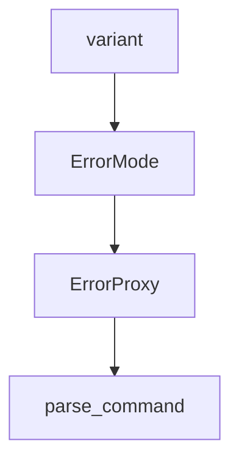

# Chapter 7: CLI Workflows and Automation

Welcome to **Chapter 7: CLI Workflows and Automation**. In this part of **Goose Tutorial: Extensible Open-Source AI Agent for Real Engineering Work**, you will build an intuitive mental model first, then move into concrete implementation details and practical production tradeoffs.


This chapter focuses on making Goose reliable inside repeatable terminal workflows.

## Learning Goals

- use Goose CLI commands with predictable flag patterns
- embed Goose into scripted engineering loops
- standardize diagnostics and update flows
- improve reproducibility across developer machines

## Core Commands to Operationalize

| Command | Purpose |
|:--------|:--------|
| `goose configure` | provider, extensions, and settings setup |
| `goose info` | inspect version and runtime config locations |
| `goose session` | interactive session in terminal |
| `goose run` | headless/task automation mode |
| `goose update` | upgrade to stable/canary builds |
| `goose completion zsh` | shell completion for faster operation |

## Automation Pattern

1. pin install/update strategy
2. verify provider credentials at runtime
3. run bounded task with max-turn controls
4. collect logs and outputs for review
5. fail fast on permission or tool-surface mismatch

## Troubleshooting Baseline

- run `goose info` during incident triage
- inspect logs before retry loops
- ensure command flags use current naming conventions

## Source References

- [Goose CLI Commands](https://block.github.io/goose/docs/guides/goose-cli-commands)
- [Updating goose](https://block.github.io/goose/docs/guides/updating-goose)
- [Diagnostics and Reporting](https://block.github.io/goose/docs/troubleshooting/diagnostics-and-reporting)

## Summary

You now have a production-friendly CLI operating model for Goose automation.

Next: [Chapter 8: Production Operations and Security](08-production-operations-and-security.md)

## Depth Expansion Playbook

## Source Code Walkthrough

### `examples/frontend_tools.py`

The `variant` interface in [`examples/frontend_tools.py`](https://github.com/block/goose/blob/HEAD/examples/frontend_tools.py) handles a key part of this chapter's functionality:

```py
                result /= n

        # Return properly structured Content::Text variant
        return [
            {
                "type": "text",
                "text": str(result),
                "annotations": None,  # Required field in Rust struct
            }
        ]
    except Exception as e:
        return [
            {
                "type": "text",
                "text": f"Error: {str(e)}",
                "annotations": None,  # Required field in Rust struct
            }
        ]

def get_tools() -> Dict[str, Any]:
    with httpx.Client() as client:
        response = client.get(
            f"{GOOSE_URL}/agent/tools",
            headers={"X-Secret-Key": SECRET_KEY},
        )
        response.raise_for_status()
        return response.json()


def execute_enable_extension(args: Dict[str, Any]) -> List[Dict[str, Any]]:
    """
    Execute the enable_extension tool.
```

This interface is important because it defines how Goose Tutorial: Extensible Open-Source AI Agent for Real Engineering Work implements the patterns covered in this chapter.

### `scripts/provider-error-proxy/proxy.py`

The `ErrorMode` class in [`scripts/provider-error-proxy/proxy.py`](https://github.com/block/goose/blob/HEAD/scripts/provider-error-proxy/proxy.py) handles a key part of this chapter's functionality:

```py


class ErrorMode(Enum):
    """Error injection modes."""
    NO_ERROR = 1
    CONTEXT_LENGTH = 2
    RATE_LIMIT = 3
    SERVER_ERROR = 4


# Error responses for each provider and error type
ERROR_CONFIGS = {
    'openai': {
        ErrorMode.CONTEXT_LENGTH: {
            'status': 400,
            'body': {
                'error': {
                    'message': "This model's maximum context length is 128000 tokens. However, your messages resulted in 150000 tokens. Please reduce the length of the messages.",
                    'type': 'invalid_request_error',
                    'code': 'context_length_exceeded'
                }
            }
        },
        ErrorMode.RATE_LIMIT: {
            'status': 429,
            'body': {
                'error': {
                    'message': 'Rate limit exceeded. Please try again later.',
                    'type': 'rate_limit_error',
                    'code': 'rate_limit_exceeded'
                }
            }
```

This class is important because it defines how Goose Tutorial: Extensible Open-Source AI Agent for Real Engineering Work implements the patterns covered in this chapter.

### `scripts/provider-error-proxy/proxy.py`

The `ErrorProxy` class in [`scripts/provider-error-proxy/proxy.py`](https://github.com/block/goose/blob/HEAD/scripts/provider-error-proxy/proxy.py) handles a key part of this chapter's functionality:

```py


class ErrorProxy:
    """HTTP proxy that can inject errors into provider responses."""
    
    def __init__(self):
        """Initialize the error proxy."""
        self.error_mode = ErrorMode.NO_ERROR
        self.error_count = 0  # Remaining errors to inject (0 = unlimited/percentage mode)
        self.error_percentage = 0.0  # Percentage of requests to error (0.0 = count mode)
        self.request_count = 0
        self.session: Optional[ClientSession] = None
        self.lock = threading.Lock()
        
    def set_error_mode(self, mode: ErrorMode, count: int = 1, percentage: float = 0.0):
        """
        Set the error injection mode.
        
        Args:
            mode: The error mode to use
            count: Number of errors to inject (default 1, 0 for unlimited)
            percentage: Percentage of requests to error (0.0-1.0, 0.0 for count mode)
        """
        with self.lock:
            self.error_mode = mode
            self.error_count = count
            self.error_percentage = percentage
            
    def should_inject_error(self) -> bool:
        """
        Determine if we should inject an error for this request.
        
```

This class is important because it defines how Goose Tutorial: Extensible Open-Source AI Agent for Real Engineering Work implements the patterns covered in this chapter.

### `scripts/provider-error-proxy/proxy.py`

The `parse_command` function in [`scripts/provider-error-proxy/proxy.py`](https://github.com/block/goose/blob/HEAD/scripts/provider-error-proxy/proxy.py) handles a key part of this chapter's functionality:

```py


def parse_command(command: str) -> tuple[Optional[ErrorMode], int, float, Optional[str]]:
    """
    Parse a command string and return the error mode, count, and percentage.

    Args:
        command: Command string (e.g., "c", "c 3", "r 30%", "u *")

    Returns:
        Tuple of (mode, count, percentage, error_message)
        If error_message is not None, parsing failed
    """
    # Parse command - remove all whitespace and parse
    command_no_space = command.strip().replace(" ", "")
    if not command_no_space:
        return (None, 0, 0.0, "Empty command")

    # Get the first character (error type letter)
    error_letter = command_no_space[0].lower()

    # Map letter to ErrorMode
    mode_map = {
        'n': ErrorMode.NO_ERROR,
        'c': ErrorMode.CONTEXT_LENGTH,
        'r': ErrorMode.RATE_LIMIT,
        'u': ErrorMode.SERVER_ERROR
    }

    if error_letter not in mode_map:
        return (None, 0, 0.0, f"Invalid command: '{error_letter}'. Use n, c, r, or u")

```

This function is important because it defines how Goose Tutorial: Extensible Open-Source AI Agent for Real Engineering Work implements the patterns covered in this chapter.


## How These Components Connect


