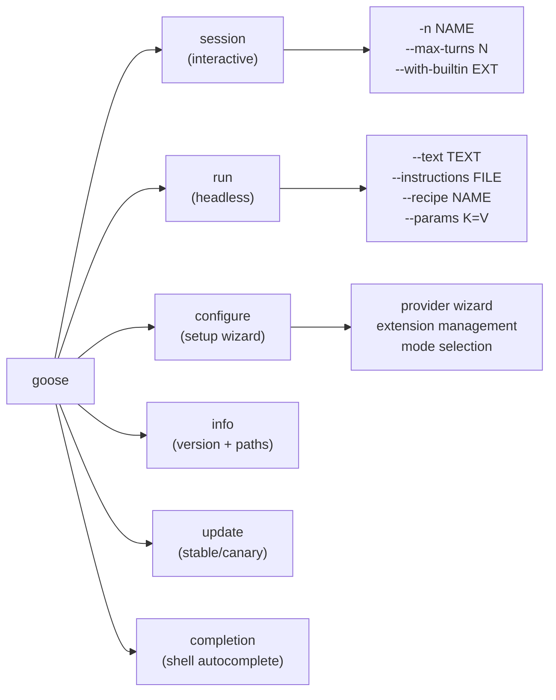
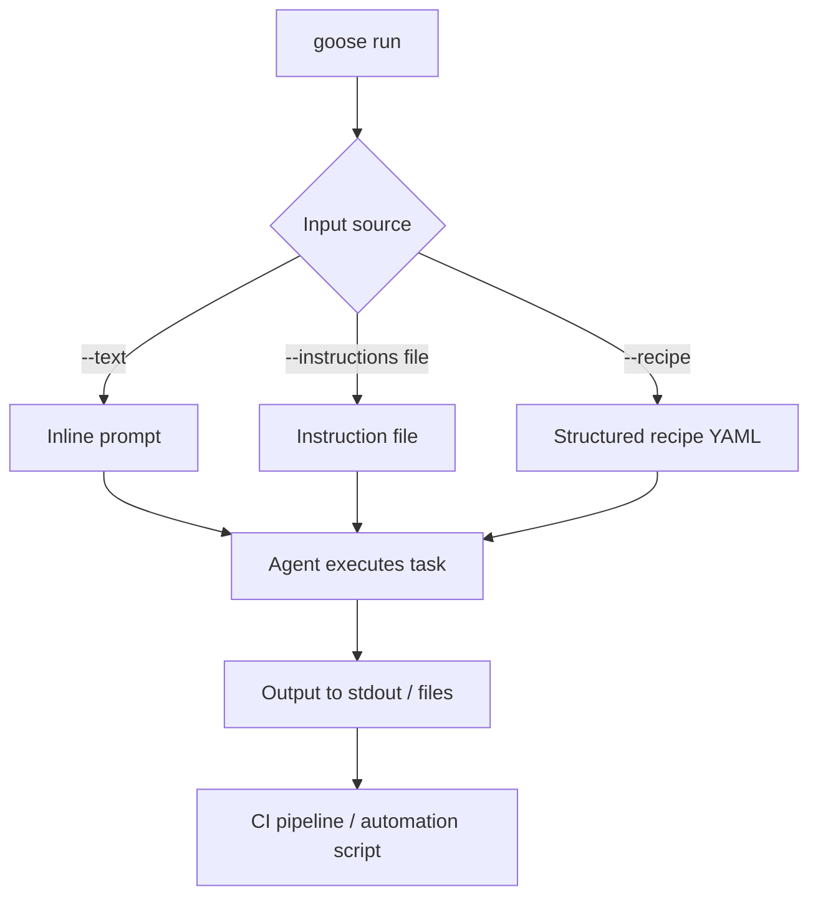

# Chapter 7: CLI Workflows and Automation

Welcome to **Chapter 7: CLI Workflows and Automation**. In this part of **Goose Tutorial: Extensible Open-Source AI Agent for Real Engineering Work**, you will build an intuitive mental model first, then move into concrete implementation details and practical production tradeoffs.


This chapter focuses on making Goose reliable inside repeatable terminal workflows.

## Learning Goals

- use Goose CLI commands with predictable flag patterns
- embed Goose into scripted engineering loops
- standardize diagnostics and update flows
- improve reproducibility across developer machines

## CLI Command Map



## Core Commands to Operationalize

| Command | Purpose |
|:--------|:--------|
| `goose configure` | provider, extensions, and settings setup |
| `goose info` | inspect version and runtime config locations |
| `goose session` | interactive session in terminal |
| `goose run` | headless/task automation mode |
| `goose update` | upgrade to stable/canary builds |
| `goose completion zsh` | shell completion for faster operation |
| `goose session list` | list all sessions with metadata |
| `goose session export` | export session to JSON/YAML/Markdown |
| `goose session remove` | delete sessions by name, ID, or regex |
| `goose session diagnostics` | generate ZIP bundle for troubleshooting |

## CI Integration Example

A minimal CI job using `goose run`:

```yaml
# .github/workflows/goose-task.yml
- name: Run Goose task
  env:
    ANTHROPIC_API_KEY: ${{ secrets.ANTHROPIC_API_KEY }}
    GOOSE_MODE: auto
  run: |
    goose run \
      --instructions .goose/tasks/check-api-breaking-changes.md \
      --max-turns 30 \
      --no-profile \
      --with-builtin developer
```

Key CI practices:
- always set `--max-turns` to prevent runaway jobs
- use `--no-profile` for a clean, reproducible extension surface
- inject credentials from secrets, not environment files
- check exit code: non-zero means the task failed or hit a limit

## The `goose run` Command in Detail

`goose run` is the primary surface for headless automation. Unlike `goose session`, it exits automatically when the task completes or the turn limit is reached:

```bash
# Run from an instruction file
goose run --instructions task.md --max-turns 30

# Run with inline text and a specific named session for resume
goose run --text "Generate a changelog from git log since v1.0.0" \
  --name changelog-task \
  --max-turns 20

# Run with a recipe and parameter substitution
goose run --recipe refactor-module \
  --params MODULE=auth \
  --params TARGET_VERSION=2.0 \
  --no-profile \
  --with-builtin developer
```

Exit codes follow Unix conventions: `0` for success, non-zero for failures including turn limit exceeded, permission denied, or provider errors.

## Recipes for Repeatable Tasks

Goose recipes are YAML files that encode a task template with parameter slots. They let you commit standardized AI tasks to your repository and invoke them consistently:

```yaml
# .goose/recipes/extract-todos.yaml
name: extract-todos
description: Extract all TODO and FIXME comments from source
parameters:
  - name: TARGET_DIR
    description: Directory to scan
    default: src/
prompt: |
  Scan all files in {{TARGET_DIR}} for TODO and FIXME comments.
  Produce a Markdown table with: file path, line number, comment text.
  Sort by file path.
```

Run it with:

```bash
goose run --recipe .goose/recipes/extract-todos.yaml --params TARGET_DIR=lib/
```

## Shell Completion Setup

Install shell completion once to enable tab-completion for all Goose commands and flags:

```bash
# zsh
goose completion zsh >> ~/.zshrc && source ~/.zshrc

# bash
goose completion bash >> ~/.bashrc && source ~/.bashrc
```

## Automation Pattern

1. pin install/update strategy (`goose update --channel stable`)
2. verify provider credentials at runtime (`goose info`)
3. run bounded task with max-turn controls (`--max-turns 30`)
4. collect logs and outputs for review (session files in `~/.config/goose/sessions/`)
5. fail fast on permission or tool-surface mismatch (non-zero exit code triggers CI failure)

## Troubleshooting Baseline

- run `goose info` during incident triage to confirm version and config path
- inspect session logs at `~/.config/goose/sessions/` before retry loops
- run `goose session diagnostics` to generate a ZIP bundle for deeper investigation
- ensure command flags use current naming conventions (`goose --help` shows current surface)

## Source References

- [Goose CLI Commands](https://block.github.io/goose/docs/guides/goose-cli-commands)
- [Updating goose](https://block.github.io/goose/docs/guides/updating-goose)
- [Diagnostics and Reporting](https://block.github.io/goose/docs/troubleshooting/diagnostics-and-reporting)

## Summary

You now have a production-friendly CLI operating model for Goose automation.

Next: [Chapter 8: Production Operations and Security](08-production-operations-and-security.md)

## How These Components Connect



## Source Code Walkthrough

### `crates/goose-cli/src/cli.rs` — `goose run` and headless flags

The `goose run` subcommand is the primary surface for automation. Its key flags come from `InputOptions` and `SessionOptions` defined in [`crates/goose-cli/src/cli.rs`](https://github.com/block/goose/blob/main/crates/goose-cli/src/cli.rs):

```rust
// InputOptions (for goose run)
--instructions (-i)   // path to an instruction file, or "-" for stdin
--text (-t)           // inline task text passed directly
--recipe              // named recipe or .yaml recipe file path
--params KEY=VALUE    // dynamic key-value substitutions into recipes (repeatable)

// SessionOptions
--max-turns N         // hard ceiling on agent iterations (default: 1000)
--no-profile          // skip loading default extensions from profile
--with-extension CMD  // inject a stdio extension for this run only
```

Exit codes follow Unix conventions. In CI, check `$?` after `goose run` to detect failures including turn limit exceeded, provider errors, or permission denials.

### `crates/goose-cli/src/commands/session.rs` — diagnostics for automation triage

[`crates/goose-cli/src/commands/session.rs`](https://github.com/block/goose/blob/main/crates/goose-cli/src/commands/session.rs) exposes `handle_diagnostics()`, which generates a ZIP bundle containing session metadata, logs, and conversation history for failure triage:

```bash
# After a failed goose run, capture diagnostics
goose session diagnostics --output /tmp/goose-diag-$(date +%s).zip

# List recent sessions in JSON for scripted triage
goose session list --format json | jq '.[] | select(.status == "error")'
```

The `handle_session_list()` function explicitly supports `--format json` for machine consumption.
