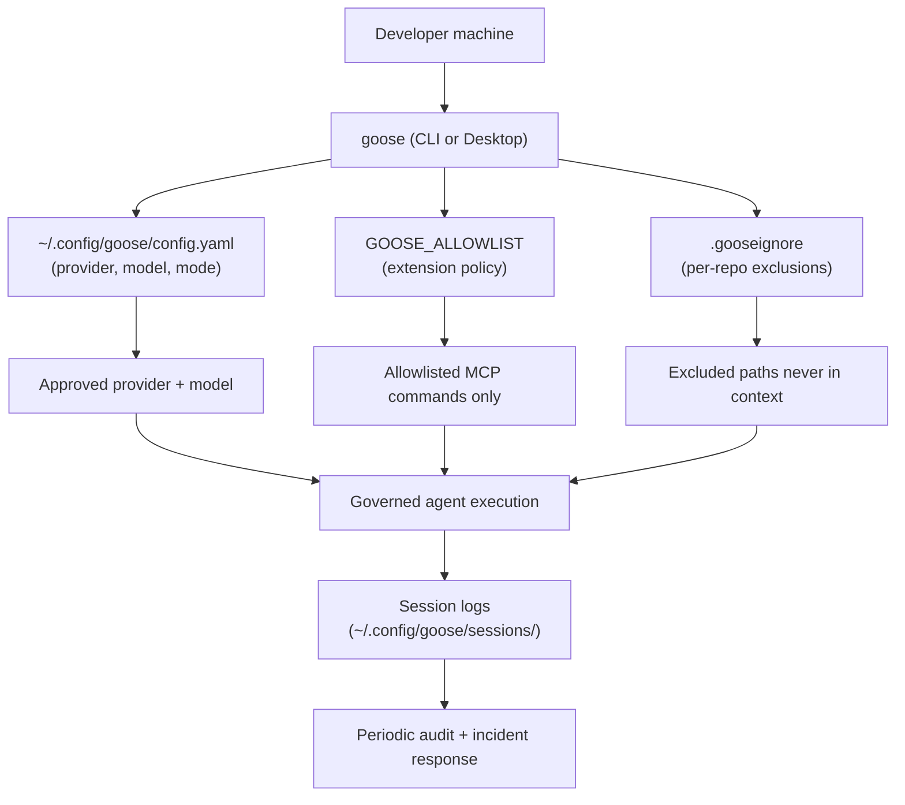
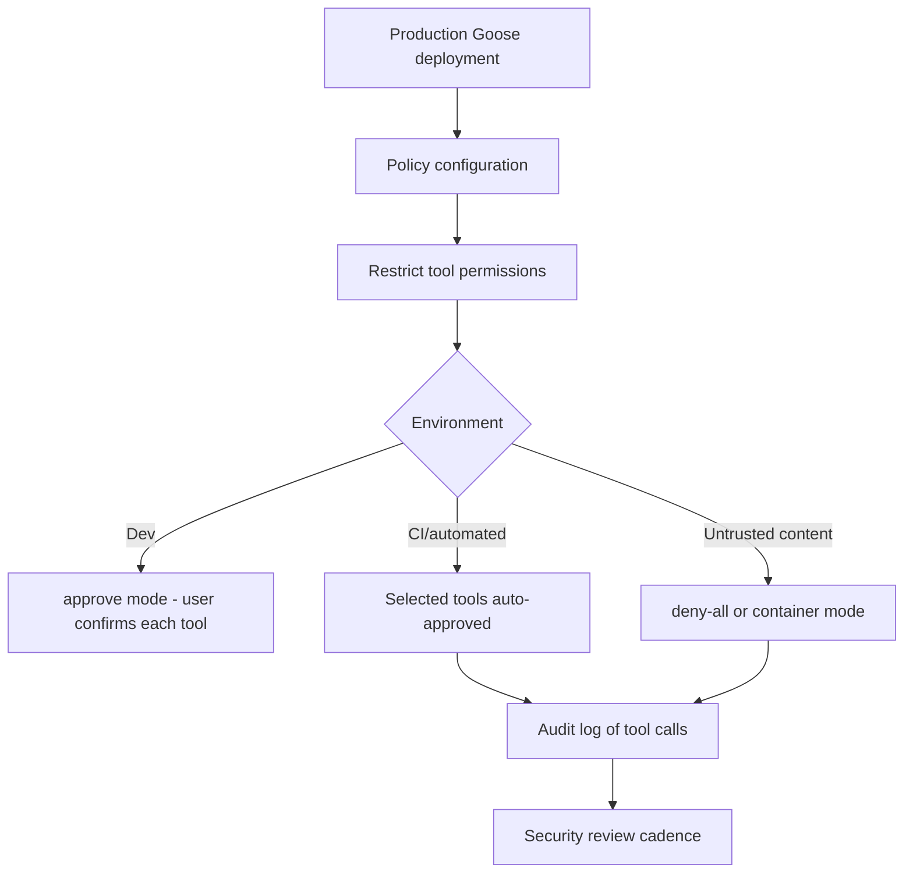

# Chapter 8: Production Operations and Security

Welcome to **Chapter 8: Production Operations and Security**. In this part of **Goose Tutorial: Extensible Open-Source AI Agent for Real Engineering Work**, you will build an intuitive mental model first, then move into concrete implementation details and practical production tradeoffs.


This chapter turns Goose from a useful local assistant into a controlled team platform.

## Learning Goals

- define production guardrails for Goose usage
- enforce extension and tool policies per environment
- build incident response paths around logs and diagnostics
- establish upgrade and governance cadences

## Production Deployment Architecture



## Production Guardrails

| Domain | Recommended Baseline |
|:-------|:---------------------|
| permissions | default to manual/smart approval in production repos |
| extensions | allowlist approved MCP commands and sources |
| context/cost | tune compaction thresholds and max turns |
| observability | collect logs and diagnostics on failures |
| upgrades | stage canary usage before broad rollout |

## Secure Adoption Flow

1. define approved provider/model matrix (document in team wiki)
2. define approved extension/tool matrix (encode in `GOOSE_ALLOWLIST` policy)
3. publish `.gooseignore` template in your repo scaffold
4. standardize `GooseMode` per environment class in team onboarding docs
5. run pilot with monitored repositories (export sessions for review)
6. review incidents and tighten defaults
7. schedule quarterly policy reviews as model capabilities evolve

## Responsible AI Coding (HOWTOAI.md)

Block's `HOWTOAI.md` at the repo root documents their own principles for responsible AI-assisted development with Goose:

- human remains responsible for all code that ships
- review AI-generated changes as carefully as you would any PR
- do not use Goose to generate content that bypasses your normal review process
- be explicit about AI assistance in commit messages and PR descriptions when it materially shaped the implementation

These are not Goose-enforced constraints — they are team norms. The governance system (allowlists, permission modes, `.gooseignore`) enforces technical boundaries; responsible use requires complementary social and process norms.

## The Allowlist System

`GOOSE_ALLOWLIST` points to a URL or file path containing a YAML policy that restricts which extensions and providers Goose can use. This is the primary control for managed deployments where developers should not be able to add arbitrary MCP servers:

```yaml
# allowlist.yaml example
extensions:
  allowed_commands:
    - "npx -y @modelcontextprotocol/server-filesystem"
    - "npx -y @modelcontextprotocol/server-github"
providers:
  allowed:
    - anthropic
    - openai
```

Set `GOOSE_ALLOWLIST=https://internal.example.com/goose-policy.yaml` in your organization's shell profile to enforce this policy on every developer machine.

## Incident Response Paths

When a Goose session causes an unexpected outcome:

1. **Capture diagnostics** — `goose session diagnostics` generates a ZIP with full conversation and tool call logs
2. **Review the session file** — sessions are plain files in `~/.config/goose/sessions/`; export to Markdown for readable review
3. **Identify the turn** — tool call logs show which model decision triggered the problem
4. **Tighten the policy** — add the problematic pattern to `.gooseignore` or lower the permission mode for that repository

## Security Threat Surface

The `SECURITY.md` at the repository root documents the known threat surface:

| Threat | Mitigation |
|:-------|:-----------|
| Prompt injection via document content | Use `Approve` mode when reading external/untrusted files |
| Tool permission bypass via malformed MCP responses | Allowlist trusted MCP commands only |
| Credential leakage through session export | Restrict export to non-secret working directories; add `.env` to `.gooseignore` |
| Runaway automation | Set `--max-turns` limits on all CI invocations |
| Supply chain risk in MCP extensions | Pin extension command versions; review source before adding |

## Upgrade Strategy

```bash
# Upgrade to latest stable
goose update --channel stable

# Upgrade to canary (for early access)
goose update --channel canary

# Check current version
goose info
```

Canary builds are useful for evaluating new features before broad team rollout. The recommended pattern: one or two developers run canary in personal projects; stable is enforced in shared and production repositories via a pinned install in your team's onboarding script.

## Team Onboarding Checklist

When rolling Goose out to a new team:

- [ ] publish approved provider matrix to team wiki
- [ ] commit a shared `.gooseignore` to all active repositories
- [ ] set `GOOSE_ALLOWLIST` in the team shell profile
- [ ] document the default `GooseMode` for each environment class
- [ ] run a pilot session on a non-critical repository with logging enabled
- [ ] review the session export and confirm no credential paths appear in context
- [ ] define escalation path if a Goose session causes an unexpected side effect

## Cost Monitoring

Session logs include token usage per turn. For cost attribution:

```bash
# Extract token counts from all sessions
find ~/.config/goose/sessions/ -name "*.json" | \
  xargs jq -r '.metadata.token_usage | "\(.input_tokens) in \(.output_tokens) out"'
```

For team-scale monitoring, export session JSON from each developer's machine into a shared data store and aggregate by provider + model + date. This gives you the data to make informed decisions about which model to use for which task class.

## Governance Cadence

- weekly: check release notes and open security issues at `github.com/block/goose/releases`
- monthly: audit permission and extension policies against team usage
- quarterly: review provider costs from session logs, model quality benchmarks, and policy drift

## Source References

- [Staying Safe with goose](https://block.github.io/goose/docs/guides/security/)
- [goose Extension Allowlist](https://block.github.io/goose/docs/guides/allowlist)
- [goose Governance](https://github.com/block/goose/blob/main/GOVERNANCE.md)
- [Responsible AI-Assisted Coding Guide](https://github.com/block/goose/blob/main/HOWTOAI.md)

## Summary

You now have a complete framework for running Goose with strong safety, consistency, and operational reliability.

Continue by comparing workflows in the [Crush Tutorial](../crush-tutorial/).

## How These Components Connect



## Source Code Walkthrough

### `crates/goose-acp/src/tools.rs` — ACP tool metadata and trust marking

[`crates/goose-acp/src/tools.rs`](https://github.com/block/goose/blob/main/crates/goose-acp/src/tools.rs) defines the `AcpAwareToolMeta` trait used to mark tool results as ACP-compliant:

```rust
// Marks a CallToolResult as ACP-aware via metadata key "_goose/acp-aware"
pub trait AcpAwareToolMeta {
    fn with_acp_aware_meta(self) -> Self;
    fn is_acp_aware(&self) -> bool;
}
```

The metadata key `"_goose/acp-aware"` is injected at tool call result time. In production contexts, this allows the ACP server layer to distinguish between tool results that went through Goose's permission and validation pipeline versus those that bypassed it — a meaningful audit signal.

### `crates/goose-server/src/auth.rs` — server authentication

[`crates/goose-server/src/auth.rs`](https://github.com/block/goose/blob/main/crates/goose-server/src/auth.rs) implements the `X-Secret-Key` bearer token that protects every `/agent/*` and `/extensions/*` route. In team deployments, the secret key should be rotated via environment variable rather than hardcoded, and the TLS configuration in `crates/goose-server/src/tls.rs` should be enabled when the server is exposed beyond localhost.

The `GOVERNANCE.md` and `HOWTOAI.md` documents at the repo root provide Block's own framework for responsible AI-assisted development — useful references when building internal governance policies for your organization's Goose usage.
