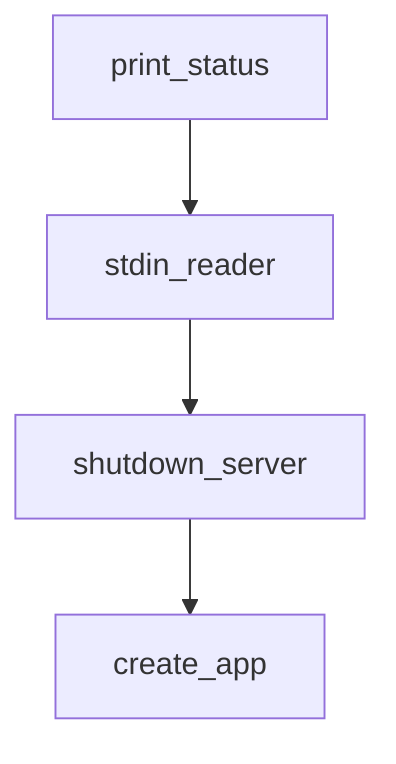

# Chapter 8: Production Operations and Security

Welcome to **Chapter 8: Production Operations and Security**. In this part of **Goose Tutorial: Extensible Open-Source AI Agent for Real Engineering Work**, you will build an intuitive mental model first, then move into concrete implementation details and practical production tradeoffs.


This chapter turns Goose from a useful local assistant into a controlled team platform.

## Learning Goals

- define production guardrails for Goose usage
- enforce extension and tool policies per environment
- build incident response paths around logs and diagnostics
- establish upgrade and governance cadences

## Production Guardrails

| Domain | Recommended Baseline |
|:-------|:---------------------|
| permissions | default to manual/smart approval in production repos |
| extensions | allowlist approved MCP commands and sources |
| context/cost | tune compaction thresholds and max turns |
| observability | collect logs and diagnostics on failures |
| upgrades | stage canary usage before broad rollout |

## Secure Adoption Flow

1. define approved provider/model matrix
2. define approved extension/tool matrix
3. publish `.gooseignore` and session conventions
4. run pilot with monitored repositories
5. review incidents and tighten defaults

## Governance Cadence

- weekly: check release notes and open security issues
- monthly: audit permission and extension policies
- quarterly: review provider costs, model quality, and policy drift

## Source References

- [Staying Safe with goose](https://block.github.io/goose/docs/guides/security/)
- [goose Extension Allowlist](https://block.github.io/goose/docs/guides/allowlist)
- [goose Governance](https://github.com/block/goose/blob/main/GOVERNANCE.md)
- [Responsible AI-Assisted Coding Guide](https://github.com/block/goose/blob/main/HOWTOAI.md)

## Summary

You now have a complete framework for running Goose with strong safety, consistency, and operational reliability.

Continue by comparing workflows in the [Crush Tutorial](../crush-tutorial/).

## Depth Expansion Playbook

## Source Code Walkthrough

### `scripts/provider-error-proxy/proxy.py`

The `print_status` function in [`scripts/provider-error-proxy/proxy.py`](https://github.com/block/goose/blob/HEAD/scripts/provider-error-proxy/proxy.py) handles a key part of this chapter's functionality:

```py


def print_status(proxy: ErrorProxy):
    """Print the current proxy status."""
    mode, count, percentage = proxy.get_error_config()
    mode_names = {
        ErrorMode.NO_ERROR: "✅ No error (pass through)",
        ErrorMode.CONTEXT_LENGTH: "📏 Context length exceeded",
        ErrorMode.RATE_LIMIT: "⏱️  Rate limit exceeded",
        ErrorMode.SERVER_ERROR: "💥 Server error (500)"
    }

    print("\n" + "=" * 60)
    mode_str = mode_names.get(mode, 'Unknown')
    if mode != ErrorMode.NO_ERROR:
        if percentage > 0.0:
            mode_str += f" ({percentage*100:.0f}% of requests)"
        elif count > 0:
            mode_str += f" ({count} remaining)"
    print(f"Current mode: {mode_str}")
    print(f"Requests handled: {proxy.request_count}")
    print("=" * 60)
    print("\nCommands:")
    print("  n      - No error (pass through) - permanent")
    print("  c      - Context length exceeded (1 time)")
    print("  c 4    - Context length exceeded (4 times)")
    print("  c 0.3  - Context length exceeded (30% of requests)")
    print("  c 30%  - Context length exceeded (30% of requests)")
    print("  c *    - Context length exceeded (100% of requests)")
    print("  r      - Rate limit error (1 time)")
    print("  u      - Unknown server error (1 time)")
    print("  q      - Quit")
```

This function is important because it defines how Goose Tutorial: Extensible Open-Source AI Agent for Real Engineering Work implements the patterns covered in this chapter.

### `scripts/provider-error-proxy/proxy.py`

The `stdin_reader` function in [`scripts/provider-error-proxy/proxy.py`](https://github.com/block/goose/blob/HEAD/scripts/provider-error-proxy/proxy.py) handles a key part of this chapter's functionality:

```py


def stdin_reader(proxy: ErrorProxy, loop):
    """Read commands from stdin in a separate thread."""
    print_status(proxy)

    while True:
        try:
            command = input("Enter command: ").strip()

            if command.lower() == 'q':
                print("\n🛑 Shutting down proxy...")
                # Schedule the shutdown in the event loop
                asyncio.run_coroutine_threadsafe(shutdown_server(loop), loop)
                break

            # Parse the command using the shared parser
            mode, count, percentage, error_msg = parse_command(command)

            if error_msg:
                print(f"❌ {error_msg}")
                continue

            # Set the error mode
            proxy.set_error_mode(mode, count, percentage)
            print_status(proxy)

        except EOFError:
            # Handle Ctrl+D
            print("\n🛑 Shutting down proxy...")
            asyncio.run_coroutine_threadsafe(shutdown_server(loop), loop)
            break
```

This function is important because it defines how Goose Tutorial: Extensible Open-Source AI Agent for Real Engineering Work implements the patterns covered in this chapter.

### `scripts/provider-error-proxy/proxy.py`

The `shutdown_server` function in [`scripts/provider-error-proxy/proxy.py`](https://github.com/block/goose/blob/HEAD/scripts/provider-error-proxy/proxy.py) handles a key part of this chapter's functionality:

```py
                print("\n🛑 Shutting down proxy...")
                # Schedule the shutdown in the event loop
                asyncio.run_coroutine_threadsafe(shutdown_server(loop), loop)
                break

            # Parse the command using the shared parser
            mode, count, percentage, error_msg = parse_command(command)

            if error_msg:
                print(f"❌ {error_msg}")
                continue

            # Set the error mode
            proxy.set_error_mode(mode, count, percentage)
            print_status(proxy)

        except EOFError:
            # Handle Ctrl+D
            print("\n🛑 Shutting down proxy...")
            asyncio.run_coroutine_threadsafe(shutdown_server(loop), loop)
            break
        except Exception as e:
            logger.error(f"Error reading stdin: {e}")


async def shutdown_server(loop):
    """Shutdown the server gracefully."""
    # Stop the event loop
    loop.stop()


async def create_app(proxy: ErrorProxy) -> web.Application:
```

This function is important because it defines how Goose Tutorial: Extensible Open-Source AI Agent for Real Engineering Work implements the patterns covered in this chapter.

### `scripts/provider-error-proxy/proxy.py`

The `create_app` function in [`scripts/provider-error-proxy/proxy.py`](https://github.com/block/goose/blob/HEAD/scripts/provider-error-proxy/proxy.py) handles a key part of this chapter's functionality:

```py


async def create_app(proxy: ErrorProxy) -> web.Application:
    """
    Create the aiohttp application.
    
    Args:
        proxy: The ErrorProxy instance
        
    Returns:
        Configured aiohttp application
    """
    app = web.Application()
    
    # Setup and teardown
    async def on_startup(app):
        await proxy.start_session()
        logger.info("🚀 Proxy session started")
        
    async def on_cleanup(app):
        await proxy.close_session()
        logger.info("🛑 Proxy session closed")
        
    app.on_startup.append(on_startup)
    app.on_cleanup.append(on_cleanup)
    
    # Route all requests through the proxy
    app.router.add_route('*', '/{path:.*}', proxy.handle_request)
    
    return app


```

This function is important because it defines how Goose Tutorial: Extensible Open-Source AI Agent for Real Engineering Work implements the patterns covered in this chapter.


## How These Components Connect


