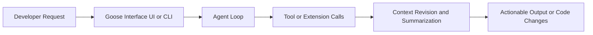

# Goose Tutorial: Extensible Open-Source AI Agent for Real Engineering Work

> Learn how to use `block/goose` to automate coding workflows with controlled tool execution, strong provider flexibility, and production-ready operations.

## Why This Track Matters

Goose is one of the highest-velocity open-source coding agents and combines desktop + CLI interfaces with deep MCP extension support.

This track focuses on:

- setting up Goose quickly across desktop and terminal workflows
- understanding the agent loop, tool execution, and context management model
- controlling permissions, risk boundaries, and extension behavior
- operating Goose safely for teams and production usage

## Current Snapshot (Verified February 12, 2026)

- repository: [`block/goose`](https://github.com/block/goose)
- stars: about **30.3k**
- latest release: [`v1.23.2`](https://github.com/block/goose/releases/tag/v1.23.2)
- recent activity: updates on **February 12, 2026**
- project positioning: local, extensible AI agent for end-to-end engineering automation

## Mental Model

## Chapter Guide

| Chapter | Key Question | Outcome |
|:--------|:-------------|:--------|
| [01 - Getting Started](01-getting-started.md) | How do I install and launch Goose quickly? | Working baseline setup |
| [02 - Architecture and Agent Loop](02-architecture-and-agent-loop.md) | How does Goose process requests and tool calls? | Strong runtime mental model |
| [03 - Providers and Model Routing](03-providers-and-model-routing.md) | How do I choose and configure providers safely? | Reliable model configuration strategy |
| [04 - Permissions and Tool Governance](04-permissions-and-tool-governance.md) | How do I control automation risk in daily usage? | Safer execution boundaries |
| [05 - Sessions and Context Management](05-sessions-and-context-management.md) | How does Goose sustain long-running sessions? | Durable conversation and token management |
| [06 - Extensions and MCP Integration](06-extensions-and-mcp-integration.md) | How do I add capabilities with built-in and custom MCP servers? | Extensible workflow design |
| [07 - CLI Workflows and Automation](07-cli-workflows-and-automation.md) | How do I automate Goose in scripts and CI-like flows? | Repeatable command-driven workflows |
| [08 - Production Operations and Security](08-production-operations-and-security.md) | How do teams run Goose in production responsibly? | Governance and operations runbook |

## What You Will Learn

- how to use Goose across desktop and CLI surfaces
- how the Goose agent loop uses tools, extensions, and context revision
- how to balance autonomy and safety with permission modes and tool controls
- how to operationalize Goose for reproducible, team-scale engineering workflows

## Source References

- [Goose Repository](https://github.com/block/goose)
- [Goose Quickstart](https://block.github.io/goose/docs/quickstart)
- [Install goose](https://block.github.io/goose/docs/getting-started/installation)
- [Supported providers](https://block.github.io/goose/docs/getting-started/providers)
- [Using extensions](https://block.github.io/goose/docs/getting-started/using-extensions)
- [CLI commands](https://block.github.io/goose/docs/guides/goose-cli-commands)
- [Permissions guide](https://block.github.io/goose/docs/guides/goose-permissions)
- [Architecture guide](https://block.github.io/goose/docs/goose-architecture/)

## Related Tutorials

- [OpenCode Tutorial](../opencode-tutorial/)
- [Cline Tutorial](../cline-tutorial/)
- [Roo Code Tutorial](../roo-code-tutorial/)
- [Crush Tutorial](../crush-tutorial/)

---

Start with [Chapter 1: Getting Started](01-getting-started.md).
