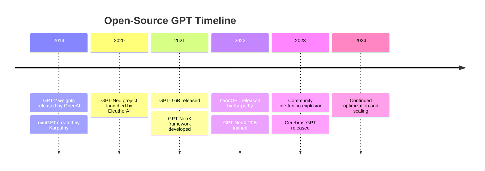
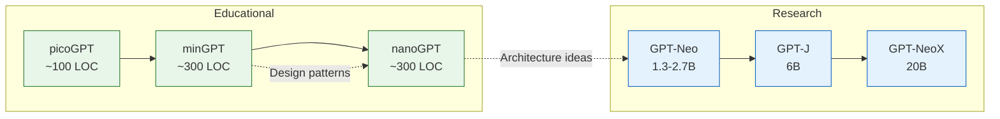
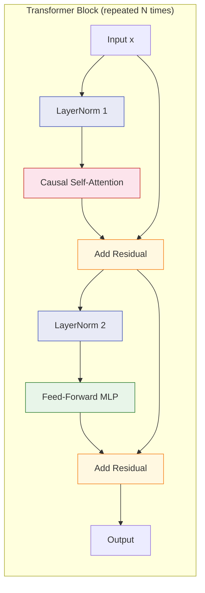
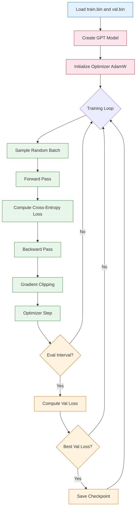

# Chapter 1: Getting Started -- Understanding the Open-Source GPT Landscape

## Introduction

The open-source GPT ecosystem represents one of the most significant movements in modern AI. Starting with OpenAI's release of the GPT-2 model weights in 2019, the community has built an impressive collection of implementations that range from educational single-file projects to production-grade training frameworks capable of handling models with hundreds of billions of parameters.

This chapter will orient you within this landscape, help you set up your development environment, and guide you through your first training run using nanoGPT -- the most accessible entry point into GPT model development.



## The Open-Source GPT Family Tree

Understanding how the major open-source GPT projects relate to each other is essential before diving into code.

### Educational Implementations

These projects prioritize clarity and readability over performance:

| Project | Lines of Code | Key Insight | Best For |
|:--------|:-------------|:------------|:---------|
| **minGPT** | ~300 (model) | Clean OOP design, well-documented | Learning transformer architecture |
| **nanoGPT** | ~300 (model) | Performance-oriented, benchmarked | Training real models, research |
| **picoGPT** | ~100 | Absolute minimum viable GPT | Understanding core math |
| **x-transformers** | ~5000 | Modular transformer components | Experimenting with variants |

### Research-Scale Implementations

These projects are designed for training large models:

| Project | Max Scale | Training Framework | Key Feature |
|:--------|:----------|:-------------------|:------------|
| **GPT-Neo** | 2.7B | Mesh TensorFlow | First open GPT-3 attempt |
| **GPT-J** | 6B | JAX/Haiku | Rotary embeddings, parallel layers |
| **GPT-NeoX** | 20B+ | Megatron-based | 3D parallelism, full pipeline |
| **Cerebras-GPT** | 13B | Cerebras CS-2 | Compute-optimal scaling |



## Setting Up Your Environment

### Hardware Requirements

| Setup | GPU Memory | What You Can Train | Approximate Cost |
|:------|:-----------|:-------------------|:-----------------|
| **Laptop** | CPU only | Character-level nanoGPT | Free |
| **Single GPU** | 8-16 GB | GPT-2 124M reproduction | $0.50-1.00/hr cloud |
| **Multi-GPU** | 4x 24 GB | GPT-2 774M+ | $4-8/hr cloud |
| **Cluster** | 8x 80 GB | GPT-J 6B scale | $20-40/hr cloud |

### Software Installation

```bash
# 1. Create a dedicated conda environment
conda create -n gpt-oss python=3.10 -y
conda activate gpt-oss

# 2. Install PyTorch with CUDA support
# For CUDA 11.8:
pip install torch torchvision torchaudio --index-url https://download.pytorch.org/whl/cu118
# For CUDA 12.1:
pip install torch torchvision torchaudio --index-url https://download.pytorch.org/whl/cu121

# 3. Install essential packages
pip install transformers==4.36.0
pip install datasets==2.16.0
pip install tiktoken==0.5.2
pip install wandb==0.16.1
pip install numpy==1.26.2

# 4. Verify GPU access
python -c "import torch; print(f'CUDA available: {torch.cuda.is_available()}'); print(f'GPU: {torch.cuda.get_device_name(0) if torch.cuda.is_available() else \"None\"}')"
```

### Clone the Key Repositories

```bash
# Create a workspace
mkdir -p ~/gpt-oss-workspace && cd ~/gpt-oss-workspace

# Clone nanoGPT (primary learning tool)
git clone https://github.com/karpathy/nanoGPT.git

# Clone minGPT (reference implementation)
git clone https://github.com/karpathy/minGPT.git

# Clone GPT-NeoX (production-scale training)
git clone https://github.com/EleutherAI/gpt-neox.git
```

## Understanding nanoGPT's Structure

nanoGPT is our primary vehicle for learning. Let us examine its structure:

```
nanoGPT/
├── model.py          # The GPT model definition (~300 lines)
├── train.py          # Training loop (~300 lines)
├── sample.py         # Text generation script
├── config/
│   ├── train_shakespeare_char.py   # Small character-level config
│   ├── train_gpt2.py              # GPT-2 124M reproduction config
│   └── finetune_shakespeare.py    # Fine-tuning config
├── data/
│   ├── shakespeare_char/
│   │   └── prepare.py            # Character-level data prep
│   └── openwebtext/
│       └── prepare.py            # Full GPT-2 data prep
└── bench.py          # Benchmarking script
```

### The Core Model: `model.py`

The entire GPT model fits in roughly 300 lines. Here is the high-level structure:

```python
import torch
import torch.nn as nn
import torch.nn.functional as F
import math
from dataclasses import dataclass

@dataclass
class GPTConfig:
    """Configuration for GPT model."""
    block_size: int = 1024       # Maximum sequence length
    vocab_size: int = 50304      # GPT-2 vocab size (padded for efficiency)
    n_layer: int = 12            # Number of transformer layers
    n_head: int = 12             # Number of attention heads
    n_embd: int = 768            # Embedding dimension
    dropout: float = 0.0         # Dropout rate
    bias: bool = True            # Use bias in linear layers and LayerNorms

class CausalSelfAttention(nn.Module):
    """Multi-head causal self-attention."""

    def __init__(self, config):
        super().__init__()
        assert config.n_embd % config.n_head == 0
        # Key, Query, Value projections combined
        self.c_attn = nn.Linear(config.n_embd, 3 * config.n_embd, bias=config.bias)
        # Output projection
        self.c_proj = nn.Linear(config.n_embd, config.n_embd, bias=config.bias)
        self.n_head = config.n_head
        self.n_embd = config.n_embd
        self.dropout = config.dropout
        # Causal mask
        self.register_buffer("bias", torch.tril(
            torch.ones(config.block_size, config.block_size)
        ).view(1, 1, config.block_size, config.block_size))

    def forward(self, x):
        B, T, C = x.size()  # batch, sequence length, embedding dim
        # Compute Q, K, V for all heads in batch
        q, k, v = self.c_attn(x).split(self.n_embd, dim=2)
        k = k.view(B, T, self.n_head, C // self.n_head).transpose(1, 2)
        q = q.view(B, T, self.n_head, C // self.n_head).transpose(1, 2)
        v = v.view(B, T, self.n_head, C // self.n_head).transpose(1, 2)

        # Attention: (B, nh, T, hs) x (B, nh, hs, T) -> (B, nh, T, T)
        att = (q @ k.transpose(-2, -1)) * (1.0 / math.sqrt(k.size(-1)))
        att = att.masked_fill(self.bias[:, :, :T, :T] == 0, float('-inf'))
        att = F.softmax(att, dim=-1)
        y = att @ v  # (B, nh, T, T) x (B, nh, T, hs) -> (B, nh, T, hs)

        y = y.transpose(1, 2).contiguous().view(B, T, C)
        y = self.c_proj(y)
        return y


class MLP(nn.Module):
    """Feed-forward network with GELU activation."""

    def __init__(self, config):
        super().__init__()
        self.c_fc = nn.Linear(config.n_embd, 4 * config.n_embd, bias=config.bias)
        self.gelu = nn.GELU()
        self.c_proj = nn.Linear(4 * config.n_embd, config.n_embd, bias=config.bias)
        self.dropout = nn.Dropout(config.dropout)

    def forward(self, x):
        x = self.c_fc(x)
        x = self.gelu(x)
        x = self.c_proj(x)
        x = self.dropout(x)
        return x


class Block(nn.Module):
    """Transformer block: LayerNorm -> Attention -> LayerNorm -> MLP."""

    def __init__(self, config):
        super().__init__()
        self.ln_1 = nn.LayerNorm(config.n_embd, bias=config.bias)
        self.attn = CausalSelfAttention(config)
        self.ln_2 = nn.LayerNorm(config.n_embd, bias=config.bias)
        self.mlp = MLP(config)

    def forward(self, x):
        x = x + self.attn(self.ln_1(x))  # Pre-norm residual
        x = x + self.mlp(self.ln_2(x))   # Pre-norm residual
        return x
```



## Your First Training Run

### Step 1: Prepare the Shakespeare Dataset

```bash
cd ~/gpt-oss-workspace/nanoGPT

# This downloads and tokenizes the Shakespeare corpus
python data/shakespeare_char/prepare.py
```

This script does the following:
1. Downloads the complete works of Shakespeare (~1MB of text)
2. Creates a character-level vocabulary (65 unique characters)
3. Encodes the text into integer sequences
4. Splits into train (90%) and validation (10%) sets
5. Saves as `train.bin` and `val.bin`

### Step 2: Configure the Training

```python
# config/train_shakespeare_char.py - annotated
# This configuration trains a small character-level model

# Data
dataset = 'shakespeare_char'
batch_size = 64           # Number of sequences per batch
block_size = 256          # Context window size (characters)

# Model - a "baby GPT"
n_layer = 6               # 6 transformer layers
n_head = 6                # 6 attention heads
n_embd = 384              # 384-dimensional embeddings
dropout = 0.2             # 20% dropout for regularization

# Training
learning_rate = 1e-3      # Peak learning rate
max_iters = 5000          # Total training iterations
lr_decay_iters = 5000     # Learning rate decay schedule
min_lr = 1e-4             # Minimum learning rate
warmup_iters = 100        # Linear warmup steps

# Evaluation
eval_interval = 250       # Evaluate every 250 steps
eval_iters = 200          # Average loss over 200 batches

# System
device = 'cuda'           # Use GPU
compile = True            # Use torch.compile for speed
```

### Step 3: Train the Model

```bash
# Start training
python train.py config/train_shakespeare_char.py

# Expected output:
# step 0: train loss 4.1743, val loss 4.1755
# step 250: train loss 1.8234, val loss 1.9876
# step 500: train loss 1.5321, val loss 1.6543
# ...
# step 5000: train loss 0.8012, val loss 1.4654
```

### Step 4: Generate Text

```bash
# Generate Shakespeare-like text
python sample.py --out_dir=out-shakespeare-char

# Example output:
# ROMEO:
# What, ho! the county Paris shall not woo
# My daughter yet; she is too young and fair
# To be your bride...
```

## Understanding What Just Happened

Let us trace through what the training loop actually does:



### Key Metrics to Watch

| Metric | Healthy Range | Warning Signs |
|:-------|:-------------|:--------------|
| **Train Loss** | Steadily decreasing | Plateaus early, spikes |
| **Val Loss** | Slightly above train loss | Diverges from train loss |
| **Learning Rate** | Follows cosine schedule | N/A (configured) |
| **Gradient Norm** | Stable, < 1.0 after clipping | Spikes, NaN values |
| **Tokens/sec** | GPU-dependent | Significantly below baseline |

## Comparing minGPT and nanoGPT

Both are by Andrej Karpathy, but they serve different purposes:

```python
# minGPT style: Object-oriented, modular
from mingpt.model import GPT

model_config = GPT.get_default_config()
model_config.model_type = 'gpt2'
model_config.vocab_size = 50257
model_config.block_size = 1024
model = GPT(model_config)

# nanoGPT style: Flat, optimized, benchmarked
from model import GPTConfig, GPT

config = GPTConfig(
    block_size=1024,
    vocab_size=50304,  # Padded to nearest multiple of 64
    n_layer=12,
    n_head=12,
    n_embd=768,
)
model = GPT(config)
```

| Aspect | minGPT | nanoGPT |
|:-------|:-------|:--------|
| **Design philosophy** | Clean, educational | Practical, optimized |
| **Code organization** | Multiple files, classes | Minimal files |
| **Performance** | Baseline | ~2x faster with compile |
| **GPT-2 reproduction** | Not benchmarked | Verified reproduction |
| **Vocab size** | 50257 (raw) | 50304 (padded for GPU) |
| **Weight initialization** | Standard | Scaled residual init |

## Summary

In this chapter, you have:

- Surveyed the open-source GPT ecosystem from educational tools to production frameworks
- Set up a complete development environment for GPT experimentation
- Trained your first character-level GPT model using nanoGPT
- Understood the core structure of a GPT implementation
- Compared minGPT and nanoGPT design philosophies

## Key Takeaways

1. **The open-source GPT ecosystem is layered**: Start with nanoGPT for learning, scale to GPT-NeoX for production.
2. **A GPT model is surprisingly simple**: The core architecture is roughly 300 lines of PyTorch.
3. **nanoGPT is the best starting point**: It balances readability with real performance.
4. **Character-level models train fast**: You can see results in minutes, making them ideal for experimentation.
5. **Understanding the training loop is fundamental**: Every GPT training system follows the same basic pattern.

## Next Steps

In [Chapter 2: Transformer Architecture](02-transformer-architecture.md), we will dissect every component of the transformer architecture in detail -- from the mathematics of self-attention to the role of layer normalization and residual connections.

---
*Built with insights from open-source GPT implementations.*
