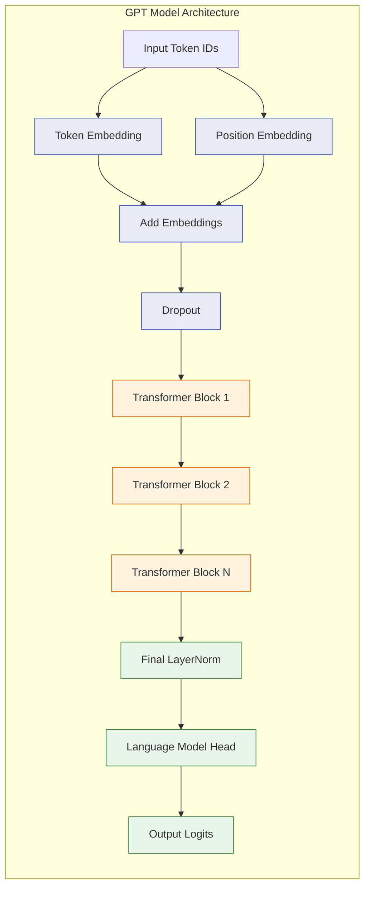
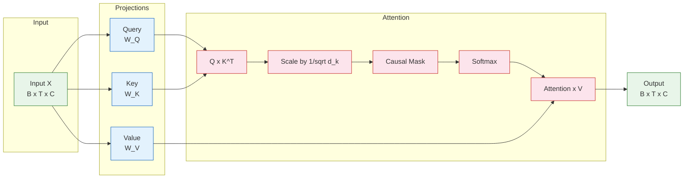
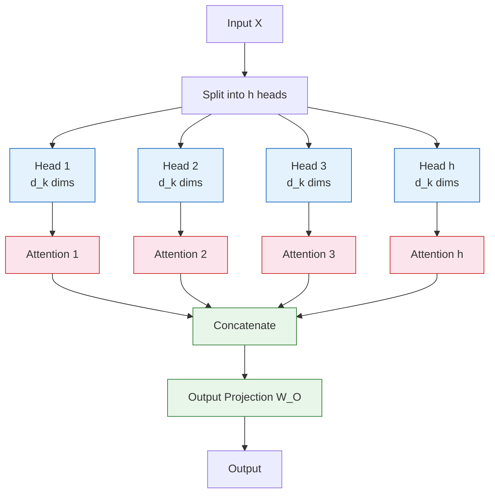
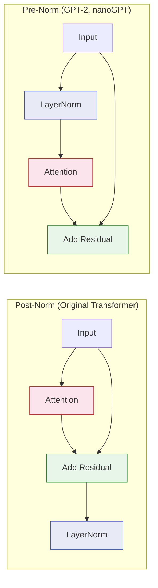

# Chapter 2: Transformer Architecture -- Self-Attention, Multi-Head Attention, and Feed-Forward Networks

Welcome to **Chapter 2: Transformer Architecture -- Self-Attention, Multi-Head Attention, and Feed-Forward Networks**. In this part of **GPT Open Source: Deep Dive Tutorial**, you will build an intuitive mental model first, then move into concrete implementation details and practical production tradeoffs.


## Introduction

The GPT architecture is a decoder-only transformer. Every open-source GPT implementation -- from picoGPT to GPT-NeoX -- is built on the same foundational components: self-attention, feed-forward networks, layer normalization, and residual connections. This chapter dissects each component with mathematical rigor and maps the math directly to PyTorch code.



## The Full GPT Model

Here is the complete GPT model as implemented in nanoGPT:

```python
class GPT(nn.Module):
    """The full GPT language model."""

    def __init__(self, config):
        super().__init__()
        self.config = config

        self.transformer = nn.ModuleDict(dict(
            wte = nn.Embedding(config.vocab_size, config.n_embd),       # Token embeddings
            wpe = nn.Embedding(config.block_size, config.n_embd),       # Position embeddings
            drop = nn.Dropout(config.dropout),
            h = nn.ModuleList([Block(config) for _ in range(config.n_layer)]),
            ln_f = nn.LayerNorm(config.n_embd, bias=config.bias),
        ))
        self.lm_head = nn.Linear(config.n_embd, config.vocab_size, bias=False)

        # Weight tying: share weights between token embedding and output projection
        self.transformer.wte.weight = self.lm_head.weight

    def forward(self, idx, targets=None):
        device = idx.device
        b, t = idx.size()
        assert t <= self.config.block_size, f"Sequence length {t} exceeds block size {self.config.block_size}"

        pos = torch.arange(0, t, dtype=torch.long, device=device)

        # Forward through embeddings
        tok_emb = self.transformer.wte(idx)    # (B, T, n_embd)
        pos_emb = self.transformer.wpe(pos)    # (T, n_embd)
        x = self.transformer.drop(tok_emb + pos_emb)

        # Forward through transformer blocks
        for block in self.transformer.h:
            x = block(x)

        x = self.transformer.ln_f(x)

        if targets is not None:
            logits = self.lm_head(x)           # (B, T, vocab_size)
            loss = F.cross_entropy(
                logits.view(-1, logits.size(-1)),
                targets.view(-1),
                ignore_index=-1
            )
        else:
            # Inference optimization: only compute last position
            logits = self.lm_head(x[:, [-1], :])  # (B, 1, vocab_size)
            loss = None

        return logits, loss
```

## Self-Attention: The Core Mechanism

Self-attention allows each token to attend to every previous token in the sequence. This is the mechanism that gives transformers their power.

### The Mathematics

Given an input sequence `X` of shape `(B, T, C)`:

1. **Project** into queries, keys, and values:
   - `Q = X * W_Q` (what am I looking for?)
   - `K = X * W_K` (what do I contain?)
   - `V = X * W_V` (what information do I provide?)

2. **Compute attention scores**:
   - `A = (Q * K^T) / sqrt(d_k)`

3. **Apply causal mask** (prevent attending to future tokens):
   - `A = mask(A)` (set future positions to -infinity)

4. **Normalize** with softmax:
   - `A = softmax(A)`

5. **Aggregate** values:
   - `output = A * V`



### Implementation in PyTorch

```python
def self_attention(x, W_q, W_k, W_v, mask):
    """
    Single-head self-attention.

    Args:
        x: Input tensor of shape (B, T, C)
        W_q, W_k, W_v: Projection weight matrices
        mask: Causal attention mask
    """
    B, T, C = x.shape

    # Step 1: Project to Q, K, V
    Q = x @ W_q  # (B, T, d_k)
    K = x @ W_k  # (B, T, d_k)
    V = x @ W_v  # (B, T, d_v)

    d_k = K.size(-1)

    # Step 2: Compute scaled dot-product attention
    scores = Q @ K.transpose(-2, -1) / math.sqrt(d_k)  # (B, T, T)

    # Step 3: Apply causal mask
    scores = scores.masked_fill(mask[:T, :T] == 0, float('-inf'))

    # Step 4: Softmax normalization
    attn_weights = F.softmax(scores, dim=-1)  # (B, T, T)

    # Step 5: Weighted sum of values
    output = attn_weights @ V  # (B, T, d_v)

    return output, attn_weights
```

### Visualizing the Causal Mask

The causal mask ensures that position `i` can only attend to positions `<= i`:

```
Position:  0  1  2  3  4
    0    [ 1  0  0  0  0 ]   Token 0 sees only itself
    1    [ 1  1  0  0  0 ]   Token 1 sees tokens 0-1
    2    [ 1  1  1  0  0 ]   Token 2 sees tokens 0-2
    3    [ 1  1  1  1  0 ]   Token 3 sees tokens 0-3
    4    [ 1  1  1  1  1 ]   Token 4 sees all tokens
```

```python
# Creating the causal mask
def create_causal_mask(seq_len):
    """Lower triangular mask for causal (autoregressive) attention."""
    mask = torch.tril(torch.ones(seq_len, seq_len))
    return mask

# Example
mask = create_causal_mask(5)
print(mask)
# tensor([[1., 0., 0., 0., 0.],
#         [1., 1., 0., 0., 0.],
#         [1., 1., 1., 0., 0.],
#         [1., 1., 1., 1., 0.],
#         [1., 1., 1., 1., 1.]])
```

## Multi-Head Attention

Instead of performing a single attention function with `d_model` dimensions, multi-head attention runs `h` parallel attention operations on `d_k = d_model / h` dimensions each.

### Why Multiple Heads?

Each head can learn to attend to different types of relationships:

| Head | What It Might Learn |
|:-----|:-------------------|
| Head 1 | Syntactic dependencies (subject-verb) |
| Head 2 | Positional patterns (nearby tokens) |
| Head 3 | Semantic similarity |
| Head 4 | Coreference (pronouns to nouns) |
| Head N | Other patterns discovered during training |



### Implementation

```python
class MultiHeadAttention(nn.Module):
    """Multi-head causal self-attention."""

    def __init__(self, n_embd, n_head, block_size, dropout=0.0):
        super().__init__()
        assert n_embd % n_head == 0, "Embedding dim must be divisible by number of heads"

        self.n_head = n_head
        self.n_embd = n_embd
        self.head_dim = n_embd // n_head

        # Combined QKV projection for efficiency
        self.c_attn = nn.Linear(n_embd, 3 * n_embd)
        self.c_proj = nn.Linear(n_embd, n_embd)
        self.attn_dropout = nn.Dropout(dropout)
        self.resid_dropout = nn.Dropout(dropout)

        # Causal mask
        self.register_buffer("mask", torch.tril(
            torch.ones(block_size, block_size)
        ).view(1, 1, block_size, block_size))

    def forward(self, x):
        B, T, C = x.size()

        # Compute Q, K, V for all heads simultaneously
        qkv = self.c_attn(x)                                    # (B, T, 3*C)
        q, k, v = qkv.split(self.n_embd, dim=2)                # Each: (B, T, C)

        # Reshape to (B, n_head, T, head_dim)
        q = q.view(B, T, self.n_head, self.head_dim).transpose(1, 2)
        k = k.view(B, T, self.n_head, self.head_dim).transpose(1, 2)
        v = v.view(B, T, self.n_head, self.head_dim).transpose(1, 2)

        # Scaled dot-product attention
        scale = 1.0 / math.sqrt(self.head_dim)
        att = (q @ k.transpose(-2, -1)) * scale                # (B, nh, T, T)
        att = att.masked_fill(self.mask[:, :, :T, :T] == 0, float('-inf'))
        att = F.softmax(att, dim=-1)
        att = self.attn_dropout(att)

        y = att @ v                                              # (B, nh, T, head_dim)

        # Concatenate heads and project
        y = y.transpose(1, 2).contiguous().view(B, T, C)        # (B, T, C)
        y = self.resid_dropout(self.c_proj(y))

        return y
```

### GPT-2 Model Sizes and Head Configurations

| Model | d_model | n_heads | d_head | n_layers | Parameters |
|:------|:--------|:--------|:-------|:---------|:-----------|
| GPT-2 Small | 768 | 12 | 64 | 12 | 124M |
| GPT-2 Medium | 1024 | 16 | 64 | 24 | 350M |
| GPT-2 Large | 1280 | 20 | 64 | 36 | 774M |
| GPT-2 XL | 1600 | 25 | 64 | 48 | 1.5B |
| GPT-J | 4096 | 16 | 256 | 28 | 6B |
| GPT-NeoX | 6144 | 64 | 96 | 44 | 20B |

## Feed-Forward Network (MLP)

Each transformer block contains a position-wise feed-forward network. This is where the model stores "knowledge" -- the learned associations and facts.

### Architecture

The MLP expands the hidden dimension by a factor of 4, applies a non-linearity, then projects back:

```python
class MLP(nn.Module):
    """Position-wise feed-forward network."""

    def __init__(self, config):
        super().__init__()
        self.c_fc   = nn.Linear(config.n_embd, 4 * config.n_embd, bias=config.bias)
        self.gelu   = nn.GELU()
        self.c_proj = nn.Linear(4 * config.n_embd, config.n_embd, bias=config.bias)
        self.dropout = nn.Dropout(config.dropout)

    def forward(self, x):
        x = self.c_fc(x)       # (B, T, 4*n_embd) -- expand
        x = self.gelu(x)       # Non-linear activation
        x = self.c_proj(x)     # (B, T, n_embd)   -- contract
        x = self.dropout(x)
        return x
```

### Activation Functions Across GPT Variants

| Model | Activation | Formula | Why |
|:------|:-----------|:--------|:----|
| GPT-2 | GELU | `0.5 * x * (1 + tanh(sqrt(2/pi) * (x + 0.044715*x^3)))` | Smooth, original choice |
| GPT-J | GELU | Same as above | Followed GPT-2 |
| GPT-NeoX | GELU | Same as above | Followed GPT-2 |
| LLaMA | SiLU/SwiGLU | `x * sigmoid(x)` with gating | Better training dynamics |
| PaLM | SwiGLU | Gated variant of SiLU | Improved performance |

```python
# SwiGLU MLP (used in modern architectures like LLaMA)
class SwiGLUMLP(nn.Module):
    """SwiGLU feed-forward network, as used in LLaMA."""

    def __init__(self, config):
        super().__init__()
        hidden_dim = int(2 * (4 * config.n_embd) / 3)
        # Round up to nearest multiple of 256 for efficiency
        hidden_dim = 256 * ((hidden_dim + 255) // 256)

        self.w1 = nn.Linear(config.n_embd, hidden_dim, bias=False)  # Gate
        self.w2 = nn.Linear(hidden_dim, config.n_embd, bias=False)  # Down proj
        self.w3 = nn.Linear(config.n_embd, hidden_dim, bias=False)  # Up proj

    def forward(self, x):
        return self.w2(F.silu(self.w1(x)) * self.w3(x))
```

## Layer Normalization

Layer normalization stabilizes training by normalizing activations across the feature dimension.

### Pre-Norm vs Post-Norm

GPT-2 and most modern implementations use **pre-norm** (LayerNorm before sublayers), while the original transformer used **post-norm**:



| Approach | Advantages | Used By |
|:---------|:-----------|:--------|
| **Pre-Norm** | More stable training, no warmup needed | GPT-2, GPT-J, LLaMA, nanoGPT |
| **Post-Norm** | Slightly better final performance | Original Transformer, BERT |

```python
# LayerNorm implementation
class LayerNorm(nn.Module):
    """LayerNorm with optional bias (GPT-2 style includes bias)."""

    def __init__(self, ndim, bias=True):
        super().__init__()
        self.weight = nn.Parameter(torch.ones(ndim))
        self.bias = nn.Parameter(torch.zeros(ndim)) if bias else None

    def forward(self, x):
        return F.layer_norm(x, self.weight.shape, self.weight, self.bias, 1e-5)
```

## Residual Connections

Residual connections are critical for training deep transformers. Without them, gradients vanish in deep networks.

### Scaled Initialization

nanoGPT uses a scaled initialization for residual projections to prevent the residual stream from growing too large:

```python
def _init_weights(self, module):
    """Weight initialization following GPT-2."""
    if isinstance(module, nn.Linear):
        torch.nn.init.normal_(module.weight, mean=0.0, std=0.02)
        if module.bias is not None:
            torch.nn.init.zeros_(module.bias)
    elif isinstance(module, nn.Embedding):
        torch.nn.init.normal_(module.weight, mean=0.0, std=0.02)

    # Scale residual projections by 1/sqrt(2*n_layer)
    # This prevents the residual stream from growing with depth
    for pn, p in self.named_parameters():
        if pn.endswith('c_proj.weight'):
            torch.nn.init.normal_(p, mean=0.0, std=0.02 / math.sqrt(2 * config.n_layer))
```

### Parameter Counting

Understanding where parameters live in a GPT model:

```python
def count_parameters(config):
    """Count parameters in each component of GPT."""
    d = config.n_embd
    L = config.n_layer
    V = config.vocab_size
    T = config.block_size

    params = {
        'Token Embeddings':    V * d,
        'Position Embeddings': T * d,
        'Attention QKV (per layer)': 3 * d * d,
        'Attention Output (per layer)': d * d,
        'MLP Up (per layer)':   d * (4 * d),
        'MLP Down (per layer)': (4 * d) * d,
        'LayerNorm (per layer)': 4 * d,  # 2 LNs x (weight + bias)
        'Final LayerNorm': 2 * d,
    }

    total_per_layer = (
        3 * d * d +      # QKV
        d * d +           # Output proj
        d * (4 * d) +     # MLP up
        (4 * d) * d +     # MLP down
        4 * d             # LayerNorms
    )

    total = V * d + T * d + L * total_per_layer + 2 * d
    # Note: lm_head shares weights with token embeddings (weight tying)

    return params, total

# GPT-2 Small: ~124M parameters
# 50304 * 768 + 1024 * 768 + 12 * (12 * 768^2 + 4 * 768) + 2 * 768
```

## Weight Tying

A key optimization in GPT models is **weight tying**: the token embedding matrix and the language model head share the same weights.

```python
# In GPT.__init__:
self.transformer.wte.weight = self.lm_head.weight
```

This works because:
- The embedding layer maps token IDs to vectors: `token_id -> embedding_vector`
- The LM head maps vectors back to logits over vocabulary: `hidden_state -> logits`
- These are inverse operations, so sharing weights makes semantic sense and saves significant memory

| Model Size | Embedding Params | Savings from Weight Tying |
|:-----------|:----------------|:--------------------------|
| GPT-2 124M | 38.6M (31%) | 38.6M saved |
| GPT-2 1.5B | 80.5M (5%) | 80.5M saved |
| GPT-J 6B | 200M (3%) | 200M saved |

## Summary

In this chapter, you have:

- Understood the complete GPT model architecture from input to output
- Learned the mathematics and implementation of self-attention
- Explored multi-head attention and why it outperforms single-head attention
- Examined the feed-forward network and its role as a knowledge store
- Compared pre-norm and post-norm architectures
- Understood residual connections and their initialization
- Learned about weight tying and parameter counting

## Key Takeaways

1. **Self-attention is a weighted lookup**: Each token computes a query to find relevant keys, then aggregates their values.
2. **The causal mask makes GPT autoregressive**: By masking future positions, each token can only attend to itself and past tokens.
3. **Multi-head attention provides diversity**: Different heads learn different attention patterns, enriching the model's representations.
4. **The MLP is the knowledge store**: While attention routes information, the feed-forward layers store and transform learned representations.
5. **Pre-norm is more stable**: Applying LayerNorm before sublayers (not after) makes training deeper models much more stable.
6. **Weight tying saves significant parameters**: Sharing the embedding and output matrices is both theoretically motivated and practically beneficial.

## Next Steps

In [Chapter 3: Tokenization & Embeddings](03-tokenization-embeddings.md), we will explore how raw text is converted into the token sequences that feed into the transformer -- covering BPE tokenization, vocabulary construction, and positional encoding strategies.

---
*Built with insights from open-source GPT implementations.*

## What Problem Does This Solve?

Most teams struggle here because the hard part is not writing more code, but deciding clear boundaries for `self`, `config`, `n_embd` so behavior stays predictable as complexity grows.

In practical terms, this chapter helps you avoid three common failures:

- coupling core logic too tightly to one implementation path
- missing the handoff boundaries between setup, execution, and validation
- shipping changes without clear rollback or observability strategy

After working through this chapter, you should be able to reason about `Chapter 2: Transformer Architecture -- Self-Attention, Multi-Head Attention, and Feed-Forward Networks` as an operating subsystem inside **GPT Open Source: Deep Dive Tutorial**, with explicit contracts for inputs, state transitions, and outputs.

Use the implementation notes around `bias`, `mask`, `weight` as your checklist when adapting these patterns to your own repository.

## How it Works Under the Hood

Under the hood, `Chapter 2: Transformer Architecture -- Self-Attention, Multi-Head Attention, and Feed-Forward Networks` usually follows a repeatable control path:

1. **Context bootstrap**: initialize runtime config and prerequisites for `self`.
2. **Input normalization**: shape incoming data so `config` receives stable contracts.
3. **Core execution**: run the main logic branch and propagate intermediate state through `n_embd`.
4. **Policy and safety checks**: enforce limits, auth scopes, and failure boundaries.
5. **Output composition**: return canonical result payloads for downstream consumers.
6. **Operational telemetry**: emit logs/metrics needed for debugging and performance tuning.

When debugging, walk this sequence in order and confirm each stage has explicit success/failure conditions.

## Source Walkthrough

Use the following upstream sources to verify implementation details while reading this chapter:

- [nanoGPT](https://github.com/karpathy/nanoGPT)
  Why it matters: authoritative reference on `nanoGPT` (github.com).
- [minGPT](https://github.com/karpathy/minGPT)
  Why it matters: authoritative reference on `minGPT` (github.com).
- [GPT-NeoX](https://github.com/EleutherAI/gpt-neox)
  Why it matters: authoritative reference on `GPT-NeoX` (github.com).
- [GPT-Neo](https://github.com/EleutherAI/gpt-neo)
  Why it matters: authoritative reference on `GPT-Neo` (github.com).
- [GPT-J](https://github.com/kingoflolz/mesh-transformer-jax)
  Why it matters: authoritative reference on `GPT-J` (github.com).
- [Chapter 1: Getting Started](01-getting-started.md)
  Why it matters: authoritative reference on `Chapter 1: Getting Started` (01-getting-started.md).

Suggested trace strategy:
- search upstream code for `self` and `config` to map concrete implementation paths
- compare docs claims against actual runtime/config code before reusing patterns in production

## Chapter Connections

- [Tutorial Index](index.md)
- [Previous Chapter: Chapter 1: Getting Started -- Understanding the Open-Source GPT Landscape](01-getting-started.md)
- [Next Chapter: Chapter 3: Tokenization & Embeddings -- BPE, Vocabulary Construction, and Positional Encodings](03-tokenization-embeddings.md)
- [Main Catalog](../../README.md#-tutorial-catalog)
- [A-Z Tutorial Directory](../../discoverability/tutorial-directory.md)
