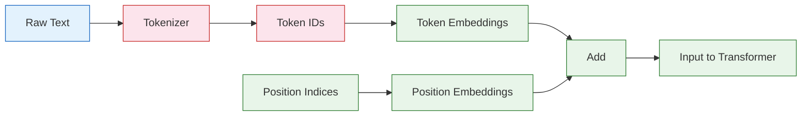
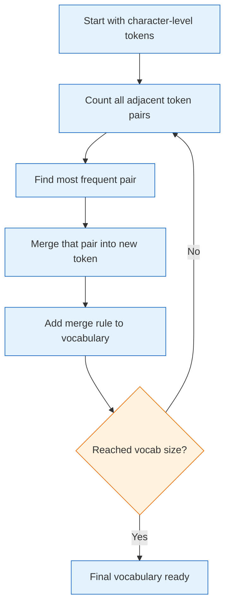
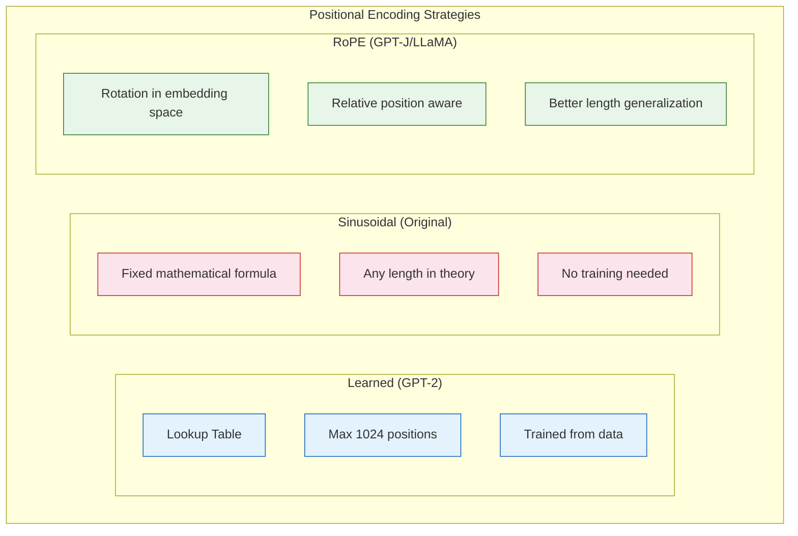

# Chapter 3: Tokenization & Embeddings -- BPE, Vocabulary Construction, and Positional Encodings

## Introduction

Before any text reaches the transformer, it must be converted into a sequence of integers. This process -- tokenization -- is one of the most consequential design decisions in building a GPT model. The choice of tokenizer affects vocabulary size, sequence length, multilingual capability, and even model performance on downstream tasks.

This chapter covers the full tokenization pipeline, from raw text to the embedded representations that enter the first transformer block.



## Character-Level vs Subword Tokenization

nanoGPT supports both character-level and subword tokenization. Understanding the tradeoffs is essential.

### Character-Level Tokenization

The simplest approach: each character is a token.

```python
# Character-level tokenizer (used in nanoGPT Shakespeare example)
class CharTokenizer:
    """Simple character-level tokenizer."""

    def __init__(self, text):
        chars = sorted(list(set(text)))
        self.vocab_size = len(chars)
        self.stoi = {ch: i for i, ch in enumerate(chars)}
        self.itos = {i: ch for i, ch in enumerate(chars)}

    def encode(self, text):
        return [self.stoi[ch] for ch in text]

    def decode(self, ids):
        return ''.join([self.itos[i] for i in ids])

# Example with Shakespeare
text = "To be or not to be, that is the question."
tokenizer = CharTokenizer(text)
print(f"Vocabulary size: {tokenizer.vocab_size}")
# Vocabulary size: ~65 (for full Shakespeare corpus)

encoded = tokenizer.encode("To be")
print(f"Encoded: {encoded}")  # e.g., [20, 53, 1, 40, 45]
```

### Subword Tokenization (BPE)

GPT-2 and most modern models use Byte Pair Encoding (BPE):

```python
import tiktoken

# GPT-2 tokenizer
enc = tiktoken.get_encoding("gpt2")

text = "To be or not to be, that is the question."
tokens = enc.encode(text)
print(f"Tokens: {tokens}")
# [2514, 307, 393, 407, 284, 307, 11, 326, 318, 262, 1808, 13]
print(f"Number of tokens: {len(tokens)}")  # 12 tokens vs 42 characters

# Decode back
decoded = enc.decode(tokens)
print(f"Decoded: {decoded}")
# "To be or not to be, that is the question."

# Inspect individual tokens
for t in tokens:
    print(f"  {t:5d} -> '{enc.decode([t])}'")
# 2514 -> 'To'
#  307 -> ' be'
#  393 -> ' or'
#  407 -> ' not'
#  284 -> ' to'
#  ...
```

### Comparison

| Aspect | Character-Level | BPE (Subword) |
|:-------|:---------------|:--------------|
| **Vocab size** | ~100 | 50,000-100,000 |
| **Sequence length** | Very long | 3-4x shorter |
| **OOV handling** | No OOV possible | Rare OOV |
| **Semantic units** | Individual characters | Words/subwords |
| **Training speed** | Slower (longer sequences) | Faster |
| **Memory usage** | Higher (long sequences) | Lower |
| **Best for** | Learning, small experiments | Production models |

## Byte Pair Encoding (BPE) -- How It Works

BPE builds a vocabulary by iteratively merging the most frequent pairs of tokens.

### The BPE Algorithm



### BPE Implementation from Scratch

```python
def train_bpe(text, vocab_size):
    """
    Train a BPE tokenizer from scratch.

    Args:
        text: Training text
        vocab_size: Target vocabulary size
    Returns:
        merges: List of merge rules (pair -> new_token)
        vocab: Final vocabulary mapping
    """
    # Start with byte-level tokens (0-255)
    tokens = list(text.encode("utf-8"))

    # Track merge rules
    merges = {}
    vocab = {i: bytes([i]) for i in range(256)}
    num_merges = vocab_size - 256

    for i in range(num_merges):
        # Count all adjacent pairs
        pair_counts = {}
        for j in range(len(tokens) - 1):
            pair = (tokens[j], tokens[j + 1])
            pair_counts[pair] = pair_counts.get(pair, 0) + 1

        if not pair_counts:
            break

        # Find most frequent pair
        best_pair = max(pair_counts, key=pair_counts.get)
        new_token_id = 256 + i

        # Merge all occurrences
        new_tokens = []
        j = 0
        while j < len(tokens):
            if j < len(tokens) - 1 and (tokens[j], tokens[j+1]) == best_pair:
                new_tokens.append(new_token_id)
                j += 2
            else:
                new_tokens.append(tokens[j])
                j += 1
        tokens = new_tokens

        # Record the merge
        merges[best_pair] = new_token_id
        vocab[new_token_id] = vocab[best_pair[0]] + vocab[best_pair[1]]

        if i < 10:  # Print first 10 merges
            print(f"Merge {i}: {best_pair} -> {new_token_id} "
                  f"('{vocab[new_token_id].decode('utf-8', errors='replace')}')")

    return merges, vocab

# Example
text = "the cat sat on the mat. the cat is a good cat."
merges, vocab = train_bpe(text, vocab_size=280)
# Merge 0: (116, 104) -> 256 ('th')
# Merge 1: (256, 101) -> 257 ('the')
# Merge 2: (99, 97) -> 258 ('ca')
# Merge 3: (258, 116) -> 259 ('cat')
# ...
```

### Using BPE for Encoding

```python
def bpe_encode(text, merges):
    """Encode text using trained BPE merges."""
    tokens = list(text.encode("utf-8"))

    while len(tokens) >= 2:
        # Find the pair with the lowest merge index
        pairs = {}
        for i in range(len(tokens) - 1):
            pair = (tokens[i], tokens[i + 1])
            if pair in merges:
                pairs[i] = merges[pair]

        if not pairs:
            break  # No more merges possible

        # Apply the highest-priority merge (lowest merge index)
        min_idx = min(pairs, key=lambda i: pairs[i])
        pair = (tokens[min_idx], tokens[min_idx + 1])
        new_token = merges[pair]

        new_tokens = []
        i = 0
        while i < len(tokens):
            if i < len(tokens) - 1 and (tokens[i], tokens[i+1]) == pair:
                new_tokens.append(new_token)
                i += 2
            else:
                new_tokens.append(tokens[i])
                i += 1
        tokens = new_tokens

    return tokens
```

## GPT-2 Tokenizer Details

The GPT-2 tokenizer has specific design choices worth understanding:

```python
import tiktoken

enc = tiktoken.get_encoding("gpt2")

# Vocabulary size
print(f"Vocab size: {enc.n_vocab}")  # 50257

# Special tokens
print(f"EOT token: {enc.eot_token}")  # 50256 (<|endoftext|>)

# How different text types tokenize
examples = {
    "English": "The quick brown fox jumps over the lazy dog.",
    "Code": "def fibonacci(n):\n    if n <= 1:\n        return n",
    "Numbers": "3.14159265358979323846",
    "Unicode": "Hello, world!",
}

for name, text in examples.items():
    tokens = enc.encode(text)
    ratio = len(text) / len(tokens)
    print(f"{name:10s}: {len(tokens):3d} tokens, {ratio:.1f} chars/token")

# English   :  10 tokens, 4.5 chars/token
# Code      :  16 tokens, 3.0 chars/token
# Numbers   :  10 tokens, 2.2 chars/token
# Unicode   :   8 tokens, 3.5 chars/token
```

### nanoGPT Data Preparation

Here is how nanoGPT prepares data for GPT-2-level training:

```python
# data/openwebtext/prepare.py (simplified)
import os
import numpy as np
import tiktoken
from datasets import load_dataset

# Load OpenWebText dataset
dataset = load_dataset("openwebtext")

# Initialize GPT-2 tokenizer
enc = tiktoken.get_encoding("gpt2")

def tokenize(example):
    """Tokenize a single example."""
    ids = enc.encode_ordinary(example['text'])
    ids.append(enc.eot_token)  # Add end-of-text token
    return {'ids': ids, 'len': len(ids)}

# Tokenize the entire dataset
tokenized = dataset.map(
    tokenize,
    remove_columns=['text'],
    num_proc=8,  # Parallelize
)

# Concatenate all tokens into a single binary file
# Training set
train_ids = np.concatenate([
    np.array(example['ids'], dtype=np.uint16)
    for example in tokenized['train']
])
train_ids.tofile('train.bin')
print(f"Train tokens: {len(train_ids):,}")  # ~9 billion tokens

# Validation set
val_ids = np.concatenate([
    np.array(example['ids'], dtype=np.uint16)
    for example in tokenized['validation'] if 'validation' in tokenized
])
val_ids.tofile('val.bin')
```

## Positional Encodings

Since self-attention is permutation-invariant, the model needs explicit position information. GPT models use different strategies.

### Learned Positional Embeddings (GPT-2, nanoGPT)

```python
class LearnedPositionalEmbedding(nn.Module):
    """Learned positional embeddings as used in GPT-2."""

    def __init__(self, block_size, n_embd):
        super().__init__()
        self.wpe = nn.Embedding(block_size, n_embd)

    def forward(self, positions):
        return self.wpe(positions)

# Usage in GPT
pos = torch.arange(0, seq_len, dtype=torch.long, device=device)
pos_emb = self.transformer.wpe(pos)  # (T, n_embd)
x = tok_emb + pos_emb  # Broadcasting adds position info
```

### Sinusoidal Positional Encodings (Original Transformer)

```python
class SinusoidalPositionalEncoding(nn.Module):
    """Fixed sinusoidal positional encoding from 'Attention Is All You Need'."""

    def __init__(self, block_size, n_embd):
        super().__init__()
        pe = torch.zeros(block_size, n_embd)
        position = torch.arange(0, block_size).unsqueeze(1).float()
        div_term = torch.exp(
            torch.arange(0, n_embd, 2).float() * -(math.log(10000.0) / n_embd)
        )

        pe[:, 0::2] = torch.sin(position * div_term)  # Even dimensions
        pe[:, 1::2] = torch.cos(position * div_term)  # Odd dimensions

        self.register_buffer('pe', pe.unsqueeze(0))    # (1, T, n_embd)

    def forward(self, x):
        return x + self.pe[:, :x.size(1)]
```

### Rotary Positional Embeddings (RoPE) -- GPT-J, LLaMA

RoPE encodes position information by rotating the query and key vectors:

```python
class RotaryPositionalEmbedding(nn.Module):
    """Rotary Positional Embedding (RoPE) as used in GPT-J and LLaMA."""

    def __init__(self, dim, max_seq_len=2048, base=10000):
        super().__init__()
        inv_freq = 1.0 / (base ** (torch.arange(0, dim, 2).float() / dim))
        self.register_buffer("inv_freq", inv_freq)

        # Precompute cos and sin
        t = torch.arange(max_seq_len).float()
        freqs = torch.einsum("i,j->ij", t, inv_freq)
        emb = torch.cat((freqs, freqs), dim=-1)
        self.register_buffer("cos_cached", emb.cos())
        self.register_buffer("sin_cached", emb.sin())

    def forward(self, x, seq_len):
        return (
            self.cos_cached[:seq_len],
            self.sin_cached[:seq_len]
        )


def rotate_half(x):
    """Rotate half of the hidden dims."""
    x1 = x[..., :x.shape[-1] // 2]
    x2 = x[..., x.shape[-1] // 2:]
    return torch.cat((-x2, x1), dim=-1)


def apply_rotary_pos_emb(q, k, cos, sin):
    """Apply rotary embeddings to query and key tensors."""
    q_embed = (q * cos) + (rotate_half(q) * sin)
    k_embed = (k * cos) + (rotate_half(k) * sin)
    return q_embed, k_embed
```



### Comparison of Positional Encoding Methods

| Method | Learned? | Relative Position | Length Generalization | Used By |
|:-------|:---------|:-----------------|:---------------------|:--------|
| **Learned** | Yes | No | Poor (fixed max) | GPT-2, nanoGPT |
| **Sinusoidal** | No | Partial | Moderate | Original Transformer |
| **RoPE** | No | Yes | Good | GPT-J, LLaMA, GPT-NeoX |
| **ALiBi** | No | Yes | Excellent | BLOOM, MPT |

## Token Embedding Internals

The token embedding matrix is one of the largest components of the model:

```python
# Token embedding in GPT-2 Small
# Shape: (50304, 768) = 38.6M parameters

# Why 50304 instead of 50257?
# GPT-2's actual vocab is 50257 tokens
# nanoGPT pads to 50304 (nearest multiple of 64)
# This ensures efficient GPU memory access patterns

# The embedding lookup is just a matrix index operation:
# For token ID 2514 ("To"), we retrieve row 2514 of the embedding matrix
# This gives us a 768-dimensional vector representing "To"

# Verify in code:
import torch.nn as nn

embedding = nn.Embedding(50304, 768)
token_id = torch.tensor([2514])
emb_vector = embedding(token_id)
print(emb_vector.shape)  # torch.Size([1, 768])
```

### Embedding Visualization Concept

```python
# After training, similar tokens have similar embeddings
import tiktoken
from sklearn.manifold import TSNE

enc = tiktoken.get_encoding("gpt2")

# Hypothetical: extract embeddings for related tokens
animal_tokens = ["cat", "dog", "fish", "bird", "horse"]
color_tokens = ["red", "blue", "green", "yellow", "white"]
number_tokens = ["one", "two", "three", "four", "five"]

# In a trained model, you would see:
# - Animal tokens cluster together
# - Color tokens cluster together
# - Number tokens cluster together
# This emerges naturally from the training objective
```

## Vocabulary Size Considerations

The choice of vocabulary size involves several tradeoffs:

| Vocab Size | Compression Ratio | Embedding Params (768d) | Notes |
|:-----------|:-----------------|:-----------------------|:------|
| 256 (bytes) | 1.0x | 197K | No compression, very long sequences |
| 10,000 | ~3x | 7.7M | Good for small models |
| 32,000 | ~3.5x | 24.6M | LLaMA, efficient balance |
| 50,257 | ~3.8x | 38.6M | GPT-2, good English coverage |
| 100,000 | ~4x | 76.8M | Multilingual models |
| 250,000 | ~4.2x | 192M | Highly multilingual |

```python
# Impact of vocabulary size on sequence length
import tiktoken

enc_gpt2 = tiktoken.get_encoding("gpt2")       # 50,257 tokens
enc_cl100k = tiktoken.get_encoding("cl100k_base")  # 100,256 tokens

text = "The transformer architecture has revolutionized natural language processing."

gpt2_tokens = enc_gpt2.encode(text)
cl100k_tokens = enc_cl100k.encode(text)

print(f"GPT-2 tokenizer:   {len(gpt2_tokens)} tokens")   # ~10 tokens
print(f"cl100k tokenizer:  {len(cl100k_tokens)} tokens")  # ~9 tokens
```

## Summary

In this chapter, you have:

- Compared character-level and subword tokenization strategies
- Implemented BPE from scratch and understood how merge rules build vocabulary
- Explored GPT-2's tokenizer using tiktoken
- Understood nanoGPT's data preparation pipeline
- Compared three positional encoding strategies: learned, sinusoidal, and RoPE
- Analyzed vocabulary size tradeoffs and their impact on model architecture

## Key Takeaways

1. **BPE is the standard**: Most GPT models use Byte Pair Encoding, which finds an efficient balance between vocabulary size and sequence length.
2. **Tokenization affects everything**: The tokenizer determines what the model can "see" -- poor tokenization leads to poor performance.
3. **Positional encodings are evolving**: Learned embeddings (GPT-2) are giving way to RoPE (GPT-J, LLaMA) for better length generalization.
4. **Vocabulary padding matters**: Aligning vocabulary size to GPU-friendly multiples (64, 128) provides measurable speedups.
5. **Character-level is great for learning**: Start with character-level tokenization to understand the fundamentals, then move to BPE for serious training.
6. **Weight tying connects embeddings to outputs**: The same matrix that converts token IDs to vectors also converts hidden states back to vocabulary logits.

## Next Steps

In [Chapter 4: Training Pipeline](04-training-pipeline.md), we will examine the complete training loop -- from data loading and batching through loss computation, gradient accumulation, mixed-precision training, and learning rate scheduling.

---
*Built with insights from open-source GPT implementations.*
