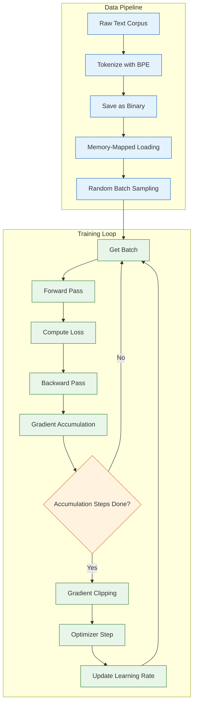
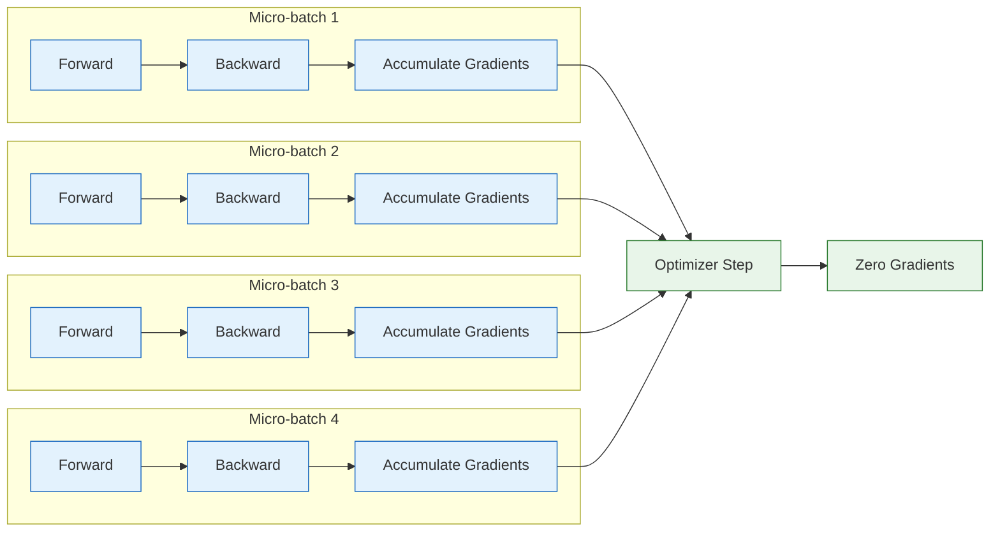
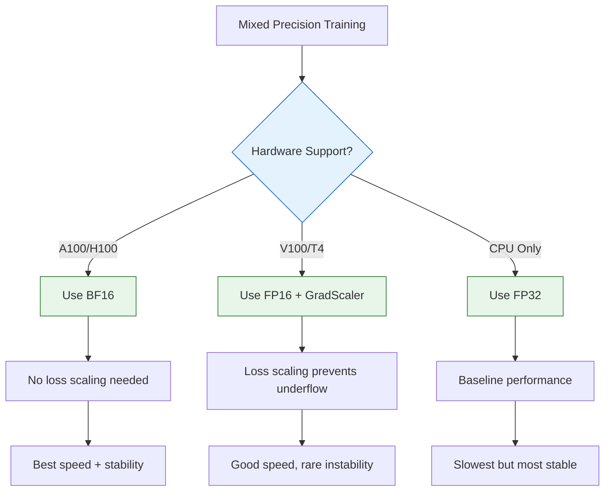
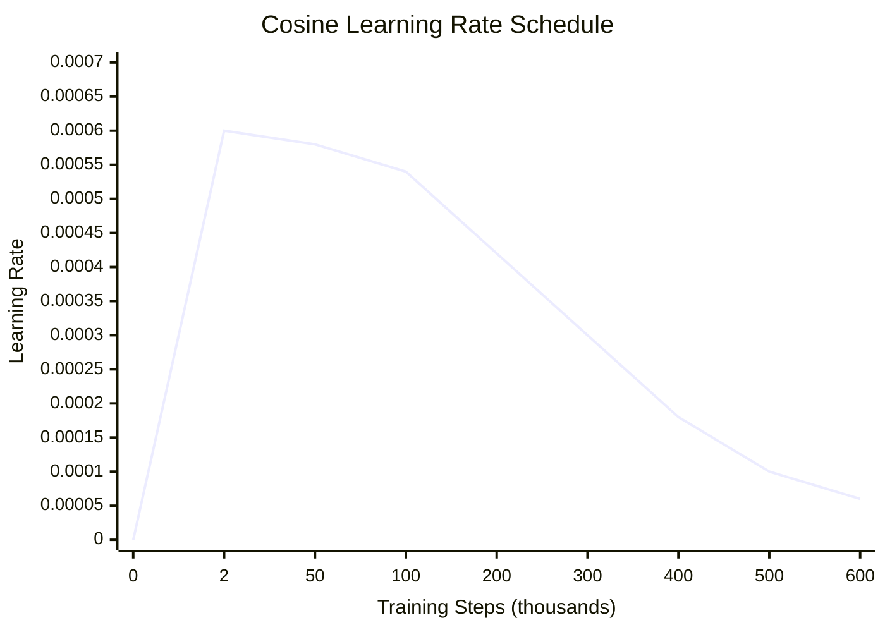

# Chapter 4: Training Pipeline -- Data Loading, Loss Computation, Gradient Accumulation, and Mixed Precision

## Introduction

The training pipeline is where theory meets practice. A well-engineered training loop can mean the difference between a successful model and wasted GPU hours. This chapter dissects the complete training pipeline used in nanoGPT, covering every component from data loading to checkpoint management.

Understanding these components is essential because the same patterns appear in every GPT training framework -- from nanoGPT to GPT-NeoX to Megatron-LM.



## Data Loading

### Memory-Mapped Data Loading

nanoGPT uses numpy memory-mapped files for efficient data access. This allows training on datasets larger than RAM:

```python
import numpy as np
import torch
import os

class GPTDataLoader:
    """Efficient data loading for GPT training using memory-mapped files."""

    def __init__(self, data_dir, split, block_size, batch_size, device):
        self.block_size = block_size
        self.batch_size = batch_size
        self.device = device

        # Memory-map the binary file (does NOT load into RAM)
        data_path = os.path.join(data_dir, f'{split}.bin')
        self.data = np.memmap(data_path, dtype=np.uint16, mode='r')
        print(f"Loaded {split} data: {len(self.data):,} tokens")

    def get_batch(self):
        """Sample a random batch of sequences."""
        # Random starting positions for each sequence in the batch
        ix = torch.randint(
            len(self.data) - self.block_size,
            (self.batch_size,)
        )

        # Extract sequences and their targets (shifted by 1)
        x = torch.stack([
            torch.from_numpy(
                self.data[i:i+self.block_size].astype(np.int64)
            ) for i in ix
        ])
        y = torch.stack([
            torch.from_numpy(
                self.data[i+1:i+1+self.block_size].astype(np.int64)
            ) for i in ix
        ])

        # Move to device (GPU)
        if self.device == 'cuda':
            x = x.pin_memory().to(self.device, non_blocking=True)
            y = y.pin_memory().to(self.device, non_blocking=True)
        else:
            x, y = x.to(self.device), y.to(self.device)

        return x, y

# Usage
train_loader = GPTDataLoader(
    data_dir='data/openwebtext',
    split='train',
    block_size=1024,
    batch_size=12,
    device='cuda'
)

x, y = train_loader.get_batch()
print(f"Input shape:  {x.shape}")   # torch.Size([12, 1024])
print(f"Target shape: {y.shape}")   # torch.Size([12, 1024])
```

### Understanding Input-Target Alignment

In GPT training, the target for each position is the next token:

```
Input:   [The] [cat] [sat] [on]  [the] [mat]
Target:  [cat] [sat] [on]  [the] [mat] [.]

Position:  0     1     2     3     4     5
Input:     The   cat   sat   on    the   mat
Target:    cat   sat   on    the   mat   .
```

```python
# Concrete example
import tiktoken
enc = tiktoken.get_encoding("gpt2")

text = "The cat sat on the mat."
tokens = enc.encode(text)
print(f"Tokens: {tokens}")
# e.g., [464, 3797, 3332, 319, 262, 2603, 13]

# During training:
# Input:  [464, 3797, 3332, 319, 262, 2603]
# Target: [3797, 3332, 319, 262, 2603, 13]
# Each position predicts the NEXT token
```

## Loss Computation

### Cross-Entropy Loss

GPT training uses cross-entropy loss -- the model predicts a probability distribution over the vocabulary, and we measure how far it is from the true next token:

```python
def compute_loss(model, x, y):
    """
    Compute cross-entropy loss for language modeling.

    Args:
        model: GPT model
        x: Input token IDs (B, T)
        y: Target token IDs (B, T)

    Returns:
        loss: Scalar loss value
        logits: Model predictions (B, T, vocab_size)
    """
    logits, loss = model(x, targets=y)
    return loss, logits

# Inside the model's forward method:
def forward(self, idx, targets=None):
    # ... transformer forward pass ...
    logits = self.lm_head(x)  # (B, T, vocab_size)

    if targets is not None:
        # Flatten for cross-entropy
        loss = F.cross_entropy(
            logits.view(-1, logits.size(-1)),  # (B*T, vocab_size)
            targets.view(-1),                   # (B*T,)
            ignore_index=-1                     # Ignore padding tokens
        )
    return logits, loss
```

### Loss Interpretation

| Loss Value | Perplexity | Interpretation |
|:-----------|:-----------|:---------------|
| 10.8 | ~50,000 | Random (untrained, vocab=50K) |
| 4.0 | ~55 | Very early training |
| 3.0 | ~20 | Learning basic patterns |
| 2.5 | ~12 | Good language model |
| 2.0 | ~7.4 | Strong model |
| 1.5 | ~4.5 | Excellent (GPT-2 level on WebText) |

```python
import math

def loss_to_perplexity(loss):
    """Convert cross-entropy loss to perplexity."""
    return math.exp(loss)

# Perplexity = 2^H where H is the cross-entropy in bits
# Lower is better: perplexity of 1 means perfect prediction
print(f"Loss 4.0 -> Perplexity {loss_to_perplexity(4.0):.1f}")
print(f"Loss 3.0 -> Perplexity {loss_to_perplexity(3.0):.1f}")
print(f"Loss 2.0 -> Perplexity {loss_to_perplexity(2.0):.1f}")
```

## Gradient Accumulation

When the desired batch size exceeds GPU memory, gradient accumulation simulates larger batches by accumulating gradients over multiple micro-batches:



```python
# Gradient accumulation implementation (from nanoGPT)

# Configuration
gradient_accumulation_steps = 4  # Accumulate over 4 micro-batches
micro_batch_size = 12            # Each micro-batch has 12 sequences
# Effective batch size = 4 * 12 = 48 sequences

for iter_num in range(max_iters):
    # Zero gradients at start of accumulation
    optimizer.zero_grad(set_to_none=True)

    for micro_step in range(gradient_accumulation_steps):
        x, y = train_loader.get_batch()

        # Forward pass (with autocast for mixed precision)
        with ctx:  # torch.amp.autocast context
            logits, loss = model(x, y)
            # Scale loss by accumulation steps
            loss = loss / gradient_accumulation_steps

        # Backward pass -- gradients accumulate
        scaler.scale(loss).backward()

    # After accumulating all micro-batches:
    # 1. Unscale gradients
    scaler.unscale_(optimizer)

    # 2. Clip gradients
    torch.nn.utils.clip_grad_norm_(model.parameters(), max_norm=1.0)

    # 3. Optimizer step
    scaler.step(optimizer)
    scaler.update()
```

### Effective Batch Size Calculation

| GPUs | Micro Batch | Accumulation Steps | Effective Batch Size | Tokens per Step |
|:-----|:-----------|:-------------------|:--------------------|:----------------|
| 1 | 12 | 4 | 48 | 49,152 |
| 1 | 12 | 40 | 480 | 491,520 |
| 4 | 12 | 10 | 480 | 491,520 |
| 8 | 12 | 5 | 480 | 491,520 |
| 64 | 12 | 1 | 768 | 786,432 |

## Mixed Precision Training

Mixed precision uses FP16 or BF16 for most computations while keeping FP32 for critical operations. This roughly doubles training speed and halves memory usage.

```python
import torch
from torch.amp import autocast, GradScaler

# Choose precision based on hardware
dtype = 'bfloat16' if torch.cuda.is_bf16_supported() else 'float16'

# Set up autocast context
ptdtype = {'float32': torch.float32, 'bfloat16': torch.bfloat16, 'float16': torch.float16}[dtype]
ctx = autocast(device_type='cuda', dtype=ptdtype)

# GradScaler for FP16 (not needed for BF16)
scaler = GradScaler(enabled=(dtype == 'float16'))

# Training step with mixed precision
with ctx:
    logits, loss = model(x, y)

scaler.scale(loss).backward()
scaler.unscale_(optimizer)
torch.nn.utils.clip_grad_norm_(model.parameters(), 1.0)
scaler.step(optimizer)
scaler.update()
```

### Precision Comparison

| Precision | Bits | Range | Training Speed | Memory | Stability |
|:----------|:-----|:------|:--------------|:-------|:----------|
| **FP32** | 32 | Very wide | 1x (baseline) | 1x | Excellent |
| **FP16** | 16 | Narrow | ~2x | ~0.5x | Needs loss scaling |
| **BF16** | 16 | Wide (like FP32) | ~2x | ~0.5x | Very good |
| **TF32** | 19 | Wide | ~1.5x | 1x | Excellent |



## The AdamW Optimizer

GPT models universally use AdamW (Adam with decoupled weight decay):

```python
def configure_optimizers(model, weight_decay, learning_rate, betas, device_type):
    """
    Configure AdamW optimizer with weight decay only on 2D parameters.
    This is the exact approach used in nanoGPT.
    """
    # Separate parameters into those that should and shouldn't have weight decay
    decay_params = []
    no_decay_params = []

    for name, param in model.named_parameters():
        if not param.requires_grad:
            continue
        # Don't decay biases, LayerNorm weights, or embedding weights
        if param.dim() < 2:
            no_decay_params.append(param)
        else:
            decay_params.append(param)

    optim_groups = [
        {'params': decay_params, 'weight_decay': weight_decay},
        {'params': no_decay_params, 'weight_decay': 0.0},
    ]

    num_decay = sum(p.numel() for p in decay_params)
    num_no_decay = sum(p.numel() for p in no_decay_params)
    print(f"Decayed parameters: {num_decay:,}")
    print(f"Non-decayed parameters: {num_no_decay:,}")

    # Use fused AdamW if available (faster on CUDA)
    use_fused = device_type == 'cuda'
    optimizer = torch.optim.AdamW(
        optim_groups,
        lr=learning_rate,
        betas=betas,
        fused=use_fused
    )

    return optimizer

# Standard GPT-2 training hyperparameters
optimizer = configure_optimizers(
    model,
    weight_decay=0.1,
    learning_rate=6e-4,
    betas=(0.9, 0.95),
    device_type='cuda'
)
```

## Learning Rate Scheduling

nanoGPT uses a cosine decay schedule with linear warmup:

```python
import math

def get_lr(it, warmup_iters, lr_decay_iters, learning_rate, min_lr):
    """
    Cosine learning rate schedule with linear warmup.

    Args:
        it: Current iteration
        warmup_iters: Number of warmup iterations
        lr_decay_iters: Total iterations for LR decay
        learning_rate: Peak learning rate
        min_lr: Minimum learning rate
    """
    # 1. Linear warmup
    if it < warmup_iters:
        return learning_rate * it / warmup_iters

    # 2. After decay period, use minimum LR
    if it > lr_decay_iters:
        return min_lr

    # 3. Cosine decay between warmup and decay end
    decay_ratio = (it - warmup_iters) / (lr_decay_iters - warmup_iters)
    assert 0 <= decay_ratio <= 1
    coeff = 0.5 * (1.0 + math.cos(math.pi * decay_ratio))  # 1 -> 0
    return min_lr + coeff * (learning_rate - min_lr)

# Example schedule for GPT-2 124M training
# Peak LR: 6e-4, Min LR: 6e-5, Warmup: 2000 steps, Total: 600K steps
```



## Gradient Clipping

Gradient clipping prevents training instability from large gradient norms:

```python
# After accumulating gradients but before optimizer step
max_norm = 1.0
grad_norm = torch.nn.utils.clip_grad_norm_(model.parameters(), max_norm)

# Monitor gradient norms for debugging
if iter_num % log_interval == 0:
    print(f"Step {iter_num}: grad_norm = {grad_norm:.4f}")
    # Healthy: grad_norm < 1.0 after clipping
    # Warning: grad_norm consistently at 1.0 (always being clipped)
    # Critical: grad_norm is NaN or Inf
```

## torch.compile

PyTorch 2.0's `torch.compile` provides significant speedups:

```python
# Compile the model for faster training
if compile:
    print("Compiling model with torch.compile...")
    model = torch.compile(model)
    # First iteration will be slow (compilation), then ~1.5-2x faster

# Performance impact on A100 GPU:
# GPT-2 124M without compile: ~150K tokens/sec
# GPT-2 124M with compile:    ~280K tokens/sec (~1.9x speedup)
```

## The Complete Training Loop

Here is nanoGPT's complete training loop, annotated:

```python
def train(config):
    """Complete GPT training loop (simplified from nanoGPT)."""
    # Setup
    model = GPT(config)
    model = model.to(config.device)
    if config.compile:
        model = torch.compile(model)

    optimizer = configure_optimizers(
        model, config.weight_decay, config.learning_rate,
        (config.beta1, config.beta2), config.device
    )

    scaler = GradScaler(enabled=(config.dtype == 'float16'))
    ctx = autocast(device_type='cuda', dtype=config.ptdtype)

    train_loader = GPTDataLoader(config.data_dir, 'train',
                                  config.block_size, config.batch_size,
                                  config.device)

    best_val_loss = float('inf')

    for iter_num in range(config.max_iters):
        # Update learning rate
        lr = get_lr(iter_num, config.warmup_iters,
                    config.lr_decay_iters, config.learning_rate,
                    config.min_lr)
        for param_group in optimizer.param_groups:
            param_group['lr'] = lr

        # Evaluation
        if iter_num % config.eval_interval == 0:
            val_loss = estimate_loss(model, config)
            print(f"step {iter_num}: train loss {train_loss:.4f}, "
                  f"val loss {val_loss:.4f}")

            if val_loss < best_val_loss:
                best_val_loss = val_loss
                save_checkpoint(model, optimizer, iter_num, config)

        # Training step with gradient accumulation
        optimizer.zero_grad(set_to_none=True)

        for micro_step in range(config.gradient_accumulation_steps):
            x, y = train_loader.get_batch()
            with ctx:
                logits, loss = model(x, y)
                loss = loss / config.gradient_accumulation_steps
            scaler.scale(loss).backward()

        scaler.unscale_(optimizer)
        grad_norm = torch.nn.utils.clip_grad_norm_(
            model.parameters(), config.grad_clip
        )
        scaler.step(optimizer)
        scaler.update()

        # Logging
        if iter_num % config.log_interval == 0:
            print(f"iter {iter_num}: loss {loss.item():.4f}, "
                  f"lr {lr:.6f}, grad_norm {grad_norm:.4f}")
```

## Checkpoint Management

```python
def save_checkpoint(model, optimizer, iter_num, config):
    """Save training checkpoint."""
    checkpoint = {
        'model': model.state_dict(),
        'optimizer': optimizer.state_dict(),
        'iter_num': iter_num,
        'config': config,
    }
    path = os.path.join(config.out_dir, 'ckpt.pt')
    torch.save(checkpoint, path)
    print(f"Saved checkpoint to {path}")


def load_checkpoint(path, model, optimizer=None):
    """Load training checkpoint."""
    checkpoint = torch.load(path, map_location='cpu')
    model.load_state_dict(checkpoint['model'])
    if optimizer is not None:
        optimizer.load_state_dict(checkpoint['optimizer'])
    return checkpoint['iter_num'], checkpoint['config']
```

## Summary

In this chapter, you have:

- Implemented efficient memory-mapped data loading for large datasets
- Understood input-target alignment in autoregressive language modeling
- Analyzed cross-entropy loss and its relationship to perplexity
- Implemented gradient accumulation for training with limited GPU memory
- Set up mixed-precision training with FP16 and BF16
- Configured AdamW with proper weight decay groups
- Implemented cosine learning rate scheduling with warmup
- Built a complete training loop with checkpointing

## Key Takeaways

1. **Memory-mapped files are essential**: They allow training on datasets larger than RAM without loading everything at once.
2. **Gradient accumulation simulates large batches**: You can achieve any effective batch size by accumulating gradients over multiple micro-batches.
3. **Mixed precision nearly doubles throughput**: BF16 on modern GPUs (A100+) gives the best combination of speed and stability.
4. **Weight decay should skip 1D parameters**: Biases and LayerNorm weights should not be regularized.
5. **Cosine schedule with warmup is the standard**: Linear warmup prevents early instability; cosine decay provides smooth convergence.
6. **torch.compile provides free speedups**: On compatible hardware, compilation can provide 1.5-2x speedups with no code changes.

## Next Steps

In [Chapter 5: Attention Mechanisms](05-attention-mechanisms.html), we will explore advanced attention techniques including causal masking implementation details, KV-cache for efficient inference, multi-query attention, and Flash Attention.

---
*Built with insights from open-source GPT implementations.*
