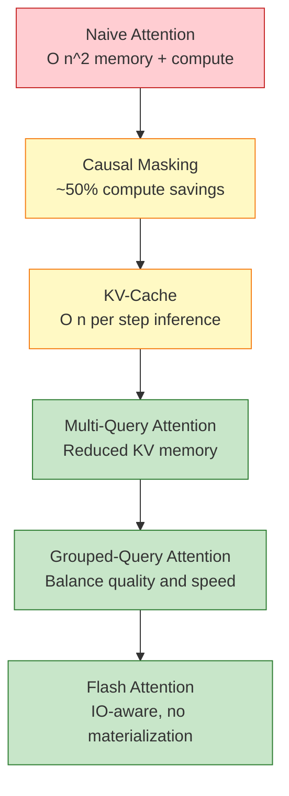
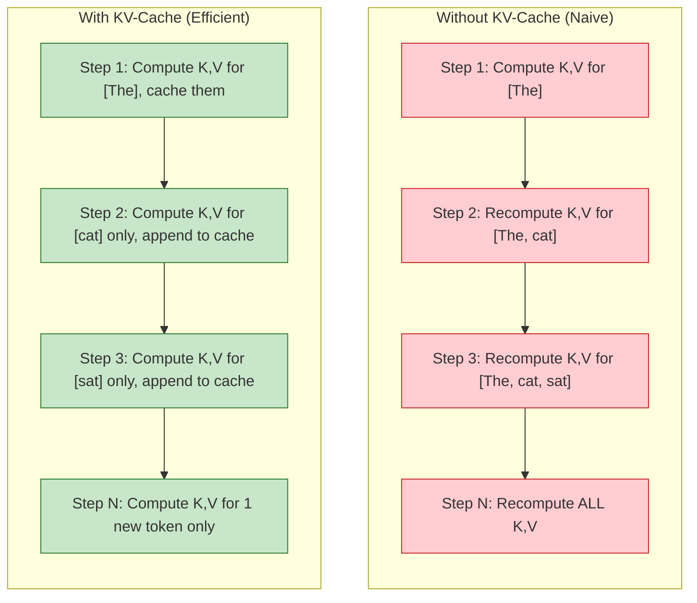
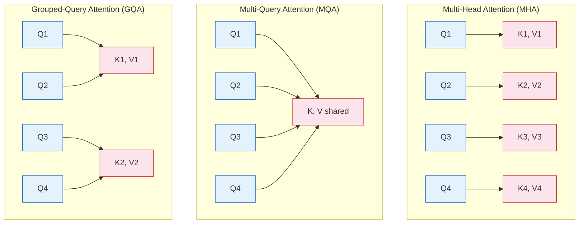
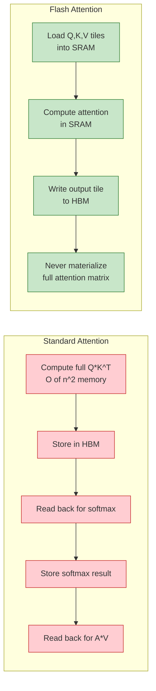

# Chapter 5: Attention Mechanisms -- Causal Masking, KV-Cache, Multi-Query Attention, and Flash Attention

Welcome to **Chapter 5: Attention Mechanisms -- Causal Masking, KV-Cache, Multi-Query Attention, and Flash Attention**. In this part of **GPT Open Source: Deep Dive Tutorial**, you will build an intuitive mental model first, then move into concrete implementation details and practical production tradeoffs.


## Introduction

Attention is the computational bottleneck of GPT models. Its memory and compute requirements scale quadratically with sequence length, making it the primary target for optimization. This chapter explores both the foundational mechanisms and the cutting-edge techniques that make modern GPT inference and training feasible at scale.

We will trace the evolution from naive attention to Flash Attention, understanding why each optimization exists and how it is implemented.



## Causal Masking in Detail

Causal (autoregressive) masking ensures that each token can only attend to tokens at the same or earlier positions. This is what makes GPT a generative model.

### Implementation Approaches

There are several ways to implement causal masking, each with different tradeoffs:

```python
import torch
import torch.nn.functional as F
import math

def attention_v1_explicit_mask(q, k, v, mask):
    """
    Version 1: Explicit mask computation.
    Most readable but not the most efficient.
    """
    B, nh, T, hs = q.shape
    # Compute attention scores
    att = (q @ k.transpose(-2, -1)) * (1.0 / math.sqrt(hs))
    # Apply causal mask: set future positions to -inf
    att = att.masked_fill(mask[:, :, :T, :T] == 0, float('-inf'))
    att = F.softmax(att, dim=-1)
    return att @ v


def attention_v2_additive_mask(q, k, v):
    """
    Version 2: Additive bias mask.
    Used in some implementations for flexibility.
    """
    B, nh, T, hs = q.shape
    att = (q @ k.transpose(-2, -1)) * (1.0 / math.sqrt(hs))

    # Create causal bias: 0 for valid positions, -inf for masked
    causal_bias = torch.zeros(T, T, device=q.device)
    causal_bias.masked_fill_(
        torch.triu(torch.ones(T, T, device=q.device), diagonal=1).bool(),
        float('-inf')
    )
    att = att + causal_bias
    att = F.softmax(att, dim=-1)
    return att @ v


def attention_v3_sdpa(q, k, v):
    """
    Version 3: PyTorch scaled_dot_product_attention.
    Automatically selects the best kernel (Flash, Memory-Efficient, or Math).
    """
    return F.scaled_dot_product_attention(
        q, k, v,
        attn_mask=None,
        dropout_p=0.0,
        is_causal=True  # Automatically applies causal mask
    )
```

### Performance Comparison

| Method | Memory | Speed | Notes |
|:-------|:-------|:------|:------|
| Explicit mask (v1) | O(T^2) | Baseline | Most readable |
| Additive bias (v2) | O(T^2) | ~Same | Flexible for ALiBi |
| `scaled_dot_product_attention` (v3) | O(T) with Flash | 2-4x faster | Recommended |

```python
# Benchmarking attention implementations
import time

def benchmark_attention(fn, q, k, v, warmup=10, runs=100):
    """Benchmark an attention function."""
    # Warmup
    for _ in range(warmup):
        _ = fn(q, k, v)
    torch.cuda.synchronize()

    start = time.perf_counter()
    for _ in range(runs):
        _ = fn(q, k, v)
    torch.cuda.synchronize()
    elapsed = (time.perf_counter() - start) / runs

    return elapsed * 1000  # milliseconds

# Test with different sequence lengths
for seq_len in [512, 1024, 2048, 4096]:
    q = torch.randn(1, 12, seq_len, 64, device='cuda', dtype=torch.float16)
    k = torch.randn(1, 12, seq_len, 64, device='cuda', dtype=torch.float16)
    v = torch.randn(1, 12, seq_len, 64, device='cuda', dtype=torch.float16)

    t_sdpa = benchmark_attention(attention_v3_sdpa, q, k, v)
    print(f"Seq {seq_len:5d}: SDPA {t_sdpa:.2f}ms")
```

## KV-Cache for Efficient Inference

During autoregressive generation, each new token only needs to attend to all previous tokens. The KV-cache stores previously computed key and value tensors to avoid recomputation.



### KV-Cache Implementation

```python
class CausalSelfAttentionWithKVCache(nn.Module):
    """Self-attention with KV-cache support for efficient inference."""

    def __init__(self, config):
        super().__init__()
        self.n_head = config.n_head
        self.n_embd = config.n_embd
        self.head_dim = config.n_embd // config.n_head

        self.c_attn = nn.Linear(config.n_embd, 3 * config.n_embd, bias=config.bias)
        self.c_proj = nn.Linear(config.n_embd, config.n_embd, bias=config.bias)

    def forward(self, x, kv_cache=None, use_cache=False):
        B, T, C = x.size()

        # Compute Q, K, V
        q, k, v = self.c_attn(x).split(self.n_embd, dim=2)

        q = q.view(B, T, self.n_head, self.head_dim).transpose(1, 2)
        k = k.view(B, T, self.n_head, self.head_dim).transpose(1, 2)
        v = v.view(B, T, self.n_head, self.head_dim).transpose(1, 2)

        # Append to KV-cache if it exists
        if kv_cache is not None:
            k_cache, v_cache = kv_cache
            k = torch.cat([k_cache, k], dim=2)  # Append new K
            v = torch.cat([v_cache, v], dim=2)  # Append new V

        # Store cache for next step
        new_cache = (k, v) if use_cache else None

        # Attention computation
        # Q: (B, nh, 1, hs) for inference, K: (B, nh, T_total, hs)
        y = F.scaled_dot_product_attention(
            q, k, v,
            is_causal=(kv_cache is None)  # Only causal for first pass
        )

        y = y.transpose(1, 2).contiguous().view(B, T, C)
        y = self.c_proj(y)

        return y, new_cache


# Usage during generation
def generate_with_kv_cache(model, prompt_ids, max_new_tokens):
    """Generate tokens using KV-cache for efficiency."""
    idx = prompt_ids
    kv_caches = [None] * model.config.n_layer

    # Process prompt (prefill phase)
    logits, kv_caches = model.forward_with_cache(idx, kv_caches)
    next_token = torch.argmax(logits[:, -1, :], dim=-1, keepdim=True)

    generated = [next_token]

    # Generate tokens one at a time (decode phase)
    for _ in range(max_new_tokens - 1):
        logits, kv_caches = model.forward_with_cache(next_token, kv_caches)
        next_token = torch.argmax(logits[:, -1, :], dim=-1, keepdim=True)
        generated.append(next_token)

    return torch.cat(generated, dim=1)
```

### KV-Cache Memory Analysis

| Model | Layers | Heads | Head Dim | KV-Cache per Token | 2048 Tokens |
|:------|:-------|:------|:---------|:------------------|:------------|
| GPT-2 124M | 12 | 12 | 64 | 36.9 KB | 73.7 MB |
| GPT-2 1.5B | 48 | 25 | 64 | 307.2 KB | 614.4 MB |
| GPT-J 6B | 28 | 16 | 256 | 458.8 KB | 917.5 MB |
| GPT-NeoX 20B | 44 | 64 | 96 | 1.08 MB | 2.16 GB |

```python
def kv_cache_size(n_layers, n_heads, head_dim, seq_len, dtype_bytes=2):
    """Calculate KV-cache memory in bytes."""
    # Per layer: 2 (K and V) * n_heads * seq_len * head_dim * dtype_bytes
    per_layer = 2 * n_heads * seq_len * head_dim * dtype_bytes
    total = n_layers * per_layer
    return total

# GPT-2 124M at 2048 tokens (FP16)
size = kv_cache_size(12, 12, 64, 2048, dtype_bytes=2)
print(f"KV-cache size: {size / 1024**2:.1f} MB")  # ~73.7 MB
```

## Multi-Query Attention (MQA)

Multi-Query Attention uses a single key-value head shared across all query heads, dramatically reducing KV-cache memory:



### MQA Implementation

```python
class MultiQueryAttention(nn.Module):
    """Multi-Query Attention: all query heads share one KV head."""

    def __init__(self, config):
        super().__init__()
        self.n_head = config.n_head
        self.head_dim = config.n_embd // config.n_head

        # Query: full n_head projections
        self.q_proj = nn.Linear(config.n_embd, config.n_embd, bias=False)
        # Key and Value: single head only
        self.k_proj = nn.Linear(config.n_embd, self.head_dim, bias=False)
        self.v_proj = nn.Linear(config.n_embd, self.head_dim, bias=False)
        self.out_proj = nn.Linear(config.n_embd, config.n_embd, bias=False)

    def forward(self, x):
        B, T, C = x.size()

        q = self.q_proj(x).view(B, T, self.n_head, self.head_dim).transpose(1, 2)
        k = self.k_proj(x).view(B, T, 1, self.head_dim).transpose(1, 2)
        v = self.v_proj(x).view(B, T, 1, self.head_dim).transpose(1, 2)

        # Expand K, V to match Q's number of heads
        k = k.expand(-1, self.n_head, -1, -1)
        v = v.expand(-1, self.n_head, -1, -1)

        y = F.scaled_dot_product_attention(q, k, v, is_causal=True)
        y = y.transpose(1, 2).contiguous().view(B, T, C)
        return self.out_proj(y)
```

### Grouped-Query Attention (GQA)

GQA is a middle ground between MHA and MQA, used by LLaMA 2 70B and many modern models:

```python
class GroupedQueryAttention(nn.Module):
    """Grouped-Query Attention: groups of query heads share KV heads."""

    def __init__(self, config, n_kv_heads=None):
        super().__init__()
        self.n_head = config.n_head
        self.n_kv_heads = n_kv_heads or config.n_head  # Default: MHA
        self.head_dim = config.n_embd // config.n_head
        self.n_rep = self.n_head // self.n_kv_heads  # How many Q heads per KV head

        self.q_proj = nn.Linear(config.n_embd, config.n_embd, bias=False)
        self.k_proj = nn.Linear(config.n_embd, self.n_kv_heads * self.head_dim, bias=False)
        self.v_proj = nn.Linear(config.n_embd, self.n_kv_heads * self.head_dim, bias=False)
        self.out_proj = nn.Linear(config.n_embd, config.n_embd, bias=False)

    def forward(self, x):
        B, T, C = x.size()

        q = self.q_proj(x).view(B, T, self.n_head, self.head_dim).transpose(1, 2)
        k = self.k_proj(x).view(B, T, self.n_kv_heads, self.head_dim).transpose(1, 2)
        v = self.v_proj(x).view(B, T, self.n_kv_heads, self.head_dim).transpose(1, 2)

        # Repeat KV heads to match Q heads
        if self.n_rep > 1:
            k = k.repeat_interleave(self.n_rep, dim=1)
            v = v.repeat_interleave(self.n_rep, dim=1)

        y = F.scaled_dot_product_attention(q, k, v, is_causal=True)
        y = y.transpose(1, 2).contiguous().view(B, T, C)
        return self.out_proj(y)
```

### Attention Variant Comparison

| Variant | KV Heads | KV-Cache Memory | Quality | Models |
|:--------|:---------|:---------------|:--------|:-------|
| **MHA** | n_head | 1x (baseline) | Best | GPT-2, GPT-J |
| **GQA (8)** | 8 | n_head/8 | Near MHA | LLaMA 2 70B |
| **GQA (4)** | 4 | n_head/4 | Good | Mistral |
| **MQA** | 1 | 1/n_head | Slightly lower | PaLM, Falcon |

## Flash Attention

Flash Attention is an IO-aware attention algorithm that avoids materializing the full attention matrix. Instead of computing the full T x T matrix, it uses tiling to compute attention in blocks that fit in GPU SRAM.



### Using Flash Attention in Practice

```python
# Method 1: Through PyTorch's SDPA (automatic selection)
# PyTorch >= 2.0 automatically uses Flash Attention when available
y = F.scaled_dot_product_attention(q, k, v, is_causal=True)

# Method 2: Explicit Flash Attention via flash-attn library
# pip install flash-attn --no-build-isolation
from flash_attn import flash_attn_func

# flash_attn expects (B, T, nh, hs) layout (NOT B, nh, T, hs)
q = q.transpose(1, 2)  # (B, T, nh, hs)
k = k.transpose(1, 2)
v = v.transpose(1, 2)

output = flash_attn_func(q, k, v, causal=True)

# Method 3: Check which backend PyTorch selects
with torch.backends.cuda.sdp_kernel(
    enable_flash=True,
    enable_math=False,
    enable_mem_efficient=False
):
    y = F.scaled_dot_product_attention(q, k, v, is_causal=True)
```

### Flash Attention Performance

| Sequence Length | Standard (ms) | Flash Attention (ms) | Speedup | Memory Savings |
|:---------------|:-------------|:--------------------|:--------|:--------------|
| 512 | 0.8 | 0.5 | 1.6x | 2x |
| 1024 | 2.5 | 1.1 | 2.3x | 4x |
| 2048 | 9.2 | 2.8 | 3.3x | 8x |
| 4096 | 35.0 | 7.5 | 4.7x | 16x |
| 8192 | 138.0 | 20.0 | 6.9x | 32x |
| 16384 | OOM | 55.0 | -- | 64x |

### Flash Attention 2 Improvements

Flash Attention 2 builds on the original with further optimizations:

```python
# Flash Attention 2 key improvements:
# 1. Better parallelism across sequence length dimension
# 2. Reduced non-matmul FLOPs
# 3. Better work partitioning across warps

# Using Flash Attention 2
from flash_attn import flash_attn_func  # v2.x

# Same API, faster execution
output = flash_attn_func(
    q, k, v,
    dropout_p=0.0,
    softmax_scale=None,  # Defaults to 1/sqrt(head_dim)
    causal=True,
    window_size=(-1, -1),  # Full attention (no sliding window)
    return_attn_probs=False,
)
```

## Sliding Window Attention

Some models (like Mistral) use sliding window attention to handle long sequences efficiently:

```python
class SlidingWindowAttention(nn.Module):
    """Attention with a sliding window for long sequences."""

    def __init__(self, config, window_size=4096):
        super().__init__()
        self.window_size = window_size
        self.n_head = config.n_head
        self.head_dim = config.n_embd // config.n_head
        self.c_attn = nn.Linear(config.n_embd, 3 * config.n_embd, bias=False)
        self.c_proj = nn.Linear(config.n_embd, config.n_embd, bias=False)

    def forward(self, x):
        B, T, C = x.size()
        q, k, v = self.c_attn(x).split(C, dim=2)

        q = q.view(B, T, self.n_head, self.head_dim).transpose(1, 2)
        k = k.view(B, T, self.n_head, self.head_dim).transpose(1, 2)
        v = v.view(B, T, self.n_head, self.head_dim).transpose(1, 2)

        # Create sliding window mask
        # Each position attends only to the last `window_size` positions
        att = (q @ k.transpose(-2, -1)) / math.sqrt(self.head_dim)

        # Causal mask
        causal_mask = torch.tril(torch.ones(T, T, device=x.device))
        # Window mask: zero out positions beyond window
        window_mask = torch.triu(torch.ones(T, T, device=x.device),
                                  diagonal=-(self.window_size - 1))
        mask = causal_mask * window_mask

        att = att.masked_fill(mask == 0, float('-inf'))
        att = F.softmax(att, dim=-1)
        y = att @ v

        y = y.transpose(1, 2).contiguous().view(B, T, C)
        return self.c_proj(y)
```

## Summary

In this chapter, you have:

- Explored three approaches to implementing causal masking
- Implemented KV-cache for efficient autoregressive generation
- Built Multi-Query and Grouped-Query Attention from scratch
- Understood Flash Attention's IO-aware tiling strategy
- Analyzed memory and compute tradeoffs across attention variants
- Examined sliding window attention for long-sequence models

## Key Takeaways

1. **KV-cache is essential for inference**: Without it, generation time grows quadratically. With it, each new token requires constant-time attention computation.
2. **GQA is the modern standard**: It provides most of MHA's quality with dramatically reduced KV-cache memory, making it the default choice for new models.
3. **Flash Attention is transformative**: By avoiding materialization of the attention matrix, it enables longer sequences and faster training simultaneously.
4. **Use PyTorch's SDPA**: `F.scaled_dot_product_attention` automatically selects the best available kernel, so you get Flash Attention for free on compatible hardware.
5. **Attention optimization compounds**: Combining GQA with Flash Attention and KV-cache yields order-of-magnitude improvements over naive attention.

## Next Steps

In [Chapter 6: Scaling & Distributed Training](06-scaling-distributed-training.md), we will explore how to scale GPT training across multiple GPUs and nodes -- covering data parallelism, model parallelism, ZeRO optimization, and FSDP.

---
*Built with insights from open-source GPT implementations.*

## What Problem Does This Solve?

Most teams struggle here because the hard part is not writing more code, but deciding clear boundaries for `self`, `config`, `n_embd` so behavior stays predictable as complexity grows.

In practical terms, this chapter helps you avoid three common failures:

- coupling core logic too tightly to one implementation path
- missing the handoff boundaries between setup, execution, and validation
- shipping changes without clear rollback or observability strategy

After working through this chapter, you should be able to reason about `Chapter 5: Attention Mechanisms -- Causal Masking, KV-Cache, Multi-Query Attention, and Flash Attention` as an operating subsystem inside **GPT Open Source: Deep Dive Tutorial**, with explicit contracts for inputs, state transitions, and outputs.

Use the implementation notes around `n_head`, `head_dim`, `torch` as your checklist when adapting these patterns to your own repository.

## How it Works Under the Hood

Under the hood, `Chapter 5: Attention Mechanisms -- Causal Masking, KV-Cache, Multi-Query Attention, and Flash Attention` usually follows a repeatable control path:

1. **Context bootstrap**: initialize runtime config and prerequisites for `self`.
2. **Input normalization**: shape incoming data so `config` receives stable contracts.
3. **Core execution**: run the main logic branch and propagate intermediate state through `n_embd`.
4. **Policy and safety checks**: enforce limits, auth scopes, and failure boundaries.
5. **Output composition**: return canonical result payloads for downstream consumers.
6. **Operational telemetry**: emit logs/metrics needed for debugging and performance tuning.

When debugging, walk this sequence in order and confirm each stage has explicit success/failure conditions.

## Source Walkthrough

Use the following upstream sources to verify implementation details while reading this chapter:

- [nanoGPT](https://github.com/karpathy/nanoGPT)
  Why it matters: authoritative reference on `nanoGPT` (github.com).
- [minGPT](https://github.com/karpathy/minGPT)
  Why it matters: authoritative reference on `minGPT` (github.com).
- [GPT-NeoX](https://github.com/EleutherAI/gpt-neox)
  Why it matters: authoritative reference on `GPT-NeoX` (github.com).
- [GPT-Neo](https://github.com/EleutherAI/gpt-neo)
  Why it matters: authoritative reference on `GPT-Neo` (github.com).
- [GPT-J](https://github.com/kingoflolz/mesh-transformer-jax)
  Why it matters: authoritative reference on `GPT-J` (github.com).
- [Chapter 1: Getting Started](01-getting-started.md)
  Why it matters: authoritative reference on `Chapter 1: Getting Started` (01-getting-started.md).

Suggested trace strategy:
- search upstream code for `self` and `config` to map concrete implementation paths
- compare docs claims against actual runtime/config code before reusing patterns in production

## Chapter Connections

- [Tutorial Index](index.md)
- [Previous Chapter: Chapter 4: Training Pipeline -- Data Loading, Loss Computation, Gradient Accumulation, and Mixed Precision](04-training-pipeline.md)
- [Next Chapter: Chapter 6: Scaling & Distributed Training -- Model Parallelism, Data Parallelism, ZeRO, and FSDP](06-scaling-distributed-training.md)
- [Main Catalog](../../README.md#-tutorial-catalog)
- [A-Z Tutorial Directory](../../discoverability/tutorial-directory.md)
