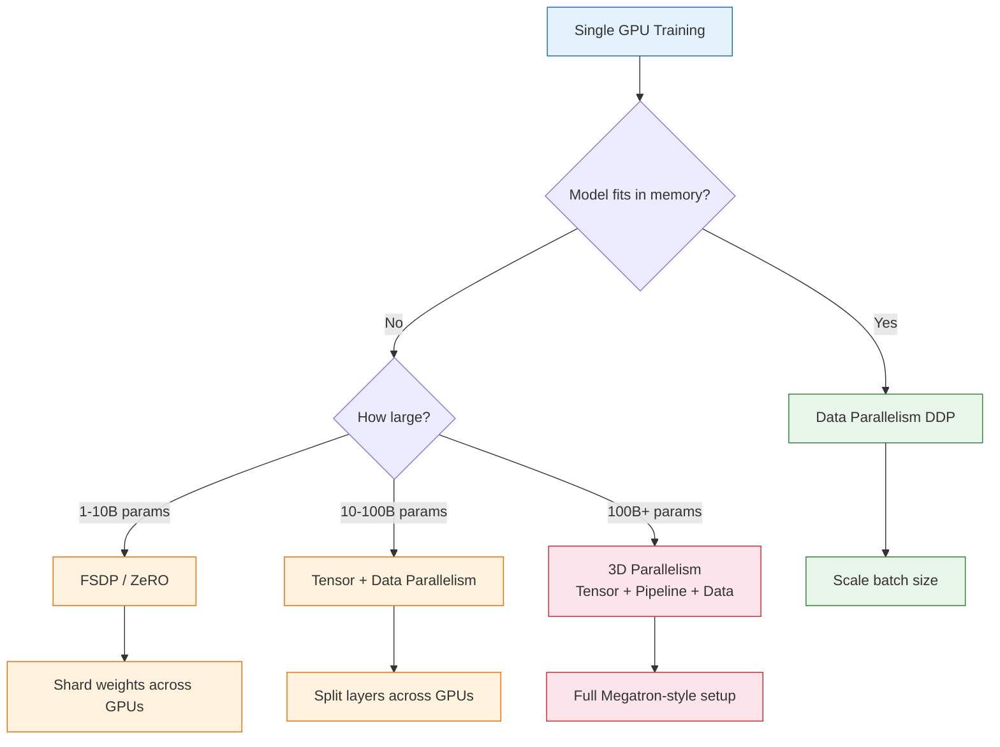
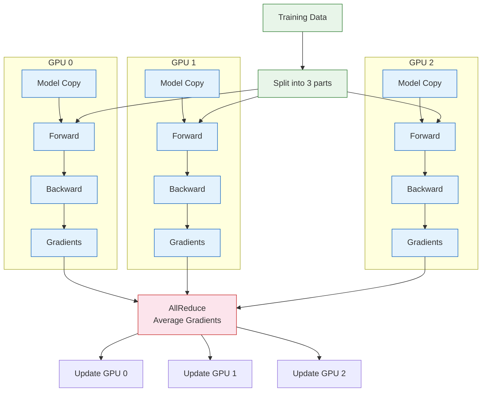
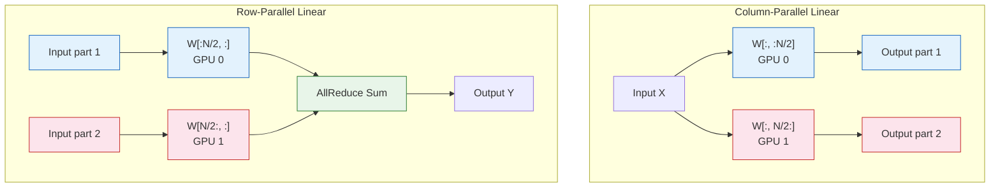
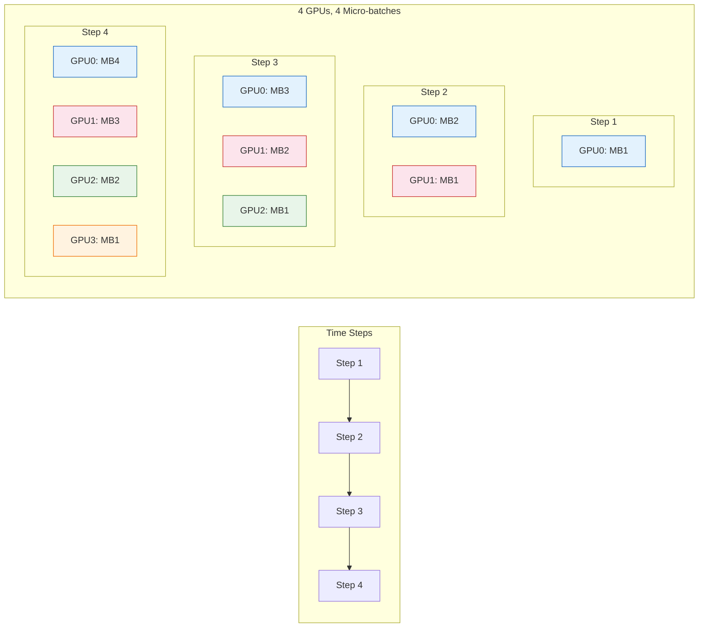

# Chapter 6: Scaling & Distributed Training -- Model Parallelism, Data Parallelism, ZeRO, and FSDP

Welcome to **Chapter 6: Scaling & Distributed Training -- Model Parallelism, Data Parallelism, ZeRO, and FSDP**. In this part of **GPT Open Source: Deep Dive Tutorial**, you will build an intuitive mental model first, then move into concrete implementation details and practical production tradeoffs.


## Introduction

Training GPT models beyond a few hundred million parameters requires distributing computation across multiple GPUs. A single GPU, even with 80GB of memory, cannot hold the model weights, optimizer states, gradients, and activations for a multi-billion parameter model.

This chapter covers the parallelism strategies used by GPT-NeoX, Megatron-LM, and modern training frameworks. We will progress from basic data parallelism to the sophisticated 3D parallelism used to train models with hundreds of billions of parameters.



## Memory Breakdown: Why Distribution Is Needed

Understanding where GPU memory goes is essential for choosing the right parallelism strategy.

### Memory Components for Training

```python
def estimate_memory(n_params_billions, batch_size, seq_len, dtype='fp16'):
    """
    Estimate GPU memory requirements for training.

    Components:
    1. Model weights
    2. Gradients (same size as weights)
    3. Optimizer states (AdamW: 2x weights for momentum + variance in FP32)
    4. Activations (depends on batch size and sequence length)
    """
    params = n_params_billions * 1e9
    bytes_per_param = 2 if dtype == 'fp16' else 4

    # Model weights
    weights_gb = (params * bytes_per_param) / 1e9

    # Gradients
    gradients_gb = weights_gb

    # AdamW optimizer states (always FP32)
    # Master weights (FP32) + Momentum (FP32) + Variance (FP32)
    optimizer_gb = (params * 4 * 3) / 1e9  # 12 bytes per param

    # Activation memory (rough estimate)
    # ~2 bytes per param per token in batch
    activation_gb = (params * batch_size * seq_len * 2) / 1e9
    # With activation checkpointing: sqrt reduction
    activation_ckpt_gb = activation_gb ** 0.5

    total_gb = weights_gb + gradients_gb + optimizer_gb + activation_gb

    return {
        'weights': weights_gb,
        'gradients': gradients_gb,
        'optimizer': optimizer_gb,
        'activations': activation_gb,
        'total': total_gb,
    }

# GPT-2 1.5B
mem = estimate_memory(1.5, batch_size=8, seq_len=1024)
print(f"GPT-2 1.5B memory breakdown:")
for k, v in mem.items():
    print(f"  {k:15s}: {v:6.1f} GB")
```

| Model | Weights (FP16) | Gradients | Optimizer (FP32) | Min GPU Memory |
|:------|:--------------|:----------|:----------------|:---------------|
| GPT-2 124M | 0.25 GB | 0.25 GB | 1.5 GB | ~4 GB |
| GPT-2 1.5B | 3.0 GB | 3.0 GB | 18.0 GB | ~40 GB |
| GPT-J 6B | 12.0 GB | 12.0 GB | 72.0 GB | ~160 GB |
| GPT-NeoX 20B | 40.0 GB | 40.0 GB | 240.0 GB | ~530 GB |

## Data Parallelism with DDP

The simplest form of distributed training: replicate the model on each GPU, split data across GPUs, and synchronize gradients.



### nanoGPT DDP Implementation

```python
import torch
import torch.distributed as dist
from torch.nn.parallel import DistributedDataParallel as DDP

def setup_ddp():
    """Initialize distributed training."""
    # These env vars are set by torchrun
    rank = int(os.environ.get('RANK', 0))
    local_rank = int(os.environ.get('LOCAL_RANK', 0))
    world_size = int(os.environ.get('WORLD_SIZE', 1))

    dist.init_process_group(backend='nccl')
    torch.cuda.set_device(local_rank)

    return rank, local_rank, world_size

def train_ddp():
    """Training with DDP (simplified from nanoGPT)."""
    rank, local_rank, world_size = setup_ddp()
    is_master = rank == 0

    # Create model on this GPU
    model = GPT(config).to(local_rank)

    # Wrap with DDP
    model = DDP(model, device_ids=[local_rank])

    # Each GPU gets different data
    # Effective batch size = micro_batch * grad_accum * world_size
    for iter_num in range(max_iters):
        # Only master logs and saves checkpoints
        if iter_num % eval_interval == 0 and is_master:
            val_loss = estimate_loss(model)
            print(f"step {iter_num}: val loss {val_loss:.4f}")

        optimizer.zero_grad(set_to_none=True)

        for micro_step in range(gradient_accumulation_steps):
            x, y = get_batch('train')

            # DDP sync only on last micro-step
            model.require_backward_grad_sync = (
                micro_step == gradient_accumulation_steps - 1
            )

            with ctx:
                logits, loss = model(x, y)
                loss = loss / gradient_accumulation_steps

            loss.backward()

        torch.nn.utils.clip_grad_norm_(model.parameters(), 1.0)
        optimizer.step()

    dist.destroy_process_group()

# Launch with:
# torchrun --nproc_per_node=4 train.py
```

## ZeRO Optimization (DeepSpeed)

ZeRO (Zero Redundancy Optimizer) eliminates memory redundancy across GPUs by partitioning optimizer states, gradients, and parameters.

### ZeRO Stages

| Stage | What Is Partitioned | Memory per GPU | Communication |
|:------|:-------------------|:--------------|:-------------|
| **ZeRO-1** | Optimizer states | ~4x reduction | Same as DDP |
| **ZeRO-2** | + Gradients | ~8x reduction | Slightly more |
| **ZeRO-3** | + Parameters | ~Nx reduction (N = GPUs) | Most overhead |

```mermaid
flowchart LR
    subgraph DDP["DDP (No ZeRO)"]
        direction TB
        D_W[Full Weights]
        D_G[Full Gradients]
        D_O[Full Optimizer States]
    end

    subgraph Z1["ZeRO Stage 1"]
        direction TB
        Z1_W[Full Weights]
        Z1_G[Full Gradients]
        Z1_O[Partitioned Optimizer]
    end

    subgraph Z2["ZeRO Stage 2"]
        direction TB
        Z2_W[Full Weights]
        Z2_G[Partitioned Gradients]
        Z2_O[Partitioned Optimizer]
    end

    subgraph Z3["ZeRO Stage 3"]
        direction TB
        Z3_W[Partitioned Weights]
        Z3_G[Partitioned Gradients]
        Z3_O[Partitioned Optimizer]
    end

    DDP --> Z1 --> Z2 --> Z3

    classDef full fill:#ffcdd2,stroke:#c62828
    classDef part fill:#c8e6c9,stroke:#2e7d32

    class D_W,D_G,D_O,Z1_W,Z1_G,Z2_W full
    class Z1_O,Z2_G,Z2_O,Z3_W,Z3_G,Z3_O part
```



### Using DeepSpeed with GPT-NeoX

```python
# DeepSpeed configuration for GPT-NeoX
deepspeed_config = {
    "train_batch_size": 2048,
    "train_micro_batch_size_per_gpu": 4,
    "gradient_accumulation_steps": 64,

    "optimizer": {
        "type": "Adam",
        "params": {
            "lr": 6e-4,
            "betas": [0.9, 0.95],
            "eps": 1e-8,
            "weight_decay": 0.1
        }
    },

    "scheduler": {
        "type": "WarmupDecayLR",
        "params": {
            "warmup_min_lr": 6e-5,
            "warmup_max_lr": 6e-4,
            "warmup_num_steps": 2000,
            "total_num_steps": 320000
        }
    },

    "zero_optimization": {
        "stage": 2,
        "allgather_partitions": True,
        "allgather_bucket_size": 5e8,
        "reduce_scatter": True,
        "reduce_bucket_size": 5e8,
        "overlap_comm": True,
        "contiguous_gradients": True,
    },

    "fp16": {
        "enabled": True,
        "loss_scale": 0,
        "loss_scale_window": 1000,
        "initial_scale_power": 16,
        "hysteresis": 2,
        "min_loss_scale": 1
    },

    "activation_checkpointing": {
        "partition_activations": True,
        "contiguous_memory_optimization": True,
    },

    "wall_clock_breakdown": True
}
```

```python
# Integrating DeepSpeed with a training script
import deepspeed

def train_with_deepspeed():
    model = GPT(config)

    model_engine, optimizer, _, _ = deepspeed.initialize(
        model=model,
        config=deepspeed_config,
        model_parameters=model.parameters()
    )

    for step in range(max_steps):
        x, y = get_batch()
        loss = model_engine(x, y)
        model_engine.backward(loss)
        model_engine.step()

# Launch:
# deepspeed --num_gpus=8 train.py --deepspeed_config ds_config.json
```

## FSDP (Fully Sharded Data Parallelism)

FSDP is PyTorch's native alternative to DeepSpeed ZeRO-3. It shards model parameters, gradients, and optimizer states across GPUs.

```python
from torch.distributed.fsdp import (
    FullyShardedDataParallel as FSDP,
    MixedPrecision,
    ShardingStrategy,
)
from torch.distributed.fsdp.wrap import transformer_auto_wrap_policy

def train_with_fsdp():
    """Training with PyTorch FSDP."""
    setup_ddp()

    model = GPT(config)

    # Define mixed precision policy
    mixed_precision_policy = MixedPrecision(
        param_dtype=torch.bfloat16,
        reduce_dtype=torch.bfloat16,
        buffer_dtype=torch.bfloat16,
    )

    # Auto-wrap policy: shard at transformer block boundaries
    auto_wrap_policy = transformer_auto_wrap_policy(
        transformer_layer_cls={Block},
    )

    # Wrap model with FSDP
    model = FSDP(
        model,
        auto_wrap_policy=auto_wrap_policy,
        mixed_precision=mixed_precision_policy,
        sharding_strategy=ShardingStrategy.FULL_SHARD,  # ZeRO-3 equivalent
        device_id=torch.cuda.current_device(),
        limit_all_gathers=True,
    )

    optimizer = torch.optim.AdamW(model.parameters(), lr=6e-4)

    for step in range(max_steps):
        x, y = get_batch()
        loss = model(x, y)
        loss.backward()
        torch.nn.utils.clip_grad_norm_(model.parameters(), 1.0)
        optimizer.step()
        optimizer.zero_grad()

# Launch:
# torchrun --nproc_per_node=8 train.py
```

### FSDP Sharding Strategies

| Strategy | Description | Memory Savings | Communication |
|:---------|:-----------|:--------------|:-------------|
| `FULL_SHARD` | Shard everything (ZeRO-3) | Maximum | Highest |
| `SHARD_GRAD_OP` | Shard gradients + optimizer (ZeRO-2) | High | Moderate |
| `NO_SHARD` | Standard DDP | None | Lowest |
| `HYBRID_SHARD` | Full shard within node, DDP across | Good balance | Moderate |

## Tensor Parallelism

Tensor parallelism splits individual layers across GPUs. This is essential for very large models where even a single layer's activations exceed GPU memory.



```python
class ColumnParallelLinear(nn.Module):
    """Column-parallel linear layer for tensor parallelism."""

    def __init__(self, in_features, out_features, world_size, rank):
        super().__init__()
        assert out_features % world_size == 0
        self.local_out = out_features // world_size
        self.weight = nn.Parameter(
            torch.randn(self.local_out, in_features) * 0.02
        )

    def forward(self, x):
        return F.linear(x, self.weight)


class RowParallelLinear(nn.Module):
    """Row-parallel linear layer for tensor parallelism."""

    def __init__(self, in_features, out_features, world_size, rank):
        super().__init__()
        assert in_features % world_size == 0
        self.local_in = in_features // world_size
        self.weight = nn.Parameter(
            torch.randn(out_features, self.local_in) * 0.02
        )

    def forward(self, x):
        local_output = F.linear(x, self.weight)
        # AllReduce to sum partial results across GPUs
        dist.all_reduce(local_output, op=dist.ReduceOp.SUM)
        return local_output
```

## Pipeline Parallelism

Pipeline parallelism splits the model layer-wise across GPUs and processes micro-batches through the pipeline.



## 3D Parallelism in GPT-NeoX

GPT-NeoX combines all three forms of parallelism:

```python
# GPT-NeoX configuration for 3D parallelism
neox_config = {
    "pipe-parallel-size": 4,     # Pipeline parallelism across 4 stages
    "model-parallel-size": 2,    # Tensor parallelism across 2 GPUs
    # Data parallelism = total_gpus / (pipe * tensor) = 64 / (4 * 2) = 8

    "num-layers": 44,
    "hidden-size": 6144,
    "num-attention-heads": 64,
    "seq-length": 2048,
    "max-position-embeddings": 2048,

    # Activation checkpointing to save memory
    "checkpoint-activations": True,
    "checkpoint-num-layers": 1,

    # Training settings
    "train-iters": 320000,
    "lr-decay-iters": 320000,
    "lr": 0.97e-4,
    "min-lr": 0.97e-5,
    "warmup": 0.01,
}

# Launch GPT-NeoX training
# python deepy.py train.py neox_config.yml
```

### Parallelism Strategy Selection Guide

| Total GPUs | Model Size | Recommended Strategy |
|:-----------|:-----------|:--------------------|
| 1 | < 1B | Single GPU + gradient accumulation |
| 2-8 | 1-7B | DDP or FSDP |
| 8-32 | 7-20B | FSDP or ZeRO-2/3 |
| 32-128 | 20-70B | Tensor + Data parallelism |
| 128-512 | 70-200B | 3D parallelism |
| 512+ | 200B+ | Full 3D + expert parallelism |

## Activation Checkpointing

Activation checkpointing (gradient checkpointing) trades compute for memory by recomputing activations during the backward pass instead of storing them:

```python
from torch.utils.checkpoint import checkpoint

class BlockWithCheckpointing(nn.Module):
    """Transformer block with activation checkpointing."""

    def __init__(self, config):
        super().__init__()
        self.ln_1 = nn.LayerNorm(config.n_embd)
        self.attn = CausalSelfAttention(config)
        self.ln_2 = nn.LayerNorm(config.n_embd)
        self.mlp = MLP(config)
        self.use_checkpoint = config.get('activation_checkpointing', False)

    def forward(self, x):
        if self.use_checkpoint and self.training:
            x = x + checkpoint(self.attn, self.ln_1(x), use_reentrant=False)
            x = x + checkpoint(self.mlp, self.ln_2(x), use_reentrant=False)
        else:
            x = x + self.attn(self.ln_1(x))
            x = x + self.mlp(self.ln_2(x))
        return x

# Memory savings with activation checkpointing:
# Without: O(n_layers * batch * seq * hidden)
# With:    O(sqrt(n_layers) * batch * seq * hidden)
# Cost: ~33% more compute (recompute activations in backward)
```

## Summary

In this chapter, you have:

- Analyzed GPU memory breakdown for GPT models of various sizes
- Implemented Data Parallelism with DDP and nanoGPT
- Explored ZeRO optimization stages and DeepSpeed integration
- Configured FSDP for fully sharded training with PyTorch
- Understood tensor parallelism for splitting individual layers
- Examined pipeline parallelism for stage-wise model distribution
- Learned how GPT-NeoX combines all three into 3D parallelism

## Key Takeaways

1. **Memory is the bottleneck**: Optimizer states consume 3x the memory of model weights in FP32, making them the primary target for optimization.
2. **Start simple, scale up**: Begin with DDP, move to FSDP/ZeRO when the model outgrows a single GPU, then add tensor parallelism for very large models.
3. **FSDP is the PyTorch-native solution**: For most use cases under 70B parameters, FSDP with `FULL_SHARD` provides excellent memory efficiency without the complexity of Megatron-style parallelism.
4. **Activation checkpointing is almost always worth it**: The 33% compute overhead is a small price for the significant memory savings, which can be reinvested into larger batch sizes.
5. **Communication overhead matters**: Tensor parallelism requires fast interconnects (NVLink), while data parallelism can work with slower network connections.

## Next Steps

In [Chapter 7: Fine-Tuning & Alignment](07-fine-tuning-alignment.md), we will explore how to adapt pre-trained GPT models to specific tasks using LoRA, QLoRA, RLHF, DPO, and instruction tuning techniques.

---
*Built with insights from open-source GPT implementations.*

## What Problem Does This Solve?

Most teams struggle here because the hard part is not writing more code, but deciding clear boundaries for `self`, `model`, `classDef` so behavior stays predictable as complexity grows.

In practical terms, this chapter helps you avoid three common failures:

- coupling core logic too tightly to one implementation path
- missing the handoff boundaries between setup, execution, and validation
- shipping changes without clear rollback or observability strategy

After working through this chapter, you should be able to reason about `Chapter 6: Scaling & Distributed Training -- Model Parallelism, Data Parallelism, ZeRO, and FSDP` as an operating subsystem inside **GPT Open Source: Deep Dive Tutorial**, with explicit contracts for inputs, state transitions, and outputs.

Use the implementation notes around `fill`, `stroke`, `torch` as your checklist when adapting these patterns to your own repository.

## How it Works Under the Hood

Under the hood, `Chapter 6: Scaling & Distributed Training -- Model Parallelism, Data Parallelism, ZeRO, and FSDP` usually follows a repeatable control path:

1. **Context bootstrap**: initialize runtime config and prerequisites for `self`.
2. **Input normalization**: shape incoming data so `model` receives stable contracts.
3. **Core execution**: run the main logic branch and propagate intermediate state through `classDef`.
4. **Policy and safety checks**: enforce limits, auth scopes, and failure boundaries.
5. **Output composition**: return canonical result payloads for downstream consumers.
6. **Operational telemetry**: emit logs/metrics needed for debugging and performance tuning.

When debugging, walk this sequence in order and confirm each stage has explicit success/failure conditions.

## Source Walkthrough

Use the following upstream sources to verify implementation details while reading this chapter:

- [nanoGPT](https://github.com/karpathy/nanoGPT)
  Why it matters: authoritative reference on `nanoGPT` (github.com).
- [minGPT](https://github.com/karpathy/minGPT)
  Why it matters: authoritative reference on `minGPT` (github.com).
- [GPT-NeoX](https://github.com/EleutherAI/gpt-neox)
  Why it matters: authoritative reference on `GPT-NeoX` (github.com).
- [GPT-Neo](https://github.com/EleutherAI/gpt-neo)
  Why it matters: authoritative reference on `GPT-Neo` (github.com).
- [GPT-J](https://github.com/kingoflolz/mesh-transformer-jax)
  Why it matters: authoritative reference on `GPT-J` (github.com).
- [Chapter 1: Getting Started](01-getting-started.md)
  Why it matters: authoritative reference on `Chapter 1: Getting Started` (01-getting-started.md).

Suggested trace strategy:
- search upstream code for `self` and `model` to map concrete implementation paths
- compare docs claims against actual runtime/config code before reusing patterns in production

## Chapter Connections

- [Tutorial Index](index.md)
- [Previous Chapter: Chapter 5: Attention Mechanisms -- Causal Masking, KV-Cache, Multi-Query Attention, and Flash Attention](05-attention-mechanisms.md)
- [Next Chapter: Chapter 7: Fine-Tuning & Alignment -- LoRA, QLoRA, RLHF, DPO, and Instruction Tuning](07-fine-tuning-alignment.md)
- [Main Catalog](../../README.md#-tutorial-catalog)
- [A-Z Tutorial Directory](../../discoverability/tutorial-directory.md)
