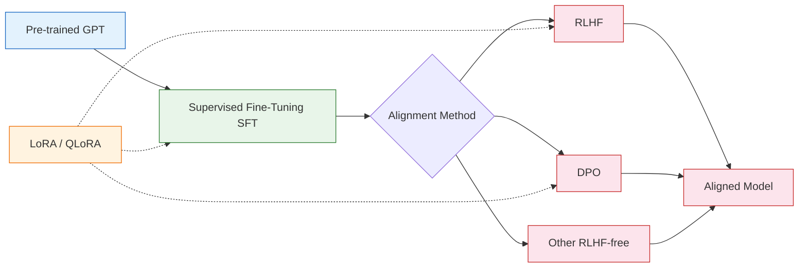
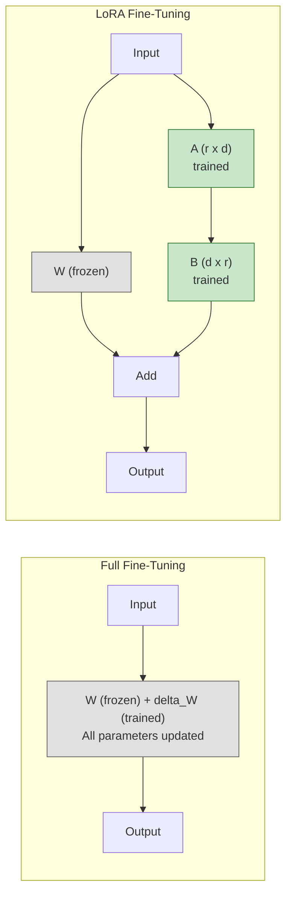
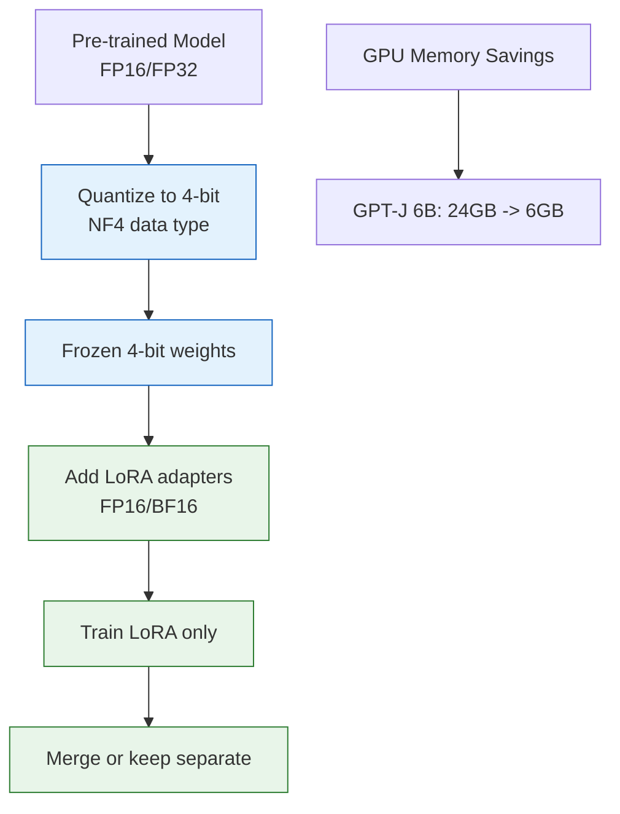
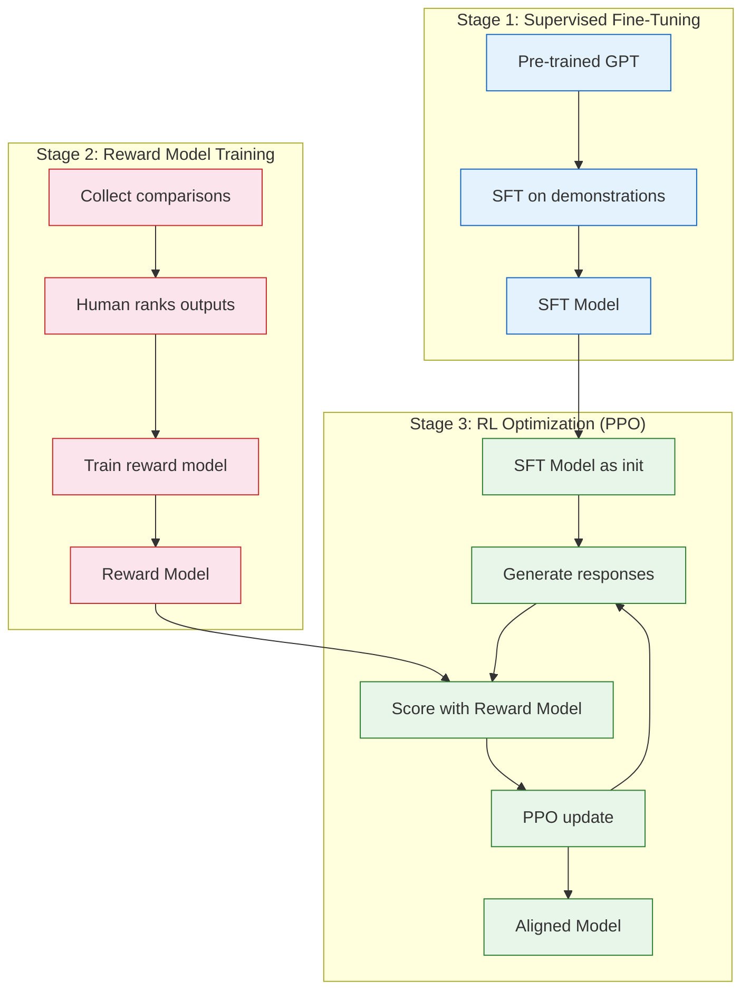
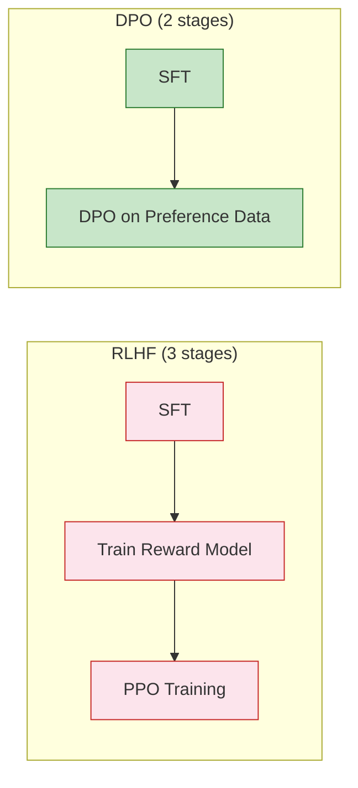

# Chapter 7: Fine-Tuning & Alignment -- LoRA, QLoRA, RLHF, DPO, and Instruction Tuning

## Introduction

Pre-training gives a GPT model broad language understanding, but it does not make the model useful for specific tasks or safe to deploy. Fine-tuning adapts the model to particular domains, while alignment techniques teach it to follow instructions and produce helpful, harmless outputs.

This chapter covers the full spectrum of post-training techniques, from simple supervised fine-tuning through parameter-efficient methods (LoRA, QLoRA) to alignment approaches (RLHF, DPO).



## Supervised Fine-Tuning (SFT)

SFT is the most straightforward approach: continue training on task-specific data with instruction-response pairs.

### Data Format

```python
# Standard instruction-tuning data format
training_examples = [
    {
        "instruction": "Summarize the following text in one sentence.",
        "input": "The transformer architecture was introduced in the paper "
                 "'Attention Is All You Need' by Vaswani et al. in 2017. "
                 "It replaced recurrent architectures with self-attention "
                 "mechanisms, enabling much more efficient parallelization.",
        "output": "The transformer, introduced in 2017, replaced recurrent "
                  "networks with self-attention for better parallelization."
    },
    {
        "instruction": "Write a Python function to compute the Fibonacci sequence.",
        "input": "",
        "output": "def fibonacci(n):\n    if n <= 1:\n        return n\n    "
                  "return fibonacci(n-1) + fibonacci(n-2)"
    },
]

# Formatting for training
def format_instruction(example):
    """Format instruction-tuning example for GPT training."""
    if example["input"]:
        prompt = (
            f"### Instruction:\n{example['instruction']}\n\n"
            f"### Input:\n{example['input']}\n\n"
            f"### Response:\n{example['output']}"
        )
    else:
        prompt = (
            f"### Instruction:\n{example['instruction']}\n\n"
            f"### Response:\n{example['output']}"
        )
    return prompt
```

### SFT with nanoGPT

```python
# Fine-tuning configuration for nanoGPT
# config/finetune_instruct.py

# Start from a pre-trained checkpoint
init_from = 'gpt2'  # or path to your checkpoint

# Dataset
dataset = 'instruct'
batch_size = 4
block_size = 512

# Fine-tuning hyperparameters (lower LR than pre-training)
learning_rate = 2e-5     # 10-30x lower than pre-training
max_iters = 5000
lr_decay_iters = 5000
min_lr = 2e-6
warmup_iters = 100
weight_decay = 0.01

# Less aggressive gradient clipping
grad_clip = 0.5

# Evaluation
eval_interval = 200
eval_iters = 50

# Save
out_dir = 'out-instruct'
always_save_checkpoint = True
```

### Loss Masking for Instruction Tuning

During instruction tuning, you should only compute loss on the response tokens, not the instruction tokens:

```python
def create_instruction_loss_mask(input_ids, response_start_positions):
    """
    Create a loss mask that only computes loss on response tokens.

    Args:
        input_ids: Token IDs (B, T)
        response_start_positions: Position where response begins for each example
    """
    B, T = input_ids.shape
    loss_mask = torch.zeros(B, T, dtype=torch.bool)

    for i in range(B):
        # Only compute loss on tokens after the response marker
        loss_mask[i, response_start_positions[i]:] = True

    return loss_mask


def compute_masked_loss(logits, targets, loss_mask):
    """Compute loss only on response tokens."""
    # Flatten
    logits_flat = logits.view(-1, logits.size(-1))
    targets_flat = targets.view(-1)
    mask_flat = loss_mask.view(-1)

    # Compute per-token loss
    per_token_loss = F.cross_entropy(
        logits_flat, targets_flat, reduction='none'
    )

    # Apply mask and average
    masked_loss = (per_token_loss * mask_flat.float()).sum() / mask_flat.sum()
    return masked_loss
```

## LoRA (Low-Rank Adaptation)

LoRA freezes the pre-trained model weights and injects trainable rank-decomposition matrices into each layer. Instead of fine-tuning all parameters, you only train the small LoRA matrices.



### How LoRA Works

The key insight: weight update matrices during fine-tuning have low intrinsic rank. Instead of updating a full `d x d` weight matrix, LoRA decomposes the update into two small matrices:

`W_new = W_frozen + alpha * (B @ A)`

where A is `(r, d_in)` and B is `(d_out, r)`, and `r << d`.

```python
import torch
import torch.nn as nn

class LoRALinear(nn.Module):
    """Linear layer with LoRA adaptation."""

    def __init__(self, base_layer, r=8, alpha=16, dropout=0.1):
        super().__init__()
        self.base_layer = base_layer
        self.r = r
        self.alpha = alpha
        self.scaling = alpha / r

        in_features = base_layer.in_features
        out_features = base_layer.out_features

        # LoRA matrices
        self.lora_A = nn.Parameter(torch.randn(r, in_features) * 0.01)
        self.lora_B = nn.Parameter(torch.zeros(out_features, r))
        self.lora_dropout = nn.Dropout(dropout)

        # Freeze base layer
        for param in base_layer.parameters():
            param.requires_grad = False

    def forward(self, x):
        # Original output (frozen)
        base_output = self.base_layer(x)

        # LoRA adaptation
        lora_output = self.lora_dropout(x) @ self.lora_A.T @ self.lora_B.T
        lora_output = lora_output * self.scaling

        return base_output + lora_output


def apply_lora_to_model(model, r=8, alpha=16, target_modules=None):
    """Apply LoRA to specified modules in a GPT model."""
    if target_modules is None:
        target_modules = ['c_attn', 'c_proj']  # Default: attention layers

    for name, module in model.named_modules():
        if any(target in name for target in target_modules):
            if isinstance(module, nn.Linear):
                parent_name = '.'.join(name.split('.')[:-1])
                child_name = name.split('.')[-1]
                parent = dict(model.named_modules())[parent_name]

                lora_layer = LoRALinear(module, r=r, alpha=alpha)
                setattr(parent, child_name, lora_layer)

    # Count trainable parameters
    total_params = sum(p.numel() for p in model.parameters())
    trainable_params = sum(p.numel() for p in model.parameters() if p.requires_grad)
    print(f"Total parameters:     {total_params:,}")
    print(f"Trainable parameters: {trainable_params:,}")
    print(f"Trainable ratio:      {trainable_params/total_params:.2%}")

    return model
```

### LoRA Parameter Comparison

| Model | Full FT Params | LoRA r=8 | LoRA r=16 | LoRA r=64 |
|:------|:--------------|:---------|:----------|:----------|
| GPT-2 124M | 124M (100%) | 0.59M (0.47%) | 1.18M (0.95%) | 4.72M (3.8%) |
| GPT-2 1.5B | 1.5B (100%) | 3.15M (0.21%) | 6.29M (0.42%) | 25.2M (1.68%) |
| GPT-J 6B | 6B (100%) | 8.39M (0.14%) | 16.8M (0.28%) | 67.1M (1.12%) |

### Using PEFT Library

```python
from peft import LoraConfig, get_peft_model, TaskType
from transformers import AutoModelForCausalLM, AutoTokenizer

# Load base model
model = AutoModelForCausalLM.from_pretrained("gpt2-large")
tokenizer = AutoTokenizer.from_pretrained("gpt2-large")

# Configure LoRA
lora_config = LoraConfig(
    task_type=TaskType.CAUSAL_LM,
    r=16,                              # Rank
    lora_alpha=32,                     # Scaling factor
    lora_dropout=0.05,                 # Dropout for LoRA layers
    target_modules=["c_attn", "c_proj", "c_fc"],  # Which layers to adapt
    bias="none",                       # Don't train biases
)

# Apply LoRA
model = get_peft_model(model, lora_config)
model.print_trainable_parameters()
# trainable params: 2,359,296 || all params: 776,573,952 || trainable%: 0.3037
```

## QLoRA (Quantized LoRA)

QLoRA combines 4-bit quantization of the base model with LoRA fine-tuning, enabling fine-tuning of very large models on consumer hardware.



```python
from transformers import AutoModelForCausalLM, BitsAndBytesConfig
from peft import LoraConfig, get_peft_model, prepare_model_for_kbit_training
import torch

# 4-bit quantization configuration
bnb_config = BitsAndBytesConfig(
    load_in_4bit=True,
    bnb_4bit_quant_type="nf4",           # NormalFloat4 data type
    bnb_4bit_compute_dtype=torch.bfloat16,  # Compute in BF16
    bnb_4bit_use_double_quant=True,       # Nested quantization
)

# Load model in 4-bit
model = AutoModelForCausalLM.from_pretrained(
    "EleutherAI/gpt-j-6b",
    quantization_config=bnb_config,
    device_map="auto",
)

# Prepare for training
model = prepare_model_for_kbit_training(model)

# Apply LoRA
lora_config = LoraConfig(
    r=16,
    lora_alpha=32,
    target_modules=["q_proj", "k_proj", "v_proj", "o_proj"],
    lora_dropout=0.05,
    bias="none",
    task_type="CAUSAL_LM",
)
model = get_peft_model(model, lora_config)

# Memory usage: ~6GB instead of ~24GB for full FP16
```

### Memory Comparison

| Method | GPT-J 6B Memory | GPU Required | Trainable Params |
|:-------|:----------------|:------------|:----------------|
| Full Fine-Tuning (FP16) | ~48 GB | A100 80GB | 6B (100%) |
| LoRA (FP16) | ~24 GB | A100 40GB | ~17M (0.28%) |
| QLoRA (4-bit + LoRA) | ~6 GB | RTX 3090 24GB | ~17M (0.28%) |
| QLoRA (4-bit, r=64) | ~8 GB | RTX 3090 24GB | ~67M (1.1%) |

## RLHF (Reinforcement Learning from Human Feedback)

RLHF aligns language models with human preferences through a three-stage process.



### Reward Model

```python
class RewardModel(nn.Module):
    """Reward model for RLHF, built on top of a GPT model."""

    def __init__(self, base_model):
        super().__init__()
        self.base_model = base_model
        # Replace LM head with scalar reward head
        self.reward_head = nn.Linear(base_model.config.n_embd, 1, bias=False)

    def forward(self, input_ids, attention_mask=None):
        # Get hidden states from base model
        hidden_states = self.base_model.transformer(input_ids)
        # Use last token's representation
        last_hidden = hidden_states[:, -1, :]
        reward = self.reward_head(last_hidden)
        return reward.squeeze(-1)


def train_reward_model(model, comparisons, epochs=3):
    """
    Train reward model on human preference comparisons.

    Each comparison has:
    - chosen: the preferred response
    - rejected: the less preferred response
    """
    optimizer = torch.optim.AdamW(model.parameters(), lr=1e-5)

    for epoch in range(epochs):
        for batch in comparisons:
            chosen_reward = model(batch['chosen_ids'])
            rejected_reward = model(batch['rejected_ids'])

            # Bradley-Terry loss: chosen should score higher
            loss = -torch.log(
                torch.sigmoid(chosen_reward - rejected_reward)
            ).mean()

            loss.backward()
            optimizer.step()
            optimizer.zero_grad()

            accuracy = (chosen_reward > rejected_reward).float().mean()
            print(f"Loss: {loss.item():.4f}, Accuracy: {accuracy:.2%}")
```

### PPO Training Loop

```python
# Simplified PPO for RLHF (using trl library)
from trl import PPOTrainer, PPOConfig

ppo_config = PPOConfig(
    model_name="gpt2-finetuned",
    learning_rate=1.41e-5,
    batch_size=64,
    mini_batch_size=8,
    gradient_accumulation_steps=8,
    ppo_epochs=4,
    kl_penalty="kl",            # KL divergence penalty
    init_kl_coef=0.2,           # Initial KL coefficient
    target_kl=6.0,              # Target KL divergence
    cliprange=0.2,              # PPO clip range
    cliprange_value=0.2,        # Value function clip range
)

# Initialize PPO trainer
ppo_trainer = PPOTrainer(
    config=ppo_config,
    model=sft_model,
    ref_model=sft_model_frozen,    # Reference model for KL penalty
    tokenizer=tokenizer,
    reward_model=reward_model,
)

# PPO training loop
for batch in dataloader:
    # Generate responses
    query_tensors = batch['input_ids']
    response_tensors = ppo_trainer.generate(query_tensors, max_new_tokens=128)

    # Compute rewards
    rewards = reward_model(response_tensors)

    # PPO update
    stats = ppo_trainer.step(query_tensors, response_tensors, rewards)
    print(f"Mean reward: {stats['ppo/mean_scores']:.4f}")
```

## DPO (Direct Preference Optimization)

DPO simplifies RLHF by eliminating the need for a separate reward model and RL training. It directly optimizes the policy from preference data.



```python
import torch
import torch.nn.functional as F

def dpo_loss(policy_model, reference_model, chosen_ids, rejected_ids, beta=0.1):
    """
    Direct Preference Optimization loss.

    The DPO loss directly optimizes the policy to prefer chosen over rejected
    responses, using the reference model as an anchor.

    Args:
        policy_model: The model being trained
        reference_model: Frozen reference model (usually the SFT model)
        chosen_ids: Token IDs of preferred responses
        rejected_ids: Token IDs of rejected responses
        beta: Temperature parameter (lower = stronger optimization)
    """
    # Compute log probabilities under both models
    with torch.no_grad():
        ref_chosen_logps = get_log_probs(reference_model, chosen_ids)
        ref_rejected_logps = get_log_probs(reference_model, rejected_ids)

    policy_chosen_logps = get_log_probs(policy_model, chosen_ids)
    policy_rejected_logps = get_log_probs(policy_model, rejected_ids)

    # DPO loss
    chosen_rewards = beta * (policy_chosen_logps - ref_chosen_logps)
    rejected_rewards = beta * (policy_rejected_logps - ref_rejected_logps)

    loss = -F.logsigmoid(chosen_rewards - rejected_rewards).mean()

    # Metrics
    chosen_reward_mean = chosen_rewards.detach().mean()
    rejected_reward_mean = rejected_rewards.detach().mean()
    reward_margin = (chosen_rewards - rejected_rewards).detach().mean()
    accuracy = (chosen_rewards > rejected_rewards).float().mean()

    return loss, {
        'chosen_reward': chosen_reward_mean,
        'rejected_reward': rejected_reward_mean,
        'reward_margin': reward_margin,
        'accuracy': accuracy,
    }


def get_log_probs(model, input_ids):
    """Compute per-sequence log probabilities."""
    logits = model(input_ids[:, :-1]).logits
    log_probs = F.log_softmax(logits, dim=-1)

    # Gather log probs for actual tokens
    token_log_probs = log_probs.gather(
        dim=-1,
        index=input_ids[:, 1:].unsqueeze(-1)
    ).squeeze(-1)

    return token_log_probs.sum(dim=-1)  # Sum over sequence
```

### DPO with TRL Library

```python
from trl import DPOTrainer, DPOConfig
from transformers import AutoModelForCausalLM, AutoTokenizer
from datasets import load_dataset

# Load models
model = AutoModelForCausalLM.from_pretrained("gpt2-sft")
ref_model = AutoModelForCausalLM.from_pretrained("gpt2-sft")
tokenizer = AutoTokenizer.from_pretrained("gpt2")

# Load preference dataset
# Format: {"prompt": ..., "chosen": ..., "rejected": ...}
dataset = load_dataset("your_preference_data")

# DPO configuration
dpo_config = DPOConfig(
    beta=0.1,
    learning_rate=5e-7,
    num_train_epochs=3,
    per_device_train_batch_size=4,
    gradient_accumulation_steps=4,
    max_length=512,
    max_prompt_length=256,
)

# Train
trainer = DPOTrainer(
    model=model,
    ref_model=ref_model,
    args=dpo_config,
    train_dataset=dataset["train"],
    tokenizer=tokenizer,
)
trainer.train()
```

### Alignment Method Comparison

| Method | Reward Model | RL Required | Stability | Compute | Quality |
|:-------|:------------|:-----------|:----------|:--------|:--------|
| **SFT** | No | No | High | Low | Baseline |
| **RLHF (PPO)** | Yes | Yes | Low | Very High | Best |
| **DPO** | No | No | High | Moderate | Near RLHF |
| **KTO** | No | No | High | Low | Good |
| **ORPO** | No | No | High | Low | Good |

## Summary

In this chapter, you have:

- Implemented supervised fine-tuning with instruction data and loss masking
- Built LoRA from scratch and understood its low-rank decomposition
- Configured QLoRA for fine-tuning large models on consumer hardware
- Understood the complete RLHF pipeline: SFT, reward model, PPO
- Implemented DPO as a simpler alternative to RLHF
- Compared different alignment methods and their tradeoffs

## Key Takeaways

1. **LoRA is the standard for efficient fine-tuning**: Training less than 1% of parameters often achieves comparable quality to full fine-tuning.
2. **QLoRA democratizes large model fine-tuning**: 4-bit quantization with LoRA enables fine-tuning 6-7B models on a single consumer GPU.
3. **Loss masking is critical for instruction tuning**: Only computing loss on response tokens prevents the model from memorizing instruction templates.
4. **DPO is simpler than RLHF with comparable results**: Eliminating the reward model and RL training makes alignment significantly more accessible.
5. **The SFT stage matters most**: A good SFT model is the foundation for all subsequent alignment, regardless of which technique you use.
6. **Merge LoRA weights for inference**: After training, merge LoRA weights into the base model to eliminate the inference overhead of separate adapters.

## Next Steps

In [Chapter 8: Production Inference](08-production-inference.md), we will cover everything needed to deploy your fine-tuned GPT model -- including quantization, continuous batching, speculative decoding, and deployment strategies.

---
*Built with insights from open-source GPT implementations.*
