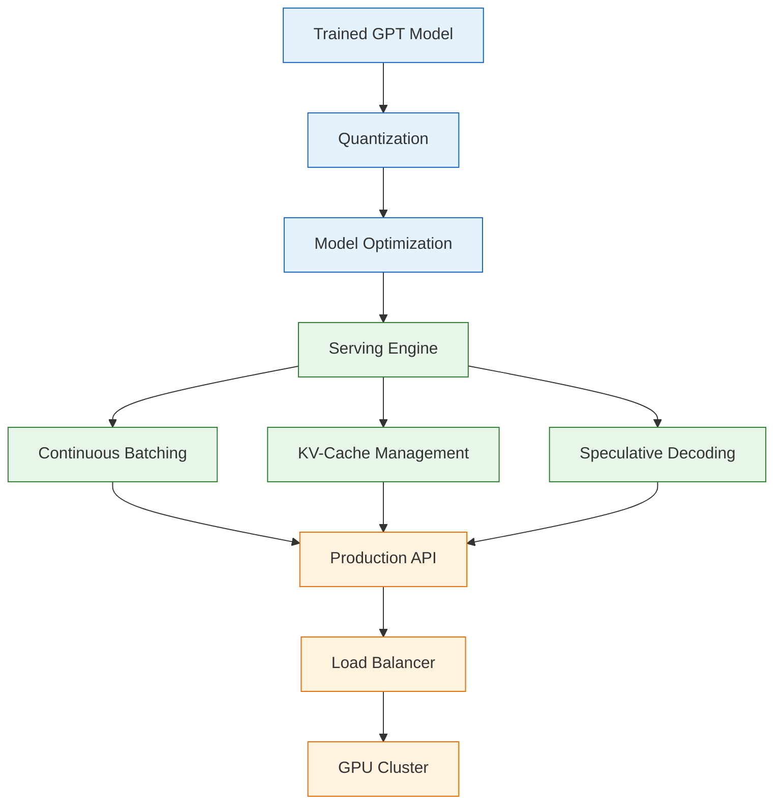
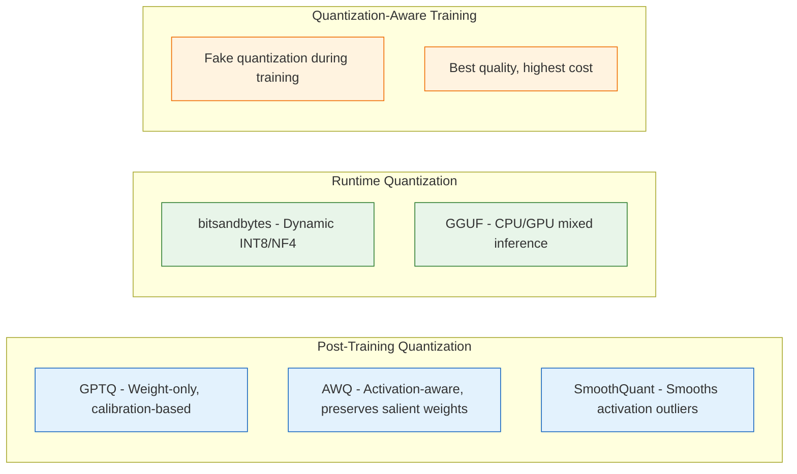
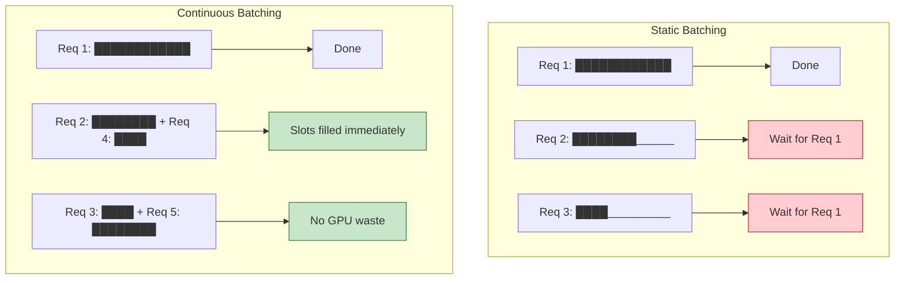
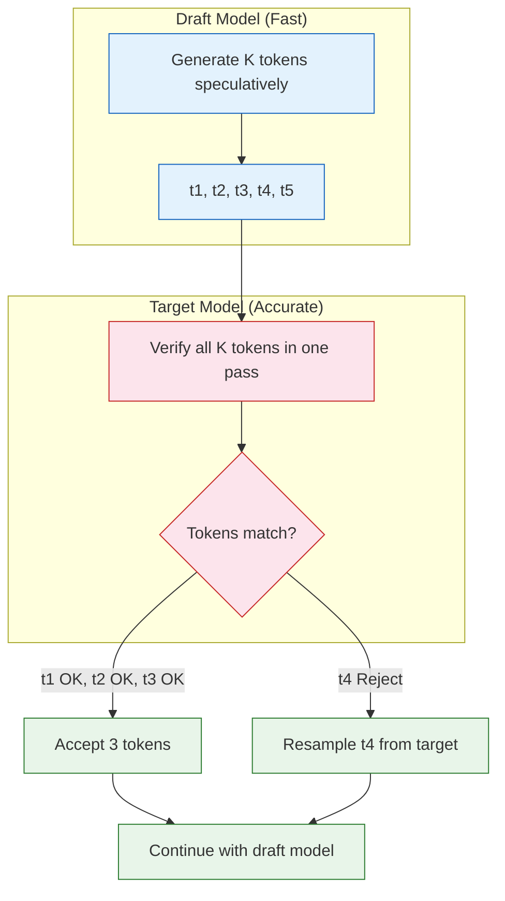
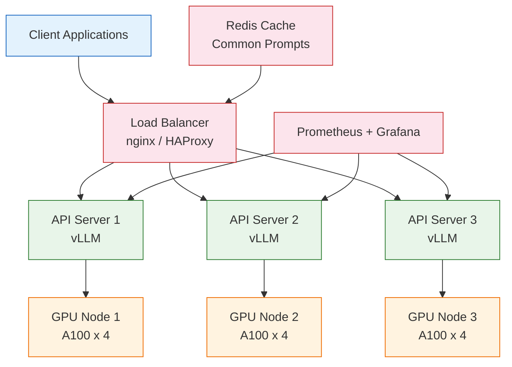

# Chapter 8: Production Inference -- Quantization, Batching, Speculative Decoding, and Deployment

Welcome to **Chapter 8: Production Inference -- Quantization, Batching, Speculative Decoding, and Deployment**. In this part of **GPT Open Source: Deep Dive Tutorial**, you will build an intuitive mental model first, then move into concrete implementation details and practical production tradeoffs.


## Introduction

Taking a GPT model from a research checkpoint to a production service requires a different set of skills from training. Production inference is about maximizing throughput, minimizing latency, and reducing cost -- all while maintaining acceptable output quality.

This chapter covers the complete inference optimization stack, from model-level techniques like quantization to system-level optimizations like continuous batching and deployment architectures.



## Quantization

Quantization reduces the precision of model weights from FP16/FP32 to INT8 or INT4, dramatically reducing memory usage and often increasing inference speed.

### Quantization Methods

| Method | Bits | Memory Savings | Speed Impact | Quality Loss |
|:-------|:-----|:--------------|:-------------|:-------------|
| **FP16** | 16 | 1x (baseline) | 1x | None |
| **INT8 (absmax)** | 8 | 2x | 1.2-1.5x | Minimal |
| **INT8 (LLM.int8)** | 8 | 2x | 1.0-1.2x | Near zero |
| **GPTQ (INT4)** | 4 | 4x | 1.5-2x | Small |
| **AWQ (INT4)** | 4 | 4x | 1.5-2.5x | Small |
| **GGUF (Q4_K_M)** | 4-5 | ~3.5x | Varies | Small |
| **INT3** | 3 | 5.3x | 1.5-2x | Moderate |



### GPTQ Quantization

```python
from transformers import AutoModelForCausalLM, AutoTokenizer, GPTQConfig

# Load model and tokenizer
model_name = "gpt2-large"
tokenizer = AutoTokenizer.from_pretrained(model_name)

# Configure GPTQ quantization
gptq_config = GPTQConfig(
    bits=4,                    # 4-bit quantization
    group_size=128,            # Quantize in groups of 128
    desc_act=True,             # Use activation order for quantization
    dataset="c4",              # Calibration dataset
    tokenizer=tokenizer,
)

# Quantize the model
model = AutoModelForCausalLM.from_pretrained(
    model_name,
    quantization_config=gptq_config,
    device_map="auto",
)

# Save quantized model
model.save_pretrained("gpt2-large-gptq-4bit")
tokenizer.save_pretrained("gpt2-large-gptq-4bit")
```

### AWQ Quantization

```python
from awq import AutoAWQForCausalLM

# Load model
model = AutoAWQForCausalLM.from_pretrained(
    "gpt2-large",
    safetensors=True,
)
tokenizer = AutoTokenizer.from_pretrained("gpt2-large")

# Quantize with AWQ
quant_config = {
    "zero_point": True,
    "q_group_size": 128,
    "w_bit": 4,
    "version": "GEMM",  # or "GEMV" for batch=1 optimization
}

model.quantize(
    tokenizer,
    quant_config=quant_config,
    calib_data="c4",
)

# Save
model.save_quantized("gpt2-large-awq-4bit")
```

### Simple INT8 Quantization from Scratch

```python
import torch

def quantize_int8(weight):
    """
    Simple absmax INT8 quantization.

    Maps FP16 weights to INT8 range [-127, 127].
    """
    # Find the absolute maximum per output channel
    scale = weight.abs().max(dim=-1, keepdim=True)[0] / 127.0

    # Quantize
    weight_int8 = torch.round(weight / scale).to(torch.int8)

    return weight_int8, scale


def dequantize_int8(weight_int8, scale):
    """Dequantize INT8 back to floating point."""
    return weight_int8.float() * scale


class QuantizedLinear(nn.Module):
    """INT8 quantized linear layer."""

    def __init__(self, linear_layer):
        super().__init__()
        weight = linear_layer.weight.data
        self.weight_int8, self.scale = quantize_int8(weight)
        self.bias = linear_layer.bias

    def forward(self, x):
        # Dequantize on the fly
        weight_fp = dequantize_int8(self.weight_int8, self.scale)
        output = F.linear(x, weight_fp, self.bias)
        return output


def quantize_model(model):
    """Replace all Linear layers with INT8 quantized versions."""
    for name, module in model.named_children():
        if isinstance(module, nn.Linear):
            setattr(model, name, QuantizedLinear(module))
        else:
            quantize_model(module)
    return model
```

### Memory Savings

| Model | FP16 | INT8 | INT4 (GPTQ) | INT4 (AWQ) |
|:------|:-----|:-----|:------------|:-----------|
| GPT-2 124M | 248 MB | 124 MB | 70 MB | 70 MB |
| GPT-2 1.5B | 3.0 GB | 1.5 GB | 0.85 GB | 0.85 GB |
| GPT-J 6B | 12 GB | 6 GB | 3.5 GB | 3.5 GB |
| GPT-NeoX 20B | 40 GB | 20 GB | 11.5 GB | 11.5 GB |

## Continuous Batching

Traditional static batching wastes GPU cycles because shorter sequences finish before longer ones. Continuous batching dynamically inserts new requests as old ones complete.



```python
# Continuous batching with vLLM
from vllm import LLM, SamplingParams

# Initialize vLLM engine with a GPT model
llm = LLM(
    model="gpt2-large",
    tensor_parallel_size=1,
    max_model_len=2048,
    gpu_memory_utilization=0.9,
)

# Sampling parameters
sampling_params = SamplingParams(
    temperature=0.8,
    top_p=0.95,
    max_tokens=256,
)

# Process multiple prompts (automatically batched)
prompts = [
    "Explain the theory of relativity in simple terms.",
    "Write a Python function to sort a list.",
    "What are the benefits of open-source software?",
]

outputs = llm.generate(prompts, sampling_params)

for output in outputs:
    prompt = output.prompt
    generated = output.outputs[0].text
    print(f"Prompt: {prompt[:50]}...")
    print(f"Output: {generated[:100]}...")
    print()
```

### Throughput Comparison

| Batching Strategy | Throughput (tokens/s) | GPU Utilization | Latency P50 | Latency P99 |
|:-----------------|:---------------------|:---------------|:-----------|:-----------|
| Single request | 50 | 5-10% | 20ms | 20ms |
| Static batch (8) | 300 | 30-40% | 30ms | 100ms |
| Static batch (32) | 800 | 50-60% | 50ms | 200ms |
| Continuous batch | 2000+ | 80-90% | 25ms | 80ms |

## Speculative Decoding

Speculative decoding uses a smaller, faster "draft" model to propose multiple tokens, then verifies them in parallel with the larger target model. When the draft model's predictions match, you get multiple tokens for the cost of one forward pass.



```python
import torch
import torch.nn.functional as F

def speculative_decode(
    target_model,
    draft_model,
    input_ids,
    max_new_tokens,
    num_speculative=5,
    temperature=1.0,
):
    """
    Speculative decoding: use a draft model to propose tokens,
    then verify with the target model.

    Args:
        target_model: Large, accurate model
        draft_model: Small, fast model
        input_ids: Starting token IDs
        max_new_tokens: Maximum tokens to generate
        num_speculative: Number of tokens to speculate per step
        temperature: Sampling temperature
    """
    generated = input_ids.clone()
    total_accepted = 0
    total_drafted = 0

    while generated.shape[1] - input_ids.shape[1] < max_new_tokens:
        # Step 1: Draft model generates K speculative tokens
        draft_tokens = []
        draft_probs = []
        draft_input = generated.clone()

        for _ in range(num_speculative):
            with torch.no_grad():
                logits = draft_model(draft_input).logits[:, -1, :]
                probs = F.softmax(logits / temperature, dim=-1)
                token = torch.multinomial(probs, 1)

            draft_tokens.append(token)
            draft_probs.append(probs)
            draft_input = torch.cat([draft_input, token], dim=1)

        draft_sequence = torch.cat(draft_tokens, dim=1)

        # Step 2: Target model verifies all tokens in one forward pass
        candidate = torch.cat([generated, draft_sequence], dim=1)
        with torch.no_grad():
            target_logits = target_model(candidate).logits

        # Step 3: Accept/reject tokens
        n_accepted = 0
        for i in range(num_speculative):
            pos = generated.shape[1] + i - 1
            target_probs = F.softmax(
                target_logits[:, pos, :] / temperature, dim=-1
            )
            draft_prob = draft_probs[i]
            token = draft_tokens[i]

            # Acceptance criterion
            target_p = target_probs[0, token[0, 0]].item()
            draft_p = draft_prob[0, token[0, 0]].item()

            if torch.rand(1).item() < min(1.0, target_p / draft_p):
                n_accepted += 1
            else:
                # Resample from adjusted distribution
                adjusted = torch.clamp(target_probs - draft_prob, min=0)
                adjusted = adjusted / adjusted.sum()
                new_token = torch.multinomial(adjusted, 1)
                draft_tokens[i] = new_token
                break

        # Add accepted tokens
        accepted = torch.cat(draft_tokens[:n_accepted + 1], dim=1)
        generated = torch.cat([generated, accepted], dim=1)

        total_accepted += n_accepted
        total_drafted += num_speculative

    acceptance_rate = total_accepted / max(total_drafted, 1)
    print(f"Acceptance rate: {acceptance_rate:.1%}")
    return generated


# Usage with GPT-2 models
# Target: GPT-2 Large (774M)
# Draft: GPT-2 Small (124M)
# Expected speedup: 2-3x with ~70% acceptance rate
```

### Speculative Decoding Performance

| Draft Model | Target Model | Acceptance Rate | Speedup | Tokens/sec |
|:-----------|:------------|:---------------|:--------|:-----------|
| GPT-2 Small | GPT-2 Large | ~70% | 2.1x | 105 |
| GPT-2 Small | GPT-2 XL | ~55% | 1.8x | 72 |
| 68M draft | GPT-J 6B | ~65% | 2.5x | 50 |
| n-gram | GPT-2 Large | ~40% | 1.4x | 70 |

## Text Generation Strategies

### Sampling Methods

```python
def generate_with_sampling(model, input_ids, max_tokens, strategy="top_p"):
    """
    Generate text with various sampling strategies.
    """
    generated = input_ids.clone()

    for _ in range(max_tokens):
        with torch.no_grad():
            logits = model(generated).logits[:, -1, :]

        if strategy == "greedy":
            next_token = logits.argmax(dim=-1, keepdim=True)

        elif strategy == "temperature":
            temperature = 0.8
            probs = F.softmax(logits / temperature, dim=-1)
            next_token = torch.multinomial(probs, 1)

        elif strategy == "top_k":
            k = 50
            top_k_logits, top_k_indices = logits.topk(k, dim=-1)
            probs = F.softmax(top_k_logits, dim=-1)
            idx = torch.multinomial(probs, 1)
            next_token = top_k_indices.gather(-1, idx)

        elif strategy == "top_p":
            p = 0.95
            sorted_logits, sorted_indices = logits.sort(descending=True)
            cumulative_probs = F.softmax(sorted_logits, dim=-1).cumsum(dim=-1)

            # Remove tokens with cumulative probability above the threshold
            sorted_indices_to_remove = cumulative_probs > p
            sorted_indices_to_remove[..., 1:] = sorted_indices_to_remove[..., :-1].clone()
            sorted_indices_to_remove[..., 0] = False

            logits_filtered = sorted_logits.clone()
            logits_filtered[sorted_indices_to_remove] = float('-inf')

            probs = F.softmax(logits_filtered, dim=-1)
            idx = torch.multinomial(probs, 1)
            next_token = sorted_indices.gather(-1, idx)

        generated = torch.cat([generated, next_token], dim=1)

    return generated
```

| Strategy | Diversity | Quality | Speed | Use Case |
|:---------|:---------|:--------|:------|:---------|
| **Greedy** | None | Deterministic | Fastest | Code generation |
| **Temperature** | Tunable | Good with tuning | Fast | Creative text |
| **Top-K** | Moderate | Good | Fast | General generation |
| **Top-P (nucleus)** | Adaptive | Best balance | Fast | Chat, stories |
| **Beam Search** | Low | Highest average | Slow (N beams) | Translation |

## Deployment Architecture

### Simple API Server

```python
from fastapi import FastAPI
from pydantic import BaseModel
import torch
from transformers import AutoModelForCausalLM, AutoTokenizer

app = FastAPI()

# Load model at startup
model = AutoModelForCausalLM.from_pretrained(
    "gpt2-large",
    torch_dtype=torch.float16,
    device_map="auto",
)
tokenizer = AutoTokenizer.from_pretrained("gpt2-large")

class GenerateRequest(BaseModel):
    prompt: str
    max_tokens: int = 256
    temperature: float = 0.8
    top_p: float = 0.95

class GenerateResponse(BaseModel):
    text: str
    tokens_generated: int
    latency_ms: float

@app.post("/generate", response_model=GenerateResponse)
async def generate(request: GenerateRequest):
    import time
    start = time.perf_counter()

    inputs = tokenizer(request.prompt, return_tensors="pt").to(model.device)

    with torch.no_grad():
        outputs = model.generate(
            **inputs,
            max_new_tokens=request.max_tokens,
            temperature=request.temperature,
            top_p=request.top_p,
            do_sample=True,
        )

    generated_text = tokenizer.decode(
        outputs[0][inputs.input_ids.shape[1]:],
        skip_special_tokens=True
    )

    latency = (time.perf_counter() - start) * 1000

    return GenerateResponse(
        text=generated_text,
        tokens_generated=outputs.shape[1] - inputs.input_ids.shape[1],
        latency_ms=round(latency, 2),
    )

# Run: uvicorn server:app --host 0.0.0.0 --port 8000
```

### Production Deployment with vLLM

```python
# vLLM provides an OpenAI-compatible API server
# Launch:
# python -m vllm.entrypoints.openai.api_server \
#     --model gpt2-large \
#     --host 0.0.0.0 \
#     --port 8000 \
#     --tensor-parallel-size 1 \
#     --max-model-len 2048

# Client usage (compatible with OpenAI SDK)
from openai import OpenAI

client = OpenAI(
    api_key="EMPTY",
    base_url="http://localhost:8000/v1",
)

response = client.completions.create(
    model="gpt2-large",
    prompt="The future of open-source AI is",
    max_tokens=100,
    temperature=0.8,
)

print(response.choices[0].text)
```

### Production Architecture



### Monitoring Metrics

| Metric | Target | Alert Threshold |
|:-------|:-------|:---------------|
| **Request latency P50** | < 100ms | > 500ms |
| **Request latency P99** | < 500ms | > 2000ms |
| **Throughput (tokens/s)** | > 1000 | < 500 |
| **GPU utilization** | 70-90% | < 50% or > 95% |
| **GPU memory** | < 90% | > 95% |
| **Queue depth** | < 100 | > 500 |
| **Error rate** | < 0.1% | > 1% |

## Optimization Checklist

Before deploying to production, verify these optimizations:

```python
# Production readiness checklist
checklist = {
    "Model Optimization": [
        "Quantized to INT4/INT8 if quality permits",
        "torch.compile applied",
        "Flash Attention enabled",
        "KV-cache properly sized",
    ],
    "Serving Configuration": [
        "Continuous batching enabled",
        "Max batch size tuned for GPU memory",
        "Request timeout configured",
        "Rate limiting in place",
    ],
    "Infrastructure": [
        "Health check endpoint active",
        "Graceful shutdown configured",
        "GPU monitoring dashboard",
        "Auto-scaling policies defined",
    ],
    "Quality Assurance": [
        "Output quality benchmarked post-quantization",
        "Latency tested under load",
        "Edge cases handled (empty input, max length)",
        "Token streaming for long outputs",
    ],
}
```

## Summary

In this chapter, you have:

- Implemented and compared quantization methods (INT8, GPTQ, AWQ)
- Understood continuous batching and its throughput advantages
- Built speculative decoding from scratch for faster generation
- Explored text generation sampling strategies
- Created a production API server with FastAPI
- Designed a production deployment architecture with monitoring

## Key Takeaways

1. **INT4 quantization is production-ready**: GPTQ and AWQ provide 4x memory reduction with minimal quality loss, enabling larger models on fewer GPUs.
2. **Continuous batching is non-negotiable**: Static batching wastes 50-80% of GPU capacity. Use vLLM or TensorRT-LLM for production.
3. **Speculative decoding provides free speedups**: With a good draft model, expect 2-3x faster generation at the same output quality.
4. **vLLM is the easiest path to production**: Its OpenAI-compatible API, PagedAttention, and continuous batching make it the recommended serving engine for most deployments.
5. **Monitor everything**: GPU utilization, latency percentiles, throughput, and error rates are all critical for maintaining production quality.
6. **Start with the simplest deployment that meets your needs**: A single GPU with vLLM can serve many production workloads before you need a complex multi-node setup.

---

**Congratulations!** You have completed the GPT Open Source Deep Dive Tutorial. You now have the knowledge to understand, train, fine-tune, and deploy open-source GPT models at any scale -- from a character-level nanoGPT experiment to a production-grade inference service.

For further exploration, consider:
- Training your own nanoGPT model on a custom dataset
- Fine-tuning GPT-J with QLoRA for a specific domain
- Setting up a vLLM serving endpoint for a production application
- Contributing to open-source GPT projects like nanoGPT or GPT-NeoX

---
*Built with insights from open-source GPT implementations.*

## What Problem Does This Solve?

Most teams struggle here because the hard part is not writing more code, but deciding clear boundaries for `model`, `torch`, `classDef` so behavior stays predictable as complexity grows.

In practical terms, this chapter helps you avoid three common failures:

- coupling core logic too tightly to one implementation path
- missing the handoff boundaries between setup, execution, and validation
- shipping changes without clear rollback or observability strategy

After working through this chapter, you should be able to reason about `Chapter 8: Production Inference -- Quantization, Batching, Speculative Decoding, and Deployment` as an operating subsystem inside **GPT Open Source: Deep Dive Tutorial**, with explicit contracts for inputs, state transitions, and outputs.

Use the implementation notes around `fill`, `stroke`, `generated` as your checklist when adapting these patterns to your own repository.

## How it Works Under the Hood

Under the hood, `Chapter 8: Production Inference -- Quantization, Batching, Speculative Decoding, and Deployment` usually follows a repeatable control path:

1. **Context bootstrap**: initialize runtime config and prerequisites for `model`.
2. **Input normalization**: shape incoming data so `torch` receives stable contracts.
3. **Core execution**: run the main logic branch and propagate intermediate state through `classDef`.
4. **Policy and safety checks**: enforce limits, auth scopes, and failure boundaries.
5. **Output composition**: return canonical result payloads for downstream consumers.
6. **Operational telemetry**: emit logs/metrics needed for debugging and performance tuning.

When debugging, walk this sequence in order and confirm each stage has explicit success/failure conditions.

## Source Walkthrough

Use the following upstream sources to verify implementation details while reading this chapter:

- [nanoGPT](https://github.com/karpathy/nanoGPT)
  Why it matters: authoritative reference on `nanoGPT` (github.com).
- [minGPT](https://github.com/karpathy/minGPT)
  Why it matters: authoritative reference on `minGPT` (github.com).
- [GPT-NeoX](https://github.com/EleutherAI/gpt-neox)
  Why it matters: authoritative reference on `GPT-NeoX` (github.com).
- [GPT-Neo](https://github.com/EleutherAI/gpt-neo)
  Why it matters: authoritative reference on `GPT-Neo` (github.com).
- [GPT-J](https://github.com/kingoflolz/mesh-transformer-jax)
  Why it matters: authoritative reference on `GPT-J` (github.com).
- [Chapter 1: Getting Started](01-getting-started.md)
  Why it matters: authoritative reference on `Chapter 1: Getting Started` (01-getting-started.md).

Suggested trace strategy:
- search upstream code for `model` and `torch` to map concrete implementation paths
- compare docs claims against actual runtime/config code before reusing patterns in production

## Chapter Connections

- [Tutorial Index](index.md)
- [Previous Chapter: Chapter 7: Fine-Tuning & Alignment -- LoRA, QLoRA, RLHF, DPO, and Instruction Tuning](07-fine-tuning-alignment.md)
- [Main Catalog](../../README.md#-tutorial-catalog)
- [A-Z Tutorial Directory](../../discoverability/tutorial-directory.md)
