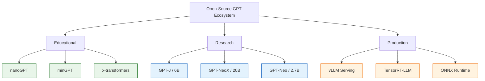

# GPT Open Source: Deep Dive Tutorial

> A comprehensive guide to understanding, building, and deploying open-source GPT implementations -- from nanoGPT to GPT-NeoX and beyond.

<div align="center">

**Open-Source GPT Architectures and Implementations**

[](https://github.com/karpathy/nanoGPT)
[](https://github.com/EleutherAI/gpt-neox)
[](https://github.com/karpathy/minGPT)

</div>

---

## What This Tutorial Covers

This tutorial provides a deep dive into the open-source GPT ecosystem. You will learn how GPT models work at every level -- from raw transformer math to production-scale inference optimization. Whether you are training a small character-level model with nanoGPT or deploying a billion-parameter model with GPT-NeoX, this guide has you covered.

### The Open-Source GPT Landscape

| Project | Parameters | Purpose | Language |
|:--------|:-----------|:--------|:---------|
| **nanoGPT** | ~124M | Educational, minimal GPT-2 reproduction | Python/PyTorch |
| **minGPT** | ~124M | Clean, readable GPT implementation | Python/PyTorch |
| **GPT-J** | 6B | Open alternative to GPT-3 | JAX/PyTorch |
| **GPT-NeoX** | 20B | Large-scale training framework | Python/PyTorch |
| **GPT-Neo** | 1.3B-2.7B | First open GPT-3 replication effort | Python/TensorFlow |
| **Cerebras-GPT** | 111M-13B | Compute-optimal GPT models | Python/PyTorch |
| **OpenLLaMA** | 3B-13B | Open reproduction of LLaMA | Python/PyTorch |



## Tutorial Structure

This tutorial is organized into 8 chapters that progressively build your understanding:

| Chapter | Title | What You Will Learn |
|:--------|:------|:--------------------|
| [Chapter 1](01-getting-started.html) | Getting Started | Open-source GPT landscape, nanoGPT setup, first training run |
| [Chapter 2](02-transformer-architecture.html) | Transformer Architecture | Self-attention, multi-head attention, feed-forward networks |
| [Chapter 3](03-tokenization-embeddings.html) | Tokenization & Embeddings | BPE, vocabulary construction, positional encodings |
| [Chapter 4](04-training-pipeline.html) | Training Pipeline | Data loading, loss computation, gradient accumulation, mixed precision |
| [Chapter 5](05-attention-mechanisms.html) | Attention Mechanisms | Causal masking, KV-cache, multi-query attention, Flash Attention |
| [Chapter 6](06-scaling-distributed-training.html) | Scaling & Distributed Training | Model parallelism, data parallelism, ZeRO, FSDP |
| [Chapter 7](07-fine-tuning-alignment.html) | Fine-Tuning & Alignment | LoRA, QLoRA, RLHF, DPO, instruction tuning |
| [Chapter 8](08-production-inference.html) | Production Inference | Quantization, batching, speculative decoding, deployment |

## Prerequisites

Before starting this tutorial, you should have:

- **Python 3.8+** with a working PyTorch installation
- **Basic understanding** of neural networks and backpropagation
- **GPU access** (recommended): NVIDIA GPU with CUDA support, or cloud GPU instance
- **Familiarity** with the command line and git

```bash
# Recommended environment setup
conda create -n gpt-oss python=3.10
conda activate gpt-oss
pip install torch torchvision torchaudio
pip install transformers datasets tiktoken wandb
```

## Quick Start

Clone nanoGPT and run your first training:

```bash
git clone https://github.com/karpathy/nanoGPT.git
cd nanoGPT
pip install -r requirements.txt

# Prepare Shakespeare dataset
python data/shakespeare_char/prepare.py

# Train a small character-level model
python train.py config/train_shakespeare_char.py
```

## Who This Tutorial Is For

- **ML Engineers** wanting to understand GPT internals beyond API calls
- **Researchers** exploring transformer architectures and training strategies
- **Students** looking for a hands-on path from theory to implementation
- **Practitioners** who need to fine-tune or deploy open-source GPT models

---

**Ready to begin? Start with [Chapter 1: Getting Started](01-getting-started.html).**

---
*Built with insights from open-source GPT implementations.*
