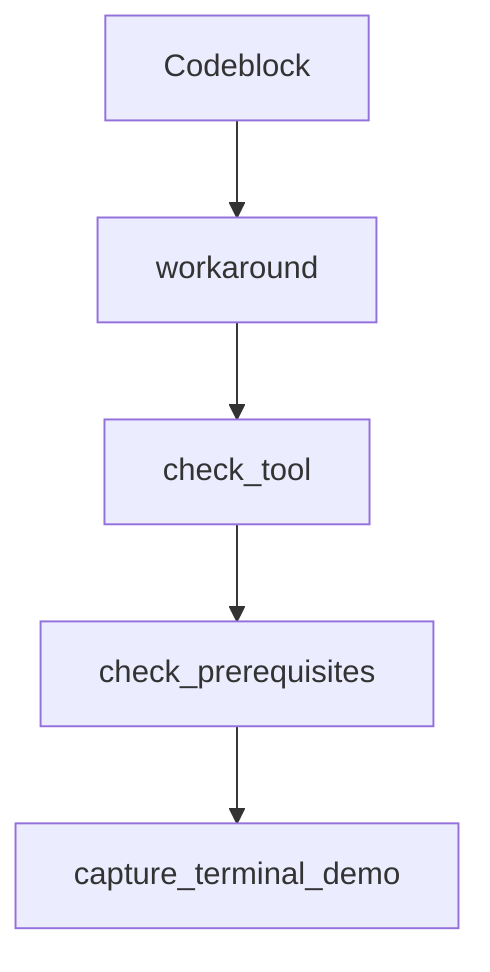

# Chapter 1: Getting Started

Welcome to **Chapter 1: Getting Started**. In this part of **gptme Tutorial: Open-Source Terminal Agent for Local Tool-Driven Work**, you will build an intuitive mental model first, then move into concrete implementation details and practical production tradeoffs.


This chapter gets gptme installed and running in a local terminal session.

## Quick Install

```bash
pipx install gptme
# or
uv tool install gptme
```

## First Run

```bash
gptme
```

If provider keys are missing, gptme prompts to configure them.

## Source References

- [gptme Getting Started](https://github.com/gptme/gptme/blob/master/docs/getting-started.rst)

## Summary

You now have gptme installed and ready for interactive local workflows.

Next: [Chapter 2: Core CLI Workflow and Prompt Patterns](02-core-cli-workflow-and-prompt-patterns.md)

## Source Code Walkthrough

### `gptme/codeblock.py`

The `Codeblock` class in [`gptme/codeblock.py`](https://github.com/gptme/gptme/blob/HEAD/gptme/codeblock.py) handles a key part of this chapter's functionality:

```py

@dataclass(frozen=True)
class Codeblock:
    lang: str
    content: str
    path: str | None = None
    start: int | None = field(default=None, compare=False)
    fence: str = field(default_factory=lambda: "```", compare=False, repr=False)

    def __post_init__(self):
        # init path if path is None and lang is pathy
        if self.path is None and self.is_filename:
            object.__setattr__(self, "path", self.lang)  # frozen dataclass workaround

    def to_markdown(self) -> str:
        return f"{self.fence}{self.lang}\n{self.content}\n{self.fence}"

    def to_xml(self) -> str:
        """Converts codeblock to XML with proper escaping."""
        # Use quoteattr for attributes to handle quotes and special chars safely
        # Use xml_escape for content to handle <, >, & characters
        path_attr = f" path={quoteattr(self.path)}" if self.path else ""
        return f"<codeblock lang={quoteattr(self.lang)}{path_attr}>\n{xml_escape(self.content)}\n</codeblock>"

    @classmethod
    @trace_function(name="codeblock.from_markdown", attributes={"component": "parser"})
    def from_markdown(cls, content: str) -> "Codeblock":
        stripped = content.strip()
        fence_len = 0

        # Handle variable-length fences (3+ backticks)
        start_match = re.match(r"^(`{3,})", stripped)
```

This class is important because it defines how gptme Tutorial: Open-Source Terminal Agent for Local Tool-Driven Work implements the patterns covered in this chapter.

### `gptme/codeblock.py`

The `workaround` class in [`gptme/codeblock.py`](https://github.com/gptme/gptme/blob/HEAD/gptme/codeblock.py) handles a key part of this chapter's functionality:

```py
        # init path if path is None and lang is pathy
        if self.path is None and self.is_filename:
            object.__setattr__(self, "path", self.lang)  # frozen dataclass workaround

    def to_markdown(self) -> str:
        return f"{self.fence}{self.lang}\n{self.content}\n{self.fence}"

    def to_xml(self) -> str:
        """Converts codeblock to XML with proper escaping."""
        # Use quoteattr for attributes to handle quotes and special chars safely
        # Use xml_escape for content to handle <, >, & characters
        path_attr = f" path={quoteattr(self.path)}" if self.path else ""
        return f"<codeblock lang={quoteattr(self.lang)}{path_attr}>\n{xml_escape(self.content)}\n</codeblock>"

    @classmethod
    @trace_function(name="codeblock.from_markdown", attributes={"component": "parser"})
    def from_markdown(cls, content: str) -> "Codeblock":
        stripped = content.strip()
        fence_len = 0

        # Handle variable-length fences (3+ backticks)
        start_match = re.match(r"^(`{3,})", stripped)
        if start_match:
            fence_len = len(start_match.group(1))
            stripped = stripped[fence_len:]

        # Check for closing fence at end - only strip if fence lengths match
        end_match = re.search(r"(`{3,})$", stripped.strip())
        if end_match:
            end_fence_len = len(end_match.group(1))
            # Only strip closing fence if it matches opening fence length (CommonMark spec)
            if fence_len == end_fence_len:
```

This class is important because it defines how gptme Tutorial: Open-Source Terminal Agent for Local Tool-Driven Work implements the patterns covered in this chapter.

### `scripts/demo_capture.py`

The `check_tool` function in [`scripts/demo_capture.py`](https://github.com/gptme/gptme/blob/HEAD/scripts/demo_capture.py) handles a key part of this chapter's functionality:

```py


def check_tool(name: str) -> bool:
    """Check if a tool is available."""
    return shutil.which(name) is not None


def check_prerequisites(modes: list[str]) -> list[str]:
    """Check required tools and return list of missing ones."""
    missing = []

    if "terminal" in modes:
        if not check_tool("asciinema"):
            missing.append("asciinema (pip install asciinema)")
        if not check_tool("gptme"):
            missing.append("gptme (pip install gptme)")

    if "screenshots" in modes or "recording" in modes:
        try:
            # Check if playwright is importable
            subprocess.run(
                [
                    sys.executable,
                    "-c",
                    "from playwright.sync_api import sync_playwright",
                ],
                capture_output=True,
                check=True,
            )
        except (subprocess.CalledProcessError, FileNotFoundError):
            missing.append(
                "playwright (pip install playwright && playwright install chromium)"
```

This function is important because it defines how gptme Tutorial: Open-Source Terminal Agent for Local Tool-Driven Work implements the patterns covered in this chapter.

### `scripts/demo_capture.py`

The `check_prerequisites` function in [`scripts/demo_capture.py`](https://github.com/gptme/gptme/blob/HEAD/scripts/demo_capture.py) handles a key part of this chapter's functionality:

```py


def check_prerequisites(modes: list[str]) -> list[str]:
    """Check required tools and return list of missing ones."""
    missing = []

    if "terminal" in modes:
        if not check_tool("asciinema"):
            missing.append("asciinema (pip install asciinema)")
        if not check_tool("gptme"):
            missing.append("gptme (pip install gptme)")

    if "screenshots" in modes or "recording" in modes:
        try:
            # Check if playwright is importable
            subprocess.run(
                [
                    sys.executable,
                    "-c",
                    "from playwright.sync_api import sync_playwright",
                ],
                capture_output=True,
                check=True,
            )
        except (subprocess.CalledProcessError, FileNotFoundError):
            missing.append(
                "playwright (pip install playwright && playwright install chromium)"
            )

        if not check_tool("gptme-server"):
            missing.append("gptme-server (pip install gptme)")

```

This function is important because it defines how gptme Tutorial: Open-Source Terminal Agent for Local Tool-Driven Work implements the patterns covered in this chapter.


## How These Components Connect


