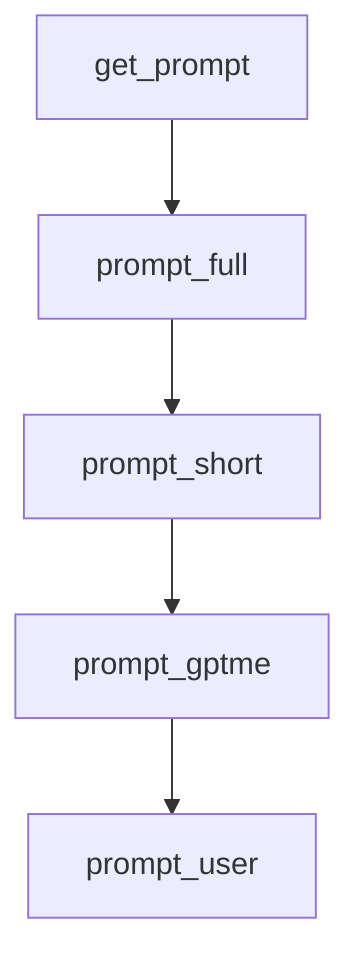

# Chapter 1: Getting Started

Welcome to **Chapter 1: Getting Started**. In this part of **gptme Tutorial: Open-Source Terminal Agent for Local Tool-Driven Work**, you will build an intuitive mental model first, then move into concrete implementation details and practical production tradeoffs.


This chapter gets gptme installed and running in a local terminal session.

## Quick Install

```bash
pipx install gptme
# or
uv tool install gptme
```

## First Run

```bash
gptme
```

If provider keys are missing, gptme prompts to configure them.

## Source References

- [gptme Getting Started](https://github.com/gptme/gptme/blob/master/docs/getting-started.rst)

## Summary

You now have gptme installed and ready for interactive local workflows.

Next: [Chapter 2: Core CLI Workflow and Prompt Patterns](02-core-cli-workflow-and-prompt-patterns.md)

## Depth Expansion Playbook

## Source Code Walkthrough

### `gptme/prompts.py`

The `get_prompt` function in [`gptme/prompts.py`](https://github.com/gptme/gptme/blob/HEAD/gptme/prompts.py) handles a key part of this chapter's functionality:

```py


def get_prompt(
    tools: list[ToolSpec],
    tool_format: ToolFormat = "markdown",
    prompt: PromptType | str = "full",
    interactive: bool = True,
    model: str | None = None,
    workspace: Path | None = None,
    agent_path: Path | None = None,
    context_mode: ContextMode | None = None,
    context_include: list[str] | None = None,
) -> list[Message]:
    """
    Get the initial system prompt.

    The prompt is assembled from several layers:

    1. **Core prompt** (always included):

       - Base gptme identity and instructions
       - User identity/preferences (interactive only, from user config ``[user]``;
         skipped in ``--non-interactive`` since no human is present)
       - Tool descriptions (when tools are loaded, controlled by ``--tools``)

    2. **Context** (controlled by ``--context``, independent of ``--non-interactive``):

       - ``files``: static files from project config (gptme.toml ``[prompt] files``)
         and user config (``~/.config/gptme/config.toml`` ``[prompt] files``).
         Both sources are merged and deduplicated.
       - ``cmd``: dynamic output of ``context_cmd`` in gptme.toml (project-level only,
         no user-level equivalent). Changes most often, least cacheable.
```

This function is important because it defines how gptme Tutorial: Open-Source Terminal Agent for Local Tool-Driven Work implements the patterns covered in this chapter.

### `gptme/prompts.py`

The `prompt_full` function in [`gptme/prompts.py`](https://github.com/gptme/gptme/blob/HEAD/gptme/prompts.py) handles a key part of this chapter's functionality:

```py
        if include_tools:
            core_msgs = list(
                prompt_full(
                    interactive,
                    tools,
                    tool_format,
                    model,
                    agent_name=agent_name,
                    workspace=workspace,
                )
            )
        else:
            # Full mode without tools
            # Note: skills summary is intentionally excluded here since skills
            # require tool access (e.g., `cat <path>`) to load on-demand
            core_msgs = list(
                prompt_gptme(interactive, model, agent_name, tool_format=tool_format)
            )
            if interactive:
                core_msgs.extend(prompt_user(tool_format=tool_format))
            core_msgs.extend(prompt_project(tool_format=tool_format))
            core_msgs.extend(prompt_systeminfo(workspace, tool_format=tool_format))
            core_msgs.extend(prompt_timeinfo(tool_format=tool_format))
    elif prompt == "short":
        if include_tools:
            core_msgs = list(
                prompt_short(interactive, tools, tool_format, agent_name=agent_name)
            )
        else:
            core_msgs = list(
                prompt_gptme(interactive, model, agent_name, tool_format=tool_format)
            )
```

This function is important because it defines how gptme Tutorial: Open-Source Terminal Agent for Local Tool-Driven Work implements the patterns covered in this chapter.

### `gptme/prompts.py`

The `prompt_short` function in [`gptme/prompts.py`](https://github.com/gptme/gptme/blob/HEAD/gptme/prompts.py) handles a key part of this chapter's functionality:

```py
        if include_tools:
            core_msgs = list(
                prompt_short(interactive, tools, tool_format, agent_name=agent_name)
            )
        else:
            core_msgs = list(
                prompt_gptme(interactive, model, agent_name, tool_format=tool_format)
            )
    else:
        core_msgs = [Message("system", prompt)]
        if tools and include_tools:
            core_msgs.extend(
                prompt_tools(tools=tools, tool_format=tool_format, model=model)
            )

    # TODO: generate context_cmd outputs separately and put them last in a "dynamic context" section
    #       with context known not to cache well across conversation starts, so that cache points can be set before and better utilized/changed less frequently.
    #       probably together with chat history since it's also dynamic/live context.
    #       as opposed to static (core/system prompt) and semi-static (workspace/project prompt, like files).

    # Generate workspace messages separately (if included)
    workspace_msgs = (
        list(prompt_workspace(workspace, include_context_cmd=include_context_cmd))
        if include_workspace and workspace and workspace != agent_path
        else []
    )

    # Agent config workspace (separate from project, only with --agent-path)
    agent_config_msgs = (
        list(
            prompt_workspace(
                agent_path,
```

This function is important because it defines how gptme Tutorial: Open-Source Terminal Agent for Local Tool-Driven Work implements the patterns covered in this chapter.

### `gptme/prompts.py`

The `prompt_gptme` function in [`gptme/prompts.py`](https://github.com/gptme/gptme/blob/HEAD/gptme/prompts.py) handles a key part of this chapter's functionality:

```py
        # Selective mode with no tools loaded: base prompt only
        core_msgs = list(
            prompt_gptme(interactive, model, agent_name, tool_format=tool_format)
        )
    elif prompt == "full":
        if include_tools:
            core_msgs = list(
                prompt_full(
                    interactive,
                    tools,
                    tool_format,
                    model,
                    agent_name=agent_name,
                    workspace=workspace,
                )
            )
        else:
            # Full mode without tools
            # Note: skills summary is intentionally excluded here since skills
            # require tool access (e.g., `cat <path>`) to load on-demand
            core_msgs = list(
                prompt_gptme(interactive, model, agent_name, tool_format=tool_format)
            )
            if interactive:
                core_msgs.extend(prompt_user(tool_format=tool_format))
            core_msgs.extend(prompt_project(tool_format=tool_format))
            core_msgs.extend(prompt_systeminfo(workspace, tool_format=tool_format))
            core_msgs.extend(prompt_timeinfo(tool_format=tool_format))
    elif prompt == "short":
        if include_tools:
            core_msgs = list(
                prompt_short(interactive, tools, tool_format, agent_name=agent_name)
```

This function is important because it defines how gptme Tutorial: Open-Source Terminal Agent for Local Tool-Driven Work implements the patterns covered in this chapter.


## How These Components Connect


