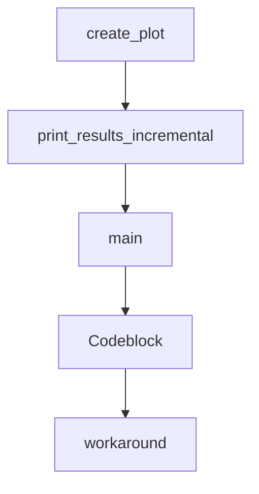

# Chapter 2: Core CLI Workflow and Prompt Patterns

Welcome to **Chapter 2: Core CLI Workflow and Prompt Patterns**. In this part of **gptme Tutorial: Open-Source Terminal Agent for Local Tool-Driven Work**, you will build an intuitive mental model first, then move into concrete implementation details and practical production tradeoffs.


gptme supports direct prompt invocation, chained prompts, and resumed sessions for iterative development.

## Workflow Patterns

| Pattern | Example |
|:--------|:--------|
| interactive | `gptme` |
| single prompt | `gptme "summarize this" README.md` |
| chained prompts | `gptme "make a change" - "test it" - "commit it"` |
| resume session | `gptme -r` |

## Practical Guidance

Use chained prompts to enforce staged execution (change -> test -> commit) instead of single broad prompts.

## Source References

- [gptme README usage examples](https://github.com/gptme/gptme/blob/master/README.md)
- [CLI entrypoint options](https://github.com/gptme/gptme/blob/master/gptme/cli/main.py)

## Summary

You now know how to structure repeatable prompt flows and resume long-running conversations.

Next: [Chapter 3: Tooling and Local Execution Boundaries](03-tooling-and-local-execution-boundaries.md)

## Depth Expansion Playbook

## Source Code Walkthrough

### `scripts/analyze_compression.py`

The `create_plot` function in [`scripts/analyze_compression.py`](https://github.com/gptme/gptme/blob/HEAD/scripts/analyze_compression.py) handles a key part of this chapter's functionality:

```py


def create_plot(distribution: dict, output_file: str = "compression_distribution.png"):
    """Create matplotlib plot of distribution."""
    try:
        import matplotlib.pyplot as plt  # type: ignore[import-not-found]
        import numpy as np  # type: ignore[import-not-found]
    except ImportError:
        print("Note: Install matplotlib for plot generation: pip install matplotlib")
        return

    buckets = distribution["buckets"]
    bucket_names = list(buckets.keys())
    counts = [len(buckets[name]) for name in bucket_names]

    # Create figure
    fig, (ax1, ax2) = plt.subplots(1, 2, figsize=(14, 6))

    # Histogram
    colors = [
        "red" if i < 3 else "orange" if i < 5 else "green"
        for i in range(len(bucket_names))
    ]
    ax1.bar(range(len(bucket_names)), counts, color=colors, alpha=0.7)
    ax1.set_xlabel("Novelty Ratio")
    ax1.set_ylabel("Message Count")
    ax1.set_title("Distribution of Information Novelty")
    ax1.set_xticks(range(len(bucket_names)))
    ax1.set_xticklabels(bucket_names, rotation=45, ha="right")
    ax1.grid(axis="y", alpha=0.3)

    # Add classification zones
```

This function is important because it defines how gptme Tutorial: Open-Source Terminal Agent for Local Tool-Driven Work implements the patterns covered in this chapter.

### `scripts/analyze_compression.py`

The `print_results_incremental` function in [`scripts/analyze_compression.py`](https://github.com/gptme/gptme/blob/HEAD/scripts/analyze_compression.py) handles a key part of this chapter's functionality:

```py


def print_results_incremental(
    results: dict, detailed: bool = False, plot: bool = False
):
    """Print incremental compression analysis results."""
    stats = results["overall_stats"]

    print("=" * 80)
    print("INCREMENTAL COMPRESSION ANALYSIS RESULTS")
    print("=" * 80)
    print()

    # Overall statistics
    print("Overall Statistics:")
    print(f"  Total conversations analyzed: {stats['total_conversations']}")
    print(f"  Total messages: {stats['total_messages']}")
    print(f"  Average novelty ratio: {stats['avg_novelty_ratio']:.3f}")
    print(f"  Low novelty messages (ratio < 0.3): {stats['low_novelty_messages']}")
    print(f"  High novelty messages (ratio > 0.7): {stats['high_novelty_messages']}")
    print()

    # By role statistics
    print("Information Novelty by Role:")
    for role, data in sorted(results["by_role"].items()):
        avg_ratio = data["total_ratio"] / data["count"] if data["count"] > 0 else 0
        print(f"  {role:12s}: {avg_ratio:.3f} (n={data['count']:,})")
    print()

    # Distribution analysis
    distribution = analyze_distribution(results)
    if distribution:
```

This function is important because it defines how gptme Tutorial: Open-Source Terminal Agent for Local Tool-Driven Work implements the patterns covered in this chapter.

### `scripts/analyze_compression.py`

The `main` function in [`scripts/analyze_compression.py`](https://github.com/gptme/gptme/blob/HEAD/scripts/analyze_compression.py) handles a key part of this chapter's functionality:

```py


def main():
    parser = argparse.ArgumentParser(
        description="Analyze compression ratios of conversation logs"
    )
    parser.add_argument(
        "--limit",
        type=int,
        default=100,
        help="Maximum number of conversations to analyze (default: 100)",
    )
    parser.add_argument(
        "--verbose", "-v", action="store_true", help="Show verbose output"
    )
    parser.add_argument(
        "--detailed", "-d", action="store_true", help="Show detailed results"
    )
    parser.add_argument(
        "--incremental",
        "-i",
        action="store_true",
        help="Use incremental compression analysis (measures marginal information contribution)",
    )
    parser.add_argument(
        "--plot",
        "-p",
        action="store_true",
        help="Generate matplotlib plot of distribution (requires matplotlib)",
    )

    args = parser.parse_args()
```

This function is important because it defines how gptme Tutorial: Open-Source Terminal Agent for Local Tool-Driven Work implements the patterns covered in this chapter.

### `gptme/codeblock.py`

The `Codeblock` class in [`gptme/codeblock.py`](https://github.com/gptme/gptme/blob/HEAD/gptme/codeblock.py) handles a key part of this chapter's functionality:

```py

@dataclass(frozen=True)
class Codeblock:
    lang: str
    content: str
    path: str | None = None
    start: int | None = field(default=None, compare=False)

    def __post_init__(self):
        # init path if path is None and lang is pathy
        if self.path is None and self.is_filename:
            object.__setattr__(self, "path", self.lang)  # frozen dataclass workaround

    def to_markdown(self) -> str:
        return f"```{self.lang}\n{self.content}\n```"

    def to_xml(self) -> str:
        """Converts codeblock to XML with proper escaping."""
        # Use quoteattr for attributes to handle quotes and special chars safely
        # Use xml_escape for content to handle <, >, & characters
        path_attr = f" path={quoteattr(self.path)}" if self.path else ""
        return f"<codeblock lang={quoteattr(self.lang)}{path_attr}>\n{xml_escape(self.content)}\n</codeblock>"

    @classmethod
    @trace_function(name="codeblock.from_markdown", attributes={"component": "parser"})
    def from_markdown(cls, content: str) -> "Codeblock":
        stripped = content.strip()
        fence_len = 0

        # Handle variable-length fences (3+ backticks)
        start_match = re.match(r"^(`{3,})", stripped)
        if start_match:
```

This class is important because it defines how gptme Tutorial: Open-Source Terminal Agent for Local Tool-Driven Work implements the patterns covered in this chapter.


## How These Components Connect


