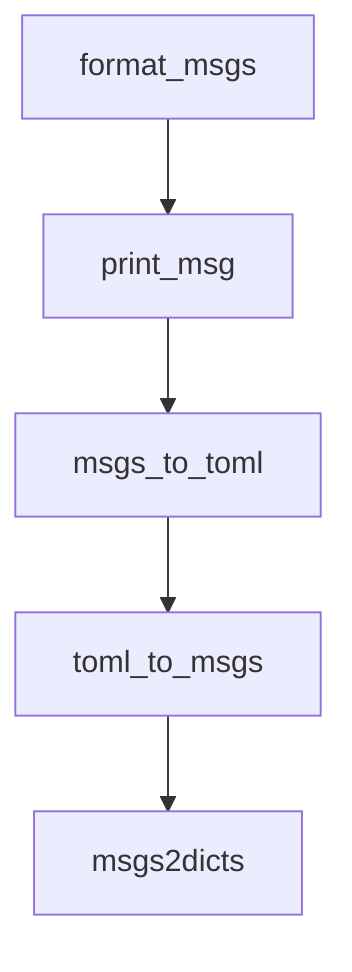

# Chapter 2: Core CLI Workflow and Prompt Patterns

Welcome to **Chapter 2: Core CLI Workflow and Prompt Patterns**. In this part of **gptme Tutorial: Open-Source Terminal Agent for Local Tool-Driven Work**, you will build an intuitive mental model first, then move into concrete implementation details and practical production tradeoffs.


gptme supports direct prompt invocation, chained prompts, and resumed sessions for iterative development.

## Workflow Patterns

| Pattern | Example |
|:--------|:--------|
| interactive | `gptme` |
| single prompt | `gptme "summarize this" README.md` |
| chained prompts | `gptme "make a change" - "test it" - "commit it"` |
| resume session | `gptme -r` |

## Practical Guidance

Use chained prompts to enforce staged execution (change -> test -> commit) instead of single broad prompts.

## Source References

- [gptme README usage examples](https://github.com/gptme/gptme/blob/master/README.md)
- [CLI entrypoint options](https://github.com/gptme/gptme/blob/master/gptme/cli/main.py)

## Summary

You now know how to structure repeatable prompt flows and resume long-running conversations.

Next: [Chapter 3: Tooling and Local Execution Boundaries](03-tooling-and-local-execution-boundaries.md)

## Source Code Walkthrough

### `gptme/message.py`

The `format_msgs` function in [`gptme/message.py`](https://github.com/gptme/gptme/blob/HEAD/gptme/message.py) handles a key part of this chapter's functionality:

```py
                content += "..."
            temp_msg = self.replace(content=content)
            return format_msgs([temp_msg], oneline=True, highlight=highlight)[0]
        return format_msgs([self], oneline=oneline, highlight=highlight)[0]

    def print(self, oneline: bool = False, highlight: bool = True) -> None:
        print_msg(self, oneline=oneline, highlight=highlight)

    def to_toml(self) -> str:
        """Converts a message to a TOML string, for easy editing by hand in editor to then be parsed back."""
        flags = []
        if self.pinned:
            flags.append("pinned")
        if self.hide:
            flags.append("hide")
        flags_toml = "\n".join(f"{flag} = true" for flag in flags)
        # Use proper TOML array syntax with escaped strings (not Python repr)
        if self.files:
            escaped_files = ", ".join(f'"{escape_string(str(f))}"' for f in self.files)
            files_toml = f"files = [{escaped_files}]"
        else:
            files_toml = ""
        # Serialize file_hashes as TOML inline table with proper escaping
        if self.file_hashes:
            items = ", ".join(
                f'"{escape_string(k)}" = "{escape_string(v)}"'
                for k, v in self.file_hashes.items()
            )
            file_hashes_toml = f"file_hashes = {{ {items} }}"
        else:
            file_hashes_toml = ""
        # Serialize metadata as TOML inline table if present
```

This function is important because it defines how gptme Tutorial: Open-Source Terminal Agent for Local Tool-Driven Work implements the patterns covered in this chapter.

### `gptme/message.py`

The `print_msg` function in [`gptme/message.py`](https://github.com/gptme/gptme/blob/HEAD/gptme/message.py) handles a key part of this chapter's functionality:

```py

    def print(self, oneline: bool = False, highlight: bool = True) -> None:
        print_msg(self, oneline=oneline, highlight=highlight)

    def to_toml(self) -> str:
        """Converts a message to a TOML string, for easy editing by hand in editor to then be parsed back."""
        flags = []
        if self.pinned:
            flags.append("pinned")
        if self.hide:
            flags.append("hide")
        flags_toml = "\n".join(f"{flag} = true" for flag in flags)
        # Use proper TOML array syntax with escaped strings (not Python repr)
        if self.files:
            escaped_files = ", ".join(f'"{escape_string(str(f))}"' for f in self.files)
            files_toml = f"files = [{escaped_files}]"
        else:
            files_toml = ""
        # Serialize file_hashes as TOML inline table with proper escaping
        if self.file_hashes:
            items = ", ".join(
                f'"{escape_string(k)}" = "{escape_string(v)}"'
                for k, v in self.file_hashes.items()
            )
            file_hashes_toml = f"file_hashes = {{ {items} }}"
        else:
            file_hashes_toml = ""
        # Serialize metadata as TOML inline table if present
        if self.metadata:
            metadata_toml = _format_metadata_toml(self.metadata)
        else:
            metadata_toml = ""
```

This function is important because it defines how gptme Tutorial: Open-Source Terminal Agent for Local Tool-Driven Work implements the patterns covered in this chapter.

### `gptme/message.py`

The `msgs_to_toml` function in [`gptme/message.py`](https://github.com/gptme/gptme/blob/HEAD/gptme/message.py) handles a key part of this chapter's functionality:

```py


def msgs_to_toml(msgs: Iterable[Message]) -> str:
    """Converts a list of messages to a TOML string, for easy editing by hand in editor to then be parsed back."""
    t = ""
    for msg in msgs:
        t += msg.to_toml().replace("[message]", "[[messages]]") + "\n\n"

    return t


def _fix_toml_content(content: str) -> str:
    """
    Remove exactly one trailing newline that TOML multiline format adds.

    TOML multiline strings (using triple quotes) add a newline before the
    closing delimiter. This function removes that artifact while preserving
    all other whitespace.
    """
    content = content.removesuffix("\n")
    return content


def toml_to_msgs(toml: str) -> list[Message]:
    """
    Converts a TOML string to a list of messages.

    The string can be a whole file with multiple [[messages]].
    """
    t = tomlkit.parse(toml)
    assert "messages" in t and isinstance(t["messages"], list)
    msgs: list[dict] = t["messages"]
```

This function is important because it defines how gptme Tutorial: Open-Source Terminal Agent for Local Tool-Driven Work implements the patterns covered in this chapter.

### `gptme/message.py`

The `toml_to_msgs` function in [`gptme/message.py`](https://github.com/gptme/gptme/blob/HEAD/gptme/message.py) handles a key part of this chapter's functionality:

```py


def toml_to_msgs(toml: str) -> list[Message]:
    """
    Converts a TOML string to a list of messages.

    The string can be a whole file with multiple [[messages]].
    """
    t = tomlkit.parse(toml)
    assert "messages" in t and isinstance(t["messages"], list)
    msgs: list[dict] = t["messages"]

    return [
        Message(
            msg["role"],
            _fix_toml_content(msg["content"]),
            pinned=msg.get("pinned", False),
            hide=msg.get("hide", False),
            timestamp=isoparse(msg["timestamp"]),
            files=[parse_file_reference(f) for f in msg.get("files", [])],
            file_hashes=dict(msg.get("file_hashes", {})),
            call_id=msg.get("call_id"),
            metadata=_migrate_metadata(dict(msg["metadata"]))
            if msg.get("metadata")
            else None,
        )
        for msg in msgs
    ]


def msgs2dicts(msgs: list[Message]) -> list[dict]:
    """Convert a list of Message objects to a list of dicts ready to pass to an LLM."""
```

This function is important because it defines how gptme Tutorial: Open-Source Terminal Agent for Local Tool-Driven Work implements the patterns covered in this chapter.


## How These Components Connect


