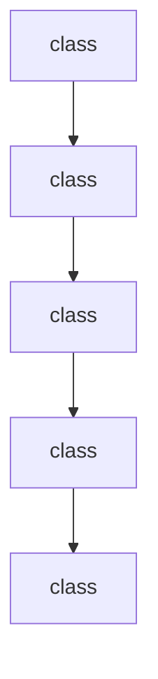

# Chapter 3: Tooling and Local Execution Boundaries

Welcome to **Chapter 3: Tooling and Local Execution Boundaries**. In this part of **gptme Tutorial: Open-Source Terminal Agent for Local Tool-Driven Work**, you will build an intuitive mental model first, then move into concrete implementation details and practical production tradeoffs.


gptme exposes tools for file editing, shell execution, web browsing, and more inside a local execution loop.

## Tooling Coverage

- shell and code execution
- file read/write/patch workflows
- web and browser access
- vision and multimodal context

## Boundary Strategy

- explicitly constrain tool allowlists for risky environments
- keep default confirmations enabled outside trusted automation jobs
- validate side effects with standard test/build commands

## Source References

- [gptme README: features and tools](https://github.com/gptme/gptme/blob/master/README.md)
- [Custom tool config docs](https://github.com/gptme/gptme/blob/master/docs/custom_tool.rst)

## Summary

You now understand how gptme's local tool loop works and how to control risk boundaries.

Next: [Chapter 4: Configuration Layers and Environment Strategy](04-configuration-layers-and-environment-strategy.md)

## Depth Expansion Playbook

## Source Code Walkthrough

### `gptme/config.py`

The `class` class in [`gptme/config.py`](https://github.com/gptme/gptme/blob/HEAD/gptme/config.py) handles a key part of this chapter's functionality:

```py
import tempfile
from contextvars import ContextVar
from dataclasses import (
    asdict,
    dataclass,
    field,
    replace,
)
from functools import lru_cache
from pathlib import Path
from typing import TYPE_CHECKING, cast

import tomlkit
from tomlkit import TOMLDocument
from tomlkit.exceptions import TOMLKitError
from typing_extensions import Self

from .context.config import ContextConfig
from .context.selector.config import ContextSelectorConfig
from .tools import get_toolchain
from .util import path_with_tilde

if TYPE_CHECKING:
    from tomlkit.container import Container

    from .tools.base import ToolFormat

logger = logging.getLogger(__name__)


@dataclass
class PluginsConfig:
```

This class is important because it defines how gptme Tutorial: Open-Source Terminal Agent for Local Tool-Driven Work implements the patterns covered in this chapter.

### `gptme/config.py`

The `class` class in [`gptme/config.py`](https://github.com/gptme/gptme/blob/HEAD/gptme/config.py) handles a key part of this chapter's functionality:

```py
import tempfile
from contextvars import ContextVar
from dataclasses import (
    asdict,
    dataclass,
    field,
    replace,
)
from functools import lru_cache
from pathlib import Path
from typing import TYPE_CHECKING, cast

import tomlkit
from tomlkit import TOMLDocument
from tomlkit.exceptions import TOMLKitError
from typing_extensions import Self

from .context.config import ContextConfig
from .context.selector.config import ContextSelectorConfig
from .tools import get_toolchain
from .util import path_with_tilde

if TYPE_CHECKING:
    from tomlkit.container import Container

    from .tools.base import ToolFormat

logger = logging.getLogger(__name__)


@dataclass
class PluginsConfig:
```

This class is important because it defines how gptme Tutorial: Open-Source Terminal Agent for Local Tool-Driven Work implements the patterns covered in this chapter.

### `gptme/config.py`

The `class` class in [`gptme/config.py`](https://github.com/gptme/gptme/blob/HEAD/gptme/config.py) handles a key part of this chapter's functionality:

```py
import tempfile
from contextvars import ContextVar
from dataclasses import (
    asdict,
    dataclass,
    field,
    replace,
)
from functools import lru_cache
from pathlib import Path
from typing import TYPE_CHECKING, cast

import tomlkit
from tomlkit import TOMLDocument
from tomlkit.exceptions import TOMLKitError
from typing_extensions import Self

from .context.config import ContextConfig
from .context.selector.config import ContextSelectorConfig
from .tools import get_toolchain
from .util import path_with_tilde

if TYPE_CHECKING:
    from tomlkit.container import Container

    from .tools.base import ToolFormat

logger = logging.getLogger(__name__)


@dataclass
class PluginsConfig:
```

This class is important because it defines how gptme Tutorial: Open-Source Terminal Agent for Local Tool-Driven Work implements the patterns covered in this chapter.

### `gptme/config.py`

The `class` class in [`gptme/config.py`](https://github.com/gptme/gptme/blob/HEAD/gptme/config.py) handles a key part of this chapter's functionality:

```py
import tempfile
from contextvars import ContextVar
from dataclasses import (
    asdict,
    dataclass,
    field,
    replace,
)
from functools import lru_cache
from pathlib import Path
from typing import TYPE_CHECKING, cast

import tomlkit
from tomlkit import TOMLDocument
from tomlkit.exceptions import TOMLKitError
from typing_extensions import Self

from .context.config import ContextConfig
from .context.selector.config import ContextSelectorConfig
from .tools import get_toolchain
from .util import path_with_tilde

if TYPE_CHECKING:
    from tomlkit.container import Container

    from .tools.base import ToolFormat

logger = logging.getLogger(__name__)


@dataclass
class PluginsConfig:
```

This class is important because it defines how gptme Tutorial: Open-Source Terminal Agent for Local Tool-Driven Work implements the patterns covered in this chapter.


## How These Components Connect


