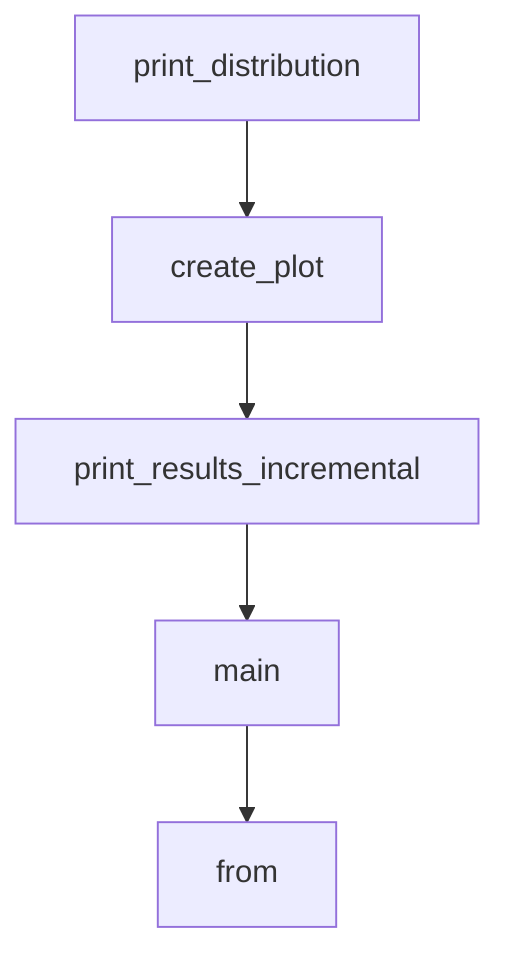

# Chapter 3: Tooling and Local Execution Boundaries

Welcome to **Chapter 3: Tooling and Local Execution Boundaries**. In this part of **gptme Tutorial: Open-Source Terminal Agent for Local Tool-Driven Work**, you will build an intuitive mental model first, then move into concrete implementation details and practical production tradeoffs.


gptme exposes tools for file editing, shell execution, web browsing, and more inside a local execution loop.

## Tooling Coverage

- shell and code execution
- file read/write/patch workflows
- web and browser access
- vision and multimodal context

## Boundary Strategy

- explicitly constrain tool allowlists for risky environments
- keep default confirmations enabled outside trusted automation jobs
- validate side effects with standard test/build commands

## Source References

- [gptme README: features and tools](https://github.com/gptme/gptme/blob/master/README.md)
- [Custom tool config docs](https://github.com/gptme/gptme/blob/master/docs/custom_tool.rst)

## Summary

You now understand how gptme's local tool loop works and how to control risk boundaries.

Next: [Chapter 4: Configuration Layers and Environment Strategy](04-configuration-layers-and-environment-strategy.md)

## Source Code Walkthrough

### `scripts/analyze_compression.py`

The `print_distribution` function in [`scripts/analyze_compression.py`](https://github.com/gptme/gptme/blob/HEAD/scripts/analyze_compression.py) handles a key part of this chapter's functionality:

```py


def print_distribution(distribution: dict):
    """Print distribution as ASCII histogram."""
    if not distribution:
        return

    print("=" * 80)
    print("REDUNDANCY DISTRIBUTION")
    print("=" * 80)
    print()

    buckets = distribution["buckets"]
    total = distribution["total"]
    max_count = max(len(v) for v in buckets.values())

    print(f"Total messages analyzed: {total}")
    print(f"Range: {distribution['min']:.3f} - {distribution['max']:.3f}")
    print(f"Median: {distribution['median']:.3f}")
    print()

    # ASCII histogram
    print("Distribution (novelty ratio):")
    print()

    for bucket_name, ratios in buckets.items():
        count = len(ratios)
        pct = (count / total * 100) if total > 0 else 0

        # Create bar (max 50 chars)
        bar_len = int((count / max_count) * 50) if max_count > 0 else 0
        bar = "█" * bar_len
```

This function is important because it defines how gptme Tutorial: Open-Source Terminal Agent for Local Tool-Driven Work implements the patterns covered in this chapter.

### `scripts/analyze_compression.py`

The `create_plot` function in [`scripts/analyze_compression.py`](https://github.com/gptme/gptme/blob/HEAD/scripts/analyze_compression.py) handles a key part of this chapter's functionality:

```py


def create_plot(distribution: dict, output_file: str = "compression_distribution.png"):
    """Create matplotlib plot of distribution."""
    try:
        import matplotlib.pyplot as plt  # type: ignore[import-not-found]
        import numpy as np  # type: ignore[import-not-found]
    except ImportError:
        print("Note: Install matplotlib for plot generation: pip install matplotlib")
        return

    buckets = distribution["buckets"]
    bucket_names = list(buckets.keys())
    counts = [len(buckets[name]) for name in bucket_names]

    # Create figure
    fig, (ax1, ax2) = plt.subplots(1, 2, figsize=(14, 6))

    # Histogram
    colors = [
        "red" if i < 3 else "orange" if i < 5 else "green"
        for i in range(len(bucket_names))
    ]
    ax1.bar(range(len(bucket_names)), counts, color=colors, alpha=0.7)
    ax1.set_xlabel("Novelty Ratio")
    ax1.set_ylabel("Message Count")
    ax1.set_title("Distribution of Information Novelty")
    ax1.set_xticks(range(len(bucket_names)))
    ax1.set_xticklabels(bucket_names, rotation=45, ha="right")
    ax1.grid(axis="y", alpha=0.3)

    # Add classification zones
```

This function is important because it defines how gptme Tutorial: Open-Source Terminal Agent for Local Tool-Driven Work implements the patterns covered in this chapter.

### `scripts/analyze_compression.py`

The `print_results_incremental` function in [`scripts/analyze_compression.py`](https://github.com/gptme/gptme/blob/HEAD/scripts/analyze_compression.py) handles a key part of this chapter's functionality:

```py


def print_results_incremental(
    results: dict, detailed: bool = False, plot: bool = False
):
    """Print incremental compression analysis results."""
    stats = results["overall_stats"]

    print("=" * 80)
    print("INCREMENTAL COMPRESSION ANALYSIS RESULTS")
    print("=" * 80)
    print()

    # Overall statistics
    print("Overall Statistics:")
    print(f"  Total conversations analyzed: {stats['total_conversations']}")
    print(f"  Total messages: {stats['total_messages']}")
    print(f"  Average novelty ratio: {stats['avg_novelty_ratio']:.3f}")
    print(f"  Low novelty messages (ratio < 0.3): {stats['low_novelty_messages']}")
    print(f"  High novelty messages (ratio > 0.7): {stats['high_novelty_messages']}")
    print()

    # By role statistics
    print("Information Novelty by Role:")
    for role, data in sorted(results["by_role"].items()):
        avg_ratio = data["total_ratio"] / data["count"] if data["count"] > 0 else 0
        print(f"  {role:12s}: {avg_ratio:.3f} (n={data['count']:,})")
    print()

    # Distribution analysis
    distribution = analyze_distribution(results)
    if distribution:
```

This function is important because it defines how gptme Tutorial: Open-Source Terminal Agent for Local Tool-Driven Work implements the patterns covered in this chapter.

### `scripts/analyze_compression.py`

The `main` function in [`scripts/analyze_compression.py`](https://github.com/gptme/gptme/blob/HEAD/scripts/analyze_compression.py) handles a key part of this chapter's functionality:

```py


def main():
    parser = argparse.ArgumentParser(
        description="Analyze compression ratios of conversation logs"
    )
    parser.add_argument(
        "--limit",
        type=int,
        default=100,
        help="Maximum number of conversations to analyze (default: 100)",
    )
    parser.add_argument(
        "--verbose", "-v", action="store_true", help="Show verbose output"
    )
    parser.add_argument(
        "--detailed", "-d", action="store_true", help="Show detailed results"
    )
    parser.add_argument(
        "--incremental",
        "-i",
        action="store_true",
        help="Use incremental compression analysis (measures marginal information contribution)",
    )
    parser.add_argument(
        "--plot",
        "-p",
        action="store_true",
        help="Generate matplotlib plot of distribution (requires matplotlib)",
    )

    args = parser.parse_args()
```

This function is important because it defines how gptme Tutorial: Open-Source Terminal Agent for Local Tool-Driven Work implements the patterns covered in this chapter.


## How These Components Connect


