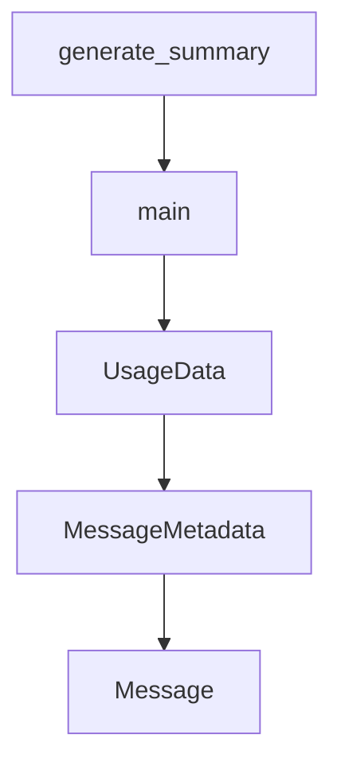

# Chapter 4: Configuration Layers and Environment Strategy

Welcome to **Chapter 4: Configuration Layers and Environment Strategy**. In this part of **gptme Tutorial: Open-Source Terminal Agent for Local Tool-Driven Work**, you will build an intuitive mental model first, then move into concrete implementation details and practical production tradeoffs.


gptme uses layered configuration across global, project, and chat scopes, with environment variables taking precedence.

## Config Layers

| Layer | Typical File |
|:------|:-------------|
| global | `~/.config/gptme/config.toml` |
| project | `gptme.toml` |
| per-chat | chat log `config.toml` |
| local overrides | `config.local.toml`, `gptme.local.toml` |

## Environment Policy

Use env vars for secrets and per-environment overrides; keep reusable behavior in versioned config files.

## Source References

- [gptme config docs](https://github.com/gptme/gptme/blob/master/docs/config.rst)

## Summary

You now have a deterministic strategy for managing gptme configuration across environments.

Next: [Chapter 5: Context, Lessons, and Conversation Management](05-context-lessons-and-conversation-management.md)

## Depth Expansion Playbook

## Source Code Walkthrough

### `scripts/demo_capture.py`

The `generate_summary` function in [`scripts/demo_capture.py`](https://github.com/gptme/gptme/blob/HEAD/scripts/demo_capture.py) handles a key part of this chapter's functionality:

```py


def generate_summary(output_dir: Path, results: dict[str, list[Path | None]]) -> Path:
    """Generate a summary JSON of captured assets."""
    assets: dict[str, list[dict[str, str | int]]] = {}

    for mode, files in results.items():
        assets[mode] = []
        for f in files:
            if f and f.exists():
                assets[mode].append(
                    {
                        "name": f.name,
                        "path": str(f),
                        "size_bytes": f.stat().st_size,
                    }
                )

    summary: dict[str, object] = {
        "generated_at": time.strftime("%Y-%m-%dT%H:%M:%SZ", time.gmtime()),
        "assets": assets,
    }

    summary_path = output_dir / "summary.json"
    with open(summary_path, "w") as fh:
        json.dump(summary, fh, indent=2)

    print(f"\nSummary written to: {summary_path}")
    return summary_path


def main():
```

This function is important because it defines how gptme Tutorial: Open-Source Terminal Agent for Local Tool-Driven Work implements the patterns covered in this chapter.

### `scripts/demo_capture.py`

The `main` function in [`scripts/demo_capture.py`](https://github.com/gptme/gptme/blob/HEAD/scripts/demo_capture.py) handles a key part of this chapter's functionality:

```py


def main():
    parser = argparse.ArgumentParser(
        description="Capture gptme demos: terminal recordings, WebUI screenshots, and screen recordings."
    )
    parser.add_argument("--all", action="store_true", help="Run all capture modes")
    parser.add_argument(
        "--terminal", action="store_true", help="Record terminal demos with asciinema"
    )
    parser.add_argument(
        "--screenshots", action="store_true", help="Capture WebUI screenshots"
    )
    parser.add_argument(
        "--recording", action="store_true", help="Record WebUI interaction video"
    )
    parser.add_argument(
        "--output-dir",
        type=Path,
        default=DEFAULT_OUTPUT_DIR,
        help=f"Output directory (default: {DEFAULT_OUTPUT_DIR})",
    )
    parser.add_argument(
        "--server-url", default="http://localhost:5701", help="WebUI server URL"
    )
    parser.add_argument(
        "--list-demos", action="store_true", help="List available terminal demos"
    )
    parser.add_argument(
        "--model",
        default=None,
        help="Model to use for gptme (e.g. openrouter/anthropic/claude-sonnet-4-6)",
```

This function is important because it defines how gptme Tutorial: Open-Source Terminal Agent for Local Tool-Driven Work implements the patterns covered in this chapter.

### `gptme/message.py`

The `UsageData` class in [`gptme/message.py`](https://github.com/gptme/gptme/blob/HEAD/gptme/message.py) handles a key part of this chapter's functionality:

```py


class UsageData(TypedDict, total=False):
    """Token usage data from LLM API responses.

    Nested under ``usage`` in :class:`MessageMetadata` to mirror the structure
    returned by LLM provider APIs (Anthropic, OpenAI, etc.).
    """

    input_tokens: int
    output_tokens: int
    cache_read_tokens: int
    cache_creation_tokens: int


class MessageMetadata(TypedDict, total=False):
    """
    Metadata stored with each message.

    All fields are optional for compact storage - only non-None values are serialized.

    Token/cost fields are populated for assistant messages when telemetry is enabled.

    Token counts are nested under ``usage`` to match LLM API response structure::

        {
            "model": "claude-sonnet",
            "cost": 0.005,
            "usage": {
                "input_tokens": 100,
                "output_tokens": 50,
                "cache_read_tokens": 80,
```

This class is important because it defines how gptme Tutorial: Open-Source Terminal Agent for Local Tool-Driven Work implements the patterns covered in this chapter.

### `gptme/message.py`

The `MessageMetadata` class in [`gptme/message.py`](https://github.com/gptme/gptme/blob/HEAD/gptme/message.py) handles a key part of this chapter's functionality:

```py
    """Token usage data from LLM API responses.

    Nested under ``usage`` in :class:`MessageMetadata` to mirror the structure
    returned by LLM provider APIs (Anthropic, OpenAI, etc.).
    """

    input_tokens: int
    output_tokens: int
    cache_read_tokens: int
    cache_creation_tokens: int


class MessageMetadata(TypedDict, total=False):
    """
    Metadata stored with each message.

    All fields are optional for compact storage - only non-None values are serialized.

    Token/cost fields are populated for assistant messages when telemetry is enabled.

    Token counts are nested under ``usage`` to match LLM API response structure::

        {
            "model": "claude-sonnet",
            "cost": 0.005,
            "usage": {
                "input_tokens": 100,
                "output_tokens": 50,
                "cache_read_tokens": 80,
                "cache_creation_tokens": 10,
            }
        }
```

This class is important because it defines how gptme Tutorial: Open-Source Terminal Agent for Local Tool-Driven Work implements the patterns covered in this chapter.


## How These Components Connect


