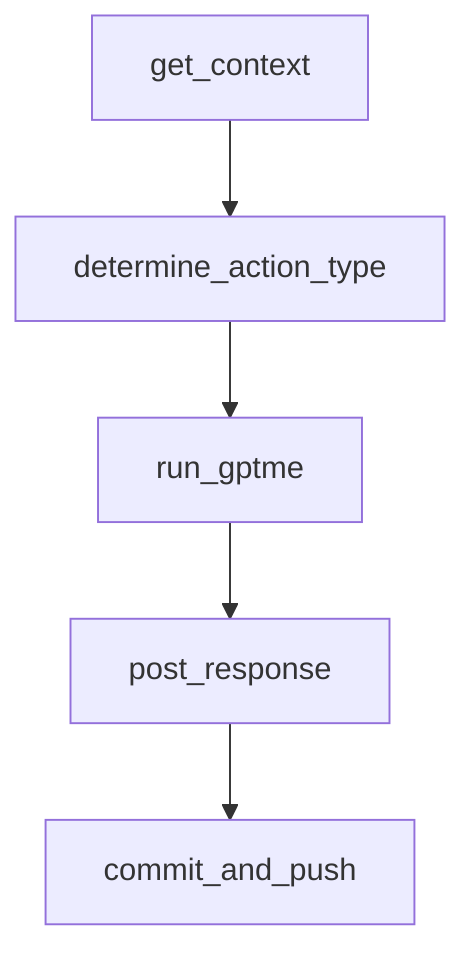

# Chapter 4: Configuration Layers and Environment Strategy

Welcome to **Chapter 4: Configuration Layers and Environment Strategy**. In this part of **gptme Tutorial: Open-Source Terminal Agent for Local Tool-Driven Work**, you will build an intuitive mental model first, then move into concrete implementation details and practical production tradeoffs.


gptme uses layered configuration across global, project, and chat scopes, with environment variables taking precedence.

## Config Layers

| Layer | Typical File |
|:------|:-------------|
| global | `~/.config/gptme/config.toml` |
| project | `gptme.toml` |
| per-chat | chat log `config.toml` |
| local overrides | `config.local.toml`, `gptme.local.toml` |

## Environment Policy

Use env vars for secrets and per-environment overrides; keep reusable behavior in versioned config files.

## Source References

- [gptme config docs](https://github.com/gptme/gptme/blob/master/docs/config.rst)

## Summary

You now have a deterministic strategy for managing gptme configuration across environments.

Next: [Chapter 5: Context, Lessons, and Conversation Management](05-context-lessons-and-conversation-management.md)

## Source Code Walkthrough

### `scripts/github_bot.py`

The `get_context` function in [`scripts/github_bot.py`](https://github.com/gptme/gptme/blob/HEAD/scripts/github_bot.py) handles a key part of this chapter's functionality:

```py


def get_context(
    repository: str, issue_number: int, is_pr: bool, token: str
) -> dict[str, str]:
    """Get context from the issue or PR with size limits to prevent token overflow."""
    context = {}
    ctx_dir = tempfile.mkdtemp()

    if is_pr:
        # Get PR details
        result = run_command(
            ["gh", "pr", "view", str(issue_number), "--repo", repository],
            capture=True,
        )
        context["pr"] = truncate_content(result.stdout, MAX_CONTEXT_CHARS, "PR details")

        # Get PR comments
        result = run_command(
            ["gh", "pr", "view", str(issue_number), "--repo", repository, "-c"],
            capture=True,
        )
        context["comments"] = truncate_content(
            result.stdout, MAX_COMMENT_CHARS, "comments"
        )

        # Get PR diff (often the largest, limit more aggressively)
        result = run_command(
            ["gh", "pr", "diff", str(issue_number), "--repo", repository],
            capture=True,
        )
        context["diff"] = truncate_content(result.stdout, MAX_DIFF_CHARS, "diff")
```

This function is important because it defines how gptme Tutorial: Open-Source Terminal Agent for Local Tool-Driven Work implements the patterns covered in this chapter.

### `scripts/github_bot.py`

The `determine_action_type` function in [`scripts/github_bot.py`](https://github.com/gptme/gptme/blob/HEAD/scripts/github_bot.py) handles a key part of this chapter's functionality:

```py


def determine_action_type(command: str, model: str) -> str:
    """Determine if the command requires changes or just a response."""
    result = run_command(
        [
            "gptme",
            "--non-interactive",
            "--model",
            model,
            f"Determine if this command requires changes to be made or just a response. "
            f"Respond with ONLY 'make_changes' or 'respond'. Command: {command}",
        ],
        capture=True,
    )

    output = result.stdout.lower()
    if "make_changes" in output:
        return "make_changes"
    return "respond"


def run_gptme(
    command: str,
    context_dir: str,
    workspace: str,
    model: str,
    timeout: int = 120,
) -> bool:
    """Run gptme with the given command and context."""
    # Build the context file list
    context_files = list(Path(context_dir).glob("gh-*.md"))
```

This function is important because it defines how gptme Tutorial: Open-Source Terminal Agent for Local Tool-Driven Work implements the patterns covered in this chapter.

### `scripts/github_bot.py`

The `run_gptme` function in [`scripts/github_bot.py`](https://github.com/gptme/gptme/blob/HEAD/scripts/github_bot.py) handles a key part of this chapter's functionality:

```py


def run_gptme(
    command: str,
    context_dir: str,
    workspace: str,
    model: str,
    timeout: int = 120,
) -> bool:
    """Run gptme with the given command and context."""
    # Build the context file list
    context_files = list(Path(context_dir).glob("gh-*.md"))
    context_args = [str(f) for f in context_files]

    cmd = [
        "gptme",
        "--non-interactive",
        "--model",
        model,
        command,
        "<system>",
        "The project has been cloned to the current directory.",
        "Here is the context:",
        *context_args,
        "</system>",
        "-",
        "Write the response to 'response.md', it will be posted as a comment.",
    ]

    try:
        result = subprocess.run(
            cmd,
```

This function is important because it defines how gptme Tutorial: Open-Source Terminal Agent for Local Tool-Driven Work implements the patterns covered in this chapter.

### `scripts/github_bot.py`

The `post_response` function in [`scripts/github_bot.py`](https://github.com/gptme/gptme/blob/HEAD/scripts/github_bot.py) handles a key part of this chapter's functionality:

```py


def post_response(
    repository: str, issue_number: int, workspace: str, dry_run: bool = False
) -> None:
    """Post the response.md as a comment."""
    response_file = Path(workspace) / "response.md"
    if not response_file.exists():
        print("No response.md generated")
        return

    if dry_run:
        print(f"[DRY RUN] Would post response:\n{response_file.read_text()}")
        return

    run_command(
        [
            "gh",
            "issue",
            "comment",
            str(issue_number),
            "--repo",
            repository,
            "--body-file",
            str(response_file),
        ]
    )


def commit_and_push(
    repository: str,
    issue_number: int,
```

This function is important because it defines how gptme Tutorial: Open-Source Terminal Agent for Local Tool-Driven Work implements the patterns covered in this chapter.


## How These Components Connect


