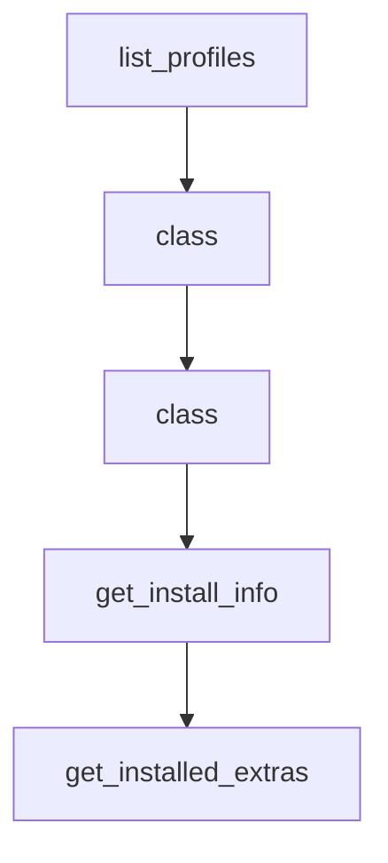

# Chapter 5: Context, Lessons, and Conversation Management

Welcome to **Chapter 5: Context, Lessons, and Conversation Management**. In this part of **gptme Tutorial: Open-Source Terminal Agent for Local Tool-Driven Work**, you will build an intuitive mental model first, then move into concrete implementation details and practical production tradeoffs.


gptme includes context controls and a lessons system to improve consistency over long and repeated tasks.

## Key Mechanisms

| Mechanism | Purpose |
|:----------|:--------|
| session logs/resume | continuity across multi-step work |
| context compression | control token growth |
| lessons system | inject recurring guidance automatically |

## Operational Tip

Combine concise lesson files with context compression to keep long autonomous sessions reliable.

## Source References

- [Lessons docs](https://github.com/gptme/gptme/blob/master/docs/lessons.rst)
- [Timeline/changelog references](https://github.com/gptme/gptme/blob/master/docs/changelog.rst)

## Summary

You now know how to preserve quality and consistency as conversation history grows.

Next: [Chapter 6: MCP, ACP, and Plugin Extensibility](06-mcp-acp-and-plugin-extensibility.md)

## Source Code Walkthrough

### `gptme/profiles.py`

The `list_profiles` function in [`gptme/profiles.py`](https://github.com/gptme/gptme/blob/HEAD/gptme/profiles.py) handles a key part of this chapter's functionality:

```py


def list_profiles() -> dict[str, Profile]:
    """List all available profiles (built-in and user-defined).

    User profiles override built-in profiles with the same name.
    """
    profiles = BUILTIN_PROFILES.copy()
    profiles.update(load_user_profiles())
    return profiles

```

This function is important because it defines how gptme Tutorial: Open-Source Terminal Agent for Local Tool-Driven Work implements the patterns covered in this chapter.

### `gptme/info.py`

The `class` class in [`gptme/info.py`](https://github.com/gptme/gptme/blob/HEAD/gptme/info.py) handles a key part of this chapter's functionality:

```py
import re
import shutil
from dataclasses import dataclass, field
from pathlib import Path

from . import __version__
from .dirs import get_logs_dir


@dataclass
class ExtraInfo:
    """Information about an optional dependency/extra."""

    name: str
    installed: bool
    description: str
    packages: list[str] = field(default_factory=list)


@dataclass
class InstallInfo:
    """Information about how gptme was installed."""

    method: str  # pip, pipx, uv, poetry, unknown
    editable: bool
    path: str | None = None


# Human-friendly descriptions for extras (optional enhancement)
# If an extra isn't listed here, its name will be used as description
_EXTRA_DESCRIPTIONS = {
    "browser": "Web browsing with Playwright",
```

This class is important because it defines how gptme Tutorial: Open-Source Terminal Agent for Local Tool-Driven Work implements the patterns covered in this chapter.

### `gptme/info.py`

The `class` class in [`gptme/info.py`](https://github.com/gptme/gptme/blob/HEAD/gptme/info.py) handles a key part of this chapter's functionality:

```py
import re
import shutil
from dataclasses import dataclass, field
from pathlib import Path

from . import __version__
from .dirs import get_logs_dir


@dataclass
class ExtraInfo:
    """Information about an optional dependency/extra."""

    name: str
    installed: bool
    description: str
    packages: list[str] = field(default_factory=list)


@dataclass
class InstallInfo:
    """Information about how gptme was installed."""

    method: str  # pip, pipx, uv, poetry, unknown
    editable: bool
    path: str | None = None


# Human-friendly descriptions for extras (optional enhancement)
# If an extra isn't listed here, its name will be used as description
_EXTRA_DESCRIPTIONS = {
    "browser": "Web browsing with Playwright",
```

This class is important because it defines how gptme Tutorial: Open-Source Terminal Agent for Local Tool-Driven Work implements the patterns covered in this chapter.

### `gptme/info.py`

The `get_install_info` function in [`gptme/info.py`](https://github.com/gptme/gptme/blob/HEAD/gptme/info.py) handles a key part of this chapter's functionality:

```py


def get_install_info() -> InstallInfo:
    """Detect how gptme was installed."""
    try:
        dist = importlib.metadata.distribution("gptme")

        # Check installer
        try:
            installer = (dist.read_text("INSTALLER") or "").strip().lower()
        except Exception:
            installer = "unknown"

        # Check if editable via direct_url.json
        editable = False
        path = None
        try:
            direct_url_text = dist.read_text("direct_url.json")
            if direct_url_text:
                data = json.loads(direct_url_text)
                editable = data.get("dir_info", {}).get("editable", False)
                url = data.get("url", "")
                if url.startswith("file://"):
                    path = url[7:]  # Strip file://
        except Exception:
            pass

        # Also check if PathDistribution (another indicator of editable)
        if not editable and type(dist).__name__ == "PathDistribution":
            editable = True

        # Determine method
```

This function is important because it defines how gptme Tutorial: Open-Source Terminal Agent for Local Tool-Driven Work implements the patterns covered in this chapter.


## How These Components Connect


