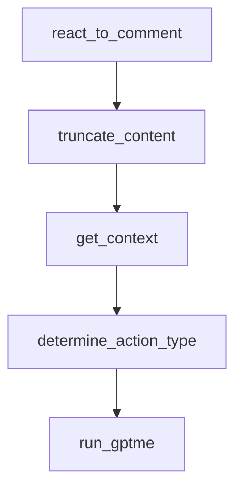

# Chapter 5: Context, Lessons, and Conversation Management

Welcome to **Chapter 5: Context, Lessons, and Conversation Management**. In this part of **gptme Tutorial: Open-Source Terminal Agent for Local Tool-Driven Work**, you will build an intuitive mental model first, then move into concrete implementation details and practical production tradeoffs.


gptme includes context controls and a lessons system to improve consistency over long and repeated tasks.

## Key Mechanisms

| Mechanism | Purpose |
|:----------|:--------|
| session logs/resume | continuity across multi-step work |
| context compression | control token growth |
| lessons system | inject recurring guidance automatically |

## Operational Tip

Combine concise lesson files with context compression to keep long autonomous sessions reliable.

## Source References

- [Lessons docs](https://github.com/gptme/gptme/blob/master/docs/lessons.rst)
- [Timeline/changelog references](https://github.com/gptme/gptme/blob/master/docs/changelog.rst)

## Summary

You now know how to preserve quality and consistency as conversation history grows.

Next: [Chapter 6: MCP, ACP, and Plugin Extensibility](06-mcp-acp-and-plugin-extensibility.md)

## Depth Expansion Playbook

## Source Code Walkthrough

### `scripts/github_bot.py`

The `react_to_comment` function in [`scripts/github_bot.py`](https://github.com/gptme/gptme/blob/HEAD/scripts/github_bot.py) handles a key part of this chapter's functionality:

```py


def react_to_comment(
    repository: str, comment_id: int, token: str, dry_run: bool = False
) -> None:
    """Add a +1 reaction to the comment."""
    if dry_run:
        print(f"[DRY RUN] Would react to comment {comment_id}")
        return

    run_command(
        [
            "gh",
            "api",
            f"/repos/{repository}/issues/comments/{comment_id}/reactions",
            "-X",
            "POST",
            "-f",
            "content=+1",
        ]
    )


# Maximum context sizes to prevent token limit issues
MAX_CONTEXT_CHARS = 50000  # ~12.5k tokens
MAX_DIFF_CHARS = 30000  # Diffs can be large, limit separately
MAX_COMMENT_CHARS = 20000  # Comments can accumulate


def truncate_content(content: str, max_chars: int, label: str = "content") -> str:
    """Truncate content to max_chars with a notice if truncated."""
    if len(content) <= max_chars:
```

This function is important because it defines how gptme Tutorial: Open-Source Terminal Agent for Local Tool-Driven Work implements the patterns covered in this chapter.

### `scripts/github_bot.py`

The `truncate_content` function in [`scripts/github_bot.py`](https://github.com/gptme/gptme/blob/HEAD/scripts/github_bot.py) handles a key part of this chapter's functionality:

```py


def truncate_content(content: str, max_chars: int, label: str = "content") -> str:
    """Truncate content to max_chars with a notice if truncated."""
    if len(content) <= max_chars:
        return content
    truncated = content[:max_chars]
    # Try to truncate at a newline for cleaner output
    last_newline = truncated.rfind("\n", max_chars - 500, max_chars)
    if last_newline > max_chars - 500:
        truncated = truncated[:last_newline]
    return f"{truncated}\n\n[... {label} truncated, {len(content) - len(truncated)} chars omitted ...]"


def get_context(
    repository: str, issue_number: int, is_pr: bool, token: str
) -> dict[str, str]:
    """Get context from the issue or PR with size limits to prevent token overflow."""
    context = {}
    ctx_dir = tempfile.mkdtemp()

    if is_pr:
        # Get PR details
        result = run_command(
            ["gh", "pr", "view", str(issue_number), "--repo", repository],
            capture=True,
        )
        context["pr"] = truncate_content(result.stdout, MAX_CONTEXT_CHARS, "PR details")

        # Get PR comments
        result = run_command(
            ["gh", "pr", "view", str(issue_number), "--repo", repository, "-c"],
```

This function is important because it defines how gptme Tutorial: Open-Source Terminal Agent for Local Tool-Driven Work implements the patterns covered in this chapter.

### `scripts/github_bot.py`

The `get_context` function in [`scripts/github_bot.py`](https://github.com/gptme/gptme/blob/HEAD/scripts/github_bot.py) handles a key part of this chapter's functionality:

```py


def get_context(
    repository: str, issue_number: int, is_pr: bool, token: str
) -> dict[str, str]:
    """Get context from the issue or PR with size limits to prevent token overflow."""
    context = {}
    ctx_dir = tempfile.mkdtemp()

    if is_pr:
        # Get PR details
        result = run_command(
            ["gh", "pr", "view", str(issue_number), "--repo", repository],
            capture=True,
        )
        context["pr"] = truncate_content(result.stdout, MAX_CONTEXT_CHARS, "PR details")

        # Get PR comments
        result = run_command(
            ["gh", "pr", "view", str(issue_number), "--repo", repository, "-c"],
            capture=True,
        )
        context["comments"] = truncate_content(
            result.stdout, MAX_COMMENT_CHARS, "comments"
        )

        # Get PR diff (often the largest, limit more aggressively)
        result = run_command(
            ["gh", "pr", "diff", str(issue_number), "--repo", repository],
            capture=True,
        )
        context["diff"] = truncate_content(result.stdout, MAX_DIFF_CHARS, "diff")
```

This function is important because it defines how gptme Tutorial: Open-Source Terminal Agent for Local Tool-Driven Work implements the patterns covered in this chapter.

### `scripts/github_bot.py`

The `determine_action_type` function in [`scripts/github_bot.py`](https://github.com/gptme/gptme/blob/HEAD/scripts/github_bot.py) handles a key part of this chapter's functionality:

```py


def determine_action_type(command: str, model: str) -> str:
    """Determine if the command requires changes or just a response."""
    result = run_command(
        [
            "gptme",
            "--non-interactive",
            "--model",
            model,
            f"Determine if this command requires changes to be made or just a response. "
            f"Respond with ONLY 'make_changes' or 'respond'. Command: {command}",
        ],
        capture=True,
    )

    output = result.stdout.lower()
    if "make_changes" in output:
        return "make_changes"
    return "respond"


def run_gptme(
    command: str,
    context_dir: str,
    workspace: str,
    model: str,
    timeout: int = 120,
) -> bool:
    """Run gptme with the given command and context."""
    # Build the context file list
    context_files = list(Path(context_dir).glob("gh-*.md"))
```

This function is important because it defines how gptme Tutorial: Open-Source Terminal Agent for Local Tool-Driven Work implements the patterns covered in this chapter.


## How These Components Connect


