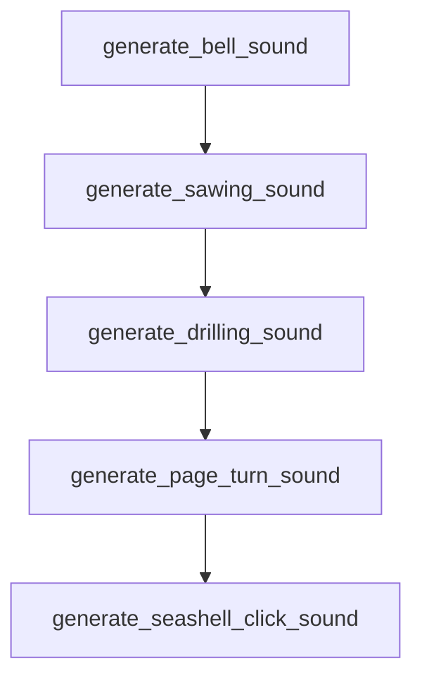

# Chapter 6: MCP, ACP, and Plugin Extensibility

Welcome to **Chapter 6: MCP, ACP, and Plugin Extensibility**. In this part of **gptme Tutorial: Open-Source Terminal Agent for Local Tool-Driven Work**, you will build an intuitive mental model first, then move into concrete implementation details and practical production tradeoffs.


gptme supports protocol and plugin extensions for richer integrations with external tools and clients.

## Extension Surfaces

- MCP integration for external tool servers
- ACP components for agent-client protocol use
- plugin system for packaged capabilities

## Strategy

- start with minimal plugin footprint
- audit MCP tool trust before enabling write-capable actions
- version extension dependencies with the same rigor as app code

## Source References

- [MCP docs](https://github.com/gptme/gptme/blob/master/docs/mcp.rst)
- [ACP docs](https://github.com/gptme/gptme/blob/master/docs/acp.rst)
- [Plugins docs](https://github.com/gptme/gptme/blob/master/docs/plugins.rst)

## Summary

You now have an extensibility model for connecting gptme to broader tool ecosystems.

Next: [Chapter 7: Automation, Server Mode, and Agent Templates](07-automation-server-mode-and-agent-templates.md)

## Source Code Walkthrough

### `scripts/generate_sounds.py`

The `generate_bell_sound` function in [`scripts/generate_sounds.py`](https://github.com/gptme/gptme/blob/HEAD/scripts/generate_sounds.py) handles a key part of this chapter's functionality:

```py


def generate_bell_sound(
    duration: float = 1.5,
    sample_rate: int = 44100,
    fundamental_freq: float = 800.0,
    volume: float = 0.3,
) -> np.ndarray:
    """Generate a pleasant bell sound using multiple harmonics with exponential decay."""
    t = np.linspace(0, duration, int(sample_rate * duration))

    # Bell harmonics (frequency ratios based on real bell acoustics)
    harmonics = [
        (1.0, 1.0),  # Fundamental
        (2.76, 0.6),  # First overtone
        (5.40, 0.4),  # Second overtone
        (8.93, 0.25),  # Third overtone
        (13.34, 0.15),  # Fourth overtone
        (18.64, 0.1),  # Fifth overtone
    ]

    bell_sound = np.zeros_like(t)

    for freq_ratio, amplitude in harmonics:
        freq = fundamental_freq * freq_ratio
        sine_wave = np.sin(2 * np.pi * freq * t)
        decay_rate = 3.0 + freq_ratio * 0.5
        envelope = np.exp(-decay_rate * t)
        modulation = 1 + 0.02 * np.sin(2 * np.pi * 5 * t) * envelope
        bell_sound += amplitude * sine_wave * envelope * modulation

    # Attack envelope
```

This function is important because it defines how gptme Tutorial: Open-Source Terminal Agent for Local Tool-Driven Work implements the patterns covered in this chapter.

### `scripts/generate_sounds.py`

The `generate_sawing_sound` function in [`scripts/generate_sounds.py`](https://github.com/gptme/gptme/blob/HEAD/scripts/generate_sounds.py) handles a key part of this chapter's functionality:

```py


def generate_sawing_sound(
    duration: float = 0.5,
    sample_rate: int = 44100,
    volume: float = 0.2,
) -> np.ndarray:
    """Generate a gentle whir sound for general tool use."""
    t = np.linspace(0, duration, int(sample_rate * duration))

    # Gentle whir: soft oscillating tone
    base_freq = 300.0
    modulation_freq = 8.0

    # Create oscillating frequency
    freq_modulation = 1 + 0.3 * np.sin(2 * np.pi * modulation_freq * t)
    whir_sound = np.sin(2 * np.pi * base_freq * freq_modulation * t)

    # Add subtle harmonics
    whir_sound += 0.4 * np.sin(2 * np.pi * base_freq * 2 * freq_modulation * t)
    whir_sound += 0.2 * np.sin(2 * np.pi * base_freq * 3 * freq_modulation * t)

    # Smooth envelope
    envelope = np.sin(np.pi * t / duration) * 0.8 + 0.2
    whir_sound *= envelope

    # Final envelope
    fade_samples = int(0.05 * sample_rate)
    final_envelope = np.ones_like(t)
    final_envelope[:fade_samples] = np.linspace(0, 1, fade_samples)
    final_envelope[-fade_samples:] = np.linspace(1, 0, fade_samples)

```

This function is important because it defines how gptme Tutorial: Open-Source Terminal Agent for Local Tool-Driven Work implements the patterns covered in this chapter.

### `scripts/generate_sounds.py`

The `generate_drilling_sound` function in [`scripts/generate_sounds.py`](https://github.com/gptme/gptme/blob/HEAD/scripts/generate_sounds.py) handles a key part of this chapter's functionality:

```py


def generate_drilling_sound(
    duration: float = 0.4,
    sample_rate: int = 44100,
    volume: float = 0.25,
) -> np.ndarray:
    """Generate a soft buzz sound for alternative general tool use."""
    t = np.linspace(0, duration, int(sample_rate * duration))

    # Soft buzz: steady tone with slight vibrato
    buzz_freq = 400.0
    vibrato_freq = 6.0
    vibrato_depth = 0.1

    # Create vibrato
    vibrato = 1 + vibrato_depth * np.sin(2 * np.pi * vibrato_freq * t)
    buzz_sound = np.sin(2 * np.pi * buzz_freq * vibrato * t)

    # Add harmonics for warmth
    buzz_sound += 0.3 * np.sin(2 * np.pi * buzz_freq * 2 * vibrato * t)
    buzz_sound += 0.1 * np.sin(2 * np.pi * buzz_freq * 3 * vibrato * t)

    # Smooth envelope
    envelope = np.sin(np.pi * t / duration) * 0.9 + 0.1
    buzz_sound *= envelope

    # Final envelope
    fade_samples = int(0.03 * sample_rate)
    final_envelope = np.ones_like(t)
    final_envelope[:fade_samples] = np.linspace(0, 1, fade_samples)
    final_envelope[-fade_samples:] = np.linspace(1, 0, fade_samples)
```

This function is important because it defines how gptme Tutorial: Open-Source Terminal Agent for Local Tool-Driven Work implements the patterns covered in this chapter.

### `scripts/generate_sounds.py`

The `generate_page_turn_sound` function in [`scripts/generate_sounds.py`](https://github.com/gptme/gptme/blob/HEAD/scripts/generate_sounds.py) handles a key part of this chapter's functionality:

```py


def generate_page_turn_sound(
    duration: float = 0.6,
    sample_rate: int = 44100,
    volume: float = 0.25,
) -> np.ndarray:
    """Generate a soft whoosh sound for read operations."""
    t = np.linspace(0, duration, int(sample_rate * duration))

    # Soft whoosh: frequency sweep from low to high
    start_freq = 200.0
    end_freq = 800.0

    # Create frequency sweep
    freq_sweep = start_freq + (end_freq - start_freq) * (t / duration)
    whoosh_sound = np.sin(2 * np.pi * freq_sweep * t)

    # Add subtle harmonics
    whoosh_sound += 0.3 * np.sin(2 * np.pi * freq_sweep * 2 * t)

    # Smooth envelope that peaks in the middle
    envelope = np.sin(np.pi * t / duration) * np.exp(-2 * t)
    whoosh_sound *= envelope

    # Final envelope
    fade_samples = int(0.05 * sample_rate)
    final_envelope = np.ones_like(t)
    final_envelope[:fade_samples] = np.linspace(0, 1, fade_samples)
    final_envelope[-fade_samples:] = np.linspace(1, 0, fade_samples)

    whoosh_sound *= final_envelope
```

This function is important because it defines how gptme Tutorial: Open-Source Terminal Agent for Local Tool-Driven Work implements the patterns covered in this chapter.


## How These Components Connect


