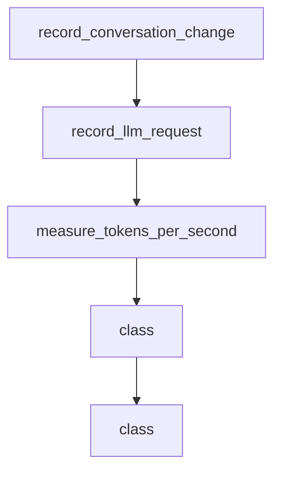

# Chapter 6: MCP, ACP, and Plugin Extensibility

Welcome to **Chapter 6: MCP, ACP, and Plugin Extensibility**. In this part of **gptme Tutorial: Open-Source Terminal Agent for Local Tool-Driven Work**, you will build an intuitive mental model first, then move into concrete implementation details and practical production tradeoffs.


gptme supports protocol and plugin extensions for richer integrations with external tools and clients.

## Extension Surfaces

- MCP integration for external tool servers
- ACP components for agent-client protocol use
- plugin system for packaged capabilities

## Strategy

- start with minimal plugin footprint
- audit MCP tool trust before enabling write-capable actions
- version extension dependencies with the same rigor as app code

## Source References

- [MCP docs](https://github.com/gptme/gptme/blob/master/docs/mcp.rst)
- [ACP docs](https://github.com/gptme/gptme/blob/master/docs/acp.rst)
- [Plugins docs](https://github.com/gptme/gptme/blob/master/docs/plugins.rst)

## Summary

You now have an extensibility model for connecting gptme to broader tool ecosystems.

Next: [Chapter 7: Automation, Server Mode, and Agent Templates](07-automation-server-mode-and-agent-templates.md)

## Depth Expansion Playbook

## Source Code Walkthrough

### `gptme/telemetry.py`

The `record_conversation_change` function in [`gptme/telemetry.py`](https://github.com/gptme/gptme/blob/HEAD/gptme/telemetry.py) handles a key part of this chapter's functionality:

```py
    "record_request_duration",
    "record_tool_call",
    "record_conversation_change",
    "record_llm_request",
    "measure_tokens_per_second",
]

logger = logging.getLogger(__name__)

# Type variable for generic function decoration
F = TypeVar("F", bound=Callable[..., Any])


def is_telemetry_enabled() -> bool:
    """Check if telemetry is enabled."""
    return _is_enabled()


def init_telemetry(
    service_name: str = "gptme",
    enable_flask_instrumentation: bool = True,
    enable_requests_instrumentation: bool = True,
    enable_openai_instrumentation: bool = True,
    enable_anthropic_instrumentation: bool = True,
    agent_name: str | None = None,
    interactive: bool | None = None,
) -> None:
    """Initialize OpenTelemetry tracing and metrics.

    Args:
        service_name: Name of the service for telemetry
        enable_flask_instrumentation: Whether to auto-instrument Flask
```

This function is important because it defines how gptme Tutorial: Open-Source Terminal Agent for Local Tool-Driven Work implements the patterns covered in this chapter.

### `gptme/telemetry.py`

The `record_llm_request` function in [`gptme/telemetry.py`](https://github.com/gptme/gptme/blob/HEAD/gptme/telemetry.py) handles a key part of this chapter's functionality:

```py
    "record_tool_call",
    "record_conversation_change",
    "record_llm_request",
    "measure_tokens_per_second",
]

logger = logging.getLogger(__name__)

# Type variable for generic function decoration
F = TypeVar("F", bound=Callable[..., Any])


def is_telemetry_enabled() -> bool:
    """Check if telemetry is enabled."""
    return _is_enabled()


def init_telemetry(
    service_name: str = "gptme",
    enable_flask_instrumentation: bool = True,
    enable_requests_instrumentation: bool = True,
    enable_openai_instrumentation: bool = True,
    enable_anthropic_instrumentation: bool = True,
    agent_name: str | None = None,
    interactive: bool | None = None,
) -> None:
    """Initialize OpenTelemetry tracing and metrics.

    Args:
        service_name: Name of the service for telemetry
        enable_flask_instrumentation: Whether to auto-instrument Flask
        enable_requests_instrumentation: Whether to auto-instrument requests library
```

This function is important because it defines how gptme Tutorial: Open-Source Terminal Agent for Local Tool-Driven Work implements the patterns covered in this chapter.

### `gptme/telemetry.py`

The `measure_tokens_per_second` function in [`gptme/telemetry.py`](https://github.com/gptme/gptme/blob/HEAD/gptme/telemetry.py) handles a key part of this chapter's functionality:

```py
    "record_conversation_change",
    "record_llm_request",
    "measure_tokens_per_second",
]

logger = logging.getLogger(__name__)

# Type variable for generic function decoration
F = TypeVar("F", bound=Callable[..., Any])


def is_telemetry_enabled() -> bool:
    """Check if telemetry is enabled."""
    return _is_enabled()


def init_telemetry(
    service_name: str = "gptme",
    enable_flask_instrumentation: bool = True,
    enable_requests_instrumentation: bool = True,
    enable_openai_instrumentation: bool = True,
    enable_anthropic_instrumentation: bool = True,
    agent_name: str | None = None,
    interactive: bool | None = None,
) -> None:
    """Initialize OpenTelemetry tracing and metrics.

    Args:
        service_name: Name of the service for telemetry
        enable_flask_instrumentation: Whether to auto-instrument Flask
        enable_requests_instrumentation: Whether to auto-instrument requests library
        enable_openai_instrumentation: Whether to auto-instrument OpenAI
```

This function is important because it defines how gptme Tutorial: Open-Source Terminal Agent for Local Tool-Driven Work implements the patterns covered in this chapter.

### `gptme/info.py`

The `class` class in [`gptme/info.py`](https://github.com/gptme/gptme/blob/HEAD/gptme/info.py) handles a key part of this chapter's functionality:

```py
import re
import shutil
from dataclasses import dataclass, field
from pathlib import Path

from . import __version__
from .dirs import get_logs_dir


@dataclass
class ExtraInfo:
    """Information about an optional dependency/extra."""

    name: str
    installed: bool
    description: str
    packages: list[str] = field(default_factory=list)


@dataclass
class InstallInfo:
    """Information about how gptme was installed."""

    method: str  # pip, pipx, uv, poetry, unknown
    editable: bool
    path: str | None = None


# Human-friendly descriptions for extras (optional enhancement)
# If an extra isn't listed here, its name will be used as description
_EXTRA_DESCRIPTIONS = {
    "browser": "Web browsing with Playwright",
```

This class is important because it defines how gptme Tutorial: Open-Source Terminal Agent for Local Tool-Driven Work implements the patterns covered in this chapter.


## How These Components Connect


