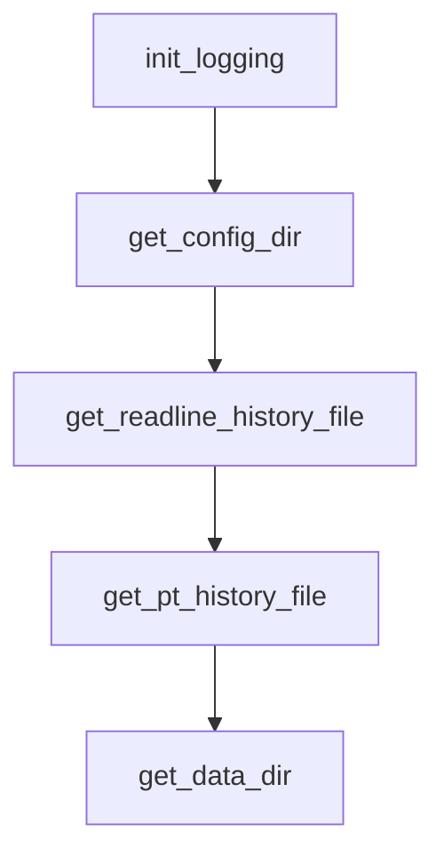

# Chapter 7: Automation, Server Mode, and Agent Templates

Welcome to **Chapter 7: Automation, Server Mode, and Agent Templates**. In this part of **gptme Tutorial: Open-Source Terminal Agent for Local Tool-Driven Work**, you will build an intuitive mental model first, then move into concrete implementation details and practical production tradeoffs.


Beyond ad hoc use, gptme supports automation patterns and broader deployment modes.

## Deployment Patterns

| Pattern | Purpose |
|:--------|:--------|
| CLI pipelines | scripted task execution with local context |
| server/web modes | shared access and API-driven workflows |
| agent template usage | persistent/autonomous agents over time |

## Source References

- [gptme server docs](https://github.com/gptme/gptme/blob/master/docs/server.rst)
- [Projects docs](https://github.com/gptme/gptme/blob/master/docs/projects.rst)
- [gptme-agent-template mention](https://github.com/gptme/gptme/blob/master/README.md)

## Summary

You now have pathways to operationalize gptme beyond an individual interactive shell.

Next: [Chapter 8: Production Operations and Security](08-production-operations-and-security.md)

## Source Code Walkthrough

### `gptme/init.py`

The `init_logging` function in [`gptme/init.py`](https://github.com/gptme/gptme/blob/HEAD/gptme/init.py) handles a key part of this chapter's functionality:

```py


def init_logging(verbose):
    handler = RichHandler()  # show_time=False
    logging.basicConfig(
        level=logging.DEBUG if verbose else logging.INFO,
        format="%(message)s",
        datefmt="[%X]",
        handlers=[handler],
        force=True,  # Override any previous logging configuration
    )

    # anthropic spams debug logs for every request
    logging.getLogger("anthropic").setLevel(logging.INFO)
    logging.getLogger("openai").setLevel(logging.INFO)
    # set httpx logging to WARNING
    logging.getLogger("httpx").setLevel(logging.WARNING)
    logging.getLogger("httpcore").setLevel(logging.WARNING)

    # Apply debouncing filter for OpenTelemetry connection errors
    # This shows the first error, then suppresses duplicates for 5 minutes
    # Prevents spam while still alerting users to telemetry issues
    # Uses singleton filter to share state with setup_telemetry() filters
    try:
        from .util._telemetry import get_connection_error_filter

        otel_filter = get_connection_error_filter(cooldown_seconds=300.0)
        logging.getLogger("opentelemetry").addFilter(otel_filter)
    except ImportError:
        # OpenTelemetry not installed, no need for filter
        pass

```

This function is important because it defines how gptme Tutorial: Open-Source Terminal Agent for Local Tool-Driven Work implements the patterns covered in this chapter.

### `gptme/dirs.py`

The `get_config_dir` function in [`gptme/dirs.py`](https://github.com/gptme/gptme/blob/HEAD/gptme/dirs.py) handles a key part of this chapter's functionality:

```py


def get_config_dir() -> Path:
    return Path(user_config_dir("gptme"))


def get_readline_history_file() -> Path:
    return get_data_dir() / "history"


def get_pt_history_file() -> Path:
    return get_data_dir() / "history.pt"


def get_data_dir() -> Path:
    # used in testing, so must take precedence
    if "XDG_DATA_HOME" in os.environ:
        return Path(os.environ["XDG_DATA_HOME"]) / "gptme"

    # just a workaround for me personally
    old = Path("~/.local/share/gptme").expanduser()
    if old.exists():
        return old

    return Path(user_data_dir("gptme"))


def get_logs_dir() -> Path:
    """Get the path for **conversation logs** (not to be confused with the logger file)"""
    if "GPTME_LOGS_HOME" in os.environ:
        path = Path(os.environ["GPTME_LOGS_HOME"])
    else:
```

This function is important because it defines how gptme Tutorial: Open-Source Terminal Agent for Local Tool-Driven Work implements the patterns covered in this chapter.

### `gptme/dirs.py`

The `get_readline_history_file` function in [`gptme/dirs.py`](https://github.com/gptme/gptme/blob/HEAD/gptme/dirs.py) handles a key part of this chapter's functionality:

```py


def get_readline_history_file() -> Path:
    return get_data_dir() / "history"


def get_pt_history_file() -> Path:
    return get_data_dir() / "history.pt"


def get_data_dir() -> Path:
    # used in testing, so must take precedence
    if "XDG_DATA_HOME" in os.environ:
        return Path(os.environ["XDG_DATA_HOME"]) / "gptme"

    # just a workaround for me personally
    old = Path("~/.local/share/gptme").expanduser()
    if old.exists():
        return old

    return Path(user_data_dir("gptme"))


def get_logs_dir() -> Path:
    """Get the path for **conversation logs** (not to be confused with the logger file)"""
    if "GPTME_LOGS_HOME" in os.environ:
        path = Path(os.environ["GPTME_LOGS_HOME"])
    else:
        path = get_data_dir() / "logs"
    path.mkdir(parents=True, exist_ok=True)
    return path

```

This function is important because it defines how gptme Tutorial: Open-Source Terminal Agent for Local Tool-Driven Work implements the patterns covered in this chapter.

### `gptme/dirs.py`

The `get_pt_history_file` function in [`gptme/dirs.py`](https://github.com/gptme/gptme/blob/HEAD/gptme/dirs.py) handles a key part of this chapter's functionality:

```py


def get_pt_history_file() -> Path:
    return get_data_dir() / "history.pt"


def get_data_dir() -> Path:
    # used in testing, so must take precedence
    if "XDG_DATA_HOME" in os.environ:
        return Path(os.environ["XDG_DATA_HOME"]) / "gptme"

    # just a workaround for me personally
    old = Path("~/.local/share/gptme").expanduser()
    if old.exists():
        return old

    return Path(user_data_dir("gptme"))


def get_logs_dir() -> Path:
    """Get the path for **conversation logs** (not to be confused with the logger file)"""
    if "GPTME_LOGS_HOME" in os.environ:
        path = Path(os.environ["GPTME_LOGS_HOME"])
    else:
        path = get_data_dir() / "logs"
    path.mkdir(parents=True, exist_ok=True)
    return path


def get_project_gptme_dir() -> Path | None:
    """
    Walks up the directory tree from the working dir to find the project root,
```

This function is important because it defines how gptme Tutorial: Open-Source Terminal Agent for Local Tool-Driven Work implements the patterns covered in this chapter.


## How These Components Connect


