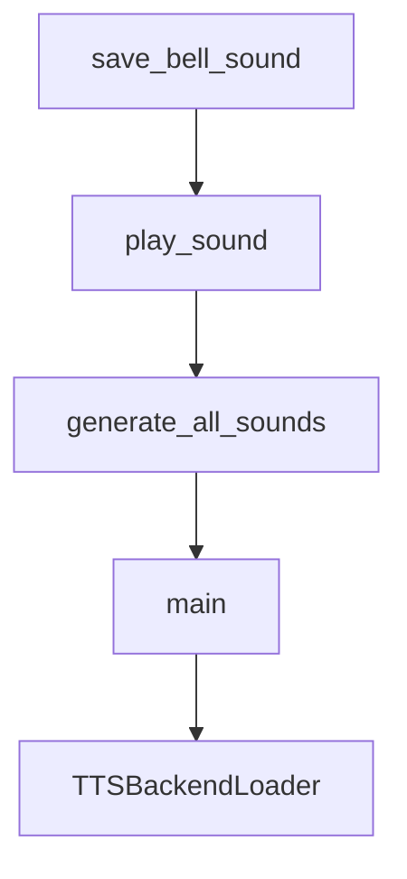

# Chapter 7: Automation, Server Mode, and Agent Templates

Welcome to **Chapter 7: Automation, Server Mode, and Agent Templates**. In this part of **gptme Tutorial: Open-Source Terminal Agent for Local Tool-Driven Work**, you will build an intuitive mental model first, then move into concrete implementation details and practical production tradeoffs.


Beyond ad hoc use, gptme supports automation patterns and broader deployment modes.

## Deployment Patterns

| Pattern | Purpose |
|:--------|:--------|
| CLI pipelines | scripted task execution with local context |
| server/web modes | shared access and API-driven workflows |
| agent template usage | persistent/autonomous agents over time |

## Source References

- [gptme server docs](https://github.com/gptme/gptme/blob/master/docs/server.rst)
- [Projects docs](https://github.com/gptme/gptme/blob/master/docs/projects.rst)
- [gptme-agent-template mention](https://github.com/gptme/gptme/blob/master/README.md)

## Summary

You now have pathways to operationalize gptme beyond an individual interactive shell.

Next: [Chapter 8: Production Operations and Security](08-production-operations-and-security.md)

## Depth Expansion Playbook

## Source Code Walkthrough

### `scripts/generate_sounds.py`

The `save_bell_sound` function in [`scripts/generate_sounds.py`](https://github.com/gptme/gptme/blob/HEAD/scripts/generate_sounds.py) handles a key part of this chapter's functionality:

```py


def save_bell_sound(output_path: Path, **kwargs) -> None:
    """Generate and save a bell sound to a file."""
    bell_sound = generate_bell_sound(**kwargs)
    sf.write(output_path, bell_sound, 44100)
    print(f"Bell sound saved to: {output_path}")


def play_sound(audio_data: np.ndarray, sample_rate: int = 44100) -> None:
    """Play the sound using the system's default audio player."""
    # Create a temporary file
    with tempfile.NamedTemporaryFile(suffix=".wav", delete=False) as tmp_file:
        tmp_path = tmp_file.name

    try:
        # Save to temporary file
        sf.write(tmp_path, audio_data, sample_rate)

        # Try to play using different system commands
        play_commands = [
            ["afplay", tmp_path],  # macOS
            ["aplay", tmp_path],  # Linux (ALSA)
            ["paplay", tmp_path],  # Linux (PulseAudio)
            ["play", tmp_path],  # SoX
        ]

        for cmd in play_commands:
            if shutil.which(cmd[0]):
                try:
                    subprocess.run(cmd, check=True, capture_output=True)
                    return
```

This function is important because it defines how gptme Tutorial: Open-Source Terminal Agent for Local Tool-Driven Work implements the patterns covered in this chapter.

### `scripts/generate_sounds.py`

The `play_sound` function in [`scripts/generate_sounds.py`](https://github.com/gptme/gptme/blob/HEAD/scripts/generate_sounds.py) handles a key part of this chapter's functionality:

```py


def play_sound(audio_data: np.ndarray, sample_rate: int = 44100) -> None:
    """Play the sound using the system's default audio player."""
    # Create a temporary file
    with tempfile.NamedTemporaryFile(suffix=".wav", delete=False) as tmp_file:
        tmp_path = tmp_file.name

    try:
        # Save to temporary file
        sf.write(tmp_path, audio_data, sample_rate)

        # Try to play using different system commands
        play_commands = [
            ["afplay", tmp_path],  # macOS
            ["aplay", tmp_path],  # Linux (ALSA)
            ["paplay", tmp_path],  # Linux (PulseAudio)
            ["play", tmp_path],  # SoX
        ]

        for cmd in play_commands:
            if shutil.which(cmd[0]):
                try:
                    subprocess.run(cmd, check=True, capture_output=True)
                    return
                except subprocess.CalledProcessError:
                    continue

        print(
            "Could not find a suitable audio player. Audio saved to temporary file:",
            tmp_path,
        )
```

This function is important because it defines how gptme Tutorial: Open-Source Terminal Agent for Local Tool-Driven Work implements the patterns covered in this chapter.

### `scripts/generate_sounds.py`

The `generate_all_sounds` function in [`scripts/generate_sounds.py`](https://github.com/gptme/gptme/blob/HEAD/scripts/generate_sounds.py) handles a key part of this chapter's functionality:

```py


def generate_all_sounds(output_dir: Path):
    """Generate all tool sounds and save them to the output directory."""
    output_dir.mkdir(parents=True, exist_ok=True)

    sounds: dict[str, SoundGenerator] = {
        "bell.wav": generate_bell_sound,
        "sawing.wav": generate_sawing_sound,
        "drilling.wav": generate_drilling_sound,
        "page_turn.wav": generate_page_turn_sound,
        "seashell_click.wav": generate_seashell_click_sound,
        "camera_shutter.wav": generate_camera_shutter_sound,
        "file_write.wav": generate_file_write_sound,
        "chime.wav": generate_chime_sound,
    }

    for filename, generator in sounds.items():
        sound_data = generator()
        output_path = output_dir / filename
        sf.write(output_path, sound_data, 44100)
        print(f"Generated {filename}")


SRC_DIR = Path(__file__).parent.resolve()


def main():
    parser = argparse.ArgumentParser(description="Generate tool sounds for gptme")
    parser.add_argument(
        "-o",
        "--output",
```

This function is important because it defines how gptme Tutorial: Open-Source Terminal Agent for Local Tool-Driven Work implements the patterns covered in this chapter.

### `scripts/generate_sounds.py`

The `main` function in [`scripts/generate_sounds.py`](https://github.com/gptme/gptme/blob/HEAD/scripts/generate_sounds.py) handles a key part of this chapter's functionality:

```py
    # This creates the varying, organic amplitude swings

    # Primary beating pair (main beat)
    beat_freq1 = 4.2  # Hz
    freq1a = fundamental_freq - beat_freq1 / 2
    freq1b = fundamental_freq + beat_freq1 / 2
    beat_wave1 = (np.sin(2 * np.pi * freq1a * t) + np.sin(2 * np.pi * freq1b * t)) * 0.4

    # Secondary beating pair (creates variation in beat intensity)
    beat_freq2 = 6.8  # Hz - different beat rate
    freq2a = fundamental_freq - beat_freq2 / 2
    freq2b = fundamental_freq + beat_freq2 / 2
    beat_wave2 = (np.sin(2 * np.pi * freq2a * t) + np.sin(2 * np.pi * freq2b * t)) * 0.3

    # Third beating pair (subtle, adds complexity)
    beat_freq3 = 3.1  # Hz - slower beat
    freq3a = fundamental_freq - beat_freq3 / 2
    freq3b = fundamental_freq + beat_freq3 / 2
    beat_wave3 = (np.sin(2 * np.pi * freq3a * t) + np.sin(2 * np.pi * freq3b * t)) * 0.2

    # Combine all beating patterns - this creates varying intensity!
    fundamental_wave = beat_wave1 + beat_wave2 + beat_wave3

    # Add the main overtone at 2.61x with slower decay
    overtone_freq = fundamental_freq * 2.61
    overtone_decay = np.exp(-2.2 * t)  # Slower decay for longer ring
    overtone_wave = 0.3 * np.sin(2 * np.pi * overtone_freq * t) * overtone_decay

    # Minimal additional harmonics for cleaner sound
    harm3 = 0.08 * np.sin(2 * np.pi * fundamental_freq * 1.5 * t) * np.exp(-2.8 * t)

    # Combine components
```

This function is important because it defines how gptme Tutorial: Open-Source Terminal Agent for Local Tool-Driven Work implements the patterns covered in this chapter.


## How These Components Connect


