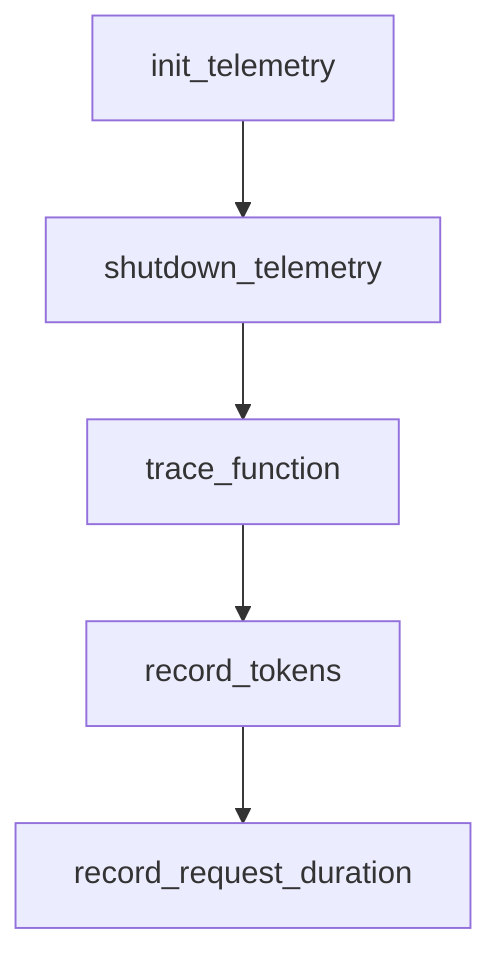

# Chapter 8: Production Operations and Security

Welcome to **Chapter 8: Production Operations and Security**. In this part of **gptme Tutorial: Open-Source Terminal Agent for Local Tool-Driven Work**, you will build an intuitive mental model first, then move into concrete implementation details and practical production tradeoffs.


Production gptme workflows require clear policy on tool permissions, secret handling, and trusted repositories.

## Security Checklist

1. treat repo-local config as code and review before execution
2. keep secret keys in env/local override files, not committed config
3. restrict dangerous tools in shared CI environments
4. validate generated changes with tests before merge

## Source References

- [gptme security docs](https://github.com/gptme/gptme/blob/master/docs/security.rst)
- [Configuration docs](https://github.com/gptme/gptme/blob/master/docs/config.rst)

## Summary

You now have a security and operations baseline for running gptme in production environments.

## Source Code Walkthrough

### `gptme/telemetry.py`

The `init_telemetry` function in [`gptme/telemetry.py`](https://github.com/gptme/gptme/blob/HEAD/gptme/telemetry.py) handles a key part of this chapter's functionality:

```py
    set_conversation_context,
)
from .util._telemetry import init_telemetry as _init
from .util._telemetry import is_telemetry_enabled as _is_enabled
from .util._telemetry import shutdown_telemetry as _shutdown

# Re-export conversation context functions for use by other modules
__all__ = [
    "set_conversation_context",
    "get_conversation_context",
    "clear_conversation_context",
    "is_telemetry_enabled",
    "init_telemetry",
    "shutdown_telemetry",
    "trace_function",
    "record_tokens",
    "record_request_duration",
    "record_tool_call",
    "record_conversation_change",
    "record_llm_request",
    "measure_tokens_per_second",
]

logger = logging.getLogger(__name__)

# Type variable for generic function decoration
F = TypeVar("F", bound=Callable[..., Any])


def is_telemetry_enabled() -> bool:
    """Check if telemetry is enabled."""
    return _is_enabled()
```

This function is important because it defines how gptme Tutorial: Open-Source Terminal Agent for Local Tool-Driven Work implements the patterns covered in this chapter.

### `gptme/telemetry.py`

The `shutdown_telemetry` function in [`gptme/telemetry.py`](https://github.com/gptme/gptme/blob/HEAD/gptme/telemetry.py) handles a key part of this chapter's functionality:

```py
from .util._telemetry import init_telemetry as _init
from .util._telemetry import is_telemetry_enabled as _is_enabled
from .util._telemetry import shutdown_telemetry as _shutdown

# Re-export conversation context functions for use by other modules
__all__ = [
    "set_conversation_context",
    "get_conversation_context",
    "clear_conversation_context",
    "is_telemetry_enabled",
    "init_telemetry",
    "shutdown_telemetry",
    "trace_function",
    "record_tokens",
    "record_request_duration",
    "record_tool_call",
    "record_conversation_change",
    "record_llm_request",
    "measure_tokens_per_second",
]

logger = logging.getLogger(__name__)

# Type variable for generic function decoration
F = TypeVar("F", bound=Callable[..., Any])


def is_telemetry_enabled() -> bool:
    """Check if telemetry is enabled."""
    return _is_enabled()


```

This function is important because it defines how gptme Tutorial: Open-Source Terminal Agent for Local Tool-Driven Work implements the patterns covered in this chapter.

### `gptme/telemetry.py`

The `trace_function` function in [`gptme/telemetry.py`](https://github.com/gptme/gptme/blob/HEAD/gptme/telemetry.py) handles a key part of this chapter's functionality:

```py
    "init_telemetry",
    "shutdown_telemetry",
    "trace_function",
    "record_tokens",
    "record_request_duration",
    "record_tool_call",
    "record_conversation_change",
    "record_llm_request",
    "measure_tokens_per_second",
]

logger = logging.getLogger(__name__)

# Type variable for generic function decoration
F = TypeVar("F", bound=Callable[..., Any])


def is_telemetry_enabled() -> bool:
    """Check if telemetry is enabled."""
    return _is_enabled()


def init_telemetry(
    service_name: str = "gptme",
    enable_flask_instrumentation: bool = True,
    enable_requests_instrumentation: bool = True,
    enable_openai_instrumentation: bool = True,
    enable_anthropic_instrumentation: bool = True,
    agent_name: str | None = None,
    interactive: bool | None = None,
) -> None:
    """Initialize OpenTelemetry tracing and metrics.
```

This function is important because it defines how gptme Tutorial: Open-Source Terminal Agent for Local Tool-Driven Work implements the patterns covered in this chapter.

### `gptme/telemetry.py`

The `record_tokens` function in [`gptme/telemetry.py`](https://github.com/gptme/gptme/blob/HEAD/gptme/telemetry.py) handles a key part of this chapter's functionality:

```py
    "shutdown_telemetry",
    "trace_function",
    "record_tokens",
    "record_request_duration",
    "record_tool_call",
    "record_conversation_change",
    "record_llm_request",
    "measure_tokens_per_second",
]

logger = logging.getLogger(__name__)

# Type variable for generic function decoration
F = TypeVar("F", bound=Callable[..., Any])


def is_telemetry_enabled() -> bool:
    """Check if telemetry is enabled."""
    return _is_enabled()


def init_telemetry(
    service_name: str = "gptme",
    enable_flask_instrumentation: bool = True,
    enable_requests_instrumentation: bool = True,
    enable_openai_instrumentation: bool = True,
    enable_anthropic_instrumentation: bool = True,
    agent_name: str | None = None,
    interactive: bool | None = None,
) -> None:
    """Initialize OpenTelemetry tracing and metrics.

```

This function is important because it defines how gptme Tutorial: Open-Source Terminal Agent for Local Tool-Driven Work implements the patterns covered in this chapter.


## How These Components Connect


