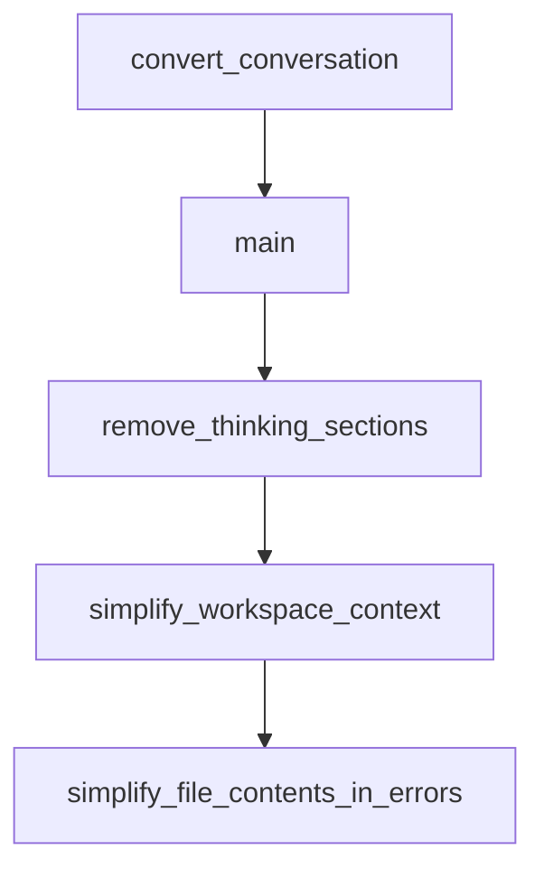

# Chapter 8: Production Operations and Security

Welcome to **Chapter 8: Production Operations and Security**. In this part of **gptme Tutorial: Open-Source Terminal Agent for Local Tool-Driven Work**, you will build an intuitive mental model first, then move into concrete implementation details and practical production tradeoffs.


Production gptme workflows require clear policy on tool permissions, secret handling, and trusted repositories.

## Security Checklist

1. treat repo-local config as code and review before execution
2. keep secret keys in env/local override files, not committed config
3. restrict dangerous tools in shared CI environments
4. validate generated changes with tests before merge

## Source References

- [gptme security docs](https://github.com/gptme/gptme/blob/master/docs/security.rst)
- [Configuration docs](https://github.com/gptme/gptme/blob/master/docs/config.rst)

## Summary

You now have a security and operations baseline for running gptme in production environments.

## Depth Expansion Playbook

## Source Code Walkthrough

### `scripts/convert_convo.py`

The `convert_conversation` function in [`scripts/convert_convo.py`](https://github.com/gptme/gptme/blob/HEAD/scripts/convert_convo.py) handles a key part of this chapter's functionality:

```py


def convert_conversation(
    jsonl_path: str,
    output_dir: str | None = None,
    verbose: bool = False,
    filename_format: str = "{index:04d}-{role}.md",
) -> None:
    """Convert a conversation.jsonl file to individual markdown files.

    Args:
        jsonl_path: Path to the conversation.jsonl file
        output_dir: Directory to write markdown files to (default: markdown/ next to input)
        verbose: Whether to print progress messages
        filename_format: Format string for filenames. Available variables:
                        {index}: Message number
                        {role}: Message role
                        {timestamp}: Message timestamp
    """
    input_path = Path(jsonl_path)
    if not input_path.exists():
        print(f"Error: Input file not found: {jsonl_path}")
        sys.exit(1)

    # If no output dir specified, create one next to the input file
    output_path = Path(output_dir) if output_dir else input_path.parent / "markdown"

    # Create output directory if it doesn't exist
    output_path.mkdir(parents=True, exist_ok=True)

    if verbose:
        print(f"Converting {jsonl_path} to markdown files in {output_path}")
```

This function is important because it defines how gptme Tutorial: Open-Source Terminal Agent for Local Tool-Driven Work implements the patterns covered in this chapter.

### `scripts/convert_convo.py`

The `main` function in [`scripts/convert_convo.py`](https://github.com/gptme/gptme/blob/HEAD/scripts/convert_convo.py) handles a key part of this chapter's functionality:

```py


def main() -> None:
    if len(sys.argv) < 2:
        print("""Usage: convert_convo.py <conversation.jsonl> [options]

Options:
    [output_dir]                 Directory to write markdown files to
    -v, --verbose               Show progress messages
    -f, --format FORMAT         Custom filename format. Available variables:
                               {index}: Message number (e.g. 0001)
                               {role}: Message role (e.g. user)
                               {timestamp}: Message timestamp (e.g. 20250506-192832)
                               Default: {index:04d}-{role}.md""")
        sys.exit(1)

    # Parse arguments
    jsonl_path = sys.argv[1]
    args = sys.argv[2:]

    output_dir: str | None = None
    verbose = False
    filename_format = "{index:04d}-{role}.md"

    while args:
        arg = args.pop(0)
        if arg in ["-v", "--verbose"]:
            verbose = True
        elif arg in ["-f", "--format"]:
            if not args:
                print("Error: --format requires a format string")
                sys.exit(1)
```

This function is important because it defines how gptme Tutorial: Open-Source Terminal Agent for Local Tool-Driven Work implements the patterns covered in this chapter.

### `scripts/reduce_context.py`

The `remove_thinking_sections` function in [`scripts/reduce_context.py`](https://github.com/gptme/gptme/blob/HEAD/scripts/reduce_context.py) handles a key part of this chapter's functionality:

```py


def remove_thinking_sections(content):
    """Remove <think>...</think> sections from content."""
    # Fix incomplete thinking sections (no closing tag)
    if "<think>" in content and "</think>" not in content:
        content = re.sub(
            r"<think>.*?$", "[incomplete thinking removed]", content, flags=re.DOTALL
        )

    # Remove normal thinking sections
    content = re.sub(
        r"<think>.*?</think>", "[thinking removed]", content, flags=re.DOTALL
    )

    return content


def simplify_workspace_context(content):
    """Simplify workspace context in system messages."""
    if "# Workspace Context" in content:
        return re.sub(
            r"# Workspace Context.*?$",
            "[workspace context removed]",
            content,
            flags=re.DOTALL,
        )
    return content


def simplify_file_contents_in_errors(content):
    """Simplify file content displays in error messages."""
```

This function is important because it defines how gptme Tutorial: Open-Source Terminal Agent for Local Tool-Driven Work implements the patterns covered in this chapter.

### `scripts/reduce_context.py`

The `simplify_workspace_context` function in [`scripts/reduce_context.py`](https://github.com/gptme/gptme/blob/HEAD/scripts/reduce_context.py) handles a key part of this chapter's functionality:

```py


def simplify_workspace_context(content):
    """Simplify workspace context in system messages."""
    if "# Workspace Context" in content:
        return re.sub(
            r"# Workspace Context.*?$",
            "[workspace context removed]",
            content,
            flags=re.DOTALL,
        )
    return content


def simplify_file_contents_in_errors(content):
    """Simplify file content displays in error messages."""
    if "Here are the actual file contents:" in content:
        return re.sub(
            r"(Error during execution:.*?\n)Here are the actual file contents:.*?$",
            r"\1[file contents removed]",
            content,
            flags=re.DOTALL,
        )
    return content


def simplify_failed_patches(content):
    """Simplify failed patch blocks in messages."""
    if "Patch failed:" in content:
        return re.sub(
            r"(Patch failed:.*?\n)```.*?```",
            r"\1[failed patch content removed]",
```

This function is important because it defines how gptme Tutorial: Open-Source Terminal Agent for Local Tool-Driven Work implements the patterns covered in this chapter.


## How These Components Connect


