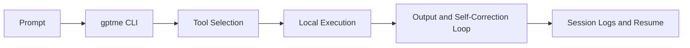

# gptme Tutorial: Open-Source Terminal Agent for Local Tool-Driven Work

> Learn how to use `gptme/gptme` to run a local-first coding and knowledge-work agent with strong CLI ergonomics, extensible tools, and automation-friendly modes.

## Why This Track Matters

gptme is one of the earliest still-active open-source terminal agents and offers a broad toolset for code, shell, web, and automation workflows.

This track focuses on:

- CLI-first operation and prompt workflows
- local tool execution and safety boundaries
- layered configuration for global/project/chat contexts
- extensibility through MCP, ACP, plugins, and automation

## Current Snapshot (auto-updated)

- repository: [`gptme/gptme`](https://github.com/gptme/gptme)
- stars: about **4.2k**
- latest release: [`v0.31.0`](https://github.com/gptme/gptme/releases/tag/v0.31.0)
- recent activity: updates on **February 11, 2026**
- project positioning: unconstrained local/open alternative to managed coding agents

## Mental Model

## Chapter Guide

| Chapter | Key Question | Outcome |
|:--------|:-------------|:--------|
| [01 - Getting Started](01-getting-started.md) | How do I install and run gptme quickly? | Working baseline |
| [02 - Core CLI Workflow and Prompt Patterns](02-core-cli-workflow-and-prompt-patterns.md) | How should I structure prompts and sessions? | Better interactive productivity |
| [03 - Tooling and Local Execution Boundaries](03-tooling-and-local-execution-boundaries.md) | How does gptme act on files, shell, and web context? | Strong tool mental model |
| [04 - Configuration Layers and Environment Strategy](04-configuration-layers-and-environment-strategy.md) | How do global/project/chat configs interact? | Predictable configuration control |
| [05 - Context, Lessons, and Conversation Management](05-context-lessons-and-conversation-management.md) | How does gptme maintain quality across long tasks? | Improved context discipline |
| [06 - MCP, ACP, and Plugin Extensibility](06-mcp-acp-and-plugin-extensibility.md) | How do I connect gptme to external tooling and clients? | Extensibility strategy |
| [07 - Automation, Server Mode, and Agent Templates](07-automation-server-mode-and-agent-templates.md) | How can I operationalize gptme beyond interactive CLI? | Automation and deployment pathways |
| [08 - Production Operations and Security](08-production-operations-and-security.md) | How should teams run gptme safely in production workflows? | Governance baseline |

## What You Will Learn

- how to structure reliable gptme terminal-agent sessions
- how to configure providers/tools across environments
- how to extend gptme with protocols and plugins
- how to run secure, reproducible automation workflows

## Source References

- [gptme Repository](https://github.com/gptme/gptme)
- [gptme README](https://github.com/gptme/gptme/blob/master/README.md)
- [Getting Started docs](https://github.com/gptme/gptme/blob/master/docs/getting-started.rst)
- [Configuration docs](https://github.com/gptme/gptme/blob/master/docs/config.rst)
- [CLI entrypoint](https://github.com/gptme/gptme/blob/master/gptme/cli/main.py)

## Related Tutorials

- [Mistral Vibe Tutorial](../mistral-vibe-tutorial/)
- [Kimi CLI Tutorial](../kimi-cli-tutorial/)
- [OpenCode Tutorial](../opencode-tutorial/)
- [Claude Squad Tutorial](../claude-squad-tutorial/)

---

Start with [Chapter 1: Getting Started](01-getting-started.md).

## Navigation & Backlinks

- [Start Here: Chapter 1: Getting Started](01-getting-started.md)
- [Back to Main Catalog](../../README.md#-tutorial-catalog)
- [Browse A-Z Tutorial Directory](../../discoverability/tutorial-directory.md)
- [Search by Intent](../../discoverability/query-hub.md)
- [Explore Category Hubs](../../README.md#category-hubs)

## Full Chapter Map

1. [Chapter 1: Getting Started](01-getting-started.md)
2. [Chapter 2: Core CLI Workflow and Prompt Patterns](02-core-cli-workflow-and-prompt-patterns.md)
3. [Chapter 3: Tooling and Local Execution Boundaries](03-tooling-and-local-execution-boundaries.md)
4. [Chapter 4: Configuration Layers and Environment Strategy](04-configuration-layers-and-environment-strategy.md)
5. [Chapter 5: Context, Lessons, and Conversation Management](05-context-lessons-and-conversation-management.md)
6. [Chapter 6: MCP, ACP, and Plugin Extensibility](06-mcp-acp-and-plugin-extensibility.md)
7. [Chapter 7: Automation, Server Mode, and Agent Templates](07-automation-server-mode-and-agent-templates.md)
8. [Chapter 8: Production Operations and Security](08-production-operations-and-security.md)

*Generated by [AI Codebase Knowledge Builder](https://github.com/The-Pocket/Tutorial-Codebase-Knowledge)*
