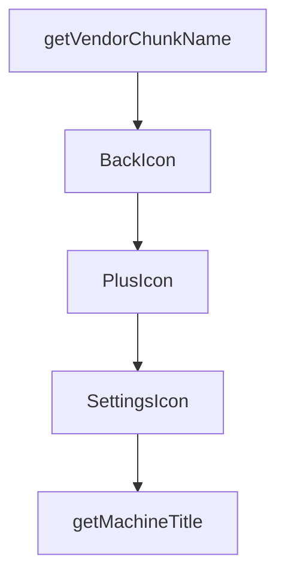

# Chapter 1: Getting Started

Welcome to **Chapter 1: Getting Started**. In this part of **HAPI Tutorial: Remote Control for Local AI Coding Sessions**, you will build an intuitive mental model first, then move into concrete implementation details and practical production tradeoffs.


This chapter gets HAPI installed and verifies a full terminal-to-mobile control loop.

## Prerequisites

| Requirement | Purpose |
|:------------|:--------|
| Claude/Codex/Gemini/OpenCode CLI | agent runtime HAPI wraps |
| npm/Homebrew | HAPI install path |
| phone/browser access | remote approvals and messaging |

## Install and Start

```bash
npm install -g @twsxtd/hapi
hapi hub --relay
hapi
```

`hapi server` is supported as a hub alias.

## First Session Validation

1. hub prints URL + QR code
2. login using generated access token
3. session appears in UI
4. send a message from phone/web and observe terminal response
5. verify permission prompt can be approved remotely

## Initial Troubleshooting

- ensure underlying agent CLI is installed and authenticated
- confirm `HAPI_API_URL`/`CLI_API_TOKEN` when hub is not localhost
- verify relay/tunnel reachability and TLS path

## Summary

You now have a working HAPI baseline with remote control enabled.

Next: [Chapter 2: System Architecture](02-system-architecture.md)

## What Problem Does This Solve?

Most teams struggle here because the hard part is not writing more code, but deciding clear boundaries for `hapi`, `install`, `twsxtd` so behavior stays predictable as complexity grows.

In practical terms, this chapter helps you avoid three common failures:

- coupling core logic too tightly to one implementation path
- missing the handoff boundaries between setup, execution, and validation
- shipping changes without clear rollback or observability strategy

After working through this chapter, you should be able to reason about `Chapter 1: Getting Started` as an operating subsystem inside **HAPI Tutorial: Remote Control for Local AI Coding Sessions**, with explicit contracts for inputs, state transitions, and outputs.

Use the implementation notes around `relay` as your checklist when adapting these patterns to your own repository.

## How it Works Under the Hood

Under the hood, `Chapter 1: Getting Started` usually follows a repeatable control path:

1. **Context bootstrap**: initialize runtime config and prerequisites for `hapi`.
2. **Input normalization**: shape incoming data so `install` receives stable contracts.
3. **Core execution**: run the main logic branch and propagate intermediate state through `twsxtd`.
4. **Policy and safety checks**: enforce limits, auth scopes, and failure boundaries.
5. **Output composition**: return canonical result payloads for downstream consumers.
6. **Operational telemetry**: emit logs/metrics needed for debugging and performance tuning.

When debugging, walk this sequence in order and confirm each stage has explicit success/failure conditions.

## Chapter Connections

- [Tutorial Index](README.md)
- [Next Chapter: Chapter 2: System Architecture](02-system-architecture.md)
- [Main Catalog](../../README.md#-tutorial-catalog)
- [A-Z Tutorial Directory](../../discoverability/tutorial-directory.md)

## Source Code Walkthrough

### `web/vite.config.ts`

The `getVendorChunkName` function in [`web/vite.config.ts`](https://github.com/tiann/hapi/blob/HEAD/web/vite.config.ts) handles a key part of this chapter's functionality:

```ts
const hubTarget = process.env.VITE_HUB_PROXY || 'http://127.0.0.1:3006'

function getVendorChunkName(id: string): string | undefined {
    if (!id.includes('/node_modules/')) {
        return undefined
    }

    if (id.includes('/node_modules/@xterm/')) {
        return 'vendor-terminal'
    }

    if (
        id.includes('/node_modules/@assistant-ui/')
        || id.includes('/node_modules/remark-gfm/')
        || id.includes('/node_modules/hast-util-to-jsx-runtime/')
    ) {
        return 'vendor-assistant'
    }

    if (id.includes('/node_modules/@elevenlabs/react/')) {
        return 'vendor-voice'
    }

    return undefined
}

export default defineConfig({
    define: {
        __APP_VERSION__: JSON.stringify(require('../cli/package.json').version),
    },
    server: {
        host: true,
```

This function is important because it defines how HAPI Tutorial: Remote Control for Local AI Coding Sessions implements the patterns covered in this chapter.

### `web/src/router.tsx`

The `BackIcon` function in [`web/src/router.tsx`](https://github.com/tiann/hapi/blob/HEAD/web/src/router.tsx) handles a key part of this chapter's functionality:

```tsx
import SettingsPage from '@/routes/settings'

function BackIcon(props: { className?: string }) {
    return (
        <svg
            xmlns="http://www.w3.org/2000/svg"
            width="20"
            height="20"
            viewBox="0 0 24 24"
            fill="none"
            stroke="currentColor"
            strokeWidth="2"
            strokeLinecap="round"
            strokeLinejoin="round"
            className={props.className}
        >
            <polyline points="15 18 9 12 15 6" />
        </svg>
    )
}

function PlusIcon(props: { className?: string }) {
    return (
        <svg
            xmlns="http://www.w3.org/2000/svg"
            width="24"
            height="24"
            viewBox="0 0 24 24"
            fill="none"
            stroke="currentColor"
            strokeWidth="2"
            strokeLinecap="round"
```

This function is important because it defines how HAPI Tutorial: Remote Control for Local AI Coding Sessions implements the patterns covered in this chapter.

### `web/src/router.tsx`

The `PlusIcon` function in [`web/src/router.tsx`](https://github.com/tiann/hapi/blob/HEAD/web/src/router.tsx) handles a key part of this chapter's functionality:

```tsx
}

function PlusIcon(props: { className?: string }) {
    return (
        <svg
            xmlns="http://www.w3.org/2000/svg"
            width="24"
            height="24"
            viewBox="0 0 24 24"
            fill="none"
            stroke="currentColor"
            strokeWidth="2"
            strokeLinecap="round"
            strokeLinejoin="round"
            className={props.className}
        >
            <line x1="12" y1="5" x2="12" y2="19" />
            <line x1="5" y1="12" x2="19" y2="12" />
        </svg>
    )
}

function SettingsIcon(props: { className?: string }) {
    return (
        <svg
            xmlns="http://www.w3.org/2000/svg"
            width="20"
            height="20"
            viewBox="0 0 24 24"
            fill="none"
            stroke="currentColor"
            strokeWidth="2"
```

This function is important because it defines how HAPI Tutorial: Remote Control for Local AI Coding Sessions implements the patterns covered in this chapter.

### `web/src/router.tsx`

The `SettingsIcon` function in [`web/src/router.tsx`](https://github.com/tiann/hapi/blob/HEAD/web/src/router.tsx) handles a key part of this chapter's functionality:

```tsx
}

function SettingsIcon(props: { className?: string }) {
    return (
        <svg
            xmlns="http://www.w3.org/2000/svg"
            width="20"
            height="20"
            viewBox="0 0 24 24"
            fill="none"
            stroke="currentColor"
            strokeWidth="2"
            strokeLinecap="round"
            strokeLinejoin="round"
            className={props.className}
        >
            <circle cx="12" cy="12" r="3" />
            <path d="M19.4 15a1.65 1.65 0 0 0 .33 1.82l.06.06a2 2 0 0 1 0 2.83 2 2 0 0 1-2.83 0l-.06-.06a1.65 1.65 0 0 0-1.82-.33 1.65 1.65 0 0 0-1 1.51V21a2 2 0 0 1-2 2 2 2 0 0 1-2-2v-.09A1.65 1.65 0 0 0 9 19.4a1.65 1.65 0 0 0-1.82.33l-.06.06a2 2 0 0 1-2.83 0 2 2 0 0 1 0-2.83l.06-.06a1.65 1.65 0 0 0 .33-1.82 1.65 1.65 0 0 0-1.51-1H3a2 2 0 0 1-2-2 2 2 0 0 1 2-2h.09A1.65 1.65 0 0 0 4.6 9a1.65 1.65 0 0 0-.33-1.82l-.06-.06a2 2 0 0 1 0-2.83 2 2 0 0 1 2.83 0l.06.06a1.65 1.65 0 0 0 1.82.33H9a1.65 1.65 0 0 0 1-1.51V3a2 2 0 0 1 2-2 2 2 0 0 1 2 2v.09a1.65 1.65 0 0 0 1 1.51 1.65 1.65 0 0 0 1.82-.33l.06-.06a2 2 0 0 1 2.83 0 2 2 0 0 1 0 2.83l-.06.06a1.65 1.65 0 0 0-.33 1.82V9a1.65 1.65 0 0 0 1.51 1H21a2 2 0 0 1 2 2 2 2 0 0 1-2 2h-.09a1.65 1.65 0 0 0-1.51 1z" />
        </svg>
    )
}

function getMachineTitle(machine: Machine): string {
    if (machine.metadata?.displayName) return machine.metadata.displayName
    if (machine.metadata?.host) return machine.metadata.host
    return machine.id.slice(0, 8)
}

function SessionsPage() {
    const { api } = useAppContext()
    const navigate = useNavigate()
    const pathname = useLocation({ select: location => location.pathname })
```

This function is important because it defines how HAPI Tutorial: Remote Control for Local AI Coding Sessions implements the patterns covered in this chapter.


## How These Components Connect


