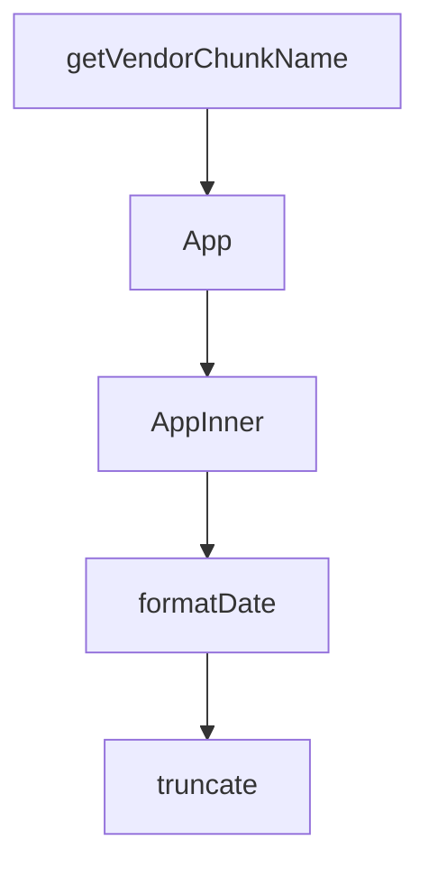

# Chapter 1: Getting Started

Welcome to **Chapter 1: Getting Started**. In this part of **HAPI Tutorial: Remote Control for Local AI Coding Sessions**, you will build an intuitive mental model first, then move into concrete implementation details and practical production tradeoffs.


This chapter gets HAPI installed and verifies a full terminal-to-mobile control loop.

## Prerequisites

| Requirement | Purpose |
|:------------|:--------|
| Claude/Codex/Gemini/OpenCode CLI | agent runtime HAPI wraps |
| npm/Homebrew | HAPI install path |
| phone/browser access | remote approvals and messaging |

## Install and Start

```bash
npm install -g @twsxtd/hapi
hapi hub --relay
hapi
```

`hapi server` is supported as a hub alias.

## First Session Validation

1. hub prints URL + QR code
2. login using generated access token
3. session appears in UI
4. send a message from phone/web and observe terminal response
5. verify permission prompt can be approved remotely

## Initial Troubleshooting

- ensure underlying agent CLI is installed and authenticated
- confirm `HAPI_API_URL`/`CLI_API_TOKEN` when hub is not localhost
- verify relay/tunnel reachability and TLS path

## Summary

You now have a working HAPI baseline with remote control enabled.

Next: [Chapter 2: System Architecture](02-system-architecture.md)

## What Problem Does This Solve?

Most teams struggle here because the hard part is not writing more code, but deciding clear boundaries for `hapi`, `install`, `twsxtd` so behavior stays predictable as complexity grows.

In practical terms, this chapter helps you avoid three common failures:

- coupling core logic too tightly to one implementation path
- missing the handoff boundaries between setup, execution, and validation
- shipping changes without clear rollback or observability strategy

After working through this chapter, you should be able to reason about `Chapter 1: Getting Started` as an operating subsystem inside **HAPI Tutorial: Remote Control for Local AI Coding Sessions**, with explicit contracts for inputs, state transitions, and outputs.

Use the implementation notes around `relay` as your checklist when adapting these patterns to your own repository.

## How it Works Under the Hood

Under the hood, `Chapter 1: Getting Started` usually follows a repeatable control path:

1. **Context bootstrap**: initialize runtime config and prerequisites for `hapi`.
2. **Input normalization**: shape incoming data so `install` receives stable contracts.
3. **Core execution**: run the main logic branch and propagate intermediate state through `twsxtd`.
4. **Policy and safety checks**: enforce limits, auth scopes, and failure boundaries.
5. **Output composition**: return canonical result payloads for downstream consumers.
6. **Operational telemetry**: emit logs/metrics needed for debugging and performance tuning.

When debugging, walk this sequence in order and confirm each stage has explicit success/failure conditions.

## Source Walkthrough

Use the following upstream sources to verify implementation details while reading this chapter:

- [HAPI Repository](https://github.com/tiann/hapi)
  Why it matters: authoritative reference on `HAPI Repository` (github.com).
- [HAPI Releases](https://github.com/tiann/hapi/releases)
  Why it matters: authoritative reference on `HAPI Releases` (github.com).
- [HAPI Docs](https://hapi.run)
  Why it matters: authoritative reference on `HAPI Docs` (hapi.run).

Suggested trace strategy:
- search upstream code for `hapi` and `install` to map concrete implementation paths
- compare docs claims against actual runtime/config code before reusing patterns in production

## Chapter Connections

- [Tutorial Index](README.md)
- [Next Chapter: Chapter 2: System Architecture](02-system-architecture.md)
- [Main Catalog](../../README.md#-tutorial-catalog)
- [A-Z Tutorial Directory](../../discoverability/tutorial-directory.md)

## Depth Expansion Playbook

## Source Code Walkthrough

### `web/vite.config.ts`

The `getVendorChunkName` function in [`web/vite.config.ts`](https://github.com/tiann/hapi/blob/HEAD/web/vite.config.ts) handles a key part of this chapter's functionality:

```ts
const hubTarget = process.env.VITE_HUB_PROXY || 'http://127.0.0.1:3006'

function getVendorChunkName(id: string): string | undefined {
    if (!id.includes('/node_modules/')) {
        return undefined
    }

    if (id.includes('/node_modules/@xterm/')) {
        return 'vendor-terminal'
    }

    if (
        id.includes('/node_modules/@assistant-ui/')
        || id.includes('/node_modules/remark-gfm/')
        || id.includes('/node_modules/hast-util-to-jsx-runtime/')
    ) {
        return 'vendor-assistant'
    }

    if (id.includes('/node_modules/@elevenlabs/react/')) {
        return 'vendor-voice'
    }

    return undefined
}

export default defineConfig({
    define: {
        __APP_VERSION__: JSON.stringify(require('../cli/package.json').version),
    },
    server: {
        host: true,
```

This function is important because it defines how HAPI Tutorial: Remote Control for Local AI Coding Sessions implements the patterns covered in this chapter.

### `web/src/App.tsx`

The `App` function in [`web/src/App.tsx`](https://github.com/tiann/hapi/blob/HEAD/web/src/App.tsx) handles a key part of this chapter's functionality:

```tsx
import { Outlet, useLocation, useMatchRoute, useRouter } from '@tanstack/react-router'
import { useQueryClient } from '@tanstack/react-query'
import { getTelegramWebApp, isTelegramApp } from '@/hooks/useTelegram'
import { initializeTheme } from '@/hooks/useTheme'
import { useAuth } from '@/hooks/useAuth'
import { useAuthSource } from '@/hooks/useAuthSource'
import { useServerUrl } from '@/hooks/useServerUrl'
import { useSSE } from '@/hooks/useSSE'
import { useSyncingState } from '@/hooks/useSyncingState'
import { usePushNotifications } from '@/hooks/usePushNotifications'
import { useVisibilityReporter } from '@/hooks/useVisibilityReporter'
import { queryKeys } from '@/lib/query-keys'
import { AppContextProvider } from '@/lib/app-context'
import { fetchLatestMessages } from '@/lib/message-window-store'
import { useAppGoBack } from '@/hooks/useAppGoBack'
import { useTranslation } from '@/lib/use-translation'
import { VoiceProvider } from '@/lib/voice-context'
import { requireHubUrlForLogin } from '@/lib/runtime-config'
import { LoginPrompt } from '@/components/LoginPrompt'
import { InstallPrompt } from '@/components/InstallPrompt'
import { OfflineBanner } from '@/components/OfflineBanner'
import { SyncingBanner } from '@/components/SyncingBanner'
import { ReconnectingBanner } from '@/components/ReconnectingBanner'
import { VoiceErrorBanner } from '@/components/VoiceErrorBanner'
import { LoadingState } from '@/components/LoadingState'
import { ToastContainer } from '@/components/ToastContainer'
import { ToastProvider, useToast } from '@/lib/toast-context'
import type { SyncEvent } from '@/types/api'

type ToastEvent = Extract<SyncEvent, { type: 'toast' }>

const REQUIRE_SERVER_URL = requireHubUrlForLogin()
```

This function is important because it defines how HAPI Tutorial: Remote Control for Local AI Coding Sessions implements the patterns covered in this chapter.

### `web/src/App.tsx`

The `AppInner` function in [`web/src/App.tsx`](https://github.com/tiann/hapi/blob/HEAD/web/src/App.tsx) handles a key part of this chapter's functionality:

```tsx
    return (
        <ToastProvider>
            <AppInner />
        </ToastProvider>
    )
}

function AppInner() {
    const { t } = useTranslation()
    const { serverUrl, baseUrl, setServerUrl, clearServerUrl } = useServerUrl()
    const { authSource, isLoading: isAuthSourceLoading, setAccessToken } = useAuthSource(baseUrl)
    const { token, api, isLoading: isAuthLoading, error: authError, needsBinding, bind } = useAuth(authSource, baseUrl)
    const goBack = useAppGoBack()
    const pathname = useLocation({ select: (location) => location.pathname })
    const matchRoute = useMatchRoute()
    const router = useRouter()
    const { addToast } = useToast()

    useEffect(() => {
        const tg = getTelegramWebApp()
        tg?.ready()
        tg?.expand()
        initializeTheme()
    }, [])

    useEffect(() => {
        const preventDefault = (event: Event) => {
            event.preventDefault()
        }

        const onWheel = (event: WheelEvent) => {
            if (event.ctrlKey) {
```

This function is important because it defines how HAPI Tutorial: Remote Control for Local AI Coding Sessions implements the patterns covered in this chapter.

### `hub/scripts/cleanup-sessions.ts`

The `formatDate` function in [`hub/scripts/cleanup-sessions.ts`](https://github.com/tiann/hapi/blob/HEAD/hub/scripts/cleanup-sessions.ts) handles a key part of this chapter's functionality:

```ts

// Format timestamp as human-readable date
function formatDate(timestamp: number): string {
    const date = new Date(timestamp)
    return date.toLocaleDateString('en-US', {
        month: 'short',
        day: 'numeric',
        year: 'numeric'
    })
}

// Truncate string to max length with ellipsis
function truncate(str: string, maxLen: number): string {
    if (str.length <= maxLen) return str
    return str.slice(0, maxLen - 3) + '...'
}

// Extract text from user message content
function extractUserText(content: unknown): string | null {
    if (!content || typeof content !== 'object') return null
    const c = content as Record<string, unknown>
    if (c.role !== 'user') return null
    const inner = c.content
    // Handle { content: { type: 'text', text: '...' } }
    if (inner && typeof inner === 'object') {
        const textObj = inner as Record<string, unknown>
        if (textObj.type === 'text' && typeof textObj.text === 'string') {
            return textObj.text
        }
    }
    // Handle { content: '...' } (string)
    if (typeof inner === 'string') {
```

This function is important because it defines how HAPI Tutorial: Remote Control for Local AI Coding Sessions implements the patterns covered in this chapter.


## How These Components Connect


