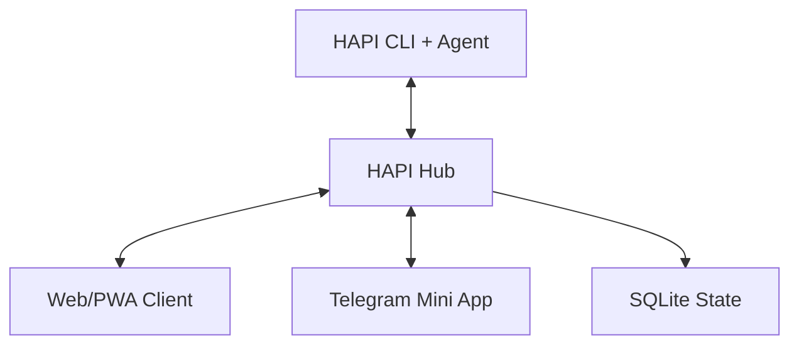

# Chapter 2: System Architecture

HAPI uses three core components: CLI wrapper, hub control plane, and web/PWA interface.

## Core Topology

## Component Responsibilities

| Component | Responsibilities |
|:----------|:-----------------|
| CLI | wraps agent sessions, relays messages, handles permission requests |
| Hub | HTTP API, Socket.IO, SSE, persistence, notifications |
| Web/PWA | session UI, approvals, message relay, status monitoring |

## Protocol Boundaries

- CLI to hub: Socket.IO for real-time bidirectional messaging
- hub to clients: REST for actions + SSE for live updates
- optional external access: relay/tunnel for remote device connectivity

## Summary

You now understand where session state, message transport, and user control are coordinated.

Next: [Chapter 3: Session Lifecycle and Handoff](03-session-lifecycle-and-handoff.md)
