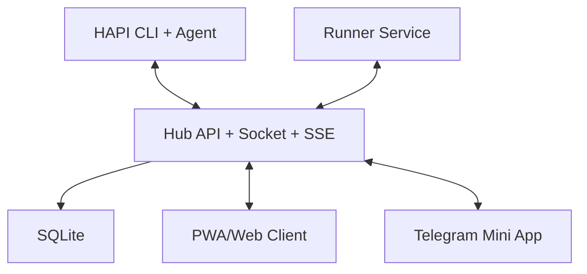

# Chapter 2: System Architecture

HAPI is a control plane around local coding agents: CLI wrapper, hub service, and remote clients.

## Architecture Diagram

## Component Roles

| Component | Responsibilities |
|:----------|:-----------------|
| CLI | wraps agent process, relays messages, emits permission events |
| Hub | session persistence, real-time transport, auth, notifications |
| PWA/Web | remote session control and approval UX |
| Runner | background machine service for remote session spawning |

## Protocol Boundaries

- CLI to hub: Socket.IO for low-latency bidirectional events
- hub to UI: REST for actions, SSE for live updates
- external users: relay/tunnel ingress with token-based auth

## Summary

You now understand where HAPI stores state and routes interactive control.

Next: [Chapter 3: Session Lifecycle and Handoff](03-session-lifecycle-and-handoff.md)
