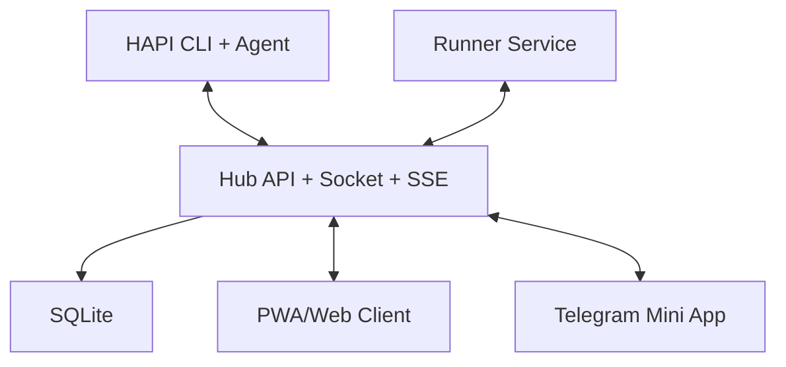

# Chapter 2: System Architecture

Welcome to **Chapter 2: System Architecture**. In this part of **HAPI Tutorial: Remote Control for Local AI Coding Sessions**, you will build an intuitive mental model first, then move into concrete implementation details and practical production tradeoffs.

HAPI is a control plane around local coding agents: CLI wrapper, hub service, and remote clients.

## Architecture Diagram

## Component Roles

| Component | Responsibilities |
|:----------|:-----------------|
| CLI | wraps agent process, relays messages, emits permission events |
| Hub | session persistence, real-time transport, auth, notifications |
| PWA/Web | remote session control and approval UX |
| Runner | background machine service for remote session spawning |

## Protocol Boundaries

- CLI to hub: Socket.IO for low-latency bidirectional events
- hub to UI: REST for actions, SSE for live updates
- external users: relay/tunnel ingress with token-based auth

## Summary

You now understand where HAPI stores state and routes interactive control.

Next: [Chapter 3: Session Lifecycle and Handoff](03-session-lifecycle-and-handoff.md)

## What Problem Does This Solve?

Most teams struggle here because the hard part is not writing more code, but deciding clear boundaries for `graph`, `HAPI`, `Agent` so behavior stays predictable as complexity grows.

In practical terms, this chapter helps you avoid three common failures:

- coupling core logic too tightly to one implementation path
- missing the handoff boundaries between setup, execution, and validation
- shipping changes without clear rollback or observability strategy

After working through this chapter, you should be able to reason about `Chapter 2: System Architecture` as an operating subsystem inside **HAPI Tutorial: Remote Control for Local AI Coding Sessions**, with explicit contracts for inputs, state transitions, and outputs.

Use the implementation notes around `Socket`, `SQLite`, `Client` as your checklist when adapting these patterns to your own repository.

## How it Works Under the Hood

Under the hood, `Chapter 2: System Architecture` usually follows a repeatable control path:

1. **Context bootstrap**: initialize runtime config and prerequisites for `graph`.
2. **Input normalization**: shape incoming data so `HAPI` receives stable contracts.
3. **Core execution**: run the main logic branch and propagate intermediate state through `Agent`.
4. **Policy and safety checks**: enforce limits, auth scopes, and failure boundaries.
5. **Output composition**: return canonical result payloads for downstream consumers.
6. **Operational telemetry**: emit logs/metrics needed for debugging and performance tuning.

When debugging, walk this sequence in order and confirm each stage has explicit success/failure conditions.

## Source Walkthrough

Use the following upstream sources to verify implementation details while reading this chapter:

- [HAPI Repository](https://github.com/tiann/hapi)
  Why it matters: authoritative reference on `HAPI Repository` (github.com).
- [HAPI Releases](https://github.com/tiann/hapi/releases)
  Why it matters: authoritative reference on `HAPI Releases` (github.com).
- [HAPI Docs](https://hapi.run)
  Why it matters: authoritative reference on `HAPI Docs` (hapi.run).

Suggested trace strategy:
- search upstream code for `graph` and `HAPI` to map concrete implementation paths
- compare docs claims against actual runtime/config code before reusing patterns in production

## Chapter Connections

- [Tutorial Index](index.md)
- [Previous Chapter: Chapter 1: Getting Started](01-getting-started.md)
- [Next Chapter: Chapter 3: Session Lifecycle and Handoff](03-session-lifecycle-and-handoff.md)
- [Main Catalog](../../README.md#-tutorial-catalog)
- [A-Z Tutorial Directory](../../discoverability/tutorial-directory.md)
