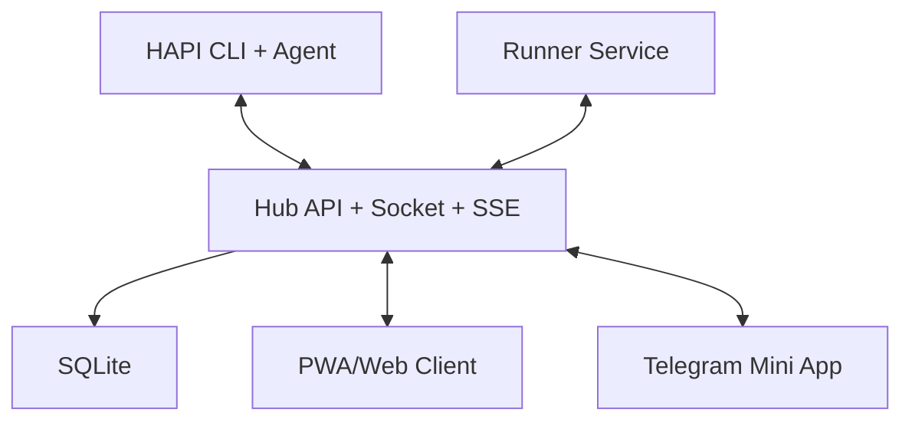
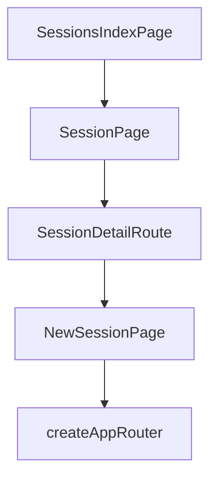

# Chapter 2: System Architecture

Welcome to **Chapter 2: System Architecture**. In this part of **HAPI Tutorial: Remote Control for Local AI Coding Sessions**, you will build an intuitive mental model first, then move into concrete implementation details and practical production tradeoffs.


HAPI is a control plane around local coding agents: CLI wrapper, hub service, and remote clients.

## Architecture Diagram


```mermaid
graph TD
    CLI[HAPI CLI + Agent] <--> HUB[Hub API + Socket + SSE]
    HUB --> DB[SQLite]
    HUB <--> WEB[PWA/Web Client]
    HUB <--> TG[Telegram Mini App]
    RUN[Runner Service] <--> HUB
```

## Component Roles

| Component | Responsibilities |
|:----------|:-----------------|
| CLI | wraps agent process, relays messages, emits permission events |
| Hub | session persistence, real-time transport, auth, notifications |
| PWA/Web | remote session control and approval UX |
| Runner | background machine service for remote session spawning |

## Protocol Boundaries

- CLI to hub: Socket.IO for low-latency bidirectional events
- hub to UI: REST for actions, SSE for live updates
- external users: relay/tunnel ingress with token-based auth

## Summary

You now understand where HAPI stores state and routes interactive control.

Next: [Chapter 3: Session Lifecycle and Handoff](03-session-lifecycle-and-handoff.md)

## What Problem Does This Solve?

Most teams struggle here because the hard part is not writing more code, but deciding clear boundaries for `graph`, `HAPI`, `Agent` so behavior stays predictable as complexity grows.

In practical terms, this chapter helps you avoid three common failures:

- coupling core logic too tightly to one implementation path
- missing the handoff boundaries between setup, execution, and validation
- shipping changes without clear rollback or observability strategy

After working through this chapter, you should be able to reason about `Chapter 2: System Architecture` as an operating subsystem inside **HAPI Tutorial: Remote Control for Local AI Coding Sessions**, with explicit contracts for inputs, state transitions, and outputs.

Use the implementation notes around `Socket`, `SQLite`, `Client` as your checklist when adapting these patterns to your own repository.

## How it Works Under the Hood

Under the hood, `Chapter 2: System Architecture` usually follows a repeatable control path:

1. **Context bootstrap**: initialize runtime config and prerequisites for `graph`.
2. **Input normalization**: shape incoming data so `HAPI` receives stable contracts.
3. **Core execution**: run the main logic branch and propagate intermediate state through `Agent`.
4. **Policy and safety checks**: enforce limits, auth scopes, and failure boundaries.
5. **Output composition**: return canonical result payloads for downstream consumers.
6. **Operational telemetry**: emit logs/metrics needed for debugging and performance tuning.

When debugging, walk this sequence in order and confirm each stage has explicit success/failure conditions.

## Chapter Connections

- [Tutorial Index](README.md)
- [Previous Chapter: Chapter 1: Getting Started](01-getting-started.md)
- [Next Chapter: Chapter 3: Session Lifecycle and Handoff](03-session-lifecycle-and-handoff.md)
- [Main Catalog](../../README.md#-tutorial-catalog)
- [A-Z Tutorial Directory](../../discoverability/tutorial-directory.md)

## Source Code Walkthrough

### `web/src/router.tsx`

The `SessionsIndexPage` function in [`web/src/router.tsx`](https://github.com/tiann/hapi/blob/HEAD/web/src/router.tsx) handles a key part of this chapter's functionality:

```tsx
}

function SessionsIndexPage() {
    return null
}

function SessionPage() {
    const { api } = useAppContext()
    const { t } = useTranslation()
    const goBack = useAppGoBack()
    const navigate = useNavigate()
    const queryClient = useQueryClient()
    const { addToast } = useToast()
    const { sessionId } = useParams({ from: '/sessions/$sessionId' })
    const {
        session,
        refetch: refetchSession,
    } = useSession(api, sessionId)
    const {
        messages,
        warning: messagesWarning,
        isLoading: messagesLoading,
        isLoadingMore: messagesLoadingMore,
        hasMore: messagesHasMore,
        loadMore: loadMoreMessages,
        refetch: refetchMessages,
        pendingCount,
        messagesVersion,
        flushPending,
        setAtBottom,
    } = useMessages(api, sessionId)
    const {
```

This function is important because it defines how HAPI Tutorial: Remote Control for Local AI Coding Sessions implements the patterns covered in this chapter.

### `web/src/router.tsx`

The `SessionPage` function in [`web/src/router.tsx`](https://github.com/tiann/hapi/blob/HEAD/web/src/router.tsx) handles a key part of this chapter's functionality:

```tsx
}

function SessionPage() {
    const { api } = useAppContext()
    const { t } = useTranslation()
    const goBack = useAppGoBack()
    const navigate = useNavigate()
    const queryClient = useQueryClient()
    const { addToast } = useToast()
    const { sessionId } = useParams({ from: '/sessions/$sessionId' })
    const {
        session,
        refetch: refetchSession,
    } = useSession(api, sessionId)
    const {
        messages,
        warning: messagesWarning,
        isLoading: messagesLoading,
        isLoadingMore: messagesLoadingMore,
        hasMore: messagesHasMore,
        loadMore: loadMoreMessages,
        refetch: refetchMessages,
        pendingCount,
        messagesVersion,
        flushPending,
        setAtBottom,
    } = useMessages(api, sessionId)
    const {
        sendMessage,
        retryMessage,
        isSending,
    } = useSendMessage(api, sessionId, {
```

This function is important because it defines how HAPI Tutorial: Remote Control for Local AI Coding Sessions implements the patterns covered in this chapter.

### `web/src/router.tsx`

The `SessionDetailRoute` function in [`web/src/router.tsx`](https://github.com/tiann/hapi/blob/HEAD/web/src/router.tsx) handles a key part of this chapter's functionality:

```tsx
}

function SessionDetailRoute() {
    const pathname = useLocation({ select: location => location.pathname })
    const { sessionId } = useParams({ from: '/sessions/$sessionId' })
    const basePath = `/sessions/${sessionId}`
    const isChat = pathname === basePath || pathname === `${basePath}/`

    return isChat ? <SessionPage /> : <Outlet />
}

function NewSessionPage() {
    const { api } = useAppContext()
    const navigate = useNavigate()
    const goBack = useAppGoBack()
    const queryClient = useQueryClient()
    const { machines, isLoading: machinesLoading, error: machinesError } = useMachines(api, true)
    const { t } = useTranslation()

    const handleCancel = useCallback(() => {
        navigate({ to: '/sessions' })
    }, [navigate])

    const handleSuccess = useCallback((sessionId: string) => {
        void queryClient.invalidateQueries({ queryKey: queryKeys.sessions })
        // Replace current page with /sessions to clear spawn flow from history
        navigate({ to: '/sessions', replace: true })
        // Then navigate to new session
        requestAnimationFrame(() => {
            navigate({
                to: '/sessions/$sessionId',
                params: { sessionId },
```

This function is important because it defines how HAPI Tutorial: Remote Control for Local AI Coding Sessions implements the patterns covered in this chapter.

### `web/src/router.tsx`

The `NewSessionPage` function in [`web/src/router.tsx`](https://github.com/tiann/hapi/blob/HEAD/web/src/router.tsx) handles a key part of this chapter's functionality:

```tsx
}

function NewSessionPage() {
    const { api } = useAppContext()
    const navigate = useNavigate()
    const goBack = useAppGoBack()
    const queryClient = useQueryClient()
    const { machines, isLoading: machinesLoading, error: machinesError } = useMachines(api, true)
    const { t } = useTranslation()

    const handleCancel = useCallback(() => {
        navigate({ to: '/sessions' })
    }, [navigate])

    const handleSuccess = useCallback((sessionId: string) => {
        void queryClient.invalidateQueries({ queryKey: queryKeys.sessions })
        // Replace current page with /sessions to clear spawn flow from history
        navigate({ to: '/sessions', replace: true })
        // Then navigate to new session
        requestAnimationFrame(() => {
            navigate({
                to: '/sessions/$sessionId',
                params: { sessionId },
            })
        })
    }, [navigate, queryClient])

    return (
        <div className="flex h-full min-h-0 flex-col">
            <div className="flex items-center gap-2 border-b border-[var(--app-border)] bg-[var(--app-bg)] p-3 pt-[calc(0.75rem+env(safe-area-inset-top))]">
                {!isTelegramApp() && (
                    <button
```

This function is important because it defines how HAPI Tutorial: Remote Control for Local AI Coding Sessions implements the patterns covered in this chapter.


## How These Components Connect


```mermaid
flowchart TD
    A[SessionsIndexPage]
    B[SessionPage]
    C[SessionDetailRoute]
    D[NewSessionPage]
    E[createAppRouter]
    A --> B
    B --> C
    C --> D
    D --> E
```
