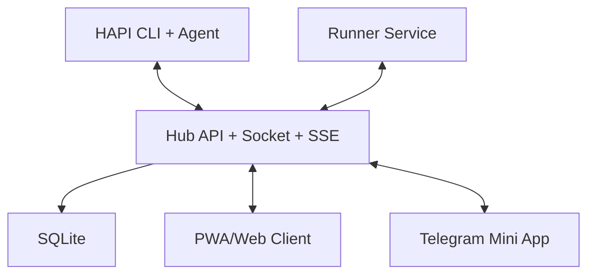
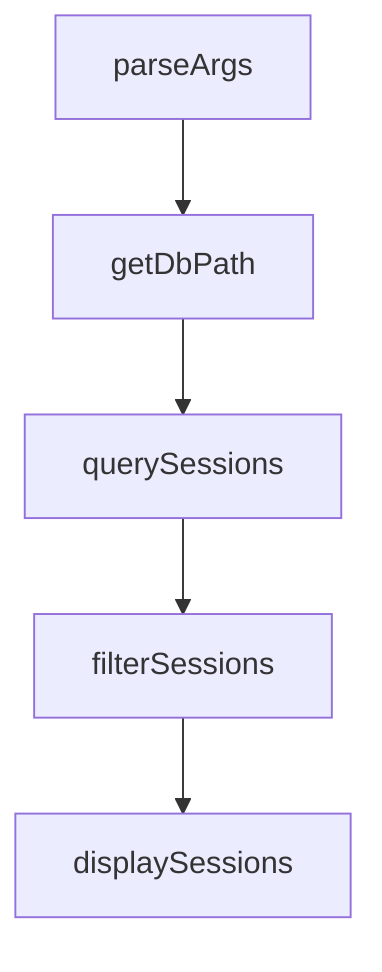

# Chapter 2: System Architecture

Welcome to **Chapter 2: System Architecture**. In this part of **HAPI Tutorial: Remote Control for Local AI Coding Sessions**, you will build an intuitive mental model first, then move into concrete implementation details and practical production tradeoffs.


HAPI is a control plane around local coding agents: CLI wrapper, hub service, and remote clients.

## Architecture Diagram


```mermaid
graph TD
    CLI[HAPI CLI + Agent] <--> HUB[Hub API + Socket + SSE]
    HUB --> DB[SQLite]
    HUB <--> WEB[PWA/Web Client]
    HUB <--> TG[Telegram Mini App]
    RUN[Runner Service] <--> HUB
```

## Component Roles

| Component | Responsibilities |
|:----------|:-----------------|
| CLI | wraps agent process, relays messages, emits permission events |
| Hub | session persistence, real-time transport, auth, notifications |
| PWA/Web | remote session control and approval UX |
| Runner | background machine service for remote session spawning |

## Protocol Boundaries

- CLI to hub: Socket.IO for low-latency bidirectional events
- hub to UI: REST for actions, SSE for live updates
- external users: relay/tunnel ingress with token-based auth

## Summary

You now understand where HAPI stores state and routes interactive control.

Next: [Chapter 3: Session Lifecycle and Handoff](03-session-lifecycle-and-handoff.md)

## What Problem Does This Solve?

Most teams struggle here because the hard part is not writing more code, but deciding clear boundaries for `graph`, `HAPI`, `Agent` so behavior stays predictable as complexity grows.

In practical terms, this chapter helps you avoid three common failures:

- coupling core logic too tightly to one implementation path
- missing the handoff boundaries between setup, execution, and validation
- shipping changes without clear rollback or observability strategy

After working through this chapter, you should be able to reason about `Chapter 2: System Architecture` as an operating subsystem inside **HAPI Tutorial: Remote Control for Local AI Coding Sessions**, with explicit contracts for inputs, state transitions, and outputs.

Use the implementation notes around `Socket`, `SQLite`, `Client` as your checklist when adapting these patterns to your own repository.

## How it Works Under the Hood

Under the hood, `Chapter 2: System Architecture` usually follows a repeatable control path:

1. **Context bootstrap**: initialize runtime config and prerequisites for `graph`.
2. **Input normalization**: shape incoming data so `HAPI` receives stable contracts.
3. **Core execution**: run the main logic branch and propagate intermediate state through `Agent`.
4. **Policy and safety checks**: enforce limits, auth scopes, and failure boundaries.
5. **Output composition**: return canonical result payloads for downstream consumers.
6. **Operational telemetry**: emit logs/metrics needed for debugging and performance tuning.

When debugging, walk this sequence in order and confirm each stage has explicit success/failure conditions.

## Source Walkthrough

Use the following upstream sources to verify implementation details while reading this chapter:

- [HAPI Repository](https://github.com/tiann/hapi)
  Why it matters: authoritative reference on `HAPI Repository` (github.com).
- [HAPI Releases](https://github.com/tiann/hapi/releases)
  Why it matters: authoritative reference on `HAPI Releases` (github.com).
- [HAPI Docs](https://hapi.run)
  Why it matters: authoritative reference on `HAPI Docs` (hapi.run).

Suggested trace strategy:
- search upstream code for `graph` and `HAPI` to map concrete implementation paths
- compare docs claims against actual runtime/config code before reusing patterns in production

## Chapter Connections

- [Tutorial Index](README.md)
- [Previous Chapter: Chapter 1: Getting Started](01-getting-started.md)
- [Next Chapter: Chapter 3: Session Lifecycle and Handoff](03-session-lifecycle-and-handoff.md)
- [Main Catalog](../../README.md#-tutorial-catalog)
- [A-Z Tutorial Directory](../../discoverability/tutorial-directory.md)

## Depth Expansion Playbook

## Source Code Walkthrough

### `hub/scripts/cleanup-sessions.ts`

The `parseArgs` function in [`hub/scripts/cleanup-sessions.ts`](https://github.com/tiann/hapi/blob/HEAD/hub/scripts/cleanup-sessions.ts) handles a key part of this chapter's functionality:

```ts

// Parse command line arguments
function parseArgs(): { minMessages: number | null; pathPattern: string | null; messagePattern: string | null; orphaned: boolean; force: boolean; help: boolean } {
    const args = process.argv.slice(2)
    let minMessages: number | null = null
    let pathPattern: string | null = null
    let messagePattern: string | null = null
    let orphaned = false
    let force = false
    let help = false

    for (const arg of args) {
        if (arg === '--help' || arg === '-h') {
            help = true
        } else if (arg === '--force' || arg === '-f') {
            force = true
        } else if (arg === '--orphaned') {
            orphaned = true
        } else if (arg.startsWith('--min-messages=')) {
            const value = parseInt(arg.split('=')[1], 10)
            if (isNaN(value) || value < 0) {
                console.error('Error: --min-messages must be a non-negative integer')
                process.exit(1)
            }
            minMessages = value
        } else if (arg.startsWith('--path=')) {
            pathPattern = arg.split('=').slice(1).join('=') // Handle paths with '='
        } else if (arg.startsWith('--message=')) {
            messagePattern = arg.split('=').slice(1).join('=').toLowerCase()
        } else {
            console.error(`Unknown argument: ${arg}`)
            console.error('Use --help for usage information')
```

This function is important because it defines how HAPI Tutorial: Remote Control for Local AI Coding Sessions implements the patterns covered in this chapter.

### `hub/scripts/cleanup-sessions.ts`

The `getDbPath` function in [`hub/scripts/cleanup-sessions.ts`](https://github.com/tiann/hapi/blob/HEAD/hub/scripts/cleanup-sessions.ts) handles a key part of this chapter's functionality:

```ts

// Get database path (same logic as configuration.ts)
function getDbPath(): string {
    if (process.env.DB_PATH) {
        return process.env.DB_PATH.replace(/^~/, homedir())
    }
    const dataDir = process.env.HAPI_HOME
        ? process.env.HAPI_HOME.replace(/^~/, homedir())
        : join(homedir(), '.hapi')
    return join(dataDir, 'hapi.db')
}

// Session info for display
interface SessionInfo {
    id: string
    title: string | null
    firstUserMessage: string | null
    path: string | null
    updatedAt: number
    messageCount: number
}

// Query sessions with message counts
function querySessions(db: Database): SessionInfo[] {
    // Get basic session info
    const sessionRows = db.query<
        { id: string; metadata: string | null; updated_at: number; message_count: number },
        []
    >(`
        SELECT
            s.id,
            s.metadata,
```

This function is important because it defines how HAPI Tutorial: Remote Control for Local AI Coding Sessions implements the patterns covered in this chapter.

### `hub/scripts/cleanup-sessions.ts`

The `querySessions` function in [`hub/scripts/cleanup-sessions.ts`](https://github.com/tiann/hapi/blob/HEAD/hub/scripts/cleanup-sessions.ts) handles a key part of this chapter's functionality:

```ts

// Query sessions with message counts
function querySessions(db: Database): SessionInfo[] {
    // Get basic session info
    const sessionRows = db.query<
        { id: string; metadata: string | null; updated_at: number; message_count: number },
        []
    >(`
        SELECT
            s.id,
            s.metadata,
            s.updated_at,
            COUNT(m.id) as message_count
        FROM sessions s
        LEFT JOIN messages m ON m.session_id = s.id
        GROUP BY s.id
    `).all()

    // Get all messages for processing
    const messageRows = db.query<
        { session_id: string; content: string; seq: number },
        []
    >(`
        SELECT session_id, content, seq
        FROM messages
        ORDER BY session_id, seq
    `).all()

    // Group messages by session
    const messagesBySession = new Map<string, { content: string; seq: number }[]>()
    for (const msg of messageRows) {
        const list = messagesBySession.get(msg.session_id) ?? []
```

This function is important because it defines how HAPI Tutorial: Remote Control for Local AI Coding Sessions implements the patterns covered in this chapter.

### `hub/scripts/cleanup-sessions.ts`

The `filterSessions` function in [`hub/scripts/cleanup-sessions.ts`](https://github.com/tiann/hapi/blob/HEAD/hub/scripts/cleanup-sessions.ts) handles a key part of this chapter's functionality:

```ts

// Filter sessions based on criteria
function filterSessions(
    sessions: SessionInfo[],
    minMessages: number | null,
    pathPattern: string | null,
    messagePattern: string | null,
    orphaned: boolean
): SessionInfo[] {
    let filtered = sessions

    // Filter by message count if specified
    if (minMessages !== null) {
        filtered = filtered.filter(s => s.messageCount < minMessages)
    }

    // Filter by path pattern if specified
    if (pathPattern !== null) {
        const glob = new Bun.Glob(pathPattern)
        filtered = filtered.filter(s => {
            if (!s.path) return false
            return glob.match(s.path)
        })
    }

    // Filter by first message pattern (case-insensitive fuzzy match)
    if (messagePattern !== null) {
        filtered = filtered.filter(s => {
            if (!s.firstUserMessage) return false
            return s.firstUserMessage.toLowerCase().includes(messagePattern)
        })
    }
```

This function is important because it defines how HAPI Tutorial: Remote Control for Local AI Coding Sessions implements the patterns covered in this chapter.


## How These Components Connect


```mermaid
flowchart TD
    A[parseArgs]
    B[getDbPath]
    C[querySessions]
    D[filterSessions]
    E[displaySessions]
    A --> B
    B --> C
    C --> D
    D --> E
```
