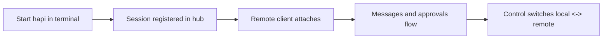

# Chapter 3: Session Lifecycle and Handoff

Welcome to **Chapter 3: Session Lifecycle and Handoff**. In this part of **HAPI Tutorial: Remote Control for Local AI Coding Sessions**, you will build an intuitive mental model first, then move into concrete implementation details and practical production tradeoffs.

HAPI's key design goal is switching control surfaces without restarting or losing session context.

## Lifecycle Flow

## Handoff Rules

- local and remote operate on the same persisted session state
- permission decisions are relayed in real time
- switching surfaces should not fork or duplicate session identity

## High-Value Use Cases

| Use Case | Benefit |
|:---------|:--------|
| stepping away mid-task | continue approvals from phone |
| long-running agent work | monitor status without terminal lock |
| team/operator handoff | preserve continuity during shift changes |

## Summary

You can now model HAPI sessions as persistent control channels, not transient terminal jobs.

Next: [Chapter 4: Remote Access and Networking](04-remote-access-and-networking.md)

## What Problem Does This Solve?

Most teams struggle here because the hard part is not writing more code, but deciding clear boundaries for `graph`, `Start`, `hapi` so behavior stays predictable as complexity grows.

In practical terms, this chapter helps you avoid three common failures:

- coupling core logic too tightly to one implementation path
- missing the handoff boundaries between setup, execution, and validation
- shipping changes without clear rollback or observability strategy

After working through this chapter, you should be able to reason about `Chapter 3: Session Lifecycle and Handoff` as an operating subsystem inside **HAPI Tutorial: Remote Control for Local AI Coding Sessions**, with explicit contracts for inputs, state transitions, and outputs.

Use the implementation notes around `terminal`, `Session`, `registered` as your checklist when adapting these patterns to your own repository.

## How it Works Under the Hood

Under the hood, `Chapter 3: Session Lifecycle and Handoff` usually follows a repeatable control path:

1. **Context bootstrap**: initialize runtime config and prerequisites for `graph`.
2. **Input normalization**: shape incoming data so `Start` receives stable contracts.
3. **Core execution**: run the main logic branch and propagate intermediate state through `hapi`.
4. **Policy and safety checks**: enforce limits, auth scopes, and failure boundaries.
5. **Output composition**: return canonical result payloads for downstream consumers.
6. **Operational telemetry**: emit logs/metrics needed for debugging and performance tuning.

When debugging, walk this sequence in order and confirm each stage has explicit success/failure conditions.

## Source Walkthrough

Use the following upstream sources to verify implementation details while reading this chapter:

- [HAPI Repository](https://github.com/tiann/hapi)
  Why it matters: authoritative reference on `HAPI Repository` (github.com).
- [HAPI Releases](https://github.com/tiann/hapi/releases)
  Why it matters: authoritative reference on `HAPI Releases` (github.com).
- [HAPI Docs](https://hapi.run)
  Why it matters: authoritative reference on `HAPI Docs` (hapi.run).

Suggested trace strategy:
- search upstream code for `graph` and `Start` to map concrete implementation paths
- compare docs claims against actual runtime/config code before reusing patterns in production

## Chapter Connections

- [Tutorial Index](index.md)
- [Previous Chapter: Chapter 2: System Architecture](02-system-architecture.md)
- [Next Chapter: Chapter 4: Remote Access and Networking](04-remote-access-and-networking.md)
- [Main Catalog](../../README.md#-tutorial-catalog)
- [A-Z Tutorial Directory](../../discoverability/tutorial-directory.md)
