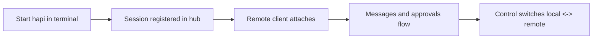

# Chapter 3: Session Lifecycle and Handoff

HAPI's key design goal is switching control surfaces without restarting or losing session context.

## Lifecycle Flow

## Handoff Rules

- local and remote operate on the same persisted session state
- permission decisions are relayed in real time
- switching surfaces should not fork or duplicate session identity

## High-Value Use Cases

| Use Case | Benefit |
|:---------|:--------|
| stepping away mid-task | continue approvals from phone |
| long-running agent work | monitor status without terminal lock |
| team/operator handoff | preserve continuity during shift changes |

## Summary

You can now model HAPI sessions as persistent control channels, not transient terminal jobs.

Next: [Chapter 4: Remote Access and Networking](04-remote-access-and-networking.md)
