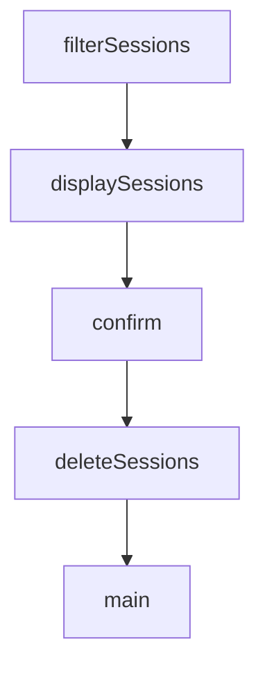

# Chapter 4: Remote Access and Networking

Welcome to **Chapter 4: Remote Access and Networking**. In this part of **HAPI Tutorial: Remote Control for Local AI Coding Sessions**, you will build an intuitive mental model first, then move into concrete implementation details and practical production tradeoffs.


Networking design determines whether HAPI is simple local tooling or production remote infrastructure.

## Access Modes

| Mode | Strength |
|:-----|:---------|
| local-only (`hapi hub`) | tight isolation and low setup overhead |
| relay (`hapi hub --relay`) | quick secure internet access |
| self-hosted tunnel/public host | full routing and policy ownership |

## Network Requirements

- stable SSE-compatible ingress path
- TLS for remote clients
- explicit host/port/public URL configuration
- firewall rules matching hub ingress and tunnel design

## Deployment Pattern

1. validate local-only mode
2. enable relay or named tunnel
3. test phone/browser connectivity and auth
4. verify reconnect behavior under network interruption

## Summary

You now have a practical network rollout sequence for safe remote HAPI access.

Next: [Chapter 5: Permissions and Approval Workflow](05-permissions-and-approval-workflow.md)

## What Problem Does This Solve?

Most teams struggle here because the hard part is not writing more code, but deciding clear boundaries for core abstractions in this chapter so behavior stays predictable as complexity grows.

In practical terms, this chapter helps you avoid three common failures:

- coupling core logic too tightly to one implementation path
- missing the handoff boundaries between setup, execution, and validation
- shipping changes without clear rollback or observability strategy

After working through this chapter, you should be able to reason about `Chapter 4: Remote Access and Networking` as an operating subsystem inside **HAPI Tutorial: Remote Control for Local AI Coding Sessions**, with explicit contracts for inputs, state transitions, and outputs.

Use the implementation notes around execution and reliability details as your checklist when adapting these patterns to your own repository.

## How it Works Under the Hood

Under the hood, `Chapter 4: Remote Access and Networking` usually follows a repeatable control path:

1. **Context bootstrap**: initialize runtime config and prerequisites for `core component`.
2. **Input normalization**: shape incoming data so `execution layer` receives stable contracts.
3. **Core execution**: run the main logic branch and propagate intermediate state through `state model`.
4. **Policy and safety checks**: enforce limits, auth scopes, and failure boundaries.
5. **Output composition**: return canonical result payloads for downstream consumers.
6. **Operational telemetry**: emit logs/metrics needed for debugging and performance tuning.

When debugging, walk this sequence in order and confirm each stage has explicit success/failure conditions.

## Chapter Connections

- [Tutorial Index](README.md)
- [Previous Chapter: Chapter 3: Session Lifecycle and Handoff](03-session-lifecycle-and-handoff.md)
- [Next Chapter: Chapter 5: Permissions and Approval Workflow](05-permissions-and-approval-workflow.md)
- [Main Catalog](../../README.md#-tutorial-catalog)
- [A-Z Tutorial Directory](../../discoverability/tutorial-directory.md)

## Source Code Walkthrough

### `hub/scripts/cleanup-sessions.ts`

The `filterSessions` function in [`hub/scripts/cleanup-sessions.ts`](https://github.com/tiann/hapi/blob/HEAD/hub/scripts/cleanup-sessions.ts) handles a key part of this chapter's functionality:

```ts

// Filter sessions based on criteria
function filterSessions(
    sessions: SessionInfo[],
    minMessages: number | null,
    pathPattern: string | null,
    messagePattern: string | null,
    orphaned: boolean
): SessionInfo[] {
    let filtered = sessions

    // Filter by message count if specified
    if (minMessages !== null) {
        filtered = filtered.filter(s => s.messageCount < minMessages)
    }

    // Filter by path pattern if specified
    if (pathPattern !== null) {
        const glob = new Bun.Glob(pathPattern)
        filtered = filtered.filter(s => {
            if (!s.path) return false
            return glob.match(s.path)
        })
    }

    // Filter by first message pattern (case-insensitive fuzzy match)
    if (messagePattern !== null) {
        filtered = filtered.filter(s => {
            if (!s.firstUserMessage) return false
            return s.firstUserMessage.toLowerCase().includes(messagePattern)
        })
    }
```

This function is important because it defines how HAPI Tutorial: Remote Control for Local AI Coding Sessions implements the patterns covered in this chapter.

### `hub/scripts/cleanup-sessions.ts`

The `displaySessions` function in [`hub/scripts/cleanup-sessions.ts`](https://github.com/tiann/hapi/blob/HEAD/hub/scripts/cleanup-sessions.ts) handles a key part of this chapter's functionality:

```ts

// Display sessions in a table format
function displaySessions(sessions: SessionInfo[]): void {
    if (sessions.length === 0) {
        console.log('No sessions match the criteria.')
        return
    }

    // Fixed column widths for readability
    const dateWidth = 12
    const countWidth = 4
    const titleWidth = 25
    const messageWidth = 30
    const pathWidth = 30

    // Header
    const header = [
        'Updated'.padEnd(dateWidth),
        'Msgs'.padStart(countWidth),
        'Title'.padEnd(titleWidth),
        'First Message'.padEnd(messageWidth),
        'Path'.padEnd(pathWidth),
    ].join(' | ')
    console.log(header)
    console.log('-'.repeat(header.length))

    // Rows
    for (const s of sessions) {
        const updated = formatDate(s.updatedAt)
        const title = truncate(s.title ?? '(no title)', titleWidth)
        const firstMsg = truncate(s.firstUserMessage ?? '(no message)', messageWidth)
        const path = truncate(s.path ?? '', pathWidth)
```

This function is important because it defines how HAPI Tutorial: Remote Control for Local AI Coding Sessions implements the patterns covered in this chapter.

### `hub/scripts/cleanup-sessions.ts`

The `confirm` function in [`hub/scripts/cleanup-sessions.ts`](https://github.com/tiann/hapi/blob/HEAD/hub/scripts/cleanup-sessions.ts) handles a key part of this chapter's functionality:

```ts
 *   --message=PATTERN  Delete sessions whose first message contains PATTERN (case-insensitive)
 *   --orphaned         Delete sessions whose path no longer exists
 *   --force            Skip confirmation prompt
 *   --help             Show this help message
 *
 * Examples:
 *   bun run hub/scripts/cleanup-sessions.ts
 *   bun run hub/scripts/cleanup-sessions.ts --min-messages=3
 *   bun run hub/scripts/cleanup-sessions.ts --path="/tmp/*"
 *   bun run hub/scripts/cleanup-sessions.ts --message="hello"
 *   bun run hub/scripts/cleanup-sessions.ts --orphaned
 *   bun run hub/scripts/cleanup-sessions.ts --orphaned --min-messages=5 --force
 */

import { Database } from 'bun:sqlite'
import { homedir } from 'node:os'
import { join } from 'node:path'
import { existsSync } from 'node:fs'

// Format timestamp as human-readable date
function formatDate(timestamp: number): string {
    const date = new Date(timestamp)
    return date.toLocaleDateString('en-US', {
        month: 'short',
        day: 'numeric',
        year: 'numeric'
    })
}

// Truncate string to max length with ellipsis
function truncate(str: string, maxLen: number): string {
    if (str.length <= maxLen) return str
```

This function is important because it defines how HAPI Tutorial: Remote Control for Local AI Coding Sessions implements the patterns covered in this chapter.

### `hub/scripts/cleanup-sessions.ts`

The `deleteSessions` function in [`hub/scripts/cleanup-sessions.ts`](https://github.com/tiann/hapi/blob/HEAD/hub/scripts/cleanup-sessions.ts) handles a key part of this chapter's functionality:

```ts

// Delete sessions by IDs
function deleteSessions(db: Database, ids: string[]): number {
    if (ids.length === 0) return 0

    const placeholders = ids.map(() => '?').join(', ')
    db.run(`DELETE FROM sessions WHERE id IN (${placeholders})`, ids)
    return ids.length
}

// Main function
async function main(): Promise<void> {
    const { minMessages, pathPattern, messagePattern, orphaned, force, help } = parseArgs()

    if (help) {
        console.log(`
Usage: bun run hub/scripts/cleanup-sessions.ts [options]

Options:
  --min-messages=N   Delete sessions with fewer than N messages (default: 5)
  --path=PATTERN     Delete sessions matching path pattern (glob supported)
  --message=PATTERN  Delete sessions whose first message contains PATTERN (case-insensitive)
  --orphaned         Delete sessions whose path no longer exists
  --force            Skip confirmation prompt
  --help             Show this help message

Filtering logic:
  - Only --min-messages: Delete sessions with message count < N
  - Only --path: Delete ALL sessions matching the path pattern
  - Only --message: Delete sessions whose first user message contains the pattern
  - Only --orphaned: Delete sessions whose path does not exist on filesystem
  - Multiple filters: Delete sessions matching ALL conditions (AND)
```

This function is important because it defines how HAPI Tutorial: Remote Control for Local AI Coding Sessions implements the patterns covered in this chapter.


## How These Components Connect


